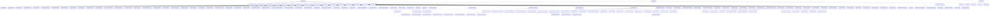

# UML: animdoclib

Class relationships (inheritance and composition) for the `animdoclib` module.

**Arrow legend:** `<|--` inheritance &nbsp; `*--` composition &nbsp; `-->` association/pointer

```mermaid
classDiagram
    CNmClipDocEvent <|-- CNmClipDocEvent_BodyGroup
    CNmClipDocEvent <|-- CNmClipDocEvent_EntityAttribute
    CNmClipDocEvent <|-- CNmClipDocEvent_FloatCurve
    CNmClipDocEvent <|-- CNmClipDocEvent_Foot
    CNmClipDocEvent <|-- CNmClipDocEvent_FrameSnap
    CNmClipDocEvent <|-- CNmClipDocEvent_ID
    CNmClipDocEvent <|-- CNmClipDocEvent_Legacy
    CNmClipDocEvent <|-- CNmClipDocEvent_MaterialAttribute
    CNmClipDocEvent <|-- CNmClipDocEvent_OrientationWarp
    CNmClipDocEvent <|-- CNmClipDocEvent_Particle
    CNmClipDocEvent <|-- CNmClipDocEvent_RootMotion
    CNmClipDocEvent <|-- CNmClipDocEvent_Sound
    CNmClipDocEvent <|-- CNmClipDocEvent_TargetWarp
    CNmClipDocEvent <|-- CNmClipDocEvent_Transition
    CNmAnimDocument <|-- CNmClipDocument
    CNmGraphDocFlowNode <|-- CNmGraphDocAndNode
    CNmGraphDocVariationDataNode <|-- CNmGraphDocAnimationPoseNode
    CNmGraphDocFlowNode <|-- CNmGraphDocBlend1DNode
    CNmGraphDocFlowNode <|-- CNmGraphDocBlend2DNode
    CNmGraphDocFlowNode <|-- CNmGraphDocBoneMaskBlendNode
    CNmGraphDocFlowNode <|-- CNmGraphDocBoneMaskNode
    CNmGraphDocParameterReferenceNode <|-- CNmGraphDocBoneMaskParameterReferenceNode
    CNmGraphDocResultNode <|-- CNmGraphDocBoneMaskResultNode
    CNmGraphDocFlowNode <|-- CNmGraphDocBoneMaskSelectorNode
    CNmGraphDocFlowNode <|-- CNmGraphDocBoneMaskSwitchNode
    CNmGraphDocVirtualParameterNode <|-- CNmGraphDocBoneMaskVirtualParameterNode
    CNmGraphDocControlParameterNode <|-- CNmGraphDocBoolControlParameterNode
    CNmGraphDocParameterReferenceNode <|-- CNmGraphDocBoolParameterReferenceNode
    CNmGraphDocResultNode <|-- CNmGraphDocBoolResultNode
    CNmGraphDocVirtualParameterNode <|-- CNmGraphDocBoolVirtualParameterNode
    CNmGraphDocFlowNode <|-- CNmGraphDocCachedBoolNode
    CNmGraphDocFlowNode <|-- CNmGraphDocCachedFloatNode
    CNmGraphDocFlowNode <|-- CNmGraphDocCachedIDNode
    CNmGraphDocFlowNode <|-- CNmGraphDocCachedTargetNode
    CNmGraphDocFlowNode <|-- CNmGraphDocCachedVectorNode
    CNmGraphDocVariationDataNode <|-- CNmGraphDocClipNode
    CNmGraphDocSelectorBaseNode <|-- CNmGraphDocClipSelectorNode
    CNmGraphDocNode <|-- CNmGraphDocCommentNode
    CNmGraphDocParameterBaseNode <|-- CNmGraphDocControlParameterNode
    CNmGraphDocFlowNode <|-- CNmGraphDocCurrentSyncEventIDNode
    CNmGraphDocFlowNode <|-- CNmGraphDocCurrentSyncEventNode
    CNmGraphDocResultNode <|-- CNmGraphDocEntryOverrideNode
    CNmGraphDocResultNode <|-- CNmGraphDocEntryStateOverrideConditionsNode
    CNmGraphDocStateMachineGraphNode <|-- CNmGraphDocEntryStateOverrideConduitNode
    CNmGraphDocFlowNode <|-- CNmGraphDocExternalGraphNode
    CNmGraphDocFlowNode <|-- CNmGraphDocExternalPoseNode
    CNmGraphDocFlowNode <|-- CNmGraphDocFixedWeightBoneMaskNode
    CNmGraphDocFlowNode <|-- CNmGraphDocFloatAngleMathNode
    CNmGraphDocFlowNode <|-- CNmGraphDocFloatClampNode
    CNmGraphDocFlowNode <|-- CNmGraphDocFloatComparisonNode
    CNmGraphDocControlParameterNode <|-- CNmGraphDocFloatControlParameterNode
    CNmGraphDocFlowNode <|-- CNmGraphDocFloatCurveEventNode
    CNmGraphDocFlowNode <|-- CNmGraphDocFloatCurveNode
    CNmGraphDocFlowNode <|-- CNmGraphDocFloatEaseNode
    CNmGraphDocFlowNode <|-- CNmGraphDocFloatMathNode
    CNmGraphDocParameterReferenceNode <|-- CNmGraphDocFloatParameterReferenceNode
    CNmGraphDocFlowNode <|-- CNmGraphDocFloatRangeComparisonNode
    CNmGraphDocFlowNode <|-- CNmGraphDocFloatRemapNode
    CNmGraphDocResultNode <|-- CNmGraphDocFloatResultNode
    CNmGraphDocFlowNode <|-- CNmGraphDocFloatSelectorNode
    CNmGraphDocFlowNode <|-- CNmGraphDocFloatSwitchNode
    CNmGraphDocVirtualParameterNode <|-- CNmGraphDocFloatVirtualParameterNode
    CNmGraphDocGraph <|-- CNmGraphDocFlowGraph
    CNmGraphDocNode <|-- CNmGraphDocFlowNode
    CNmGraphDocFlowNode <|-- CNmGraphDocFootEventConditionNode
    CNmGraphDocFlowNode <|-- CNmGraphDocFootstepEventIDNode
    CNmGraphDocFlowNode <|-- CNmGraphDocFootstepEventPercentageThroughNode
    CNmGraphDocStateMachineGraphNode <|-- CNmGraphDocGlobalTransitionConduitNode
    CNmGraphDocTransitionNode <|-- CNmGraphDocGlobalTransitionNode
    CNmGraphDocFlowNode <|-- CNmGraphDocGraphEventConditionNode
    CNmGraphDocFlowNode <|-- CNmGraphDocIDComparisonNode
    CNmGraphDocControlParameterNode <|-- CNmGraphDocIDControlParameterNode
    CNmGraphDocFlowNode <|-- CNmGraphDocIDEventConditionNode
    CNmGraphDocFlowNode <|-- CNmGraphDocIDEventNode
    CNmGraphDocFlowNode <|-- CNmGraphDocIDEventPercentageThroughNode
    CNmGraphDocParameterReferenceNode <|-- CNmGraphDocIDParameterReferenceNode
    CNmGraphDocResultNode <|-- CNmGraphDocIDResultNode
    CNmGraphDocFlowNode <|-- CNmGraphDocIDSelectorNode
    CNmGraphDocFlowNode <|-- CNmGraphDocIDSwitchNode
    CNmGraphDocFlowNode <|-- CNmGraphDocIDToFloatNode
    CNmGraphDocVirtualParameterNode <|-- CNmGraphDocIDVirtualParameterNode
    CNmGraphDocFlowNode <|-- CNmGraphDocIsExternalGraphSlotFilledNode
    CNmGraphDocFlowNode <|-- CNmGraphDocIsExternalPoseSetNode
    CNmGraphDocFlowNode <|-- CNmGraphDocIsInactiveBranchConditionNode
    CNmGraphDocFlowNode <|-- CNmGraphDocIsTargetSetNode
    CNmGraphDocFlowNode <|-- CNmGraphDocLayerBaseNode
    CNmGraphDocFlowNode <|-- CNmGraphDocLayerBlendNode
    CNmGraphDocLayerBaseNode <|-- CNmGraphDocLocalLayerNode
    CNmGraphDocFlowNode <|-- CNmGraphDocNotNode
    CNmGraphDocFlowNode <|-- CNmGraphDocOrNode
    CNmGraphDocFlowNode <|-- CNmGraphDocOrientationWarpNode
    CNmGraphDocFlowNode <|-- CNmGraphDocParameterBaseNode
    CNmGraphDocFlowNode <|-- CNmGraphDocParameterReferenceNode
    CNmGraphDocVariationDataNode <|-- CNmGraphDocParameterizedClipSelectorNode
    CNmGraphDocVariationDataNode <|-- CNmGraphDocParameterizedSelectorNode
    CNmGraphDocResultNode <|-- CNmGraphDocPoseResultNode
    CNmGraphDocFlowNode <|-- CNmGraphDocReferencePoseNode
    CNmGraphDocVariationDataNode <|-- CNmGraphDocReferencedGraphNode
    CNmGraphDocFlowNode <|-- CNmGraphDocResultNode
    CNmGraphDocFlowNode <|-- CNmGraphDocRootMotionOverrideNode
    CNmGraphDocFlowNode <|-- CNmGraphDocScaleNode
    CNmGraphDocFlowNode <|-- CNmGraphDocSelectorBaseNode
    CNmGraphDocResultNode <|-- CNmGraphDocSelectorConditionNode
    CNmGraphDocSelectorBaseNode <|-- CNmGraphDocSelectorNode
    CNmGraphDocFlowNode <|-- CNmGraphDocStateCompletedConditionNode
    CNmGraphDocResultNode <|-- CNmGraphDocStateLayerDataNode
    CNmGraphDocGraph <|-- CNmGraphDocStateMachineGraph
    CNmGraphDocNode <|-- CNmGraphDocStateMachineGraphNode
    CNmGraphDocLayerBaseNode <|-- CNmGraphDocStateMachineLayerNode
    CNmGraphDocFlowNode <|-- CNmGraphDocStateMachineNode
    CNmGraphDocStateMachineGraphNode <|-- CNmGraphDocStateNode
    CNmGraphDocFlowNode <|-- CNmGraphDocSyncEventIndexConditionNode
    CNmGraphDocControlParameterNode <|-- CNmGraphDocTargetControlParameterNode
    CNmGraphDocFlowNode <|-- CNmGraphDocTargetInfoNode
    CNmGraphDocFlowNode <|-- CNmGraphDocTargetOffsetNode
    CNmGraphDocParameterReferenceNode <|-- CNmGraphDocTargetParameterReferenceNode
    CNmGraphDocFlowNode <|-- CNmGraphDocTargetPointNode
    CNmGraphDocResultNode <|-- CNmGraphDocTargetResultNode
    CNmGraphDocFlowNode <|-- CNmGraphDocTargetSelectorNode
    CNmGraphDocVirtualParameterNode <|-- CNmGraphDocTargetVirtualParameterNode
    CNmGraphDocFlowNode <|-- CNmGraphDocTargetWarpNode
    CNmGraphDocFlowNode <|-- CNmGraphDocTimeConditionNode
    CNmGraphDocStateMachineGraphNode <|-- CNmGraphDocTransitionConduitNode
    CNmGraphDocFlowNode <|-- CNmGraphDocTransitionEventConditionNode
    CNmGraphDocResultNode <|-- CNmGraphDocTransitionNode
    CNmGraphDocFlowNode <|-- CNmGraphDocVariationDataNode
    CNmGraphDocVariationDataNode <|-- CNmGraphDocVariationIDComparisonNode
    CNmGraphDocControlParameterNode <|-- CNmGraphDocVectorControlParameterNode
    CNmGraphDocFlowNode <|-- CNmGraphDocVectorCreateNode
    CNmGraphDocFlowNode <|-- CNmGraphDocVectorInfoNode
    CNmGraphDocFlowNode <|-- CNmGraphDocVectorNegateNode
    CNmGraphDocParameterReferenceNode <|-- CNmGraphDocVectorParameterReferenceNode
    CNmGraphDocResultNode <|-- CNmGraphDocVectorResultNode
    CNmGraphDocVirtualParameterNode <|-- CNmGraphDocVectorVirtualParameterNode
    CNmGraphDocFlowNode <|-- CNmGraphDocVelocityBlendNode
    CNmGraphDocParameterBaseNode <|-- CNmGraphDocVirtualParameterNode
    CNmGraphDocFlowNode <|-- CNmGraphDocZeroPoseNode
    CNmAnimDocument <|-- CNmGraphDocument
    CNmAnimDocument <|-- CNmIKRigDocument
    CNmAnimDocument <|-- CNmSkeletonDocument
    CNmGraphDocVariationDataNode <|-- CnmGraphDocChainLookatNode
    CNmGraphDocFlowNode <|-- CnmGraphDocConstBoneTargetNode
    CNmGraphDocFlowNode <|-- CnmGraphDocConstBoolNode
    CNmGraphDocFlowNode <|-- CnmGraphDocConstFloatNode
    CNmGraphDocFlowNode <|-- CnmGraphDocConstIDNode
    CNmGraphDocFlowNode <|-- CnmGraphDocConstTargetNode
    CNmGraphDocFlowNode <|-- CnmGraphDocConstVectorNode
    CNmGraphDocFlowNode <|-- CnmGraphDocDurationScaleNode
    CNmGraphDocVariationDataNode <|-- CnmGraphDocFollowBoneNode
    CNmGraphDocFlowNode <|-- CnmGraphDocSpeedScaleNode
    CNmGraphDocVariationDataNode <|-- CnmGraphDocTwoBoneIKNode
    CNmGraphDocVariationDataNode <|-- CnmGraphDocVariationConstFloatNode
    CNmGraphDocFlowNode <|-- CnmGraphDocVelocityBasedSpeedScaleNode
    CNmGraphDocFlowNode *-- NmGraphDocPin_t
    CNmGraphDocNode --> CNmGraphDocGraph
```
