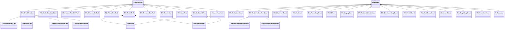

# UML: animlib

Class relationships (inheritance and composition) for the `animlib` module.

**Arrow legend:** `<|--` inheritance &nbsp; `*--` composition &nbsp; `-->` association/pointer

```mermaid
classDiagram
    CNmBlendTaskBase <|-- CNmAdditiveBlendTask
    CNmBlendTaskBase <|-- CNmBlendTask
    CNmPoseTask <|-- CNmBlendTaskBase
    CNmEvent <|-- CNmBodyGroupEvent
    CNmPoseTask <|-- CNmCachedPoseReadTask
    CNmPoseTask <|-- CNmCachedPoseWriteTask
    CNmPoseTask <|-- CNmChainLookatTask
    CNmEvent <|-- CNmEntityAttributeEventBase
    CNmEntityAttributeEventBase <|-- CNmEntityAttributeFloatEvent
    CNmEntityAttributeEventBase <|-- CNmEntityAttributeIntEvent
    CNmEvent <|-- CNmFloatCurveEvent
    CNmPoseTask <|-- CNmFollowBoneTask
    CNmEvent <|-- CNmFootEvent
    CNmPoseTask <|-- CNmFootIKTask
    CNmEvent <|-- CNmFrameSnapEvent
    CNmEvent <|-- CNmIDEvent
    CNmEvent <|-- CNmLegacyEvent
    CNmEvent <|-- CNmMaterialAttributeEvent
    CNmBlendTaskBase <|-- CNmModelSpaceBlendTask
    CNmEvent <|-- CNmOrientationWarpEvent
    CNmBlendTaskBase <|-- CNmOverlayBlendTask
    CNmEvent <|-- CNmParticleEvent
    CNmPoseTask <|-- CNmReferencePoseTask
    CNmEvent <|-- CNmRootMotionEvent
    CNmPoseTask <|-- CNmSampleTask
    CNmPoseTask <|-- CNmScaleTask
    CNmEvent <|-- CNmSoundEvent
    CNmEvent <|-- CNmTargetWarpEvent
    CNmEvent <|-- CNmTransitionEvent
    CNmPoseTask <|-- CNmTwoBoneIKTask
    CNmPoseTask <|-- CNmZeroPoseTask
    CNmEvent *-- NmPercent_t
    CNmFootIKTask *-- CNmTarget
    CNmFootIKTask *-- NmIKBlendMode_t
    CNmTwoBoneIKTask *-- CNmTarget
    CNmTwoBoneIKTask *-- NmIKBlendMode_t
```
