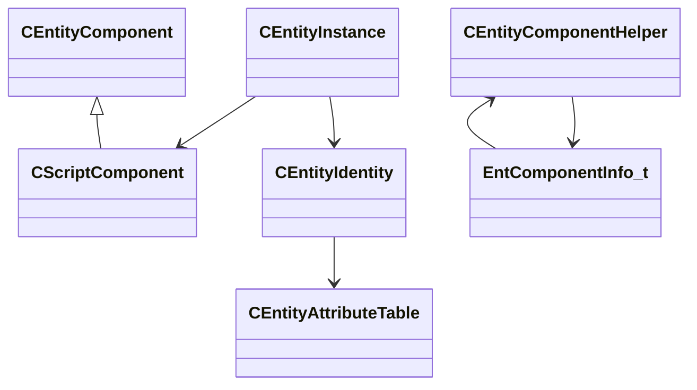

# UML: entity2

Class relationships (inheritance and composition) for the `entity2` module.

**Arrow legend:** `<|--` inheritance &nbsp; `*--` composition &nbsp; `-->` association/pointer

```mermaid
classDiagram
    CEntityComponent <|-- CScriptComponent
    CEntityComponentHelper --> EntComponentInfo_t
    CEntityIdentity --> CEntityAttributeTable
    CEntityInstance --> CEntityIdentity
    CEntityInstance --> CScriptComponent
    EntComponentInfo_t --> CEntityComponentHelper
```
