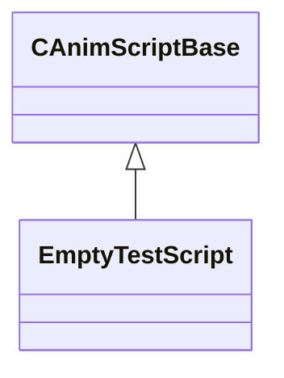

# UML: host

Class relationships (inheritance and composition) for the `host` module.

**Arrow legend:** `<|--` inheritance &nbsp; `*--` composition &nbsp; `-->` association/pointer

```mermaid
classDiagram
    CAnimScriptBase <|-- EmptyTestScript
```
