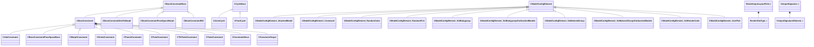

# UML: modellib

Class relationships (inheritance and composition) for the `modellib` module.

**Arrow legend:** `<|--` inheritance &nbsp; `*--` composition &nbsp; `-->` association/pointer

```mermaid
classDiagram
    CBaseConstraint <|-- CAimConstraint
    CCycleBase <|-- CAnimCycle
    CBoneConstraintBase <|-- CBaseConstraint
    CBoneConstraintBase <|-- CBoneConstraintDotToMorph
    CBaseConstraint <|-- CBoneConstraintPoseSpaceBone
    CBoneConstraintBase <|-- CBoneConstraintPoseSpaceMorph
    CBoneConstraintBase <|-- CBoneConstraintRbf
    CCycleBase <|-- CFootCycle
    CModelConfigElement <|-- CModelConfigElement_AttachedModel
    CModelConfigElement <|-- CModelConfigElement_Command
    CModelConfigElement <|-- CModelConfigElement_RandomColor
    CModelConfigElement <|-- CModelConfigElement_RandomPick
    CModelConfigElement <|-- CModelConfigElement_SetBodygroup
    CModelConfigElement <|-- CModelConfigElement_SetBodygroupOnAttachedModels
    CModelConfigElement <|-- CModelConfigElement_SetMaterialGroup
    CModelConfigElement <|-- CModelConfigElement_SetMaterialGroupOnAttachedModels
    CModelConfigElement <|-- CModelConfigElement_SetRenderColor
    CModelConfigElement <|-- CModelConfigElement_UserPick
    CBaseConstraint <|-- CMorphConstraint
    CBaseConstraint <|-- COrientConstraint
    CBaseConstraint <|-- CParentConstraint
    CBaseConstraint <|-- CPointConstraint
    CBaseConstraint <|-- CTiltTwistConstraint
    CBaseConstraint <|-- CTwistConstraint
    CBaseConstraint *-- CConstraintSlave
    CBaseConstraint *-- CConstraintTarget
    RenderInputLayoutField_t *-- RenderSlotType_t
    VsInputSignature_t *-- VsInputSignatureElement_t
```
