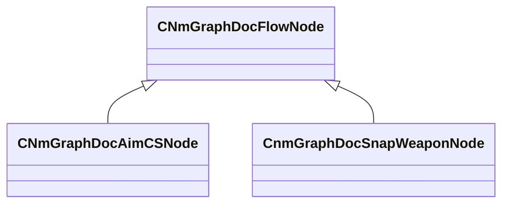

# UML: modtools

Class relationships (inheritance and composition) for the `modtools` module.

**Arrow legend:** `<|--` inheritance &nbsp; `*--` composition &nbsp; `-->` association/pointer

```mermaid
classDiagram
    CNmGraphDocFlowNode <|-- CNmGraphDocAimCSNode
    CNmGraphDocFlowNode <|-- CnmGraphDocSnapWeaponNode
```
