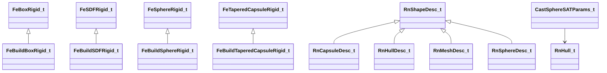

# UML: physicslib

Class relationships (inheritance and composition) for the `physicslib` module.

**Arrow legend:** `<|--` inheritance &nbsp; `*--` composition &nbsp; `-->` association/pointer

```mermaid
classDiagram
    FeBoxRigid_t <|-- FeBuildBoxRigid_t
    FeSDFRigid_t <|-- FeBuildSDFRigid_t
    FeSphereRigid_t <|-- FeBuildSphereRigid_t
    FeTaperedCapsuleRigid_t <|-- FeBuildTaperedCapsuleRigid_t
    RnShapeDesc_t <|-- RnCapsuleDesc_t
    RnShapeDesc_t <|-- RnHullDesc_t
    RnShapeDesc_t <|-- RnMeshDesc_t
    RnShapeDesc_t <|-- RnSphereDesc_t
    CastSphereSATParams_t --> RnHull_t
```
