# UML: pulse_runtime_lib

Class relationships (inheritance and composition) for the `pulse_runtime_lib` module.

**Arrow legend:** `<|--` inheritance &nbsp; `*--` composition &nbsp; `-->` association/pointer

```mermaid
classDiagram
    CPulseCell_Base <|-- CPulseCell_BaseFlow
    CPulseCell_BaseYieldingInflow <|-- CPulseCell_BaseLerp
    CPulseCell_Base <|-- CPulseCell_BaseRequirement
    CPulseCell_BaseYieldingInflow <|-- CPulseCell_BaseState
    CPulseCell_Base <|-- CPulseCell_BaseValue
    CPulseCell_BaseFlow <|-- CPulseCell_BaseYieldingInflow
    CPulseCell_BaseState <|-- CPulseCell_BooleanSwitchState
    CPulseCell_WaitForCursorsWithTagBase <|-- CPulseCell_CursorQueue
    CPulseCell_BaseYieldingInflow <|-- CPulseCell_FireCursors
    CPulseCell_BaseFlow <|-- CPulseCell_Inflow_BaseEntrypoint
    CPulseCell_Inflow_BaseEntrypoint <|-- CPulseCell_Inflow_EntOutputHandler
    CPulseCell_Inflow_BaseEntrypoint <|-- CPulseCell_Inflow_EventHandler
    CPulseCell_Inflow_BaseEntrypoint <|-- CPulseCell_Inflow_GraphHook
    CPulseCell_Inflow_BaseEntrypoint <|-- CPulseCell_Inflow_Method
    CPulseCell_Inflow_BaseEntrypoint <|-- CPulseCell_Inflow_ObservableVariableListener
    CPulseCell_BaseYieldingInflow <|-- CPulseCell_Inflow_Wait
    CPulseCell_BaseYieldingInflow <|-- CPulseCell_Inflow_Yield
    CPulseCell_BaseFlow <|-- CPulseCell_InlineNodeSkipSelector
    CPulseCell_BaseYieldingInflow <|-- CPulseCell_IntervalTimer
    CPulseCell_BaseRequirement <|-- CPulseCell_IsRequirementValid
    CPulseCell_BaseRequirement <|-- CPulseCell_LimitCount
    CPulseCell_BaseFlow <|-- CPulseCell_Outflow_CycleOrdered
    CPulseCell_BaseFlow <|-- CPulseCell_Outflow_CycleRandom
    CPulseCell_BaseFlow <|-- CPulseCell_Outflow_CycleShuffled
    CPulseCell_BaseFlow <|-- CPulseCell_PickBestOutflowSelector
    CPulseCell_BaseYieldingInflow <|-- CPulseCell_Step_CallExternalMethod
    CPulseCell_BaseFlow <|-- CPulseCell_Step_DebugLog
    CPulseCell_BaseFlow <|-- CPulseCell_Step_PublicOutput
    CPulseCell_BaseYieldingInflow <|-- CPulseCell_Timeline
    CPulseCell_Base <|-- CPulseCell_Unknown
    CPulseCell_BaseValue <|-- CPulseCell_Value_Curve
    CPulseCell_BaseValue <|-- CPulseCell_Value_Gradient
    CPulseCell_BaseValue <|-- CPulseCell_Value_RandomFloat
    CPulseCell_BaseValue <|-- CPulseCell_Value_RandomInt
    CPulseCell_WaitForCursorsWithTagBase <|-- CPulseCell_WaitForCursorsWithTag
    CPulseCell_BaseYieldingInflow <|-- CPulseCell_WaitForCursorsWithTagBase
    CPulseCell_BaseYieldingInflow <|-- CPulseCell_WaitForObservable
    CPulse_OutflowConnection <|-- CPulse_ResumePoint
    CPulse_OutflowConnection <|-- SignatureOutflow_Continue
    CPulse_ResumePoint <|-- SignatureOutflow_Resume
    CPulseCell_BaseLerp *-- CPulse_ResumePoint
    CPulse_OutflowConnection *-- PulseRuntimeChunkIndex_t
    CPulse_OutflowConnection *-- PulseRegisterMap_t
```

