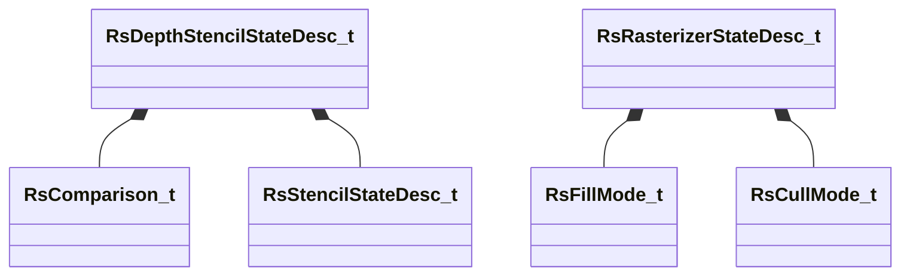

# UML: rendersystemdx11

Class relationships (inheritance and composition) for the `rendersystemdx11` module.

**Arrow legend:** `<|--` inheritance &nbsp; `*--` composition &nbsp; `-->` association/pointer

