# UML: resourcecompiler

Class relationships (inheritance and composition) for the `resourcecompiler` module.

**Arrow legend:** `<|--` inheritance &nbsp; `*--` composition &nbsp; `-->` association/pointer

```mermaid
classDiagram
    CColorCorrectionLayer <|-- CBloomLayer
    CColorCorrectionLayer <|-- CBrightnessContrastColorCorrectionLayer
    CColorCorrectionLayer <|-- CColorBalanceColorCorrectionLayer
    CColorCorrectionLayer <|-- CColorLookupColorCorrectionLayer
    CColorCorrectionLayer <|-- CColorTintColorCorrectionLayer
    CColorCorrectionLayer <|-- CCurvesColorCorrectionLayer
    CColorCorrectionLayer <|-- CFogScatteringLayer
    CColorCorrectionLayer <|-- CHueSaturationColorCorrectionLayer
    CColorCorrectionLayer <|-- CLevelsColorCorrectionLayer
    CColorCorrectionLayer <|-- CLocalContrastLayer
    CColorCorrectionLayer <|-- CToneMappingLayer
    CColorCorrectionLayer <|-- CVibranceColorCorrectionLayer
    CColorCorrectionLayer <|-- CVignetteLayer
    CColorCorrectionLayer --> CLayerMask
```

