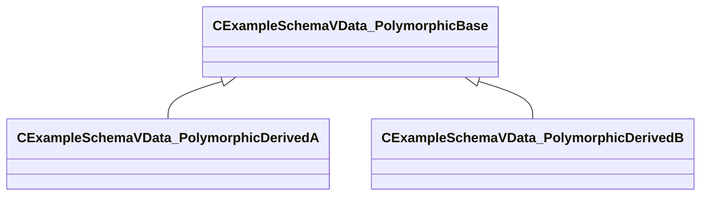

# UML: resourcefile

Class relationships (inheritance and composition) for the `resourcefile` module.

**Arrow legend:** `<|--` inheritance &nbsp; `*--` composition &nbsp; `-->` association/pointer

