# UML: server

Class relationships (inheritance and composition) for the `server` module (showing 300 of 611 relationships).

**Arrow legend:** `<|--` inheritance &nbsp; `*--` composition &nbsp; `-->` association/pointer

```mermaid
classDiagram
    CBaseModelEntity <|-- CBaseAnimGraph
    CSkeletonAnimationController <|-- CBaseAnimGraphController
    CLogicalEntity <|-- CBaseFilter
    CBaseEntity <|-- CBasePlayerController
    CEntitySubclassVDataBase <|-- CBasePlayerVData
    CEntitySubclassVDataBase <|-- CBasePlayerWeaponVData
    CBaseAnimGraph <|-- CBaseProp
    CEntityComponent <|-- CBodyComponent
    CBodyComponentSkeletonInstance <|-- CBodyComponentBaseAnimGraph
    CBodyComponentSkeletonInstance <|-- CBodyComponentBaseModelEntity
    CBodyComponent <|-- CBodyComponentPoint
    CBodyComponent <|-- CBodyComponentSkeletonInstance
    CBaseTrigger <|-- CBombTarget
    CCS2WeaponGraphController <|-- CCS2PawnGraphController
    CAnimGraphControllerBase <|-- CCS2WeaponGraphController
    CCSGO_EndOfMatchLineupEndpoint <|-- CCSGO_EndOfMatchLineupEnd
    CCSGO_TeamIntroCharacterPosition <|-- CCSGO_WingmanIntroCharacterPosition
    CCSGO_WingmanIntroCharacterPosition <|-- CCSGO_WingmanIntroCounterTerroristPosition
    CCSGO_WingmanIntroCharacterPosition <|-- CCSGO_WingmanIntroTerroristPosition
    CCSGameModeRules <|-- CCSGameModeRules_ArmsRace
    CCSGameModeRules <|-- CCSGameModeRules_Deathmatch
    CCSGameModeRules <|-- CCSGameModeRules_Noop
    CCSPlayerBase_CameraServices <|-- CCSObserver_CameraServices
    CPlayer_MovementServices <|-- CCSObserver_MovementServices
    CPlayer_ObserverServices <|-- CCSObserver_ObserverServices
    CPlayer_UseServices <|-- CCSObserver_UseServices
    CPlayer_CameraServices <|-- CCSPlayerBase_CameraServices
    CBasePlayerController <|-- CCSPlayerController
    CPlayerControllerComponent <|-- CCSPlayerController_ActionTrackingServices
    CPlayerControllerComponent <|-- CCSPlayerController_DamageServices
    CPlayerControllerComponent <|-- CCSPlayerController_InGameMoneyServices
    CPlayerControllerComponent <|-- CCSPlayerController_InventoryServices
    CPlayerPawnComponent <|-- CCSPlayer_ActionTrackingServices
    CPlayerPawnComponent <|-- CCSPlayer_BulletServices
    CPlayerPawnComponent <|-- CCSPlayer_BuyServices
    CCSPlayerBase_CameraServices <|-- CCSPlayer_CameraServices
    CPlayerPawnComponent <|-- CCSPlayer_DamageReactServices
    CPlayerPawnComponent <|-- CCSPlayer_HostageServices
    CPlayer_ItemServices <|-- CCSPlayer_ItemServices
    CPlayer_MovementServices_Humanoid <|-- CCSPlayer_MovementServices
    CPlayerPawnComponent <|-- CCSPlayer_PingServices
    CPlayer_UseServices <|-- CCSPlayer_UseServices
    CPlayer_WaterServices <|-- CCSPlayer_WaterServices
    CPlayer_WeaponServices <|-- CCSPlayer_WeaponServices
    CBasePlayerWeaponVData <|-- CCSWeaponBaseVData
    CBaseModelEntity <|-- CCashStack
    CPointEntity <|-- CChoreoInfoTarget
    CBaseEntity <|-- CCitadelSoundOpvarSetOBB
    CBaseEntity <|-- CEnvSoundscape
    CEnvSoundscape <|-- CEnvSoundscapeAlias_snd_soundscape
    CEnvSoundscape <|-- CEnvSoundscapeProxy
    CEnvSoundscapeProxy <|-- CEnvSoundscapeProxyAlias_snd_soundscape_proxy
    CEnvSoundscape <|-- CEnvSoundscapeTriggerable
    CEnvSoundscapeTriggerable <|-- CEnvSoundscapeTriggerableAlias_snd_soundscape_triggerable
    CBaseFilter <|-- CFilterAttributeInt
    CBaseFilter <|-- CFilterClass
    CBaseFilter <|-- CFilterLOS
    CBaseFilter <|-- CFilterMassGreater
    CBaseFilter <|-- CFilterModel
    CBaseFilter <|-- CFilterMultiple
    CBaseFilter <|-- CFilterName
    CBaseFilter <|-- CFilterProximity
    CBaseFilter <|-- CFilterTeam
    CDynamicProp <|-- CFuncRetakeBarrier
    CBaseModelEntity <|-- CFuncWater
    CEntityComponent <|-- CHitboxComponent
    CHostageRescueZoneShim <|-- CHostageRescueZone
    CBaseTrigger <|-- CHostageRescueZoneShim
    CPointEntity <|-- CInfoDynamicShadowHint
    CInfoDynamicShadowHint <|-- CInfoDynamicShadowHintBox
    CPointEntity <|-- CInfoFan
    CPointEntity <|-- CInfoInteraction
    CPointEntity <|-- CInfoOffscreenPanoramaTexture
    CPointEntity <|-- CInfoParticleTarget
    CPointEntity <|-- CInfoTarget
    CBaseEntity <|-- CInfoWorldLayer
    CEntityComponent <|-- CLightComponent
    CLogicalEntity <|-- CLogicRelay
    CServerOnlyEntity <|-- CLogicalEntity
    CPointEntity <|-- CMapInfo
    CPointEntity <|-- CPathNode
    CEntityComponent <|-- CPathQueryComponent
    CPathQueryUtil <|-- CPathQueryComponent
    CBaseEntity <|-- CPathSimple
    CPathSimple <|-- CPathWithDynamicNodes
    CPlayerPawnComponent <|-- CPlayer_AutoaimServices
    CPlayerPawnComponent <|-- CPlayer_CameraServices
    CPlayerPawnComponent <|-- CPlayer_FlashlightServices
    CPlayerPawnComponent <|-- CPlayer_ItemServices
    CPlayerPawnComponent <|-- CPlayer_MovementServices
    CPlayer_MovementServices <|-- CPlayer_MovementServices_Humanoid
    CPlayerPawnComponent <|-- CPlayer_ObserverServices
    CPlayerPawnComponent <|-- CPlayer_UseServices
    CPlayerPawnComponent <|-- CPlayer_WaterServices
    CPlayerPawnComponent <|-- CPlayer_WeaponServices
    CPointEntity <|-- CPointChildModifier
    CBaseEntity <|-- CPointOrient
    CLogicalEntity <|-- CPointTemplate
    CEntitySubclassVDataBase <|-- CPrecipitationVData
    CEntityComponent <|-- CPropDataComponent
    CPulseCell_BaseLerp <|-- CPulseCell_LerpCameraSettings
    CPulseCell_BaseYieldingInflow <|-- CPulseCell_PlaySequence
    CPulseCell_BaseFlow <|-- CPulseCell_Step_EntFire
    CBaseEntity <|-- CPulseGameBlackboard
    CBaseEntity <|-- CRagdollManager
    CEntityComponent <|-- CRenderComponent
    CSPerRoundStats_t <|-- CSMatchStats_t
    CBaseModelEntity <|-- CServerOnlyModelEntity
    CGameSceneNode <|-- CSkeletonInstance
    CBaseEntity <|-- CSkyboxReference
    CSprite <|-- CSpriteOriented
    IntervalTimer <|-- CTimeline
    CBaseTrigger <|-- CTriggerFan
    CBaseFilter <|-- FilterDamageType
    CBaseFilter <|-- FilterHealth
    CBaseEntity <|-- CAI_ChangeHintGroup
    CAI_Expresser <|-- CAI_ExpresserWithFollowup
    CCSWeaponBaseGun <|-- CAK47
    CPointEntity <|-- CAmbientGeneric
    CAttributeManager <|-- CAttributeContainer
    CBaseModelEntity <|-- CBarnLight
    CBaseToggle <|-- CBaseButton
    CCSWeaponBase <|-- CBaseCSGrenade
    CBaseGrenade <|-- CBaseCSGrenadeProjectile
    CBaseModelEntity <|-- CBaseClientUIEntity
    CBaseAnimGraph <|-- CBaseCombatCharacter
    CPointEntity <|-- CBaseDMStart
    CBaseToggle <|-- CBaseDoor
    CEntityInstance <|-- CBaseEntity
    CBaseAnimGraph <|-- CBaseGrenade
    CBaseEntity <|-- CBaseModelEntity
    CPathKeyFrame <|-- CBaseMoveBehavior
    CBaseToggle <|-- CBasePlatTrain
    CBaseCombatCharacter <|-- CBasePlayerPawn
    CEconEntity <|-- CBasePlayerWeapon
    CDynamicProp <|-- CBasePropDoor
    CBaseModelEntity <|-- CBaseToggle
    CBaseToggle <|-- CBaseTrigger
    CBaseModelEntity <|-- CBeam
    CPointEntity <|-- CBlood
    CBaseModelEntity <|-- CBreakable
    CBaseProp <|-- CBreakableProp
    CBtNode <|-- CBtActionAim
    CBtNode <|-- CBtActionCombatPositioning
    CBtNode <|-- CBtActionMoveTo
    CBtNode <|-- CBtActionParachutePositioning
    CBtNode <|-- CBtNodeComposite
    CBtNodeDecorator <|-- CBtNodeCondition
    CBtNodeCondition <|-- CBtNodeConditionInactive
    CBtNode <|-- CBtNodeDecorator
    CBaseTrigger <|-- CBuyZone
    CCSWeaponBase <|-- CC4
    CBot <|-- CCSBot
    CBaseEntity <|-- CCSGO_EndOfMatchLineupEndpoint
    CCSGO_EndOfMatchLineupEndpoint <|-- CCSGO_EndOfMatchLineupStart
    CCSGO_TeamPreviewCharacterPosition <|-- CCSGO_TeamIntroCharacterPosition
    CCSGO_TeamIntroCharacterPosition <|-- CCSGO_TeamIntroCounterTerroristPosition
    CCSGO_TeamIntroCharacterPosition <|-- CCSGO_TeamIntroTerroristPosition
    CBaseEntity <|-- CCSGO_TeamPreviewCharacterPosition
    CCSGO_TeamPreviewCharacterPosition <|-- CCSGO_TeamSelectCharacterPosition
    CCSGO_TeamSelectCharacterPosition <|-- CCSGO_TeamSelectCounterTerroristPosition
    CCSGO_TeamSelectCharacterPosition <|-- CCSGO_TeamSelectTerroristPosition
    CTeamplayRules <|-- CCSGameRules
    CGameRulesProxy <|-- CCSGameRulesProxy
    CBaseEntity <|-- CCSMinimapBoundary
    CCSPlayerPawnBase <|-- CCSObserverPawn
    CBaseEntity <|-- CCSPetPlacement
    CServerOnlyModelEntity <|-- CCSPlace
    CCSPlayerPawnBase <|-- CCSPlayerPawn
    CBasePlayerPawn <|-- CCSPlayerPawnBase
    CBaseEntity <|-- CCSPlayerResource
    CPlayerPawnComponent <|-- CCSPlayer_RadioServices
    CBaseEntity <|-- CCSPointScriptEntity
    CSprite <|-- CCSSprite
    CTeam <|-- CCSTeam
    CBasePlayerWeapon <|-- CCSWeaponBase
    CCSWeaponBase <|-- CCSWeaponBaseGun
    CCSWeaponBase <|-- CCSWeaponBaseShotgun
    CBaseTrigger <|-- CChangeLevel
    CDynamicProp <|-- CChicken
    IHasAttributes <|-- CChicken
    CBaseEntity <|-- CColorCorrection
    CBaseTrigger <|-- CColorCorrectionVolume
    CBaseEntity <|-- CCommentaryAuto
    CSprite <|-- CCommentaryViewPosition
    CBaseAnimGraph <|-- CConstraintAnchor
    CPointEntity <|-- CCredits
    CCSWeaponBaseGun <|-- CDEagle
    CBaseEntity <|-- CDebugHistory
    CBaseCSGrenade <|-- CDecoyGrenade
    CBaseCSGrenadeProjectile <|-- CDecoyProjectile
    CBaseModelEntity <|-- CDynamicLight
    CTriggerMultiple <|-- CDynamicNavConnectionsVolume
    CBreakableProp <|-- CDynamicProp
    CDynamicProp <|-- CDynamicPropAlias_cable_dynamic
    CDynamicProp <|-- CDynamicPropAlias_dynamic_prop
    CDynamicProp <|-- CDynamicPropAlias_prop_dynamic_override
    CBaseAnimGraph <|-- CEconEntity
    IHasAttributes <|-- CEconEntity
    IEconItemInterface <|-- CEconItemView
    CEconEntity <|-- CEconWearable
    CBaseEntity <|-- CEnableMotionFixup
    CBaseModelEntity <|-- CEntityBlocker
    CBaseModelEntity <|-- CEntityDissolve
    CBaseEntity <|-- CEntityFlame
    CBeam <|-- CEnvBeam
    CBaseEntity <|-- CEnvBeverage
    CBaseEntity <|-- CEnvCombinedLightProbeVolume
    CEnvCombinedLightProbeVolume <|-- CEnvCombinedLightProbeVolumeAlias_func_combined_light_probe_volume
    CBaseEntity <|-- CEnvCubemap
    CEnvCubemap <|-- CEnvCubemapBox
    CBaseEntity <|-- CEnvCubemapFog
    CBaseModelEntity <|-- CEnvDecal
    CBaseEntity <|-- CEnvDetailController
    CBaseEntity <|-- CEnvEntityIgniter
    CPointEntity <|-- CEnvEntityMaker
    CModelPointEntity <|-- CEnvExplosion
    CLogicalEntity <|-- CEnvFade
    CLogicalEntity <|-- CEnvGlobal
    CPointEntity <|-- CEnvHudHint
    CPointEntity <|-- CEnvInstructorHint
    CPointEntity <|-- CEnvInstructorVRHint
    CBeam <|-- CEnvLaser
    CBaseEntity <|-- CEnvLightProbeVolume
    CPointEntity <|-- CEnvMuzzleFlash
    CParticleSystem <|-- CEnvParticleGlow
    CPointEntity <|-- CEnvShake
    CBaseModelEntity <|-- CEnvSky
    CPointEntity <|-- CEnvSpark
    CPointEntity <|-- CEnvSplash
    CPointEntity <|-- CEnvTilt
    CPointEntity <|-- CEnvViewPunch
    CBaseEntity <|-- CEnvVolumetricFogController
    CBaseEntity <|-- CEnvVolumetricFogVolume
    CBaseEntity <|-- CEnvWind
    CBaseEntity <|-- CEnvWindController
    CBaseEntity <|-- CEnvWindVolume
    CBaseFilter <|-- CFilterContext
    CBaseFilter <|-- CFilterEnemy
    CInferno <|-- CFireCrackerBlast
    CBaseAnimGraph <|-- CFish
    CBaseEntity <|-- CFishPool
    CBaseCSGrenade <|-- CFlashbang
    CBaseCSGrenadeProjectile <|-- CFlashbangProjectile
    CBaseEntity <|-- CFogController
    CBaseTrigger <|-- CFogTrigger
    CServerOnlyModelEntity <|-- CFogVolume
    CBaseTrigger <|-- CFootstepControl
    CBaseModelEntity <|-- CFuncBrush
    CBaseModelEntity <|-- CFuncConveyor
    CFuncBrush <|-- CFuncElectrifiedVolume
    CBaseModelEntity <|-- CFuncIllusionary
    CBaseModelEntity <|-- CFuncInteractionLayerClip
    CBaseModelEntity <|-- CFuncLadder
    CFuncLadder <|-- CFuncLadderAlias_func_useableladder
    CFuncBrush <|-- CFuncMonitor
    CBaseToggle <|-- CFuncMoveLinear
    CFuncMoveLinear <|-- CFuncMoveLinearAlias_momentary_door
    CBaseModelEntity <|-- CFuncMover
    CBaseModelEntity <|-- CFuncNavBlocker
    CBaseModelEntity <|-- CFuncNavObstruction
    CBasePlatTrain <|-- CFuncPlat
    CFuncPlat <|-- CFuncPlatRot
    CBaseEntity <|-- CFuncPropRespawnZone
    CBaseModelEntity <|-- CFuncRotating
    CBaseModelEntity <|-- CFuncRotator
    CBaseModelEntity <|-- CFuncShatterglass
    CFuncTrackTrain <|-- CFuncTankTrain
    CBaseEntity <|-- CFuncTimescale
    CFuncTrackChange <|-- CFuncTrackAuto
    CFuncPlatRot <|-- CFuncTrackChange
    CBaseModelEntity <|-- CFuncTrackTrain
    CBasePlatTrain <|-- CFuncTrain
    CBaseModelEntity <|-- CFuncTrainControls
    CBaseModelEntity <|-- CFuncVPhysicsClip
    CBaseModelEntity <|-- CFuncVehicleClip
    CBaseModelEntity <|-- CFuncWall
    CFuncWall <|-- CFuncWallToggle
    IChoreoServices <|-- CGameChoreoServices
    CRulePointEntity <|-- CGameEnd
    CBaseEntity <|-- CGameGibManager
    CRulePointEntity <|-- CGameMoney
    CRulePointEntity <|-- CGamePlayerEquip
    CRuleBrushEntity <|-- CGamePlayerZone
    CBaseEntity <|-- CGameRulesProxy
    CRulePointEntity <|-- CGameText
    CPhysConstraint <|-- CGenericConstraint
    CBaseEntity <|-- CGradientFog
    CBaseToggle <|-- CGunTarget
    CBaseCSGrenade <|-- CHEGrenade
    CBaseCSGrenadeProjectile <|-- CHEGrenadeProjectile
    CBaseEntity <|-- CHandleDummy
    CBaseEntity <|-- CHandleTest
    CHostageExpresserShim <|-- CHostage
    CHostage <|-- CHostageAlias_info_hostage_spawn
    CBaseAnimGraph <|-- CHostageCarriableProp
    CBaseCombatCharacter <|-- CHostageExpresserShim
    CMolotovGrenade <|-- CIncendiaryGrenade
    CBaseModelEntity <|-- CInferno
    CPointEntity <|-- CInfoChoreoAnchor
```

