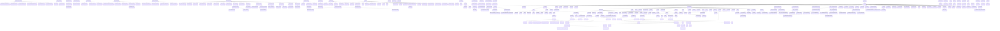

# Entity Hierarchy Diagram

Inheritance relationships between server and client entities (capped at 300 edges for readability).

```mermaid
classDiagram
    DebugSnapshotBaseStructuredData_t <|-- AI_BaseNPCAnimGraph_DebugSnapshotData_t
    DebugSnapshotBaseStructuredData_t <|-- AI_BaseNPC_DebugSnapshotData_t
    DebugSnapshotBaseStructuredData_t <|-- AI_DefaultNPC_DebugSnapshotData_t
    DebugSnapshotBaseStructuredData_t <|-- AI_MotorGroundAnimgraph_DebugSnapshotData_t
    DebugSnapshotBaseStructuredData_t <|-- AI_Motor_DebugSnapshotData_t
    DebugSnapshotBaseStructuredData_t <|-- AI_Navigator_DebugSnapshotData_t
    CAnimEventListenerBase <|-- CAnimEventListener
    CAnimEventListenerBase <|-- CAnimEventQueueListener
    C_BaseModelEntity <|-- CBaseAnimGraph
    CSkeletonAnimationController <|-- CBaseAnimGraphController
    CAnimGraphControllerBase <|-- CBaseAnimGraphDestructibleParts_GraphController
    CNmGraphVariationUserData <|-- CBaseAnimGraphVariationUserData
    CLogicalEntity <|-- CBaseFilter
    C_BaseEntity <|-- CBasePlayerController
    CEntitySubclassVDataBase <|-- CBasePlayerVData
    CEntitySubclassVDataBase <|-- CBasePlayerWeaponVData
    CBaseAnimGraph <|-- CBaseProp
    CEntityComponent <|-- CBodyComponent
    CBodyComponentSkeletonInstance <|-- CBodyComponentBaseAnimGraph
    CBodyComponentSkeletonInstance <|-- CBodyComponentBaseModelEntity
    CBodyComponent <|-- CBodyComponentPoint
    CBodyComponent <|-- CBodyComponentSkeletonInstance
    C_BaseTrigger <|-- CBombTarget
    CAnimGraphControllerBase <|-- CCS2ChickenGraphController
    CCS2WeaponGraphController <|-- CCS2PawnGraphController
    CAnimGraphControllerBase <|-- CCS2UIPawnGraphController
    CAnimGraphControllerBase <|-- CCS2WeaponGraphController
    C_CSGO_EndOfMatchLineupEndpoint <|-- CCSGO_EndOfMatchLineupEnd
    C_CSGO_TeamIntroCharacterPosition <|-- CCSGO_WingmanIntroCharacterPosition
    CCSGO_WingmanIntroCharacterPosition <|-- CCSGO_WingmanIntroCounterTerroristPosition
    CCSGO_WingmanIntroCharacterPosition <|-- CCSGO_WingmanIntroTerroristPosition
    CCSGameModeRules <|-- CCSGameModeRules_ArmsRace
    CCSGameModeRules <|-- CCSGameModeRules_Deathmatch
    CCSGameModeRules <|-- CCSGameModeRules_Noop
    CCSPlayerBase_CameraServices <|-- CCSObserver_CameraServices
    CPlayer_MovementServices <|-- CCSObserver_MovementServices
    CPlayer_ObserverServices <|-- CCSObserver_ObserverServices
    CPlayer_UseServices <|-- CCSObserver_UseServices
    CPlayer_CameraServices <|-- CCSPlayerBase_CameraServices
    CBasePlayerController <|-- CCSPlayerController
    CPlayerControllerComponent <|-- CCSPlayerController_ActionTrackingServices
    CPlayerControllerComponent <|-- CCSPlayerController_DamageServices
    CPlayerControllerComponent <|-- CCSPlayerController_InGameMoneyServices
    CPlayerControllerComponent <|-- CCSPlayerController_InventoryServices
    CPlayerPawnComponent <|-- CCSPlayer_ActionTrackingServices
    CPlayerPawnComponent <|-- CCSPlayer_BulletServices
    CPlayerPawnComponent <|-- CCSPlayer_BuyServices
    CCSPlayerBase_CameraServices <|-- CCSPlayer_CameraServices
    CPlayerPawnComponent <|-- CCSPlayer_DamageReactServices
    CPlayerPawnComponent <|-- CCSPlayer_GlowServices
    CPlayerPawnComponent <|-- CCSPlayer_HostageServices
    CPlayer_ItemServices <|-- CCSPlayer_ItemServices
    CPlayer_MovementServices_Humanoid <|-- CCSPlayer_MovementServices
    CPlayerPawnComponent <|-- CCSPlayer_PingServices
    CPlayer_UseServices <|-- CCSPlayer_UseServices
    CPlayer_WaterServices <|-- CCSPlayer_WaterServices
    CPlayer_WeaponServices <|-- CCSPlayer_WeaponServices
    CBasePlayerWeaponVData <|-- CCSWeaponBaseVData
    C_BaseEntity <|-- CCS_PortraitWorldCallbackHandler
    C_BaseModelEntity <|-- CCashStack
    C_PointEntity <|-- CChoreoInfoTarget
    C_BaseEntity <|-- CCitadelSoundOpvarSetOBB
    IClientAlphaProperty <|-- CClientAlphaProperty
    CAnimGraphControllerBase <|-- CEmptyGraphController
    C_BaseEntity <|-- CEnvSoundscape
    CEnvSoundscape <|-- CEnvSoundscapeAlias_snd_soundscape
    CEnvSoundscape <|-- CEnvSoundscapeProxy
    CEnvSoundscapeProxy <|-- CEnvSoundscapeProxyAlias_snd_soundscape_proxy
    CEnvSoundscape <|-- CEnvSoundscapeTriggerable
    CEnvSoundscapeTriggerable <|-- CEnvSoundscapeTriggerableAlias_snd_soundscape_triggerable
    CBaseFilter <|-- CFilterAttributeInt
    CBaseFilter <|-- CFilterClass
    CBaseFilter <|-- CFilterLOS
    CBaseFilter <|-- CFilterMassGreater
    CBaseFilter <|-- CFilterModel
    CBaseFilter <|-- CFilterMultiple
    CBaseFilter <|-- CFilterName
    CBaseFilter <|-- CFilterProximity
    CBaseFilter <|-- CFilterTeam
    C_DynamicProp <|-- CFuncRetakeBarrier
    C_BaseModelEntity <|-- CFuncWater
    C_BaseModelEntity <|-- CGrenadeTracer
    CEntityComponent <|-- CHitboxComponent
    CHostageRescueZoneShim <|-- CHostageRescueZone
    C_BaseTrigger <|-- CHostageRescueZoneShim
    C_PointEntity <|-- CInfoDynamicShadowHint
    CInfoDynamicShadowHint <|-- CInfoDynamicShadowHintBox
    C_PointEntity <|-- CInfoFan
    C_PointEntity <|-- CInfoInteraction
    C_PointEntity <|-- CInfoOffscreenPanoramaTexture
    C_PointEntity <|-- CInfoParticleTarget
    C_PointEntity <|-- CInfoTarget
    C_BaseEntity <|-- CInfoWorldLayer
    CEntityComponent <|-- CLightComponent
    CLogicalEntity <|-- CLogicRelay
    C_BaseEntity <|-- CLogicalEntity
    C_PointEntity <|-- CMapInfo
    CNmPoseTask <|-- CNmAimCSTask
    CNmEventConsumer <|-- CNmEventConsumerAttributes
    CNmEventConsumer <|-- CNmEventConsumerLegacy
    CNmEventConsumer <|-- CNmEventConsumerParticle
    CNmEventConsumer <|-- CNmEventConsumerSound
    CNmPoseTask <|-- CNmSnapWeaponTask
    C_PointEntity <|-- CPathNode
    CEntityComponent <|-- CPathQueryComponent
    CPathQueryUtil <|-- CPathQueryComponent
    C_BaseEntity <|-- CPathSimple
    CPathSimple <|-- CPathWithDynamicNodes
    CPlayerPawnComponent <|-- CPlayer_AutoaimServices
    CPlayerPawnComponent <|-- CPlayer_CameraServices
    CPlayerPawnComponent <|-- CPlayer_FlashlightServices
    CPlayerPawnComponent <|-- CPlayer_ItemServices
    CPlayerPawnComponent <|-- CPlayer_MovementServices
    CPlayer_MovementServices <|-- CPlayer_MovementServices_Humanoid
    CPlayerPawnComponent <|-- CPlayer_ObserverServices
    CPlayerPawnComponent <|-- CPlayer_UseServices
    CPlayerPawnComponent <|-- CPlayer_WaterServices
    CPlayerPawnComponent <|-- CPlayer_WeaponServices
    C_PointEntity <|-- CPointChildModifier
    C_PointClientUIWorldPanel <|-- CPointOffScreenIndicatorUi
    C_BaseEntity <|-- CPointOrient
    CLogicalEntity <|-- CPointTemplate
    CEntitySubclassVDataBase <|-- CPrecipitationVData
    CEntityComponent <|-- CPropDataComponent
    CPulseCell_BaseLerp <|-- CPulseCell_LerpCameraSettings
    CPulseCell_BaseYieldingInflow <|-- CPulseCell_PlaySequence
    CPulseCell_BaseFlow <|-- CPulseCell_Step_EntFire
    C_BaseEntity <|-- CPulseGameBlackboard
    C_BaseEntity <|-- CRagdollManager
    CSimpleSimTimer <|-- CRandSimTimer
    CStopwatchBase <|-- CRandStopwatch
    CEntityComponent <|-- CRenderComponent
    CSPerRoundStats_t <|-- CSMatchStats_t
    C_BaseModelEntity <|-- CServerOnlyModelEntity
    CSimpleSimTimer <|-- CSimTimer
    CStopwatchBase <|-- CSimpleStopwatch
    ISkeletonAnimationController <|-- CSkeletonAnimationController
    CGameSceneNode <|-- CSkeletonInstance
    C_BaseEntity <|-- CSkyboxReference
    C_Sprite <|-- CSpriteOriented
    CStopwatchBase <|-- CStopwatch
    CSimpleSimTimer <|-- CStopwatchBase
    IntervalTimer <|-- CTimeline
    C_BaseTrigger <|-- CTriggerFan
    C_BaseModelEntity <|-- CWaterSplasher
    C_CSWeaponBaseGun <|-- C_AK47
    CAttributeManager <|-- C_AttributeContainer
    C_BaseModelEntity <|-- C_BarnLight
    C_BaseToggle <|-- C_BaseButton
    C_CSWeaponBase <|-- C_BaseCSGrenade
    C_BaseGrenade <|-- C_BaseCSGrenadeProjectile
    C_BaseModelEntity <|-- C_BaseClientUIEntity
    CBaseAnimGraph <|-- C_BaseCombatCharacter
    C_BaseToggle <|-- C_BaseDoor
    CEntityInstance <|-- C_BaseEntity
    CBaseAnimGraph <|-- C_BaseGrenade
    C_BaseEntity <|-- C_BaseModelEntity
    C_BaseCombatCharacter <|-- C_BasePlayerPawn
    C_EconEntity <|-- C_BasePlayerWeapon
    C_DynamicProp <|-- C_BasePropDoor
    C_BaseModelEntity <|-- C_BaseToggle
    C_BaseToggle <|-- C_BaseTrigger
    C_BaseModelEntity <|-- C_Beam
    C_BaseModelEntity <|-- C_Breakable
    CBaseProp <|-- C_BreakableProp
    CBaseAnimGraph <|-- C_BulletHitModel
    C_CSWeaponBase <|-- C_C4
    C_LateUpdatedAnimating <|-- C_CS2HudModelAddon
    C_CS2HudModelBase <|-- C_CS2HudModelArms
    C_LateUpdatedAnimating <|-- C_CS2HudModelBase
    C_CS2HudModelBase <|-- C_CS2HudModelWeapon
    CBaseAnimGraph <|-- C_CS2WeaponModuleBase
    C_CSGO_TeamPreviewCamera <|-- C_CSGO_CounterTerroristTeamIntroCamera
    C_CSGO_TeamPreviewCamera <|-- C_CSGO_CounterTerroristWingmanIntroCamera
    C_CSGO_TeamPreviewCamera <|-- C_CSGO_EndOfMatchCamera
    C_CSGO_TeamPreviewCharacterPosition <|-- C_CSGO_EndOfMatchCharacterPosition
    C_BaseEntity <|-- C_CSGO_EndOfMatchLineupEndpoint
    C_CSGO_EndOfMatchLineupEndpoint <|-- C_CSGO_EndOfMatchLineupStart
    C_BaseEntity <|-- C_CSGO_MapPreviewCameraPath
    C_BaseEntity <|-- C_CSGO_MapPreviewCameraPathNode
    CBaseAnimGraph <|-- C_CSGO_PreviewModel
    C_CSGO_PreviewModel <|-- C_CSGO_PreviewModelAlias_csgo_item_previewmodel
    C_CSPlayerPawn <|-- C_CSGO_PreviewPlayer
    C_CSGO_PreviewPlayer <|-- C_CSGO_PreviewPlayerAlias_csgo_player_previewmodel
    C_CSGO_TeamPreviewCharacterPosition <|-- C_CSGO_TeamIntroCharacterPosition
    C_CSGO_TeamIntroCharacterPosition <|-- C_CSGO_TeamIntroCounterTerroristPosition
    C_CSGO_TeamIntroCharacterPosition <|-- C_CSGO_TeamIntroTerroristPosition
    C_CSGO_MapPreviewCameraPath <|-- C_CSGO_TeamPreviewCamera
    C_BaseEntity <|-- C_CSGO_TeamPreviewCharacterPosition
    C_CSGO_PreviewPlayer <|-- C_CSGO_TeamPreviewModel
    C_CSGO_TeamPreviewCamera <|-- C_CSGO_TeamSelectCamera
    C_CSGO_TeamPreviewCharacterPosition <|-- C_CSGO_TeamSelectCharacterPosition
    C_CSGO_TeamSelectCharacterPosition <|-- C_CSGO_TeamSelectCounterTerroristPosition
    C_CSGO_TeamSelectCharacterPosition <|-- C_CSGO_TeamSelectTerroristPosition
    C_CSGO_TeamPreviewCamera <|-- C_CSGO_TerroristTeamIntroCamera
    C_CSGO_TeamPreviewCamera <|-- C_CSGO_TerroristWingmanIntroCamera
    C_TeamplayRules <|-- C_CSGameRules
    C_GameRulesProxy <|-- C_CSGameRulesProxy
    C_BaseEntity <|-- C_CSMinimapBoundary
    C_CSPlayerPawnBase <|-- C_CSObserverPawn
    C_BaseEntity <|-- C_CSPetPlacement
    C_CSPlayerPawnBase <|-- C_CSPlayerPawn
    C_BasePlayerPawn <|-- C_CSPlayerPawnBase
    C_BaseEntity <|-- C_CSPlayerResource
    C_Team <|-- C_CSTeam
    C_BasePlayerWeapon <|-- C_CSWeaponBase
    C_CSWeaponBase <|-- C_CSWeaponBaseGun
    C_CSWeaponBase <|-- C_CSWeaponBaseShotgun
    C_DynamicProp <|-- C_Chicken
    IHasAttributes <|-- C_Chicken
    CBaseAnimGraph <|-- C_ClientRagdoll
    C_BaseEntity <|-- C_ColorCorrection
    C_BaseTrigger <|-- C_ColorCorrectionVolume
    C_BaseEntity <|-- C_CsmFovOverride
    C_CSWeaponBaseGun <|-- C_DEagle
    C_BaseCSGrenade <|-- C_DecoyGrenade
    C_BaseCSGrenadeProjectile <|-- C_DecoyProjectile
    C_BaseModelEntity <|-- C_DynamicLight
    C_BreakableProp <|-- C_DynamicProp
    C_DynamicProp <|-- C_DynamicPropAlias_cable_dynamic
    C_DynamicProp <|-- C_DynamicPropAlias_dynamic_prop
    C_DynamicProp <|-- C_DynamicPropAlias_prop_dynamic_override
    CBaseAnimGraph <|-- C_EconEntity
    IHasAttributes <|-- C_EconEntity
    IEconItemInterface <|-- C_EconItemView
    C_EconEntity <|-- C_EconWearable
    C_BaseModelEntity <|-- C_EntityDissolve
    C_BaseEntity <|-- C_EntityFlame
    C_BaseEntity <|-- C_EnvCombinedLightProbeVolume
    C_EnvCombinedLightProbeVolume <|-- C_EnvCombinedLightProbeVolumeAlias_func_combined_light_probe_volume
    C_BaseEntity <|-- C_EnvCubemap
    C_EnvCubemap <|-- C_EnvCubemapBox
    C_BaseEntity <|-- C_EnvCubemapFog
    C_BaseModelEntity <|-- C_EnvDecal
    C_BaseEntity <|-- C_EnvDetailController
    C_BaseEntity <|-- C_EnvLightProbeVolume
    C_ParticleSystem <|-- C_EnvParticleGlow
    C_BaseModelEntity <|-- C_EnvSky
    C_BaseEntity <|-- C_EnvVolumetricFogController
    C_BaseEntity <|-- C_EnvVolumetricFogVolume
    C_BaseEntity <|-- C_EnvWind
    C_BaseEntity <|-- C_EnvWindClientside
    C_BaseEntity <|-- C_EnvWindController
    C_BaseEntity <|-- C_EnvWindVolume
    C_Inferno <|-- C_FireCrackerBlast
    CBaseAnimGraph <|-- C_Fish
    C_BaseCSGrenade <|-- C_Flashbang
    C_BaseCSGrenadeProjectile <|-- C_FlashbangProjectile
    C_BaseEntity <|-- C_FogController
    C_BaseTrigger <|-- C_FootstepControl
    C_BaseModelEntity <|-- C_FuncBrush
    C_BaseModelEntity <|-- C_FuncConveyor
    C_FuncBrush <|-- C_FuncElectrifiedVolume
    C_BaseModelEntity <|-- C_FuncLadder
    C_FuncBrush <|-- C_FuncMonitor
    C_BaseToggle <|-- C_FuncMoveLinear
    C_BaseToggle <|-- C_FuncMover
    C_BaseModelEntity <|-- C_FuncRotating
    C_BaseModelEntity <|-- C_FuncTrackTrain
    C_BaseEntity <|-- C_GameRulesProxy
    C_BaseEntity <|-- C_GlobalLight
    CGlobalLightBase <|-- C_GlobalLight
    C_BaseEntity <|-- C_GradientFog
    C_BaseCSGrenade <|-- C_HEGrenade
    C_BaseCSGrenadeProjectile <|-- C_HEGrenadeProjectile
    C_BaseEntity <|-- C_HandleTest
    C_BaseCombatCharacter <|-- C_Hostage
    CBaseAnimGraph <|-- C_HostageCarriableProp
    C_MolotovGrenade <|-- C_IncendiaryGrenade
    C_BaseModelEntity <|-- C_Inferno
    C_PointEntity <|-- C_InfoInstructorHintHostageRescueZone
    C_BaseEntity <|-- C_InfoLadderDismount
    C_BaseEntity <|-- C_InfoVisibilityBox
    C_EconEntity <|-- C_Item
    C_Item <|-- C_ItemDogtags
    C_WeaponBaseItem <|-- C_Item_Healthshot
    C_CS2WeaponModuleBase <|-- C_KeychainModule
    C_CSWeaponBase <|-- C_Knife
    CBaseAnimGraph <|-- C_LateUpdatedAnimating
    C_LightEntity <|-- C_LightDirectionalEntity
    C_BaseModelEntity <|-- C_LightEntity
    C_LightDirectionalEntity <|-- C_LightEnvironmentEntity
    C_LightEntity <|-- C_LightOrthoEntity
    C_LightEntity <|-- C_LightSpotEntity
    CBaseAnimGraph <|-- C_LocalTempEntity
    C_ParticleSystem <|-- C_MapPreviewParticleSystem
    C_BaseEntity <|-- C_MapVetoPickController
    C_BaseModelEntity <|-- C_ModelPointEntity
    C_BaseCSGrenade <|-- C_MolotovGrenade
    C_BaseCSGrenadeProjectile <|-- C_MolotovProjectile
    CBaseAnimGraph <|-- C_Multimeter
    C_GameRules <|-- C_MultiplayRules
    C_CS2WeaponModuleBase <|-- C_NametagModule
    C_BaseCombatCharacter <|-- C_NetTestBaseCombatCharacter
    C_BarnLight <|-- C_OmniLight
    C_BaseModelEntity <|-- C_ParticleSystem
    C_BaseEntity <|-- C_PathParticleRope
    C_PathParticleRope <|-- C_PathParticleRopeAlias_path_particle_rope_clientside
    C_Breakable <|-- C_PhysBox
    CBaseAnimGraph <|-- C_PhysMagnet
```
