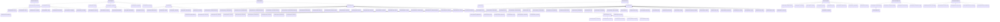

# UML: smartprops

Class relationships (inheritance and composition) for the `smartprops` module.

**Arrow legend:** `<|--` inheritance &nbsp; `*--` composition &nbsp; `-->` association/pointer

```mermaid
classDiagram
    CBasePulseGraphInstance <|-- CPulseGraphInstance_SmartPropEval
    CSmartPropParameter <|-- CSmartPropChoice
    CSmartPropElement_Deformer <|-- CSmartPropElement_BendDeformer
    CSmartPropElement_Group <|-- CSmartPropElement_Deformer
    CSmartPropElement_Group <|-- CSmartPropElement_FitOnLine
    CSmartPropElement <|-- CSmartPropElement_Group
    CSmartPropElement_Group <|-- CSmartPropElement_Layout2DGrid
    CSmartPropElement_Deformer <|-- CSmartPropElement_MidpointDeformer
    CSmartPropElement <|-- CSmartPropElement_Model
    CSmartPropElement <|-- CSmartPropElement_ModelEntity
    CSmartPropElement <|-- CSmartPropElement_ModifyState
    CSmartPropElement_Group <|-- CSmartPropElement_PickOne
    CSmartPropElement_Group <|-- CSmartPropElement_PlaceInSphere
    CSmartPropElement_Group <|-- CSmartPropElement_PlaceMultiple
    CSmartPropElement_Group <|-- CSmartPropElement_PlaceOnPath
    CSmartPropElement_ModelEntity <|-- CSmartPropElement_PropDynamic
    CSmartPropElement_ModelEntity <|-- CSmartPropElement_PropPhysics
    CSmartPropElement <|-- CSmartPropElement_SmartProp
    CSmartPropModifier <|-- CSmartPropFilter
    CSmartPropFilter <|-- CSmartPropFilter_Expression
    CSmartPropFilter <|-- CSmartPropFilter_MaterialAttributes
    CSmartPropFilter <|-- CSmartPropFilter_Probability
    CSmartPropFilter <|-- CSmartPropFilter_SurfaceAngle
    CSmartPropFilter <|-- CSmartPropFilter_SurfaceProperties
    CSmartPropFilter <|-- CSmartPropFilter_VariableValue
    CSmartPropModifier <|-- CSmartPropOperation
    CSmartPropOperation <|-- CSmartPropOperation_ComputeCrossProduct3D
    CSmartPropOperation <|-- CSmartPropOperation_ComputeDistance3D
    CSmartPropOperation <|-- CSmartPropOperation_ComputeDotProduct3D
    CSmartPropOperation <|-- CSmartPropOperation_ComputeNormalizedVector3D
    CSmartPropOperation <|-- CSmartPropOperation_ComputeProjectVector3D
    CSmartPropOperation <|-- CSmartPropOperation_ComputeVectorBetweenPoints3D
    CSmartPropTransformOperation <|-- CSmartPropOperation_CreateLocator
    CSmartPropTransformOperation <|-- CSmartPropOperation_CreateRotator
    CSmartPropTransformOperation <|-- CSmartPropOperation_CreateSizer
    CSmartPropOperation <|-- CSmartPropOperation_MaterialOverride
    CSmartPropOperation <|-- CSmartPropOperation_MaterialTint
    CSmartPropOperation <|-- CSmartPropOperation_RandomColorTintColor
    CSmartPropTransformOperation <|-- CSmartPropOperation_RandomOffset
    CSmartPropTransformOperation <|-- CSmartPropOperation_RandomRotation
    CSmartPropTransformOperation <|-- CSmartPropOperation_RandomScale
    CSmartPropTransformOperation <|-- CSmartPropOperation_ResetRotation
    CSmartPropTransformOperation <|-- CSmartPropOperation_ResetScale
    CSmartPropOperation <|-- CSmartPropOperation_RestoreState
    CSmartPropTransformOperation <|-- CSmartPropOperation_RigidDeformation
    CSmartPropTransformOperation <|-- CSmartPropOperation_Rotate
    CSmartPropTransformOperation <|-- CSmartPropOperation_RotateTowards
    CSmartPropOperation <|-- CSmartPropOperation_SaveColor
    CSmartPropOperation <|-- CSmartPropOperation_SaveDirection
    CSmartPropOperation <|-- CSmartPropOperation_SavePosition
    CSmartPropOperation <|-- CSmartPropOperation_SaveScale
    CSmartPropOperation <|-- CSmartPropOperation_SaveState
    CSmartPropOperation <|-- CSmartPropOperation_SaveSurfaceNormal
    CSmartPropTransformOperation <|-- CSmartPropOperation_Scale
    CSmartPropOperation <|-- CSmartPropOperation_SetMateraialGroupChoice
    CSmartPropTransformOperation <|-- CSmartPropOperation_SetOrientation
    CSmartPropTransformOperation <|-- CSmartPropOperation_SetPosition
    CSmartPropOperation <|-- CSmartPropOperation_SetTintColor
    CSmartPropOperation <|-- CSmartPropOperation_SetVariable
    CSmartPropTransformOperation <|-- CSmartPropOperation_Trace
    CSmartPropOperation_Trace <|-- CSmartPropOperation_TraceInDirection
    CSmartPropOperation_Trace <|-- CSmartPropOperation_TraceToLine
    CSmartPropOperation_Trace <|-- CSmartPropOperation_TraceToPoint
    CSmartPropTransformOperation <|-- CSmartPropOperation_Translate
    CPulseCell_BaseFlow <|-- CSmartPropPulse_BaseQueryableFlow
    CSmartPropPulse_BaseQueryableFlow <|-- CSmartPropPulse_CreateLocator
    CPulseCell_BaseFlow <|-- CSmartPropPulse_CreateRotator
    CPulseCell_BaseFlow <|-- CSmartPropPulse_CreateSizer
    CPulseCell_BaseRequirement <|-- CSmartPropPulse_CriteriaPathPosition
    CPulseCell_BaseFlow <|-- CSmartPropPulse_FitOnLine
    CPulseCell_BaseFlow <|-- CSmartPropPulse_Group
    CPulseCell_BaseFlow <|-- CSmartPropPulse_PickOneSelector
    CPulseCell_BaseFlow <|-- CSmartPropPulse_PlaceInSphere
    CSmartPropPulse_BaseQueryableFlow <|-- CSmartPropPulse_PlaceOnPath
    CPulseCell_BaseRequirement <|-- CSmartPropPulse_SelectionChoiceWeight
    CPulseCell_BaseRequirement <|-- CSmartPropPulse_SelectionEndCap
    CPulseCell_BaseRequirement <|-- CSmartPropPulse_SelectionLinearLength
    CPulseCell_BaseFlow <|-- CSmartPropPulse_SmartProp
    CSmartPropSelectionCriteria <|-- CSmartPropSelectionCriteria_ChoiceWeight
    CSmartPropSelectionCriteria <|-- CSmartPropSelectionCriteria_EndCap
    CSmartPropSelectionCriteria <|-- CSmartPropSelectionCriteria_IsValid
    CSmartPropSelectionCriteria <|-- CSmartPropSelectionCriteria_LinearLength
    CSmartPropSelectionCriteria <|-- CSmartPropSelectionCriteria_PathPosition
    CSmartPropOperation <|-- CSmartPropTransformOperation
    CSmartPropParameter <|-- CSmartPropVariable
    CSmartPropVariable <|-- CSmartPropVariable_Angles
    CSmartPropVariable <|-- CSmartPropVariable_ApplyColorMode
    CSmartPropVariable <|-- CSmartPropVariable_Bool
    CSmartPropVariable <|-- CSmartPropVariable_ChoiceSelectionMode
    CSmartPropVariable <|-- CSmartPropVariable_Color
    CSmartPropVariable <|-- CSmartPropVariable_ColorSelectionMode
    CSmartPropVariable <|-- CSmartPropVariable_CoordinateSpace
    CSmartPropVariable <|-- CSmartPropVariable_DirectionVector
    CSmartPropVariable <|-- CSmartPropVariable_DistributionMode
    CSmartPropVariable <|-- CSmartPropVariable_Float
    CSmartPropVariable <|-- CSmartPropVariable_GridOriginMode
    CSmartPropVariable <|-- CSmartPropVariable_GridPlacementMode
    CSmartPropVariable <|-- CSmartPropVariable_Int
    CSmartPropVariable <|-- CSmartPropVariable_Material
    CSmartPropVariable <|-- CSmartPropVariable_MaterialGroup
    CSmartPropVariable <|-- CSmartPropVariable_Model
    CSmartPropVariable <|-- CSmartPropVariable_PathPositions
    CSmartPropVariable <|-- CSmartPropVariable_PickMode
    CSmartPropVariable <|-- CSmartPropVariable_RadiusPlacementMode
    CSmartPropVariable <|-- CSmartPropVariable_ScaleMode
    CSmartPropVariable <|-- CSmartPropVariable_String
    CSmartPropVariable <|-- CSmartPropVariable_SurfaceProperty
    CSmartPropVariable <|-- CSmartPropVariable_TraceNoHit
    CSmartPropVariable <|-- CSmartPropVariable_Vector2D
    CSmartPropVariable <|-- CSmartPropVariable_Vector3D
    CSmartPropVariable <|-- CSmartPropVariable_Vector4D
    CSmartPropElement_ModelEntity *-- SmartPropDeformableAttachMode_t
    CSmartPropElement_ModelEntity *-- SmartPropDeformableOrientMode_t
    CSmartPropOperation_Trace *-- CSmartPropAttributeCoordinateSpace
    CSmartPropOperation_Trace *-- CSmartPropAttributeTraceNoHit
    CSmartPropPulse_CriteriaPathPosition *-- SmartPropPathPositions_t
```
