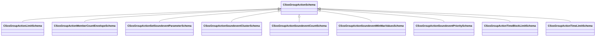

# UML: soundsystem

Class relationships (inheritance and composition) for the `soundsystem` module.

**Arrow legend:** `<|--` inheritance &nbsp; `*--` composition &nbsp; `-->` association/pointer

```mermaid
classDiagram
    CSosGroupActionSchema <|-- CSosGroupActionLimitSchema
    CSosGroupActionSchema <|-- CSosGroupActionMemberCountEnvelopeSchema
    CSosGroupActionSchema <|-- CSosGroupActionSetSoundeventParameterSchema
    CSosGroupActionSchema <|-- CSosGroupActionSoundeventClusterSchema
    CSosGroupActionSchema <|-- CSosGroupActionSoundeventCountSchema
    CSosGroupActionSchema <|-- CSosGroupActionSoundeventMinMaxValuesSchema
    CSosGroupActionSchema <|-- CSosGroupActionSoundeventPrioritySchema
    CSosGroupActionSchema <|-- CSosGroupActionTimeBlockLimitSchema
    CSosGroupActionSchema <|-- CSosGroupActionTimeLimitSchema
```
