# UML: soundsystem_lowlevel

Class relationships (inheritance and composition) for the `soundsystem_lowlevel` module.

**Arrow legend:** `<|--` inheritance &nbsp; `*--` composition &nbsp; `-->` association/pointer

```mermaid
classDiagram
    CVMixBaseProcessorDesc <|-- CVMixAutoFilterProcessorDesc
    CVMixBaseProcessorDesc <|-- CVMixBoxverb2ProcessorDesc
    CVMixBaseProcessorDesc <|-- CVMixBoxverbProcessorDesc
    CVMixInputBase <|-- CVMixControlInput
    CVMixInputBase <|-- CVMixControlInputArray
    CVMixInputBase <|-- CVMixControlMeter
    CVMixInputBase <|-- CVMixControlOutput
    CVMixBaseProcessorDesc <|-- CVMixConvolutionProcessorDesc
    CVMixBaseProcessorDesc <|-- CVMixDelayProcessorDesc
    CVMixBaseProcessorDesc <|-- CVMixDiffusorProcessorDesc
    CVMixBaseProcessorDesc <|-- CVMixDualCompressorProcessorDesc
    CVMixBaseProcessorDesc <|-- CVMixDynamics3BandProcessorDesc
    CVMixBaseProcessorDesc <|-- CVMixDynamicsCompressorProcessorDesc
    CVMixBaseProcessorDesc <|-- CVMixDynamicsProcessorDesc
    CVMixBaseProcessorDesc <|-- CVMixEQ8ProcessorDesc
    CVMixBaseProcessorDesc <|-- CVMixEffectChainProcessorDesc
    CVMixBaseProcessorDesc <|-- CVMixEnvelopeProcessorDesc
    CVMixBaseProcessorDesc <|-- CVMixFilterProcessorDesc
    CVMixBaseProcessorDesc <|-- CVMixFlangerProcessorDesc
    CVMixBaseProcessorDesc <|-- CVMixFreeverbProcessorDesc
    CVMixInputBase <|-- CVMixImpulseResponseInput
    CVMixBaseProcessorDesc <|-- CVMixModDelayProcessorDesc
    CVMixInputBase <|-- CVMixNameInput
    CVMixInputBase <|-- CVMixNameInputMeter
    CVMixBaseProcessorDesc <|-- CVMixOscProcessorDesc
    CVMixBaseProcessorDesc <|-- CVMixPannerProcessorDesc
    CVMixBaseProcessorDesc <|-- CVMixPitchShiftProcessorDesc
    CVMixBaseProcessorDesc <|-- CVMixPlateReverbProcessorDesc
    CVMixBaseProcessorDesc <|-- CVMixPresetDSPProcessorDesc
    CVMixBaseProcessorDesc <|-- CVMixShaperProcessorDesc
    CVMixBaseProcessorDesc <|-- CVMixSteamAudioDirectProcessorDesc
    CVMixBaseProcessorDesc <|-- CVMixSteamAudioHRTFProcessorDesc
    CVMixBaseProcessorDesc <|-- CVMixSteamAudioHybridReverbProcessorDesc
    CVMixBaseProcessorDesc <|-- CVMixSteamAudioPathingProcessorDesc
    CVMixBaseProcessorDesc <|-- CVMixStereoDelayProcessorDesc
    CVMixBaseProcessorDesc <|-- CVMixSubgraphSwitchProcessorDesc
    CVMixBaseProcessorDesc <|-- CVMixUtilityProcessorDesc
    CVMixBaseProcessorDesc <|-- CVMixVocoderProcessorDesc
    CVMixInputBase <|-- CVMixVsndInput
```

