# UML: soundsystem_voicecontainers

Class relationships (inheritance and composition) for the `soundsystem_voicecontainers` module.

**Arrow legend:** `<|--` inheritance &nbsp; `*--` composition &nbsp; `-->` association/pointer

```mermaid
classDiagram
    CVoiceContainerDecayingSineWave <|-- CVoiceContainerAmpedDecayingSineWave
    CVoiceContainerGenerator <|-- CVoiceContainerAsyncGenerator
    CVoiceContainerBase <|-- CVoiceContainerBlender
    CVoiceContainerGenerator <|-- CVoiceContainerDecayingSineWave
    CVoiceContainerBase <|-- CVoiceContainerDefault
    CVoiceContainerBase <|-- CVoiceContainerEnum
    CVoiceContainerDefault <|-- CVoiceContainerEnvelope
    CVoiceContainerAnalysisBase <|-- CVoiceContainerEnvelopeAnalyzer
    CVoiceContainerBase <|-- CVoiceContainerGenerator
    CVoiceContainerAsyncGenerator <|-- CVoiceContainerGranulator
    CVoiceContainerBase <|-- CVoiceContainerLoopTrigger
    CVoiceContainerBase <|-- CVoiceContainerLoopXFade
    CVoiceContainerBase <|-- CVoiceContainerMultiBlender
    CVoiceContainerGenerator <|-- CVoiceContainerNull
    CVoiceContainerBase <|-- CVoiceContainerParameterBlender
    CVoiceContainerAsyncGenerator <|-- CVoiceContainerRandomSampler
    CVoiceContainerGenerator <|-- CVoiceContainerRealtimeFMSineWave
    CVoiceContainerBase <|-- CVoiceContainerSelector
    CVoiceContainerBase <|-- CVoiceContainerSet
    CVoiceContainerGenerator <|-- CVoiceContainerShapedNoise
    CVoiceContainerAsyncGenerator <|-- CVoiceContainerStaticAdditiveSynth
    CVoiceContainerBase <|-- CVoiceContainerSwitch
    CVoiceContainerAsyncGenerator <|-- CVoiceContainerTapePlayer
    CVoiceContainerBase *-- CVSound
    CVoiceContainerBase --> CVoiceContainerAnalysisBase
```

