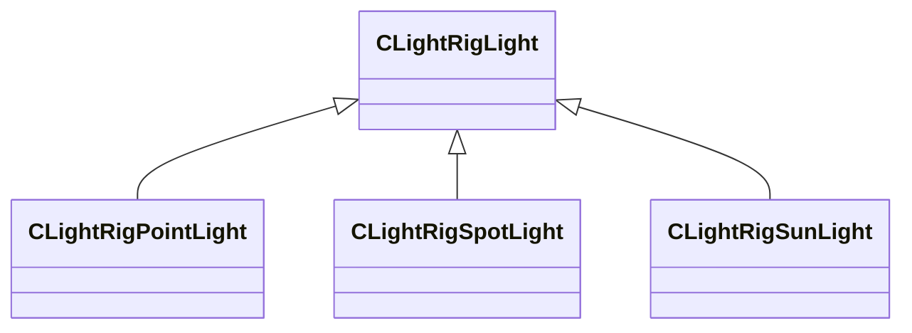

# UML: toolscene

Class relationships (inheritance and composition) for the `toolscene` module.

**Arrow legend:** `<|--` inheritance &nbsp; `*--` composition &nbsp; `-->` association/pointer

```mermaid
classDiagram
    CLightRigLight <|-- CLightRigPointLight
    CLightRigLight <|-- CLightRigSpotLight
    CLightRigLight <|-- CLightRigSunLight
```
