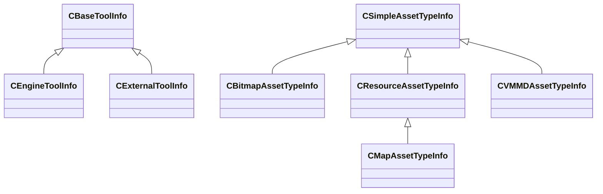

# UML: toolutils2

Class relationships (inheritance and composition) for the `toolutils2` module.

**Arrow legend:** `<|--` inheritance &nbsp; `*--` composition &nbsp; `-->` association/pointer

```mermaid
classDiagram
    CSimpleAssetTypeInfo <|-- CBitmapAssetTypeInfo
    CBaseToolInfo <|-- CEngineToolInfo
    CBaseToolInfo <|-- CExternalToolInfo
    CResourceAssetTypeInfo <|-- CMapAssetTypeInfo
    CSimpleAssetTypeInfo <|-- CResourceAssetTypeInfo
    CSimpleAssetTypeInfo <|-- CVMMDAssetTypeInfo
```
