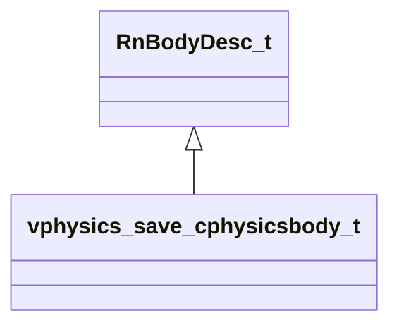

# UML: vphysics2

Class relationships (inheritance and composition) for the `vphysics2` module.

**Arrow legend:** `<|--` inheritance &nbsp; `*--` composition &nbsp; `-->` association/pointer

```mermaid
classDiagram
    RnBodyDesc_t <|-- vphysics_save_cphysicsbody_t
```
