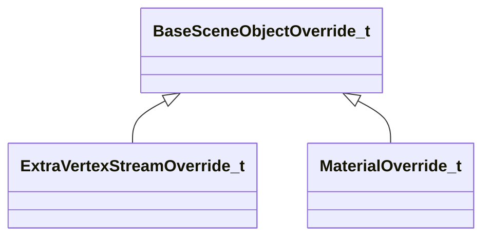

# UML: worldrenderer

Class relationships (inheritance and composition) for the `worldrenderer` module.

**Arrow legend:** `<|--` inheritance &nbsp; `*--` composition &nbsp; `-->` association/pointer

