# `base_gcmessages.proto`

**Imports:** `steammessages.proto`

## Diagram

```mermaid
classDiagram
direction LR

  class CGCStorePurchaseInit_LineItem {
    +uint32 item_def_id
    +uint32 quantity
    +uint64 cost_in_local_currency
    +uint32 purchase_type
    +uint64 supplemental_data
  }

  class CMsgGCStorePurchaseInit {
    +string country
    +int32 language
    +int32 currency
    +List~CGCStorePurchaseInit_LineItem~ line_items
  }

  class CMsgGCStorePurchaseInitResponse {
    +int32 result
    +uint64 txn_id
    +string url
    +List~uint64~ item_ids
  }

  class CSOPartyInvite {
    +uint64 group_id
    +fixed64 sender_id
    +string sender_name
  }

  class CSOLobbyInvite {
    +uint64 group_id
    +fixed64 sender_id
    +string sender_name
  }

  class CMsgSystemBroadcast {
    +string message
  }

  class CMsgInviteToParty {
    +fixed64 steam_id
    +uint32 client_version
    +uint32 team_invite
  }

  class CMsgInvitationCreated {
    +uint64 group_id
    +fixed64 steam_id
  }

  class CMsgPartyInviteResponse {
    +uint64 party_id
    +bool accept
    +uint32 client_version
    +uint32 team_invite
  }

  class CMsgKickFromParty {
    +fixed64 steam_id
  }

  class CMsgLeaveParty {
  }

  class CMsgServerAvailable {
  }

  class CMsgLANServerAvailable {
    +fixed64 lobby_id
  }

  class CSOEconGameAccountClient {
    +uint32 additional_backpack_slots
    +fixed32 trade_ban_expiration
    +fixed32 bonus_xp_timestamp_refresh
    +uint32 bonus_xp_usedflags
    +uint32 elevated_state
    +uint32 elevated_timestamp
  }

  class CSOItemCriteriaCondition {
    +int32 op
    +string field
    +bool required
    +float float_value
    +string string_value
  }

  class CSOItemCriteria {
    +uint32 item_level
    +int32 item_quality
    +bool item_level_set
    +bool item_quality_set
    +uint32 initial_inventory
    +uint32 initial_quantity
    +bool ignore_enabled_flag
    +List~CSOItemCriteriaCondition~ conditions
    +int32 item_rarity
    +bool item_rarity_set
    +bool recent_only
  }

  class CSOItemRecipe {
    +uint32 def_index
    +string name
    +string n_a
    +string desc_inputs
    +string desc_outputs
    +string di_a
    +string di_b
    +string di_c
    +string do_a
    +string do_b
    +string do_c
    +bool requires_all_same_class
    +bool requires_all_same_slot
    +int32 class_usage_for_output
    +int32 slot_usage_for_output
    +int32 set_for_output
    +List~CSOItemCriteria~ input_items_criteria
    +List~CSOItemCriteria~ output_items_criteria
    +List~uint32~ input_item_dupe_counts
  }

  class CMsgDevNewItemRequest {
    +fixed64 receiver
    +CSOItemCriteria criteria
  }

  class CMsgIncrementKillCountAttribute {
    +fixed32 killer_account_id
    +fixed32 victim_account_id
    +uint64 item_id
    +uint32 event_type
    +uint32 amount
  }

  class CMsgApplySticker {
    +uint64 sticker_item_id
    +uint64 item_item_id
    +uint32 sticker_slot
    +uint32 baseitem_defidx
    +float sticker_wear
    +float sticker_rotation
    +float sticker_scale
    +float sticker_offset_x
    +float sticker_offset_y
    +float sticker_offset_z
    +float sticker_wear_target
  }

  class CMsgModifyItemAttribute {
    +uint64 item_id
    +uint32 attr_defidx
    +uint32 attr_value
  }

  class CMsgApplyStatTrakSwap {
    +uint64 tool_item_id
    +uint64 item_1_item_id
    +uint64 item_2_item_id
  }

  class CMsgApplyStrangePart {
    +uint64 strange_part_item_id
    +uint64 item_item_id
  }

  class CMsgApplyPennantUpgrade {
    +uint64 upgrade_item_id
    +uint64 pennant_item_id
  }

  class CMsgApplyEggEssence {
    +uint64 essence_item_id
    +uint64 egg_item_id
  }

  class CSOEconItemAttribute {
    +uint32 def_index
    +uint32 value
    +bytes value_bytes
  }

  class CSOEconItemEquipped {
    +uint32 new_class
    +uint32 new_slot
  }

  class CSOEconItem {
    +uint64 id
    +uint32 account_id
    +uint32 inventory
    +uint32 def_index
    +uint32 quantity
    +uint32 level
    +uint32 quality
    +uint32 flags
    +uint32 origin
    +string custom_name
    +string custom_desc
    +List~CSOEconItemAttribute~ attribute
    +CSOEconItem interior_item
    +bool in_use
    +uint32 style
    +uint64 original_id
    +List~CSOEconItemEquipped~ equipped_state
    +uint32 rarity
  }

  class CMsgSortItems {
    +uint32 sort_type
  }

  class CSOEconClaimCode {
    +uint32 account_id
    +uint32 code_type
    +uint32 time_acquired
    +string code
  }

  class CMsgStoreGetUserData {
    +fixed32 price_sheet_version
    +int32 currency
  }

  class CMsgStoreGetUserDataResponse {
    +int32 result
    +int32 currency_deprecated
    +string country_deprecated
    +fixed32 price_sheet_version
    +bytes price_sheet
  }

  class CMsgUpdateItemSchema {
    +bytes items_game
    +fixed32 item_schema_version
    +string items_game_url
  }

  class CMsgGCError {
    +string error_text
  }

  class CMsgRequestInventoryRefresh {
  }

  class CMsgConVarValue {
    +string name
    +string value
  }

  class CMsgReplicateConVars {
    +List~CMsgConVarValue~ convars
  }

  class CMsgUseItem {
    +uint64 item_id
    +fixed64 target_steam_id
    +List~uint32~ gift__potential_targets
    +uint32 duel__class_lock
    +fixed64 initiator_steam_id
  }

  class CMsgReplayUploadedToYouTube {
    +string youtube_url
    +string youtube_account_name
    +uint64 session_id
  }

  class CMsgConsumableExhausted {
    +int32 item_def_id
  }

  class CMsgItemAcknowledged__DEPRECATED {
    +uint32 account_id
    +uint32 inventory
    +uint32 def_index
    +uint32 quality
    +uint32 rarity
    +uint32 origin
    +uint64 item_id
  }

  class CMsgSetItemPositions {
    +List~CMsgSetItemPositions.ItemPosition~ item_positions
  }

  class ItemPosition {
    +uint32 legacy_item_id
    +uint32 position
    +uint64 item_id
  }

  class CMsgGCReportAbuse {
    +fixed64 target_steam_id
    +string description
    +uint64 gid
    +uint32 abuse_type
    +uint32 content_type
    +fixed32 target_game_server_ip
    +uint32 target_game_server_port
  }

  class CMsgGCReportAbuseResponse {
    +fixed64 target_steam_id
    +uint32 result
    +string error_message
  }

  class CMsgGCNameItemNotification {
    +fixed64 player_steamid
    +uint32 item_def_index
    +string item_name_custom
  }

  class CMsgGCClientDisplayNotification {
    +string notification_title_localization_key
    +string notification_body_localization_key
    +List~string~ body_substring_keys
    +List~string~ body_substring_values
  }

  class CMsgGCShowItemsPickedUp {
    +fixed64 player_steamid
  }

  class CMsgGCIncrementKillCountResponse {
    +uint32 killer_account_id
    +uint32 num_kills
    +uint32 item_def
    +uint32 level_type
  }

  class CSOEconItemDropRateBonus {
    +uint32 account_id
    +fixed32 expiration_date
    +float bonus
    +uint32 bonus_count
    +uint64 item_id
    +uint32 def_index
  }

  class CSOEconItemLeagueViewPass {
    +uint32 account_id
    +uint32 league_id
    +uint32 admin
    +uint32 itemindex
  }

  class CSOEconItemEventTicket {
    +uint32 account_id
    +uint32 event_id
    +uint64 item_id
  }

  class CMsgGCItemPreviewItemBoughtNotification {
    +uint32 item_def_index
  }

  class CMsgGCStorePurchaseCancel {
    +uint64 txn_id
  }

  class CMsgGCStorePurchaseCancelResponse {
    +uint32 result
  }

  class CMsgGCStorePurchaseFinalize {
    +uint64 txn_id
  }

  class CMsgGCStorePurchaseFinalizeResponse {
    +uint32 result
    +List~uint64~ item_ids
  }

  class CMsgGCBannedWordListRequest {
    +uint32 ban_list_group_id
    +uint32 word_id
  }

  class CMsgGCRequestAnnouncements {
  }

  class CMsgGCRequestAnnouncementsResponse {
    +string announcement_title
    +string announcement
    +string nextmatch_title
    +string nextmatch
  }

  class CMsgGCBannedWord {
    +uint32 word_id
    +GC_BannedWordType word_type
    +string word
  }

  class CMsgGCBannedWordListResponse {
    +uint32 ban_list_group_id
    +List~CMsgGCBannedWord~ word_list
  }

  class CMsgGCToGCBannedWordListBroadcast {
    +CMsgGCBannedWordListResponse broadcast
  }

  class CMsgGCToGCBannedWordListUpdated {
    +uint32 group_id
  }

  class CMsgGCToGCDirtySDOCache {
    +uint32 sdo_type
    +uint64 key_uint64
  }

  class CMsgGCToGCDirtyMultipleSDOCache {
    +uint32 sdo_type
    +List~uint64~ key_uint64
  }

  class CMsgGCCollectItem {
    +uint64 collection_item_id
    +uint64 subject_item_id
  }

  class CMsgSDONoMemcached {
  }

  class CMsgGCToGCUpdateSQLKeyValue {
    +string key_name
  }

  class CMsgGCToGCIsTrustedServer {
    +fixed64 steam_id
  }

  class CMsgGCToGCIsTrustedServerResponse {
    +bool is_trusted
  }

  class CMsgGCToGCBroadcastConsoleCommand {
    +string con_command
  }

  class CMsgGCServerVersionUpdated {
    +uint32 server_version
  }

  class CMsgGCClientVersionUpdated {
    +uint32 client_version
  }

  class CMsgGCToGCWebAPIAccountChanged {
  }

  class CMsgGCToGCRequestPassportItemGrant {
    +fixed64 steam_id
    +uint32 league_id
    +int32 reward_flag
  }

  class CMsgGameServerInfo {
    +fixed32 server_public_ip_addr
    +fixed32 server_private_ip_addr
    +uint32 server_port
    +uint32 server_tv_port
    +string server_key
    +bool server_hibernation
    +CMsgGameServerInfo.ServerType server_type
    +uint32 server_region
    +float server_loadavg
    +float server_tv_broadcast_time
    +float server_game_time
    +fixed64 server_relay_connected_steam_id
    +uint32 relay_slots_max
    +int32 relays_connected
    +int32 relay_clients_connected
    +fixed64 relayed_game_server_steam_id
    +uint32 parent_relay_count
    +fixed64 tv_secret_code
  }

  class CSOEconEquipSlot {
    +uint32 account_id
    +uint32 class_id
    +uint32 slot_id
    +uint64 item_id
    +uint32 item_definition
  }

  class CMsgAdjustEquipSlot {
    +uint32 class_id
    +uint32 slot_id
    +uint64 item_id
  }

  class CMsgAdjustEquipSlots {
    +List~CMsgAdjustEquipSlot~ slots
    +uint32 change_num
  }

  class CMsgOpenCrate {
    +uint64 tool_item_id
    +uint64 subject_item_id
    +bool for_rental
    +uint32 points_remaining
  }

  class CSOEconRentalHistory {
    +uint32 account_id
    +uint64 crate_item_id
    +uint32 crate_def_index
    +uint32 issue_date
    +uint32 expiration_date
  }

  class CMsgAcknowledgeRentalExpiration {
    +uint64 crate_item_id
  }

  CMsgGCStorePurchaseInit --> CGCStorePurchaseInit_LineItem : line_items[]
  CSOItemCriteria --> CSOItemCriteriaCondition : conditions[]
  CSOItemRecipe --> CSOItemCriteria : input_items_criteria[]
  CMsgDevNewItemRequest --> CSOItemCriteria : criteria
  CSOEconItem --> CSOEconItemAttribute : attribute[]
  CSOEconItem --> CSOEconItem : interior_item
  CSOEconItem --> CSOEconItemEquipped : equipped_state[]
  CMsgReplicateConVars --> CMsgConVarValue : convars[]
  CMsgSetItemPositions --> ItemPosition : item_positions[]
  CMsgGCBannedWord --> GC_BannedWordType : word_type
  CMsgGCBannedWordListResponse --> CMsgGCBannedWord : word_list[]
  CMsgGCToGCBannedWordListBroadcast --> CMsgGCBannedWordListResponse : broadcast
  CMsgAdjustEquipSlots --> CMsgAdjustEquipSlot : slots[]

  class EGCBaseMsg{
    <<enumeration>>
    k_EMsgGCSystemMessage
    k_EMsgGCReplicateConVars
    k_EMsgGCConVarUpdated
    k_EMsgGCInQueue
    k_EMsgGCInviteToParty
    k_EMsgGCInvitationCreated
    k_EMsgGCPartyInviteResponse
    k_EMsgGCKickFromParty
    k_EMsgGCLeaveParty
    k_EMsgGCServerAvailable
    k_EMsgGCClientConnectToServer
    k_EMsgGCGameServerInfo
    k_EMsgGCError
    k_EMsgGCReplay_UploadedToYouTube
    k_EMsgGCLANServerAvailable
  }

  class EGCBaseProtoObjectTypes{
    <<enumeration>>
    k_EProtoObjectPartyInvite
    k_EProtoObjectLobbyInvite
  }

  class GC_BannedWordType{
    <<enumeration>>
    GC_BANNED_WORD_DISABLE_WORD
    GC_BANNED_WORD_ENABLE_WORD
  }

```

## Enums

### `EGCBaseMsg`

| Name | Value |
|------|-------|
| `k_EMsgGCSystemMessage` | 4001 |
| `k_EMsgGCReplicateConVars` | 4002 |
| `k_EMsgGCConVarUpdated` | 4003 |
| `k_EMsgGCInQueue` | 4008 |
| `k_EMsgGCInviteToParty` | 4501 |
| `k_EMsgGCInvitationCreated` | 4502 |
| `k_EMsgGCPartyInviteResponse` | 4503 |
| `k_EMsgGCKickFromParty` | 4504 |
| `k_EMsgGCLeaveParty` | 4505 |
| `k_EMsgGCServerAvailable` | 4506 |
| `k_EMsgGCClientConnectToServer` | 4507 |
| `k_EMsgGCGameServerInfo` | 4508 |
| `k_EMsgGCError` | 4509 |
| `k_EMsgGCReplay_UploadedToYouTube` | 4510 |
| `k_EMsgGCLANServerAvailable` | 4511 |

### `EGCBaseProtoObjectTypes`

| Name | Value |
|------|-------|
| `k_EProtoObjectPartyInvite` | 1001 |
| `k_EProtoObjectLobbyInvite` | 1002 |

### `GC_BannedWordType`

| Name | Value |
|------|-------|
| `GC_BANNED_WORD_DISABLE_WORD` | 0 |
| `GC_BANNED_WORD_ENABLE_WORD` | 1 |

## Messages

### `CGCStorePurchaseInit_LineItem`

| Field | Ordinal | Type | Label | Description |
|-------|---------|------|-------|-------------|
| `item_def_id` | 1 | uint32 | optional |  |
| `quantity` | 2 | uint32 | optional |  |
| `cost_in_local_currency` | 3 | uint64 | optional |  |
| `purchase_type` | 4 | uint32 | optional |  |
| `supplemental_data` | 5 | uint64 | optional |  |

### `CMsgGCStorePurchaseInit`

| Field | Ordinal | Type | Label | Description |
|-------|---------|------|-------|-------------|
| `country` | 1 | string | optional |  |
| `language` | 2 | int32 | optional |  |
| `currency` | 3 | int32 | optional |  |
| `line_items` | 4 | [CGCStorePurchaseInit_LineItem](#cgcstorepurchaseinit_lineitem) | repeated |  |

### `CMsgGCStorePurchaseInitResponse`

| Field | Ordinal | Type | Label | Description |
|-------|---------|------|-------|-------------|
| `result` | 1 | int32 | optional |  |
| `txn_id` | 2 | uint64 | optional |  |
| `url` | 3 | string | optional |  |
| `item_ids` | 4 | uint64 | repeated |  |

### `CSOPartyInvite`

| Field | Ordinal | Type | Label | Description |
|-------|---------|------|-------|-------------|
| `group_id` | 1 | uint64 | optional |  |
| `sender_id` | 2 | fixed64 | optional |  |
| `sender_name` | 3 | string | optional |  |

### `CSOLobbyInvite`

| Field | Ordinal | Type | Label | Description |
|-------|---------|------|-------|-------------|
| `group_id` | 1 | uint64 | optional |  |
| `sender_id` | 2 | fixed64 | optional |  |
| `sender_name` | 3 | string | optional |  |

### `CMsgSystemBroadcast`

| Field | Ordinal | Type | Label | Description |
|-------|---------|------|-------|-------------|
| `message` | 1 | string | optional |  |

### `CMsgInviteToParty`

| Field | Ordinal | Type | Label | Description |
|-------|---------|------|-------|-------------|
| `steam_id` | 1 | fixed64 | optional |  |
| `client_version` | 2 | uint32 | optional |  |
| `team_invite` | 3 | uint32 | optional |  |

### `CMsgInvitationCreated`

| Field | Ordinal | Type | Label | Description |
|-------|---------|------|-------|-------------|
| `group_id` | 1 | uint64 | optional |  |
| `steam_id` | 2 | fixed64 | optional |  |

### `CMsgPartyInviteResponse`

| Field | Ordinal | Type | Label | Description |
|-------|---------|------|-------|-------------|
| `party_id` | 1 | uint64 | optional |  |
| `accept` | 2 | bool | optional |  |
| `client_version` | 3 | uint32 | optional |  |
| `team_invite` | 4 | uint32 | optional |  |

### `CMsgKickFromParty`

| Field | Ordinal | Type | Label | Description |
|-------|---------|------|-------|-------------|
| `steam_id` | 1 | fixed64 | optional |  |

### `CMsgLeaveParty`

### `CMsgServerAvailable`

### `CMsgLANServerAvailable`

| Field | Ordinal | Type | Label | Description |
|-------|---------|------|-------|-------------|
| `lobby_id` | 1 | fixed64 | optional |  |

### `CSOEconGameAccountClient`

| Field | Ordinal | Type | Label | Description |
|-------|---------|------|-------|-------------|
| `additional_backpack_slots` | 1 | uint32 | optional | *(default: `0`)* |
| `trade_ban_expiration` | 6 | fixed32 | optional |  |
| `bonus_xp_timestamp_refresh` | 12 | fixed32 | optional |  |
| `bonus_xp_usedflags` | 13 | uint32 | optional |  |
| `elevated_state` | 14 | uint32 | optional |  |
| `elevated_timestamp` | 15 | uint32 | optional |  |

### `CSOItemCriteriaCondition`

| Field | Ordinal | Type | Label | Description |
|-------|---------|------|-------|-------------|
| `op` | 1 | int32 | optional |  |
| `field` | 2 | string | optional |  |
| `required` | 3 | bool | optional |  |
| `float_value` | 4 | float | optional |  |
| `string_value` | 5 | string | optional |  |

### `CSOItemCriteria`

| Field | Ordinal | Type | Label | Description |
|-------|---------|------|-------|-------------|
| `item_level` | 1 | uint32 | optional |  |
| `item_quality` | 2 | int32 | optional |  |
| `item_level_set` | 3 | bool | optional |  |
| `item_quality_set` | 4 | bool | optional |  |
| `initial_inventory` | 5 | uint32 | optional |  |
| `initial_quantity` | 6 | uint32 | optional |  |
| `ignore_enabled_flag` | 8 | bool | optional |  |
| `conditions` | 9 | [CSOItemCriteriaCondition](#csoitemcriteriacondition) | repeated |  |
| `item_rarity` | 10 | int32 | optional |  |
| `item_rarity_set` | 11 | bool | optional |  |
| `recent_only` | 12 | bool | optional |  |

### `CSOItemRecipe`

| Field | Ordinal | Type | Label | Description |
|-------|---------|------|-------|-------------|
| `def_index` | 1 | uint32 | optional |  |
| `name` | 2 | string | optional |  |
| `n_a` | 3 | string | optional |  |
| `desc_inputs` | 4 | string | optional |  |
| `desc_outputs` | 5 | string | optional |  |
| `di_a` | 6 | string | optional |  |
| `di_b` | 7 | string | optional |  |
| `di_c` | 8 | string | optional |  |
| `do_a` | 9 | string | optional |  |
| `do_b` | 10 | string | optional |  |
| `do_c` | 11 | string | optional |  |
| `requires_all_same_class` | 12 | bool | optional |  |
| `requires_all_same_slot` | 13 | bool | optional |  |
| `class_usage_for_output` | 14 | int32 | optional |  |
| `slot_usage_for_output` | 15 | int32 | optional |  |
| `set_for_output` | 16 | int32 | optional |  |
| `input_items_criteria` | 20 | [CSOItemCriteria](#csoitemcriteria) | repeated |  |
| `output_items_criteria` | 21 | [CSOItemCriteria](#csoitemcriteria) | repeated |  |
| `input_item_dupe_counts` | 22 | uint32 | repeated |  |

### `CMsgDevNewItemRequest`

| Field | Ordinal | Type | Label | Description |
|-------|---------|------|-------|-------------|
| `receiver` | 1 | fixed64 | optional |  |
| `criteria` | 2 | [CSOItemCriteria](#csoitemcriteria) | optional |  |

### `CMsgIncrementKillCountAttribute`

| Field | Ordinal | Type | Label | Description |
|-------|---------|------|-------|-------------|
| `killer_account_id` | 1 | fixed32 | optional |  |
| `victim_account_id` | 2 | fixed32 | optional |  |
| `item_id` | 3 | uint64 | optional |  |
| `event_type` | 4 | uint32 | optional |  |
| `amount` | 5 | uint32 | optional |  |

### `CMsgApplySticker`

| Field | Ordinal | Type | Label | Description |
|-------|---------|------|-------|-------------|
| `sticker_item_id` | 1 | uint64 | optional |  |
| `item_item_id` | 2 | uint64 | optional |  |
| `sticker_slot` | 3 | uint32 | optional |  |
| `baseitem_defidx` | 4 | uint32 | optional |  |
| `sticker_wear` | 5 | float | optional |  |
| `sticker_rotation` | 6 | float | optional |  |
| `sticker_scale` | 7 | float | optional |  |
| `sticker_offset_x` | 8 | float | optional |  |
| `sticker_offset_y` | 9 | float | optional |  |
| `sticker_offset_z` | 10 | float | optional |  |
| `sticker_wear_target` | 11 | float | optional |  |

### `CMsgModifyItemAttribute`

| Field | Ordinal | Type | Label | Description |
|-------|---------|------|-------|-------------|
| `item_id` | 1 | uint64 | optional |  |
| `attr_defidx` | 2 | uint32 | optional |  |
| `attr_value` | 3 | uint32 | optional |  |

### `CMsgApplyStatTrakSwap`

| Field | Ordinal | Type | Label | Description |
|-------|---------|------|-------|-------------|
| `tool_item_id` | 1 | uint64 | optional |  |
| `item_1_item_id` | 2 | uint64 | optional |  |
| `item_2_item_id` | 3 | uint64 | optional |  |

### `CMsgApplyStrangePart`

| Field | Ordinal | Type | Label | Description |
|-------|---------|------|-------|-------------|
| `strange_part_item_id` | 1 | uint64 | optional |  |
| `item_item_id` | 2 | uint64 | optional |  |

### `CMsgApplyPennantUpgrade`

| Field | Ordinal | Type | Label | Description |
|-------|---------|------|-------|-------------|
| `upgrade_item_id` | 1 | uint64 | optional |  |
| `pennant_item_id` | 2 | uint64 | optional |  |

### `CMsgApplyEggEssence`

| Field | Ordinal | Type | Label | Description |
|-------|---------|------|-------|-------------|
| `essence_item_id` | 1 | uint64 | optional |  |
| `egg_item_id` | 2 | uint64 | optional |  |

### `CSOEconItemAttribute`

| Field | Ordinal | Type | Label | Description |
|-------|---------|------|-------|-------------|
| `def_index` | 1 | uint32 | optional |  |
| `value` | 2 | uint32 | optional |  |
| `value_bytes` | 3 | bytes | optional |  |

### `CSOEconItemEquipped`

| Field | Ordinal | Type | Label | Description |
|-------|---------|------|-------|-------------|
| `new_class` | 1 | uint32 | optional |  |
| `new_slot` | 2 | uint32 | optional |  |

### `CSOEconItem`

| Field | Ordinal | Type | Label | Description |
|-------|---------|------|-------|-------------|
| `id` | 1 | uint64 | optional |  |
| `account_id` | 2 | uint32 | optional |  |
| `inventory` | 3 | uint32 | optional |  |
| `def_index` | 4 | uint32 | optional |  |
| `quantity` | 5 | uint32 | optional |  |
| `level` | 6 | uint32 | optional |  |
| `quality` | 7 | uint32 | optional |  |
| `flags` | 8 | uint32 | optional | *(default: `0`)* |
| `origin` | 9 | uint32 | optional |  |
| `custom_name` | 10 | string | optional |  |
| `custom_desc` | 11 | string | optional |  |
| `attribute` | 12 | [CSOEconItemAttribute](#csoeconitemattribute) | repeated |  |
| `interior_item` | 13 | [CSOEconItem](#csoeconitem) | optional |  |
| `in_use` | 14 | bool | optional | *(default: `false`)* |
| `style` | 15 | uint32 | optional | *(default: `0`)* |
| `original_id` | 16 | uint64 | optional | *(default: `0`)* |
| `equipped_state` | 18 | [CSOEconItemEquipped](#csoeconitemequipped) | repeated |  |
| `rarity` | 19 | uint32 | optional |  |

### `CMsgSortItems`

| Field | Ordinal | Type | Label | Description |
|-------|---------|------|-------|-------------|
| `sort_type` | 1 | uint32 | optional |  |

### `CSOEconClaimCode`

| Field | Ordinal | Type | Label | Description |
|-------|---------|------|-------|-------------|
| `account_id` | 1 | uint32 | optional |  |
| `code_type` | 2 | uint32 | optional |  |
| `time_acquired` | 3 | uint32 | optional |  |
| `code` | 4 | string | optional |  |

### `CMsgStoreGetUserData`

| Field | Ordinal | Type | Label | Description |
|-------|---------|------|-------|-------------|
| `price_sheet_version` | 1 | fixed32 | optional |  |
| `currency` | 2 | int32 | optional |  |

### `CMsgStoreGetUserDataResponse`

| Field | Ordinal | Type | Label | Description |
|-------|---------|------|-------|-------------|
| `result` | 1 | int32 | optional |  |
| `currency_deprecated` | 2 | int32 | optional |  |
| `country_deprecated` | 3 | string | optional |  |
| `price_sheet_version` | 4 | fixed32 | optional |  |
| `price_sheet` | 8 | bytes | optional |  |

### `CMsgUpdateItemSchema`

| Field | Ordinal | Type | Label | Description |
|-------|---------|------|-------|-------------|
| `items_game` | 1 | bytes | optional |  |
| `item_schema_version` | 2 | fixed32 | optional |  |
| `items_game_url` | 4 | string | optional |  |

### `CMsgGCError`

| Field | Ordinal | Type | Label | Description |
|-------|---------|------|-------|-------------|
| `error_text` | 1 | string | optional |  |

### `CMsgRequestInventoryRefresh`

### `CMsgConVarValue`

| Field | Ordinal | Type | Label | Description |
|-------|---------|------|-------|-------------|
| `name` | 1 | string | optional |  |
| `value` | 2 | string | optional |  |

### `CMsgReplicateConVars`

| Field | Ordinal | Type | Label | Description |
|-------|---------|------|-------|-------------|
| `convars` | 1 | [CMsgConVarValue](#cmsgconvarvalue) | repeated |  |

### `CMsgUseItem`

| Field | Ordinal | Type | Label | Description |
|-------|---------|------|-------|-------------|
| `item_id` | 1 | uint64 | optional |  |
| `target_steam_id` | 2 | fixed64 | optional |  |
| `gift__potential_targets` | 3 | uint32 | repeated |  |
| `duel__class_lock` | 4 | uint32 | optional |  |
| `initiator_steam_id` | 5 | fixed64 | optional |  |

### `CMsgReplayUploadedToYouTube`

| Field | Ordinal | Type | Label | Description |
|-------|---------|------|-------|-------------|
| `youtube_url` | 1 | string | optional |  |
| `youtube_account_name` | 2 | string | optional |  |
| `session_id` | 3 | uint64 | optional |  |

### `CMsgConsumableExhausted`

| Field | Ordinal | Type | Label | Description |
|-------|---------|------|-------|-------------|
| `item_def_id` | 1 | int32 | optional |  |

### `CMsgItemAcknowledged__DEPRECATED`

| Field | Ordinal | Type | Label | Description |
|-------|---------|------|-------|-------------|
| `account_id` | 1 | uint32 | optional |  |
| `inventory` | 2 | uint32 | optional |  |
| `def_index` | 3 | uint32 | optional |  |
| `quality` | 4 | uint32 | optional |  |
| `rarity` | 5 | uint32 | optional |  |
| `origin` | 6 | uint32 | optional |  |
| `item_id` | 7 | uint64 | optional |  |

### `CMsgSetItemPositions`

| Field | Ordinal | Type | Label | Description |
|-------|---------|------|-------|-------------|
| `item_positions` | 1 | CMsgSetItemPositions.ItemPosition | repeated |  |

### `CMsgGCReportAbuse`

| Field | Ordinal | Type | Label | Description |
|-------|---------|------|-------|-------------|
| `target_steam_id` | 1 | fixed64 | optional |  |
| `abuse_type` | 2 | uint32 | optional |  |
| `content_type` | 3 | uint32 | optional |  |
| `description` | 4 | string | optional |  |
| `gid` | 5 | uint64 | optional |  |
| `target_game_server_ip` | 6 | fixed32 | optional |  |
| `target_game_server_port` | 7 | uint32 | optional |  |

### `CMsgGCReportAbuseResponse`

| Field | Ordinal | Type | Label | Description |
|-------|---------|------|-------|-------------|
| `target_steam_id` | 1 | fixed64 | optional |  |
| `result` | 2 | uint32 | optional |  |
| `error_message` | 3 | string | optional |  |

### `CMsgGCNameItemNotification`

| Field | Ordinal | Type | Label | Description |
|-------|---------|------|-------|-------------|
| `player_steamid` | 1 | fixed64 | optional |  |
| `item_def_index` | 2 | uint32 | optional |  |
| `item_name_custom` | 3 | string | optional |  |

### `CMsgGCClientDisplayNotification`

| Field | Ordinal | Type | Label | Description |
|-------|---------|------|-------|-------------|
| `notification_title_localization_key` | 1 | string | optional |  |
| `notification_body_localization_key` | 2 | string | optional |  |
| `body_substring_keys` | 3 | string | repeated |  |
| `body_substring_values` | 4 | string | repeated |  |

### `CMsgGCShowItemsPickedUp`

| Field | Ordinal | Type | Label | Description |
|-------|---------|------|-------|-------------|
| `player_steamid` | 1 | fixed64 | optional |  |

### `CMsgGCIncrementKillCountResponse`

| Field | Ordinal | Type | Label | Description |
|-------|---------|------|-------|-------------|
| `killer_account_id` | 1 | uint32 | optional |  |
| `num_kills` | 2 | uint32 | optional |  |
| `item_def` | 3 | uint32 | optional |  |
| `level_type` | 4 | uint32 | optional |  |

### `CSOEconItemDropRateBonus`

| Field | Ordinal | Type | Label | Description |
|-------|---------|------|-------|-------------|
| `account_id` | 1 | uint32 | optional |  |
| `expiration_date` | 2 | fixed32 | optional |  |
| `bonus` | 3 | float | optional |  |
| `bonus_count` | 4 | uint32 | optional |  |
| `item_id` | 5 | uint64 | optional |  |
| `def_index` | 6 | uint32 | optional |  |

### `CSOEconItemLeagueViewPass`

| Field | Ordinal | Type | Label | Description |
|-------|---------|------|-------|-------------|
| `account_id` | 1 | uint32 | optional |  |
| `league_id` | 2 | uint32 | optional |  |
| `admin` | 3 | uint32 | optional |  |
| `itemindex` | 4 | uint32 | optional |  |

### `CSOEconItemEventTicket`

| Field | Ordinal | Type | Label | Description |
|-------|---------|------|-------|-------------|
| `account_id` | 1 | uint32 | optional |  |
| `event_id` | 2 | uint32 | optional |  |
| `item_id` | 3 | uint64 | optional |  |

### `CMsgGCItemPreviewItemBoughtNotification`

| Field | Ordinal | Type | Label | Description |
|-------|---------|------|-------|-------------|
| `item_def_index` | 1 | uint32 | optional |  |

### `CMsgGCStorePurchaseCancel`

| Field | Ordinal | Type | Label | Description |
|-------|---------|------|-------|-------------|
| `txn_id` | 1 | uint64 | optional |  |

### `CMsgGCStorePurchaseCancelResponse`

| Field | Ordinal | Type | Label | Description |
|-------|---------|------|-------|-------------|
| `result` | 1 | uint32 | optional |  |

### `CMsgGCStorePurchaseFinalize`

| Field | Ordinal | Type | Label | Description |
|-------|---------|------|-------|-------------|
| `txn_id` | 1 | uint64 | optional |  |

### `CMsgGCStorePurchaseFinalizeResponse`

| Field | Ordinal | Type | Label | Description |
|-------|---------|------|-------|-------------|
| `result` | 1 | uint32 | optional |  |
| `item_ids` | 2 | uint64 | repeated |  |

### `CMsgGCBannedWordListRequest`

| Field | Ordinal | Type | Label | Description |
|-------|---------|------|-------|-------------|
| `ban_list_group_id` | 1 | uint32 | optional |  |
| `word_id` | 2 | uint32 | optional |  |

### `CMsgGCRequestAnnouncements`

### `CMsgGCRequestAnnouncementsResponse`

| Field | Ordinal | Type | Label | Description |
|-------|---------|------|-------|-------------|
| `announcement_title` | 1 | string | optional |  |
| `announcement` | 2 | string | optional |  |
| `nextmatch_title` | 3 | string | optional |  |
| `nextmatch` | 4 | string | optional |  |

### `CMsgGCBannedWord`

| Field | Ordinal | Type | Label | Description |
|-------|---------|------|-------|-------------|
| `word_id` | 1 | uint32 | optional |  |
| `word_type` | 2 | [GC_BannedWordType](#gc_bannedwordtype) | optional | *(default: `GC_BANNED_WORD_DISABLE_WORD`)* |
| `word` | 3 | string | optional |  |

### `CMsgGCBannedWordListResponse`

| Field | Ordinal | Type | Label | Description |
|-------|---------|------|-------|-------------|
| `ban_list_group_id` | 1 | uint32 | optional |  |
| `word_list` | 2 | [CMsgGCBannedWord](#cmsggcbannedword) | repeated |  |

### `CMsgGCToGCBannedWordListBroadcast`

| Field | Ordinal | Type | Label | Description |
|-------|---------|------|-------|-------------|
| `broadcast` | 1 | [CMsgGCBannedWordListResponse](#cmsggcbannedwordlistresponse) | optional |  |

### `CMsgGCToGCBannedWordListUpdated`

| Field | Ordinal | Type | Label | Description |
|-------|---------|------|-------|-------------|
| `group_id` | 1 | uint32 | optional |  |

### `CMsgGCToGCDirtySDOCache`

| Field | Ordinal | Type | Label | Description |
|-------|---------|------|-------|-------------|
| `sdo_type` | 1 | uint32 | optional |  |
| `key_uint64` | 2 | uint64 | optional |  |

### `CMsgGCToGCDirtyMultipleSDOCache`

| Field | Ordinal | Type | Label | Description |
|-------|---------|------|-------|-------------|
| `sdo_type` | 1 | uint32 | optional |  |
| `key_uint64` | 2 | uint64 | repeated |  |

### `CMsgGCCollectItem`

| Field | Ordinal | Type | Label | Description |
|-------|---------|------|-------|-------------|
| `collection_item_id` | 1 | uint64 | optional |  |
| `subject_item_id` | 2 | uint64 | optional |  |

### `CMsgSDONoMemcached`

### `CMsgGCToGCUpdateSQLKeyValue`

| Field | Ordinal | Type | Label | Description |
|-------|---------|------|-------|-------------|
| `key_name` | 1 | string | optional |  |

### `CMsgGCToGCIsTrustedServer`

| Field | Ordinal | Type | Label | Description |
|-------|---------|------|-------|-------------|
| `steam_id` | 1 | fixed64 | optional |  |

### `CMsgGCToGCIsTrustedServerResponse`

| Field | Ordinal | Type | Label | Description |
|-------|---------|------|-------|-------------|
| `is_trusted` | 1 | bool | optional |  |

### `CMsgGCToGCBroadcastConsoleCommand`

| Field | Ordinal | Type | Label | Description |
|-------|---------|------|-------|-------------|
| `con_command` | 1 | string | optional |  |

### `CMsgGCServerVersionUpdated`

| Field | Ordinal | Type | Label | Description |
|-------|---------|------|-------|-------------|
| `server_version` | 1 | uint32 | optional |  |

### `CMsgGCClientVersionUpdated`

| Field | Ordinal | Type | Label | Description |
|-------|---------|------|-------|-------------|
| `client_version` | 1 | uint32 | optional |  |

### `CMsgGCToGCWebAPIAccountChanged`

### `CMsgGCToGCRequestPassportItemGrant`

| Field | Ordinal | Type | Label | Description |
|-------|---------|------|-------|-------------|
| `steam_id` | 1 | fixed64 | optional |  |
| `league_id` | 2 | uint32 | optional |  |
| `reward_flag` | 3 | int32 | optional |  |

### `CMsgGameServerInfo`

| Field | Ordinal | Type | Label | Description |
|-------|---------|------|-------|-------------|
| `server_public_ip_addr` | 1 | fixed32 | optional |  |
| `server_private_ip_addr` | 2 | fixed32 | optional |  |
| `server_port` | 3 | uint32 | optional |  |
| `server_tv_port` | 4 | uint32 | optional |  |
| `server_key` | 5 | string | optional |  |
| `server_hibernation` | 6 | bool | optional |  |
| `server_type` | 7 | CMsgGameServerInfo.ServerType | optional | *(default: `UNSPECIFIED`)* |
| `server_region` | 8 | uint32 | optional |  |
| `server_loadavg` | 9 | float | optional |  |
| `server_tv_broadcast_time` | 10 | float | optional |  |
| `server_game_time` | 11 | float | optional |  |
| `server_relay_connected_steam_id` | 12 | fixed64 | optional |  |
| `relay_slots_max` | 13 | uint32 | optional |  |
| `relays_connected` | 14 | int32 | optional |  |
| `relay_clients_connected` | 15 | int32 | optional |  |
| `relayed_game_server_steam_id` | 16 | fixed64 | optional |  |
| `parent_relay_count` | 17 | uint32 | optional |  |
| `tv_secret_code` | 18 | fixed64 | optional |  |

### `CSOEconEquipSlot`

| Field | Ordinal | Type | Label | Description |
|-------|---------|------|-------|-------------|
| `account_id` | 1 | uint32 | optional |  |
| `class_id` | 2 | uint32 | optional |  |
| `slot_id` | 3 | uint32 | optional |  |
| `item_id` | 4 | uint64 | optional |  |
| `item_definition` | 5 | uint32 | optional |  |

### `CMsgAdjustEquipSlot`

| Field | Ordinal | Type | Label | Description |
|-------|---------|------|-------|-------------|
| `class_id` | 1 | uint32 | optional |  |
| `slot_id` | 2 | uint32 | optional |  |
| `item_id` | 3 | uint64 | optional |  |

### `CMsgAdjustEquipSlots`

| Field | Ordinal | Type | Label | Description |
|-------|---------|------|-------|-------------|
| `slots` | 1 | [CMsgAdjustEquipSlot](#cmsgadjustequipslot) | repeated |  |
| `change_num` | 2 | uint32 | optional |  |

### `CMsgOpenCrate`

| Field | Ordinal | Type | Label | Description |
|-------|---------|------|-------|-------------|
| `tool_item_id` | 1 | uint64 | optional |  |
| `subject_item_id` | 2 | uint64 | optional |  |
| `for_rental` | 3 | bool | optional |  |
| `points_remaining` | 4 | uint32 | optional |  |

### `CSOEconRentalHistory`

| Field | Ordinal | Type | Label | Description |
|-------|---------|------|-------|-------------|
| `account_id` | 1 | uint32 | optional |  |
| `crate_item_id` | 2 | uint64 | optional |  |
| `crate_def_index` | 3 | uint32 | optional |  |
| `issue_date` | 4 | uint32 | optional |  |
| `expiration_date` | 5 | uint32 | optional |  |

### `CMsgAcknowledgeRentalExpiration`

| Field | Ordinal | Type | Label | Description |
|-------|---------|------|-------|-------------|
| `crate_item_id` | 1 | uint64 | optional |  |
