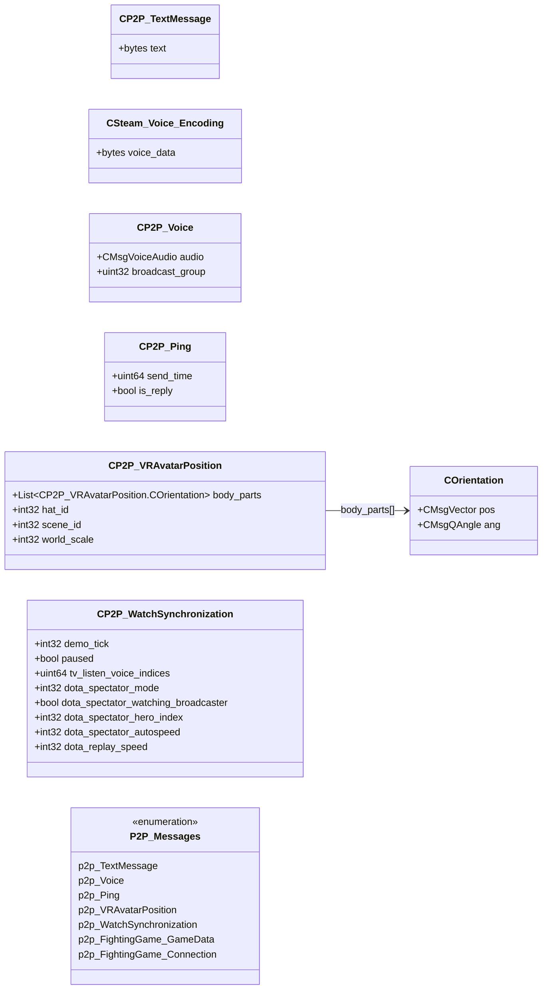

# `c_peer2peer_netmessages.proto`

**Imports:** `netmessages.proto`, `networkbasetypes.proto`

## Diagram

## Enums

### `P2P_Messages`

| Name | Value |
|------|-------|
| `p2p_TextMessage` | 256 |
| `p2p_Voice` | 257 |
| `p2p_Ping` | 258 |
| `p2p_VRAvatarPosition` | 259 |
| `p2p_WatchSynchronization` | 260 |
| `p2p_FightingGame_GameData` | 261 |
| `p2p_FightingGame_Connection` | 262 |

## Messages

### `CP2P_TextMessage`

| Field | Ordinal | Type | Label | Description |
|-------|---------|------|-------|-------------|
| `text` | 1 | bytes | optional |  |

### `CSteam_Voice_Encoding`

| Field | Ordinal | Type | Label | Description |
|-------|---------|------|-------|-------------|
| `voice_data` | 1 | bytes | optional |  |

### `CP2P_Voice`

| Field | Ordinal | Type | Label | Description |
|-------|---------|------|-------|-------------|
| `audio` | 1 | CMsgVoiceAudio | optional |  |
| `broadcast_group` | 2 | uint32 | optional |  |

### `CP2P_Ping`

| Field | Ordinal | Type | Label | Description |
|-------|---------|------|-------|-------------|
| `send_time` | 1 | uint64 | optional |  |
| `is_reply` | 2 | bool | optional |  |

### `CP2P_VRAvatarPosition`

| Field | Ordinal | Type | Label | Description |
|-------|---------|------|-------|-------------|
| `body_parts` | 1 | CP2P_VRAvatarPosition.COrientation | repeated |  |
| `hat_id` | 2 | int32 | optional |  |
| `scene_id` | 3 | int32 | optional |  |
| `world_scale` | 4 | int32 | optional |  |

### `CP2P_WatchSynchronization`

| Field | Ordinal | Type | Label | Description |
|-------|---------|------|-------|-------------|
| `demo_tick` | 1 | int32 | optional |  |
| `paused` | 2 | bool | optional |  |
| `tv_listen_voice_indices` | 3 | uint64 | optional |  |
| `dota_spectator_mode` | 4 | int32 | optional |  |
| `dota_spectator_watching_broadcaster` | 5 | bool | optional |  |
| `dota_spectator_hero_index` | 6 | int32 | optional |  |
| `dota_spectator_autospeed` | 7 | int32 | optional |  |
| `dota_replay_speed` | 8 | int32 | optional |  |
