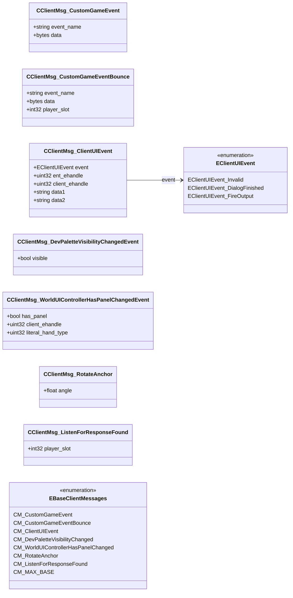

# `clientmessages.proto`

## Diagram

## Enums

### `EBaseClientMessages`

| Name | Value |
|------|-------|
| `CM_CustomGameEvent` | 280 |
| `CM_CustomGameEventBounce` | 281 |
| `CM_ClientUIEvent` | 282 |
| `CM_DevPaletteVisibilityChanged` | 283 |
| `CM_WorldUIControllerHasPanelChanged` | 284 |
| `CM_RotateAnchor` | 285 |
| `CM_ListenForResponseFound` | 286 |
| `CM_MAX_BASE` | 300 |

### `EClientUIEvent`

| Name | Value |
|------|-------|
| `EClientUIEvent_Invalid` | 0 |
| `EClientUIEvent_DialogFinished` | 1 |
| `EClientUIEvent_FireOutput` | 2 |

## Messages

### `CClientMsg_CustomGameEvent`

| Field | Ordinal | Type | Label | Description |
|-------|---------|------|-------|-------------|
| `event_name` | 1 | string | optional |  |
| `data` | 2 | bytes | optional |  |

### `CClientMsg_CustomGameEventBounce`

| Field | Ordinal | Type | Label | Description |
|-------|---------|------|-------|-------------|
| `event_name` | 1 | string | optional |  |
| `data` | 2 | bytes | optional |  |
| `player_slot` | 3 | int32 | optional | *(default: `-1`)* |

### `CClientMsg_ClientUIEvent`

| Field | Ordinal | Type | Label | Description |
|-------|---------|------|-------|-------------|
| `event` | 1 | [EClientUIEvent](#eclientuievent) | optional | *(default: `EClientUIEvent_Invalid`)* |
| `ent_ehandle` | 2 | uint32 | optional |  |
| `client_ehandle` | 3 | uint32 | optional |  |
| `data1` | 4 | string | optional |  |
| `data2` | 5 | string | optional |  |

### `CClientMsg_DevPaletteVisibilityChangedEvent`

| Field | Ordinal | Type | Label | Description |
|-------|---------|------|-------|-------------|
| `visible` | 1 | bool | optional |  |

### `CClientMsg_WorldUIControllerHasPanelChangedEvent`

| Field | Ordinal | Type | Label | Description |
|-------|---------|------|-------|-------------|
| `has_panel` | 1 | bool | optional |  |
| `client_ehandle` | 2 | uint32 | optional |  |
| `literal_hand_type` | 3 | uint32 | optional |  |

### `CClientMsg_RotateAnchor`

| Field | Ordinal | Type | Label | Description |
|-------|---------|------|-------|-------------|
| `angle` | 1 | float | optional |  |

### `CClientMsg_ListenForResponseFound`

| Field | Ordinal | Type | Label | Description |
|-------|---------|------|-------|-------------|
| `player_slot` | 1 | int32 | optional | *(default: `-1`)* |
