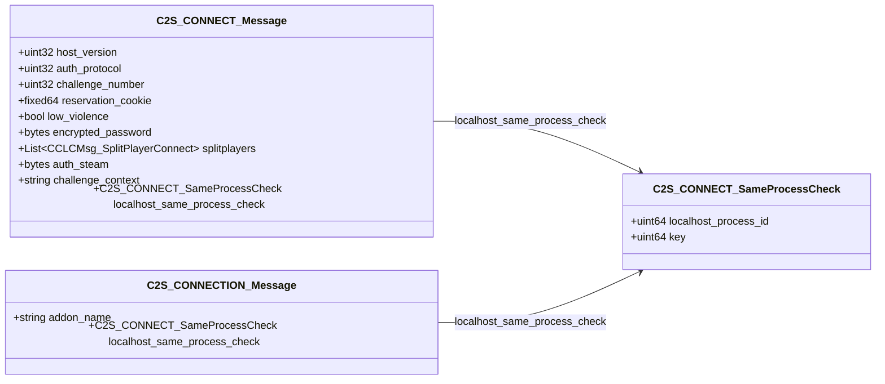

# `connectionless_netmessages.proto`

**Imports:** `netmessages.proto`

## Diagram

## Messages

### `C2S_CONNECT_SameProcessCheck`

| Field | Ordinal | Type | Label | Description |
|-------|---------|------|-------|-------------|
| `localhost_process_id` | 1 | uint64 | optional |  |
| `key` | 2 | uint64 | optional |  |

### `C2S_CONNECT_Message`

| Field | Ordinal | Type | Label | Description |
|-------|---------|------|-------|-------------|
| `host_version` | 1 | uint32 | optional |  |
| `auth_protocol` | 2 | uint32 | optional |  |
| `challenge_number` | 3 | uint32 | optional |  |
| `reservation_cookie` | 4 | fixed64 | optional |  |
| `low_violence` | 5 | bool | optional |  |
| `encrypted_password` | 6 | bytes | optional |  |
| `splitplayers` | 7 | CCLCMsg_SplitPlayerConnect | repeated |  |
| `auth_steam` | 8 | bytes | optional |  |
| `challenge_context` | 9 | string | optional |  |
| `localhost_same_process_check` | 10 | [C2S_CONNECT_SameProcessCheck](#c2s_connect_sameprocesscheck) | optional |  |

### `C2S_CONNECTION_Message`

| Field | Ordinal | Type | Label | Description |
|-------|---------|------|-------|-------------|
| `addon_name` | 1 | string | optional |  |
| `localhost_same_process_check` | 2 | [C2S_CONNECT_SameProcessCheck](#c2s_connect_sameprocesscheck) | optional |  |
