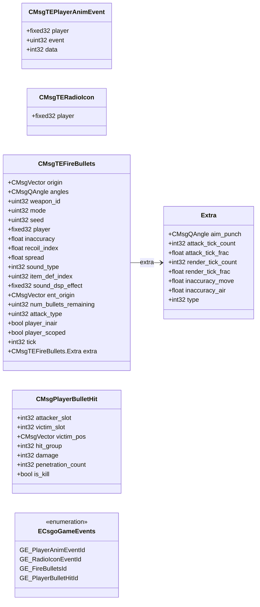

# `cs_gameevents.proto`

**Imports:** `networkbasetypes.proto`

CS2-specific game event protobuf messages.  These are temporary entity (TE) events and game events broadcast from the server to clients that are within the relevant PVS or listening for the event type.  Identified by the ECsgoGameEvents enum (450–453).

## Diagram

## Enums

### `ECsgoGameEvents`

| Name | Value |
|------|-------|
| `GE_PlayerAnimEventId` | 450 |
| `GE_RadioIconEventId` | 451 |
| `GE_FireBulletsId` | 452 |
| `GE_PlayerBulletHitId` | 453 |

## Messages

### `CMsgTEPlayerAnimEvent`

Temporary entity event that triggers a networked animation event on a player's animation graph (jumps, land, crouch transitions, etc.).

| Field | Ordinal | Type | Label | Description |
|-------|---------|------|-------|-------------|
| `player` | 1 | fixed32 | optional | Entity handle (packed as fixed32) of the player triggering the animation event. *(default: `16777215`)* |
| `event` | 2 | uint32 | optional | Animation event ID matching an entry in the player's animation graph. |
| `data` | 3 | int32 | optional | Optional integer payload passed to the animation event handler. |

### `CMsgTERadioIcon`

Triggers the radio-icon animation above a player's head when they use a radio command, showing team-mates which player is communicating.

| Field | Ordinal | Type | Label | Description |
|-------|---------|------|-------|-------------|
| `player` | 1 | fixed32 | optional | Entity handle (packed as fixed32) of the player using the radio command. *(default: `16777215`)* |

### `CMsgTEFireBullets`

Temporary entity event broadcast when a player fires a weapon. Received by all clients within PVS range of the shooter's origin.

> 📝 The seed field allows clients to reproduce the exact bullet spread using the same PRNG as the server, enabling accurate hit-registration replay in demo parsers.

| Field | Ordinal | Type | Label | Description |
|-------|---------|------|-------|-------------|
| `origin` | 1 | CMsgVector | optional | World-space muzzle position from which the bullet was fired. |
| `angles` | 2 | CMsgQAngle | optional | Aim angles (pitch, yaw) at the moment of fire. |
| `weapon_id` | 3 | uint32 | optional | Item definition index (item_definition_index_t) of the weapon fired. Maps to entries in items_game.txt.
 *(default: `16777215`)* |
| `mode` | 4 | uint32 | optional | Fire mode – 0 for primary, 1 for secondary/burst. |
| `seed` | 5 | uint32 | optional | PRNG seed used to reproduce the bullet spread trajectory. |
| `player` | 6 | fixed32 | optional | Entity handle of the player who fired (packed as fixed32). *(default: `16777215`)* |
| `inaccuracy` | 7 | float | optional | Inaccuracy value at time of fire, affecting spread cone. |
| `recoil_index` | 8 | float | optional | Recoil accumulator index used for kick-back calculations. |
| `spread` | 9 | float | optional | Weapon spread value at time of fire. |
| `sound_type` | 10 | int32 | optional | Sound type index controlling which fire-sound variant plays. |
| `item_def_index` | 11 | uint32 | optional | Item definition index of the firing weapon (same as weapon_id for most weapons). |
| `sound_dsp_effect` | 12 | fixed32 | optional | DSP (digital signal processing) effect hash applied to the fire sound. |
| `ent_origin` | 13 | CMsgVector | optional | World-space origin of the firing entity (may differ from muzzle origin for some weapon types). |
| `num_bullets_remaining` | 14 | uint32 | optional | Clip ammo remaining after this shot. |
| `attack_type` | 15 | uint32 | optional | Attack type identifier (0 = primary, other values for special modes). |
| `extra` | 16 | CMsgTEFireBullets.Extra | optional | Optional nested Extra message with additional precision data for demo analysis. |
| `player_inair` | 17 | bool | optional | True when the player was airborne at the moment of firing. |
| `player_scoped` | 18 | bool | optional | True when the player was zoomed/scoped at the moment of firing. |
| `tick` | 19 | int32 | optional | Server tick on which the shot was fired. |

### `CMsgPlayerBulletHit`

Sent to the attacker (and optionally team) when a bullet registers a hit. Used by the client to display hit-marker feedback and play hit sounds.

| Field | Ordinal | Type | Label | Description |
|-------|---------|------|-------|-------------|
| `attacker_slot` | 1 | int32 | optional | Player slot index of the shooter. *(default: `-1`)* |
| `victim_slot` | 2 | int32 | optional | Player slot index of the entity that was hit. *(default: `-1`)* |
| `victim_pos` | 3 | CMsgVector | optional | World-space position of the victim at the moment of impact. |
| `hit_group` | 4 | int32 | optional | Hit-group constant (head=1, chest=2, stomach=3, leftarm=4, rightarm=5, leftleg=6, rightleg=7). |
| `damage` | 5 | int32 | optional | Raw damage dealt before armour reduction. |
| `penetration_count` | 6 | int32 | optional | Number of surfaces the bullet penetrated before this hit. |
| `is_kill` | 7 | bool | optional | True if this hit resulted in the victim's death. |
