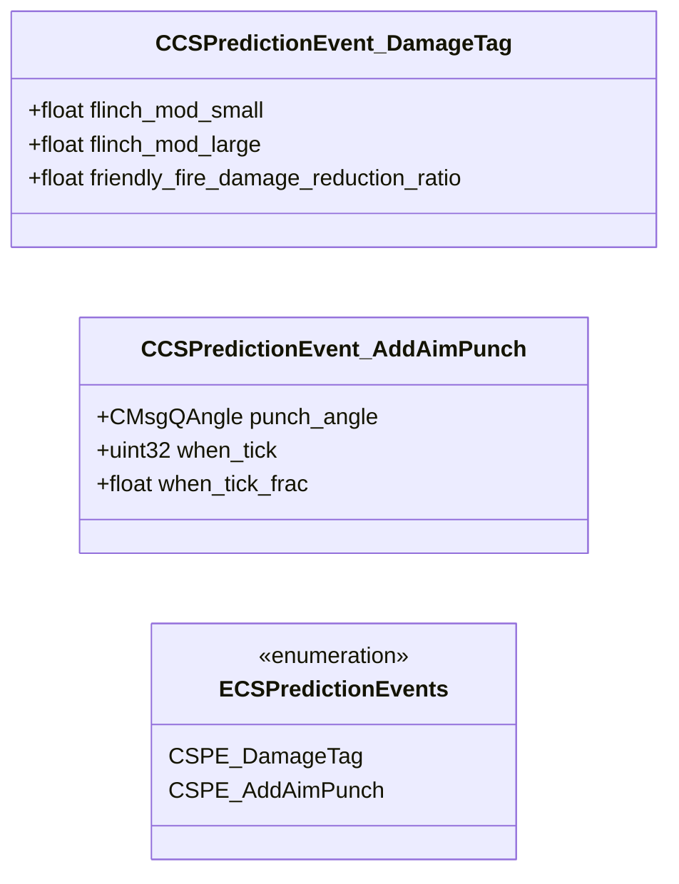

# `cs_prediction_events.proto`

**Imports:** `networkbasetypes.proto`, `prediction_events.proto`

## Diagram

## Enums

### `ECSPredictionEvents`

| Name | Value |
|------|-------|
| `CSPE_DamageTag` | 1 |
| `CSPE_AddAimPunch` | 3 |

## Messages

### `CCSPredictionEvent_DamageTag`

| Field | Ordinal | Type | Label | Description |
|-------|---------|------|-------|-------------|
| `flinch_mod_small` | 1 | float | optional |  |
| `flinch_mod_large` | 2 | float | optional |  |
| `friendly_fire_damage_reduction_ratio` | 3 | float | optional |  |

### `CCSPredictionEvent_AddAimPunch`

| Field | Ordinal | Type | Label | Description |
|-------|---------|------|-------|-------------|
| `punch_angle` | 1 | CMsgQAngle | optional |  |
| `when_tick` | 2 | uint32 | optional |  |
| `when_tick_frac` | 3 | float | optional |  |
