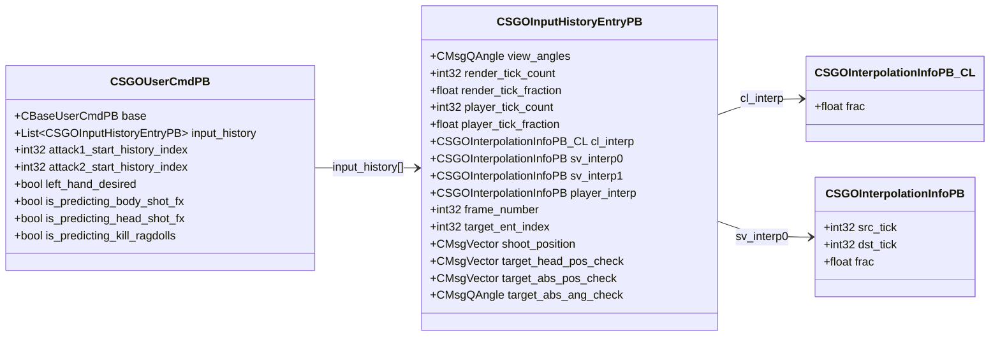

# `cs_usercmd.proto`

**Imports:** `networkbasetypes.proto`, `usercmd.proto`

## Diagram

## Messages

### `CSGOInterpolationInfoPB`

| Field | Ordinal | Type | Label | Description |
|-------|---------|------|-------|-------------|
| `src_tick` | 1 | int32 | optional | *(default: `-1`)* |
| `dst_tick` | 2 | int32 | optional | *(default: `-1`)* |
| `frac` | 3 | float | optional | *(default: `0`)* |

### `CSGOInterpolationInfoPB_CL`

| Field | Ordinal | Type | Label | Description |
|-------|---------|------|-------|-------------|
| `frac` | 3 | float | optional | *(default: `0`)* |

### `CSGOInputHistoryEntryPB`

| Field | Ordinal | Type | Label | Description |
|-------|---------|------|-------|-------------|
| `view_angles` | 2 | CMsgQAngle | optional |  |
| `render_tick_count` | 4 | int32 | optional |  |
| `render_tick_fraction` | 5 | float | optional |  |
| `player_tick_count` | 6 | int32 | optional |  |
| `player_tick_fraction` | 7 | float | optional |  |
| `cl_interp` | 12 | [CSGOInterpolationInfoPB_CL](#csgointerpolationinfopb_cl) | optional |  |
| `sv_interp0` | 13 | [CSGOInterpolationInfoPB](#csgointerpolationinfopb) | optional |  |
| `sv_interp1` | 14 | [CSGOInterpolationInfoPB](#csgointerpolationinfopb) | optional |  |
| `player_interp` | 15 | [CSGOInterpolationInfoPB](#csgointerpolationinfopb) | optional |  |
| `frame_number` | 64 | int32 | optional |  |
| `target_ent_index` | 65 | int32 | optional | *(default: `-1`)* |
| `shoot_position` | 66 | CMsgVector | optional |  |
| `target_head_pos_check` | 67 | CMsgVector | optional |  |
| `target_abs_pos_check` | 68 | CMsgVector | optional |  |
| `target_abs_ang_check` | 69 | CMsgQAngle | optional |  |

### `CSGOUserCmdPB`

| Field | Ordinal | Type | Label | Description |
|-------|---------|------|-------|-------------|
| `base` | 1 | CBaseUserCmdPB | optional |  |
| `input_history` | 2 | [CSGOInputHistoryEntryPB](#csgoinputhistoryentrypb) | repeated |  |
| `attack1_start_history_index` | 6 | int32 | optional | *(default: `-1`)* |
| `attack2_start_history_index` | 7 | int32 | optional | *(default: `-1`)* |
| `left_hand_desired` | 9 | bool | optional | *(default: `false`)* |
| `is_predicting_body_shot_fx` | 11 | bool | optional | *(default: `false`)* |
| `is_predicting_head_shot_fx` | 12 | bool | optional | *(default: `false`)* |
| `is_predicting_kill_ragdolls` | 13 | bool | optional | *(default: `false`)* |
