# `cstrike15_usermessages.proto`

**Imports:** `networkbasetypes.proto`, `cstrike15_gcmessages.proto`

CS2 user-messages sent reliably from server to one or more clients.  These messages carry HUD feedback, audio triggers, economy updates, and kill-cam data.  They are identified by the ECstrike15UserMessages enum (IDs 301–388).

## Diagram

```mermaid
classDiagram
direction LR

  class CCSUsrMsg_VGUIMenu {
    +string name
    +bool show
    +List~CCSUsrMsg_VGUIMenu.Keys~ keys
  }

  class Keys {
    +string name
    +string value
  }

  class CCSUsrMsg_Geiger {
    +int32 range
  }

  class CCSUsrMsg_Train {
    +int32 train
  }

  class CCSUsrMsg_HudText {
    +string text
  }

  class CCSUsrMsg_HudMsg {
    +int32 channel
    +CMsgVector2D pos
    +CMsgRGBA clr1
    +CMsgRGBA clr2
    +int32 effect
    +float fade_in_time
    +float fade_out_time
    +float hold_time
    +float fx_time
    +string text
  }

  class CCSUsrMsg_Shake {
    +int32 command
    +float local_amplitude
    +float frequency
    +float duration
  }

  class CCSUsrMsg_Fade {
    +int32 duration
    +int32 hold_time
    +int32 flags
    +CMsgRGBA clr
  }

  class CCSUsrMsg_Rumble {
    +int32 index
    +int32 data
    +int32 flags
  }

  class CCSUsrMsg_CloseCaption {
    +uint32 hash
    +int32 duration
    +bool from_player
    +string cctoken
  }

  class CCSUsrMsg_CloseCaptionDirect {
    +uint32 hash
    +int32 duration
    +bool from_player
  }

  class CCSUsrMsg_SendAudio {
    +string radio_sound
  }

  class CCSUsrMsg_RawAudio {
    +int32 pitch
    +int32 entidx
    +float duration
    +string voice_filename
  }

  class CCSUsrMsg_VoiceMask {
    +List~CCSUsrMsg_VoiceMask.PlayerMask~ player_masks
    +bool player_mod_enable
  }

  class PlayerMask {
    +int32 game_rules_mask
    +int32 ban_masks
  }

  class CCSUsrMsg_Damage {
    +int32 amount
    +CMsgVector inflictor_world_pos
    +int32 victim_entindex
  }

  class CCSUsrMsg_RadioText {
    +int32 msg_dst
    +int32 client
    +string msg_name
    +List~string~ params
  }

  class CCSUsrMsg_HintText {
    +string message
  }

  class CCSUsrMsg_KeyHintText {
    +List~string~ messages
  }

  class CCSUsrMsg_ProcessSpottedEntityUpdate {
    +bool new_update
    +List~CCSUsrMsg_ProcessSpottedEntityUpdate.SpottedEntityUpdate~ entity_updates
  }

  class SpottedEntityUpdate {
    +int32 entity_idx
    +int32 class_id
    +int32 origin_x
    +int32 origin_y
    +int32 origin_z
    +int32 angle_y
    +bool defuser
    +bool player_has_defuser
    +bool player_has_c4
  }

  class CCSUsrMsg_SendPlayerItemDrops {
    +List~CEconItemPreviewDataBlock~ entity_updates
  }

  class CCSUsrMsg_SendPlayerItemFound {
    +CEconItemPreviewDataBlock iteminfo
    +int32 playerslot
  }

  class CCSUsrMsg_ReloadEffect {
    +int32 entidx
    +int32 actanim
    +float origin_x
    +float origin_y
    +float origin_z
  }

  class CCSUsrMsg_WeaponSound {
    +int32 entidx
    +float origin_x
    +float origin_y
    +float origin_z
    +string sound
    +float game_timestamp
    +fixed32 source_soundscapeid
  }

  class CCSUsrMsg_UpdateScreenHealthBar {
    +int32 entidx
    +float healthratio_old
    +float healthratio_new
    +int32 style
  }

  class CCSUsrMsg_EntityOutlineHighlight {
    +int32 entidx
    +bool removehighlight
  }

  class CCSUsrMsg_AdjustMoney {
    +int32 amount
  }

  class CCSUsrMsg_ReportHit {
    +float pos_x
    +float pos_y
    +float timestamp
    +float pos_z
  }

  class CCSUsrMsg_KillCam {
    +int32 obs_mode
    +int32 first_target
    +int32 second_target
  }

  class CCSUsrMsg_DesiredTimescale {
    +float desired_timescale
    +float duration_realtime_sec
    +int32 interpolator_type
    +float start_blend_time
  }

  class CCSUsrMsg_CurrentTimescale {
    +float cur_timescale
  }

  class CCSUsrMsg_AchievementEvent {
    +int32 achievement
    +int32 count
    +int32 user_id
  }

  class CCSUsrMsg_MatchEndConditions {
    +int32 fraglimit
    +int32 mp_maxrounds
    +int32 mp_winlimit
    +float mp_timelimit
  }

  class CCSUsrMsg_PlayerStatsUpdate {
    +int32 version
    +List~CCSUsrMsg_PlayerStatsUpdate.Stat~ stats
    +uint32 ehandle
    +int32 crc
  }

  class Stat {
    +int32 idx
    +int32 delta
  }

  class CCSUsrMsg_QuestProgress {
    +uint32 quest_id
    +uint32 normal_points
    +uint32 bonus_points
    +bool is_event_quest
  }

  class CCSUsrMsg_ScoreLeaderboardData {
    +ScoreLeaderboardData data
  }

  class CCSUsrMsg_PlayerDecalDigitalSignature {
    +PlayerDecalDigitalSignature data
  }

  class CCSUsrMsg_XRankGet {
    +int32 mode_idx
    +int32 controller
  }

  class CCSUsrMsg_XRankUpd {
    +int32 mode_idx
    +int32 controller
    +int32 ranking
  }

  class CCSUsrMsg_CallVoteFailed {
    +int32 reason
    +int32 time
  }

  class CCSUsrMsg_VoteStart {
    +int32 team
    +int32 player_slot
    +int32 vote_type
    +string disp_str
    +string details_str
    +string other_team_str
    +bool is_yes_no_vote
    +int32 player_slot_target
  }

  class CCSUsrMsg_VotePass {
    +int32 team
    +int32 vote_type
    +string disp_str
    +string details_str
  }

  class CCSUsrMsg_VoteFailed {
    +int32 team
    +int32 reason
  }

  class CCSUsrMsg_VoteSetup {
    +List~string~ potential_issues
  }

  class CCSUsrMsg_SendLastKillerDamageToClient {
    +int32 num_hits_given
    +int32 damage_given
    +int32 num_hits_taken
    +int32 damage_taken
    +int32 actual_damage_given
    +int32 actual_damage_taken
  }

  class CCSUsrMsg_ServerRankUpdate {
    +List~CCSUsrMsg_ServerRankUpdate.RankUpdate~ rank_update
  }

  class RankUpdate {
    +int32 account_id
    +int32 rank_old
    +int32 rank_new
    +int32 num_wins
    +float rank_change
    +int32 rank_type_id
  }

  class CCSUsrMsg_XpUpdate {
    +CMsgGCCstrike15_v2_GC2ServerNotifyXPRewarded data
  }

  class CCSUsrMsg_ItemPickup {
    +string item
  }

  class CCSUsrMsg_ShowMenu {
    +int32 bits_valid_slots
    +int32 display_time
    +string menu_string
  }

  class CCSUsrMsg_BarTime {
    +string time
  }

  class CCSUsrMsg_AmmoDenied {
    +int32 ammoidx
  }

  class CCSUsrMsg_MarkAchievement {
    +string achievement
  }

  class CCSUsrMsg_MatchStatsUpdate {
    +string update
  }

  class CCSUsrMsg_ItemDrop {
    +int64 itemid
    +bool death
  }

  class CCSUsrMsg_RoundBackupFilenames {
    +int32 count
    +int32 index
    +string filename
    +string nicename
  }

  class CCSUsrMsg_SSUI {
    +bool show
    +float start_time
    +float end_time
  }

  class CCSUsrMsg_SurvivalStats {
    +uint64 xuid
    +List~CCSUsrMsg_SurvivalStats.Fact~ facts
    +List~CCSUsrMsg_SurvivalStats.Placement~ users
    +List~CCSUsrMsg_SurvivalStats.Damage~ damages
    +int32 ticknumber
  }

  class Fact {
    +int32 type
    +int32 display
    +int32 value
    +float interestingness
  }

  class Placement {
    +uint64 xuid
    +int32 teamnumber
    +int32 placement
  }

  class Damage {
    +uint64 xuid
    +int32 to
    +int32 to_hits
    +int32 from
    +int32 from_hits
  }

  class CCSUsrMsg_EndOfMatchAllPlayersData {
    +List~CCSUsrMsg_EndOfMatchAllPlayersData.PlayerData~ allplayerdata
    +int32 scene
  }

  class Accolade {
    +int32 eaccolade
    +float value
    +int32 position
  }

  class PlayerData {
    +int32 slot
    +uint64 xuid
    +string name
    +int32 teamnumber
    +CCSUsrMsg_EndOfMatchAllPlayersData.Accolade nomination
    +List~CEconItemPreviewDataBlock~ items
    +int32 playercolor
    +bool isbot
  }

  class CCSUsrMsg_RoundEndReportData {
    +CCSUsrMsg_RoundEndReportData.InitialConditions init_conditions
    +List~CCSUsrMsg_RoundEndReportData.RerEvent~ all_rer_event_data
  }

  class RerEvent {
    +float timestamp
    +int32 terrorist_odds
    +int32 ct_alive
    +int32 t_alive
    +CCSUsrMsg_RoundEndReportData.RerEvent.Victim victim_data
    +CCSUsrMsg_RoundEndReportData.RerEvent.Objective objective_data
    +List~CCSUsrMsg_RoundEndReportData.RerEvent.Damage~ all_damage_data
  }

  class Victim {
    +int32 team_number
    +int32 playerslot
    +uint64 xuid
    +int32 color
    +bool is_bot
    +bool is_dead
  }

  class Objective {
    +int32 type
  }

  class Damage {
    +int32 other_playerslot
    +uint64 other_xuid
    +int32 health_removed
    +int32 num_hits
    +int32 return_health_removed
    +int32 return_num_hits
  }

  class InitialConditions {
    +int32 ct_equip_value
    +int32 t_equip_value
    +int32 terrorist_odds
  }

  class CCSUsrMsg_PostRoundDamageReport {
    +uint64 other_xuid
    +int32 given_kill_type
    +int32 given_health_removed
    +int32 given_num_hits
    +int32 taken_kill_type
    +int32 taken_health_removed
    +int32 taken_num_hits
  }

  class CCSUsrMsg_CurrentRoundOdds {
    +int32 odds
  }

  class CCSUsrMsg_DeepStats {
    +CMsgGCCStrike15_ClientDeepStats stats
  }

  class CCSUsrMsg_ShootInfo {
    +int32 frame_number
    +List~CMsgTransform~ hitbox_transforms
    +CMsgVector shoot_pos
    +CMsgQAngle shoot_dir
  }

  class CCSUsrMsg_ResetHud {
    +bool reset
  }

  class CCSUsrMsg_GameTitle {
    +int32 dummy
  }

  class CCSUsrMsg_RequestState {
    +int32 dummy
  }

  class CCSUsrMsg_StopSpectatorMode {
    +int32 dummy
  }

  class CCSUsrMsg_DisconnectToLobby {
    +int32 dummy
  }

  class CCSUsrMsg_ClientInfo {
    +int32 dummy
  }

  class CCSUsrMsg_ServerRankRevealAll {
    +int32 seconds_till_shutdown
    +CMsgGCCStrike15_v2_MatchmakingGC2ServerReserve reservation
  }

  class CCSUsrMsgPreMatchSayText {
    +uint32 account_id
    +string text
    +bool all_chat
  }

  class CCSUsrMsg_CounterStrafe {
    +int32 press_to_release_ns
    +int32 total_keys_down
  }

  class CCSUsrMsg_DamagePrediction {
    +int32 command_num
    +int32 pellet_idx
    +int32 victim_slot
    +int32 victim_starting_health
    +int32 victim_damage
    +CMsgVector shoot_pos
    +CMsgQAngle shoot_dir
    +CMsgQAngle aim_punch
  }

  class CCSUsrMsg_RecurringMissionSchema {
    +uint32 period
    +bytes mission_schema
  }

  class CCSUsrMsg_SendPlayerLoadout {
    +List~CCSUsrMsg_SendPlayerLoadout.LoadoutItem~ loadout
    +int32 playerslot
  }

  class LoadoutItem {
    +CEconItemPreviewDataBlock econ_item
    +int32 team
    +int32 slot
  }

  CCSUsrMsg_VGUIMenu --> Keys : keys[]
  CCSUsrMsg_VoiceMask --> PlayerMask : player_masks[]
  CCSUsrMsg_ProcessSpottedEntityUpdate --> SpottedEntityUpdate : entity_updates[]
  CCSUsrMsg_PlayerStatsUpdate --> Stat : stats[]
  CCSUsrMsg_ServerRankUpdate --> RankUpdate : rank_update[]
  CCSUsrMsg_SurvivalStats --> Fact : facts[]
  CCSUsrMsg_SurvivalStats --> Placement : users[]
  CCSUsrMsg_SurvivalStats --> Damage : damages[]
  CCSUsrMsg_EndOfMatchAllPlayersData --> PlayerData : allplayerdata[]
  PlayerData --> Accolade : nomination
  CCSUsrMsg_RoundEndReportData --> InitialConditions : init_conditions
  CCSUsrMsg_RoundEndReportData --> RerEvent : all_rer_event_data[]
  RerEvent --> Victim : victim_data
  RerEvent --> Objective : objective_data
  RerEvent --> Damage : all_damage_data[]
  CCSUsrMsg_SendPlayerLoadout --> LoadoutItem : loadout[]

  class ECstrike15UserMessages{
    <<enumeration>>
    CS_UM_VGUIMenu
    CS_UM_Geiger
    CS_UM_Train
    CS_UM_HudText
    CS_UM_SayText
    CS_UM_SayText2
    CS_UM_TextMsg
    CS_UM_HudMsg
    CS_UM_ResetHud
    CS_UM_GameTitle
    CS_UM_Shake
    CS_UM_Fade
    CS_UM_Rumble
    CS_UM_CloseCaption
    CS_UM_CloseCaptionDirect
    CS_UM_SendAudio
    CS_UM_RawAudio
    CS_UM_VoiceMask
    CS_UM_RequestState
    CS_UM_Damage
    CS_UM_RadioText
    CS_UM_HintText
    CS_UM_KeyHintText
    CS_UM_ProcessSpottedEntityUpdate
    CS_UM_ReloadEffect
    CS_UM_AdjustMoney
    CS_UM_UpdateTeamMoney
    CS_UM_StopSpectatorMode
    CS_UM_KillCam
    CS_UM_DesiredTimescale
    CS_UM_CurrentTimescale
    CS_UM_AchievementEvent
    CS_UM_MatchEndConditions
    CS_UM_DisconnectToLobby
    CS_UM_PlayerStatsUpdate
    CS_UM_ClientInfo
    CS_UM_XRankGet
    CS_UM_XRankUpd
    CS_UM_CallVoteFailed
    CS_UM_VoteStart
    CS_UM_VotePass
    CS_UM_VoteFailed
    CS_UM_VoteSetup
    CS_UM_ServerRankRevealAll
    CS_UM_SendLastKillerDamageToClient
    CS_UM_ServerRankUpdate
    CS_UM_ItemPickup
    CS_UM_ShowMenu
    CS_UM_BarTime
    CS_UM_AmmoDenied
    CS_UM_MarkAchievement
    CS_UM_MatchStatsUpdate
    CS_UM_ItemDrop
    CS_UM_SendPlayerItemDrops
    CS_UM_RoundBackupFilenames
    CS_UM_SendPlayerItemFound
    CS_UM_ReportHit
    CS_UM_XpUpdate
    CS_UM_QuestProgress
    CS_UM_ScoreLeaderboardData
    CS_UM_PlayerDecalDigitalSignature
    CS_UM_WeaponSound
    CS_UM_UpdateScreenHealthBar
    CS_UM_EntityOutlineHighlight
    CS_UM_SSUI
    CS_UM_SurvivalStats
    CS_UM_DisconnectToLobby2
    CS_UM_EndOfMatchAllPlayersData
    CS_UM_PostRoundDamageReport
    CS_UM_RoundEndReportData
    CS_UM_CurrentRoundOdds
    CS_UM_DeepStats
    CS_UM_ShootInfo
    CS_UM_CounterStrafe
    CS_UM_DamagePrediction
    CS_UM_RecurringMissionSchema
    CS_UM_SendPlayerLoadout
  }

  class ECSUsrMsg_DisconnectToLobby_Action{
    <<enumeration>>
    k_ECSUsrMsg_DisconnectToLobby_Action_Default
    k_ECSUsrMsg_DisconnectToLobby_Action_GoQueue
  }

```

## Enums

### `ECstrike15UserMessages`

| Name | Value |
|------|-------|
| `CS_UM_VGUIMenu` | 301 |
| `CS_UM_Geiger` | 302 |
| `CS_UM_Train` | 303 |
| `CS_UM_HudText` | 304 |
| `CS_UM_SayText` | 305 |
| `CS_UM_SayText2` | 306 |
| `CS_UM_TextMsg` | 307 |
| `CS_UM_HudMsg` | 308 |
| `CS_UM_ResetHud` | 309 |
| `CS_UM_GameTitle` | 310 |
| `CS_UM_Shake` | 312 |
| `CS_UM_Fade` | 313 |
| `CS_UM_Rumble` | 314 |
| `CS_UM_CloseCaption` | 315 |
| `CS_UM_CloseCaptionDirect` | 316 |
| `CS_UM_SendAudio` | 317 |
| `CS_UM_RawAudio` | 318 |
| `CS_UM_VoiceMask` | 319 |
| `CS_UM_RequestState` | 320 |
| `CS_UM_Damage` | 321 |
| `CS_UM_RadioText` | 322 |
| `CS_UM_HintText` | 323 |
| `CS_UM_KeyHintText` | 324 |
| `CS_UM_ProcessSpottedEntityUpdate` | 325 |
| `CS_UM_ReloadEffect` | 326 |
| `CS_UM_AdjustMoney` | 327 |
| `CS_UM_UpdateTeamMoney` | 328 |
| `CS_UM_StopSpectatorMode` | 329 |
| `CS_UM_KillCam` | 330 |
| `CS_UM_DesiredTimescale` | 331 |
| `CS_UM_CurrentTimescale` | 332 |
| `CS_UM_AchievementEvent` | 333 |
| `CS_UM_MatchEndConditions` | 334 |
| `CS_UM_DisconnectToLobby` | 335 |
| `CS_UM_PlayerStatsUpdate` | 336 |
| `CS_UM_ClientInfo` | 339 |
| `CS_UM_XRankGet` | 340 |
| `CS_UM_XRankUpd` | 341 |
| `CS_UM_CallVoteFailed` | 345 |
| `CS_UM_VoteStart` | 346 |
| `CS_UM_VotePass` | 347 |
| `CS_UM_VoteFailed` | 348 |
| `CS_UM_VoteSetup` | 349 |
| `CS_UM_ServerRankRevealAll` | 350 |
| `CS_UM_SendLastKillerDamageToClient` | 351 |
| `CS_UM_ServerRankUpdate` | 352 |
| `CS_UM_ItemPickup` | 353 |
| `CS_UM_ShowMenu` | 354 |
| `CS_UM_BarTime` | 355 |
| `CS_UM_AmmoDenied` | 356 |
| `CS_UM_MarkAchievement` | 357 |
| `CS_UM_MatchStatsUpdate` | 358 |
| `CS_UM_ItemDrop` | 359 |
| `CS_UM_SendPlayerItemDrops` | 361 |
| `CS_UM_RoundBackupFilenames` | 362 |
| `CS_UM_SendPlayerItemFound` | 363 |
| `CS_UM_ReportHit` | 364 |
| `CS_UM_XpUpdate` | 365 |
| `CS_UM_QuestProgress` | 366 |
| `CS_UM_ScoreLeaderboardData` | 367 |
| `CS_UM_PlayerDecalDigitalSignature` | 368 |
| `CS_UM_WeaponSound` | 369 |
| `CS_UM_UpdateScreenHealthBar` | 370 |
| `CS_UM_EntityOutlineHighlight` | 371 |
| `CS_UM_SSUI` | 372 |
| `CS_UM_SurvivalStats` | 373 |
| `CS_UM_DisconnectToLobby2` | 374 |
| `CS_UM_EndOfMatchAllPlayersData` | 375 |
| `CS_UM_PostRoundDamageReport` | 376 |
| `CS_UM_RoundEndReportData` | 379 |
| `CS_UM_CurrentRoundOdds` | 380 |
| `CS_UM_DeepStats` | 381 |
| `CS_UM_ShootInfo` | 383 |
| `CS_UM_CounterStrafe` | 385 |
| `CS_UM_DamagePrediction` | 386 |
| `CS_UM_RecurringMissionSchema` | 387 |
| `CS_UM_SendPlayerLoadout` | 388 |

### `ECSUsrMsg_DisconnectToLobby_Action`

| Name | Value |
|------|-------|
| `k_ECSUsrMsg_DisconnectToLobby_Action_Default` | 0 |
| `k_ECSUsrMsg_DisconnectToLobby_Action_GoQueue` | 1 |

## Messages

### `CCSUsrMsg_VGUIMenu`

Opens or closes a VGUI panel on the client.  Used to trigger buy menus, team-selection screens, and other UI panels.

| Field | Ordinal | Type | Label | Description |
|-------|---------|------|-------|-------------|
| `name` | 1 | string | optional | Panel name string identifying which VGUI menu to show/hide. |
| `show` | 2 | bool | optional | True to open the panel, false to close it. |
| `keys` | 3 | CCSUsrMsg_VGUIMenu.Keys | repeated | Optional key-value pairs passed to the panel's initialization code. |

### `CCSUsrMsg_Geiger`

Legacy Geiger-counter sound message inherited from Half-Life; not used in CS2 gameplay but retained for protocol compatibility.

| Field | Ordinal | Type | Label | Description |
|-------|---------|------|-------|-------------|
| `range` | 1 | int32 | optional | Distance value that determined Geiger sound frequency in HL1. |

### `CCSUsrMsg_Train`

Controls the on-screen train speed/direction indicator (legacy HL1 message).

| Field | Ordinal | Type | Label | Description |
|-------|---------|------|-------|-------------|
| `train` | 1 | int32 | optional | Train-control state integer. |

### `CCSUsrMsg_HudText`

Displays a plain text string in the centre of the HUD for a brief period.

| Field | Ordinal | Type | Label | Description |
|-------|---------|------|-------|-------------|
| `text` | 1 | string | optional | UTF-8 string to display on the HUD. |

### `CCSUsrMsg_HudMsg`

Displays a richly formatted HUD message with custom position, colour, fade-in/out timing, and special effects.

| Field | Ordinal | Type | Label | Description |
|-------|---------|------|-------|-------------|
| `channel` | 1 | int32 | optional | HUD channel index (0–3); newer messages on the same channel replace older ones. |
| `pos` | 2 | CMsgVector2D | optional | Normalised (0–1) screen-space position of the message. |
| `clr1` | 3 | CMsgRGBA | optional | Primary text colour (RGBA). |
| `clr2` | 4 | CMsgRGBA | optional | Secondary/effect colour (RGBA). |
| `effect` | 5 | int32 | optional | Text effect type (0 = none, 1 = flicker, 2 = fade-in). |
| `fade_in_time` | 6 | float | optional | Time in seconds for the message to fade in. |
| `fade_out_time` | 7 | float | optional | Time in seconds for the message to fade out. |
| `hold_time` | 9 | float | optional | Time in seconds to hold the message at full opacity. |
| `fx_time` | 10 | float | optional | Duration in seconds of the special text effect. |
| `text` | 11 | string | optional | UTF-8 message string to display. |

### `CCSUsrMsg_Shake`

Applies a camera-shake effect on the receiving client.  Used for nearby explosions, heavy landing impacts, and environmental effects.

| Field | Ordinal | Type | Label | Description |
|-------|---------|------|-------|-------------|
| `command` | 1 | int32 | optional | Shake command: 0 = start, 1 = stop, 2 = amplitude (additive). |
| `local_amplitude` | 2 | float | optional | Peak displacement of the shake in world units. |
| `frequency` | 3 | float | optional | Oscillation frequency of the shake in Hz. |
| `duration` | 4 | float | optional | Duration of the shake in seconds. |

### `CCSUsrMsg_Fade`

Fades the client's screen to or from a solid colour.  Used for flash-bang recovery, level transitions, and damage feedback.

| Field | Ordinal | Type | Label | Description |
|-------|---------|------|-------|-------------|
| `duration` | 1 | int32 | optional | Duration of the fade in 1/100ths of a second. |
| `hold_time` | 2 | int32 | optional | Time in 1/100ths of a second to hold the peak colour before fading back. |
| `flags` | 3 | int32 | optional | Flags: 0x0001 = fade-in (screen → colour), 0x0002 = fade-out (colour → screen), 0x0004 = modulate (multiplicative), 0x0008 = stayout. |
| `clr` | 4 | CMsgRGBA | optional | Target RGBA colour of the full-screen overlay. |

### `CCSUsrMsg_Rumble`

Triggers a gamepad rumble pattern on the receiving client.

| Field | Ordinal | Type | Label | Description |
|-------|---------|------|-------|-------------|
| `index` | 1 | int32 | optional | Rumble-effect preset index. |
| `data` | 2 | int32 | optional | Additional data parameter for the rumble effect. |
| `flags` | 3 | int32 | optional | Rumble control flags. |

### `CCSUsrMsg_CloseCaption`

Displays a closed-caption subtitle string on the client by localization token hash.

| Field | Ordinal | Type | Label | Description |
|-------|---------|------|-------|-------------|
| `hash` | 1 | uint32 | optional | CRC32 hash of the localization token for the caption string. |
| `duration` | 2 | int32 | optional | Display duration in 1/10ths of a second. |
| `from_player` | 3 | bool | optional | True when the caption originates from player speech (enables speaker indicator). |
| `cctoken` | 4 | string | optional | Plaintext localization token (fallback when hash lookup fails). |

### `CCSUsrMsg_CloseCaptionDirect`

| Field | Ordinal | Type | Label | Description |
|-------|---------|------|-------|-------------|
| `hash` | 1 | uint32 | optional |  |
| `duration` | 2 | int32 | optional |  |
| `from_player` | 3 | bool | optional |  |

### `CCSUsrMsg_SendAudio`

Plays a named radio-command audio file on the client (radio-wheel voice lines).

| Field | Ordinal | Type | Label | Description |
|-------|---------|------|-------|-------------|
| `radio_sound` | 1 | string | optional | Sound event name or path of the radio voice-line to play. |

### `CCSUsrMsg_RawAudio`

Streams raw voice audio from a player to a spectator or teammate.

| Field | Ordinal | Type | Label | Description |
|-------|---------|------|-------|-------------|
| `pitch` | 1 | int32 | optional | Playback pitch shift applied to the voice audio. |
| `entidx` | 2 | int32 | optional | Entity index of the player speaking. *(default: `-1`)* |
| `duration` | 3 | float | optional | Duration of the audio clip in seconds. |
| `voice_filename` | 4 | string | optional | Path to the voice audio file. |

### `CCSUsrMsg_VoiceMask`

Pushes the server's voice-mute state to clients so they know which players are muted globally.

| Field | Ordinal | Type | Label | Description |
|-------|---------|------|-------|-------------|
| `player_masks` | 1 | CCSUsrMsg_VoiceMask.PlayerMask | repeated | Per-player mute bitmasks; one entry per possible player slot. |
| `player_mod_enable` | 2 | bool | optional | True when the player-controlled muting overrides are active. |

### `CCSUsrMsg_Damage`

Notifies the receiving client about incoming damage so the directional damage indicator can be displayed.

| Field | Ordinal | Type | Label | Description |
|-------|---------|------|-------|-------------|
| `amount` | 1 | int32 | optional | Amount of damage dealt (used to scale the indicator intensity). |
| `inflictor_world_pos` | 2 | CMsgVector | optional | World-space position of the damage source (used to compute indicator direction). |
| `victim_entindex` | 3 | int32 | optional | Entity index of the player who received the damage. *(default: `-1`)* |

### `CCSUsrMsg_RadioText`

Displays a radio-command message in the text chat area.

| Field | Ordinal | Type | Label | Description |
|-------|---------|------|-------|-------------|
| `msg_dst` | 1 | int32 | optional | Destination filter: 0 = team only, 1 = global. |
| `client` | 2 | int32 | optional | Player slot index of the radio sender. *(default: `-1`)* |
| `msg_name` | 3 | string | optional | Radio-command name/localization token. |
| `params` | 4 | string | repeated | Substitution parameters inserted into the radio command string. |

### `CCSUsrMsg_HintText`

Displays a game-hint text in the hint area of the HUD (below the centre of the screen).

| Field | Ordinal | Type | Label | Description |
|-------|---------|------|-------|-------------|
| `message` | 1 | string | optional | Localization token or plain string for the hint. |

### `CCSUsrMsg_KeyHintText`

Displays multiple key-binding hint strings in the hint area (used for context-sensitive prompts like 'Press [USE] to pick up hostage').

| Field | Ordinal | Type | Label | Description |
|-------|---------|------|-------|-------------|
| `messages` | 1 | string | repeated | List of localization tokens for each key-hint line. |

### `CCSUsrMsg_ProcessSpottedEntityUpdate`

Pushes an incremental update to the client's radar entity-spotted list, keeping the minimap positions of spotted enemies and the bomb in sync.

| Field | Ordinal | Type | Label | Description |
|-------|---------|------|-------|-------------|
| `new_update` | 1 | bool | optional | True when this is a fresh full update rather than a delta update. |
| `entity_updates` | 2 | CCSUsrMsg_ProcessSpottedEntityUpdate.SpottedEntityUpdate | repeated | List of spotted-entity records, each containing position, class, and equipment status. |

### `CCSUsrMsg_SendPlayerItemDrops`

| Field | Ordinal | Type | Label | Description |
|-------|---------|------|-------|-------------|
| `entity_updates` | 1 | CEconItemPreviewDataBlock | repeated |  |

### `CCSUsrMsg_SendPlayerItemFound`

| Field | Ordinal | Type | Label | Description |
|-------|---------|------|-------|-------------|
| `iteminfo` | 1 | CEconItemPreviewDataBlock | optional |  |
| `playerslot` | 2 | int32 | optional | *(default: `-1`)* |

### `CCSUsrMsg_ReloadEffect`

Triggers a weapon-reload visual effect at the specified world position (shell casing eject, etc.) on remote clients.

| Field | Ordinal | Type | Label | Description |
|-------|---------|------|-------|-------------|
| `entidx` | 1 | int32 | optional | Entity index of the weapon being reloaded. *(default: `-1`)* |
| `actanim` | 2 | int32 | optional | Activity/animation index that triggered the reload effect. |
| `origin_x` | 3 | float | optional | X world-space coordinate of the effect origin. |
| `origin_y` | 4 | float | optional | Y world-space coordinate of the effect origin. |
| `origin_z` | 5 | float | optional | Z world-space coordinate of the effect origin. |

### `CCSUsrMsg_WeaponSound`

Plays a weapon sound at a specific world position; used for sounds that must be heard at a precise location (fire, reload, bolt action).

| Field | Ordinal | Type | Label | Description |
|-------|---------|------|-------|-------------|
| `entidx` | 1 | int32 | optional | Entity index of the weapon producing the sound. *(default: `-1`)* |
| `origin_x` | 2 | float | optional | X world-space coordinate of the sound origin. |
| `origin_y` | 3 | float | optional | Y world-space coordinate of the sound origin. |
| `origin_z` | 4 | float | optional | Z world-space coordinate of the sound origin. |
| `sound` | 5 | string | optional | Sound event name to play. |
| `game_timestamp` | 6 | float | optional | Server game-time at which the sound originated (used for latency-compensated audio sync). |
| `source_soundscapeid` | 7 | fixed32 | optional | Hash of the soundscape that was active when the sound was emitted. |

### `CCSUsrMsg_UpdateScreenHealthBar`

Animates the target's health-bar indicator (the hitmarker health-bar and the bomb defuse progress ring) on the HUD.

| Field | Ordinal | Type | Label | Description |
|-------|---------|------|-------|-------------|
| `entidx` | 1 | int32 | optional | Entity index of the entity whose health bar to update. *(default: `-1`)* |
| `healthratio_old` | 2 | float | optional | Previous health ratio (0.0–1.0) for the animation start point. |
| `healthratio_new` | 3 | float | optional | New health ratio (0.0–1.0) for the animation end point. |
| `style` | 4 | int32 | optional | Style of health bar to update (0 = enemy, 1 = bomb defuse ring). |

### `CCSUsrMsg_EntityOutlineHighlight`

Enables or disables the outline-highlight (X-ray glow) on a specific entity for the receiving client (used by spectator tools and some convars).

| Field | Ordinal | Type | Label | Description |
|-------|---------|------|-------|-------------|
| `entidx` | 1 | int32 | optional | Entity index to highlight or de-highlight. *(default: `-1`)* |
| `removehighlight` | 2 | bool | optional | True to remove the highlight, false to add it. |

### `CCSUsrMsg_AdjustMoney`

Directly adjusts the player's in-game money by the given amount and triggers the buy-menu update animation.

| Field | Ordinal | Type | Label | Description |
|-------|---------|------|-------|-------------|
| `amount` | 1 | int32 | optional | Dollar amount to add (positive) or remove (negative) from the player's account. |

### `CCSUsrMsg_ReportHit`

Sent to a player when their bullet registers a hit on an enemy; triggers the hit-confirmation sound and marker overlay.

| Field | Ordinal | Type | Label | Description |
|-------|---------|------|-------|-------------|
| `pos_x` | 1 | float | optional | Normalised screen-space X position of the hit marker. |
| `pos_y` | 2 | float | optional | Normalised screen-space Y position of the hit marker. |
| `pos_z` | 3 | float | optional | Normalised screen-space Z depth of the hit marker. |
| `timestamp` | 4 | float | optional | Game time of the hit event. |

### `CCSUsrMsg_KillCam`

Configures the kill-cam (death-replay) observer mode and targets for the receiving dead player.

| Field | Ordinal | Type | Label | Description |
|-------|---------|------|-------|-------------|
| `obs_mode` | 1 | int32 | optional | Observer mode to use (4 = in-eye, 5 = chase-cam, 6 = roaming). |
| `first_target` | 2 | int32 | optional | Entity index of the primary observation target (usually the killer). *(default: `-1`)* |
| `second_target` | 3 | int32 | optional | Entity index of an optional secondary target. *(default: `-1`)* |

### `CCSUsrMsg_DesiredTimescale`

| Field | Ordinal | Type | Label | Description |
|-------|---------|------|-------|-------------|
| `desired_timescale` | 1 | float | optional |  |
| `duration_realtime_sec` | 2 | float | optional |  |
| `interpolator_type` | 3 | int32 | optional |  |
| `start_blend_time` | 4 | float | optional |  |

### `CCSUsrMsg_CurrentTimescale`

| Field | Ordinal | Type | Label | Description |
|-------|---------|------|-------|-------------|
| `cur_timescale` | 1 | float | optional |  |

### `CCSUsrMsg_AchievementEvent`

Triggers an achievement notification on the client.

| Field | Ordinal | Type | Label | Description |
|-------|---------|------|-------|-------------|
| `achievement` | 1 | int32 | optional | Achievement definition index. |
| `count` | 2 | int32 | optional | Progress count toward the achievement. |
| `user_id` | 3 | int32 | optional | User ID of the player who earned the achievement. |

### `CCSUsrMsg_MatchEndConditions`

Communicates the match-win conditions to the client HUD so it can display the correct round/kill/time-limit indicators.

| Field | Ordinal | Type | Label | Description |
|-------|---------|------|-------|-------------|
| `fraglimit` | 1 | int32 | optional | Kill-limit to end the match (0 = no limit; used in Deathmatch). |
| `mp_maxrounds` | 2 | int32 | optional | Maximum number of rounds before the match ends. |
| `mp_winlimit` | 3 | int32 | optional | Round-win count required to win the match. |
| `mp_timelimit` | 4 | float | optional | Time limit of the match in minutes (0 = no limit). |

### `CCSUsrMsg_PlayerStatsUpdate`

Pushes an incremental update to the player's displayed match statistics (kills, deaths, assists, MVPs, etc.) so the scoreboard stays in sync.

| Field | Ordinal | Type | Label | Description |
|-------|---------|------|-------|-------------|
| `version` | 1 | int32 | optional | Protocol version of the stats message. |
| `stats` | 4 | CCSUsrMsg_PlayerStatsUpdate.Stat | repeated | List of (stat index, delta) pairs to apply. |
| `ehandle` | 5 | uint32 | optional | Entity handle of the player whose stats are being updated. |
| `crc` | 6 | int32 | optional | Checksum for integrity verification of the stats payload. |

### `CCSUsrMsg_QuestProgress`

Reports operation-mission progress earned by the player in the current match.

| Field | Ordinal | Type | Label | Description |
|-------|---------|------|-------|-------------|
| `quest_id` | 1 | uint32 | optional | Operation mission (quest) ID. |
| `normal_points` | 2 | uint32 | optional | Normal points scored toward the quest objective. |
| `bonus_points` | 3 | uint32 | optional | Bonus points scored toward the quest objective. |
| `is_event_quest` | 4 | bool | optional | True when this quest is part of a limited-time event. |

### `CCSUsrMsg_ScoreLeaderboardData`

| Field | Ordinal | Type | Label | Description |
|-------|---------|------|-------|-------------|
| `data` | 1 | ScoreLeaderboardData | optional |  |

### `CCSUsrMsg_PlayerDecalDigitalSignature`

| Field | Ordinal | Type | Label | Description |
|-------|---------|------|-------|-------------|
| `data` | 1 | PlayerDecalDigitalSignature | optional |  |

### `CCSUsrMsg_XRankGet`

| Field | Ordinal | Type | Label | Description |
|-------|---------|------|-------|-------------|
| `mode_idx` | 1 | int32 | optional |  |
| `controller` | 2 | int32 | optional |  |

### `CCSUsrMsg_XRankUpd`

| Field | Ordinal | Type | Label | Description |
|-------|---------|------|-------|-------------|
| `mode_idx` | 1 | int32 | optional |  |
| `controller` | 2 | int32 | optional |  |
| `ranking` | 3 | int32 | optional |  |

### `CCSUsrMsg_CallVoteFailed`

| Field | Ordinal | Type | Label | Description |
|-------|---------|------|-------|-------------|
| `reason` | 1 | int32 | optional |  |
| `time` | 2 | int32 | optional |  |

### `CCSUsrMsg_VoteStart`

| Field | Ordinal | Type | Label | Description |
|-------|---------|------|-------|-------------|
| `team` | 1 | int32 | optional |  |
| `player_slot` | 2 | int32 | optional | *(default: `-1`)* |
| `vote_type` | 3 | int32 | optional |  |
| `disp_str` | 4 | string | optional |  |
| `details_str` | 5 | string | optional |  |
| `other_team_str` | 6 | string | optional |  |
| `is_yes_no_vote` | 7 | bool | optional |  |
| `player_slot_target` | 8 | int32 | optional | *(default: `-1`)* |

### `CCSUsrMsg_VotePass`

| Field | Ordinal | Type | Label | Description |
|-------|---------|------|-------|-------------|
| `team` | 1 | int32 | optional |  |
| `vote_type` | 2 | int32 | optional |  |
| `disp_str` | 3 | string | optional |  |
| `details_str` | 4 | string | optional |  |

### `CCSUsrMsg_VoteFailed`

| Field | Ordinal | Type | Label | Description |
|-------|---------|------|-------|-------------|
| `team` | 1 | int32 | optional |  |
| `reason` | 2 | int32 | optional |  |

### `CCSUsrMsg_VoteSetup`

| Field | Ordinal | Type | Label | Description |
|-------|---------|------|-------|-------------|
| `potential_issues` | 1 | string | repeated |  |

### `CCSUsrMsg_SendLastKillerDamageToClient`

Sends the full damage-dealt breakdown of the killing blow to the dead player's client so the death-screen can display 'you took X damage'.

| Field | Ordinal | Type | Label | Description |
|-------|---------|------|-------|-------------|
| `num_hits_given` | 1 | int32 | optional |  |
| `damage_given` | 2 | int32 | optional |  |
| `num_hits_taken` | 3 | int32 | optional |  |
| `damage_taken` | 4 | int32 | optional |  |
| `actual_damage_given` | 5 | int32 | optional |  |
| `actual_damage_taken` | 6 | int32 | optional |  |

### `CCSUsrMsg_ServerRankUpdate`

| Field | Ordinal | Type | Label | Description |
|-------|---------|------|-------|-------------|
| `rank_update` | 1 | CCSUsrMsg_ServerRankUpdate.RankUpdate | repeated |  |

### `CCSUsrMsg_XpUpdate`

| Field | Ordinal | Type | Label | Description |
|-------|---------|------|-------|-------------|
| `data` | 1 | CMsgGCCstrike15_v2_GC2ServerNotifyXPRewarded | optional |  |

### `CCSUsrMsg_ItemPickup`

Notifies the client that the player has picked up an item; triggers the weapon-pickup HUD indicator.

| Field | Ordinal | Type | Label | Description |
|-------|---------|------|-------|-------------|
| `item` | 1 | string | optional | Class name or item name of the picked-up weapon or equipment. |

### `CCSUsrMsg_ShowMenu`

| Field | Ordinal | Type | Label | Description |
|-------|---------|------|-------|-------------|
| `bits_valid_slots` | 1 | int32 | optional |  |
| `display_time` | 2 | int32 | optional |  |
| `menu_string` | 3 | string | optional |  |

### `CCSUsrMsg_BarTime`

| Field | Ordinal | Type | Label | Description |
|-------|---------|------|-------|-------------|
| `time` | 1 | string | optional |  |

### `CCSUsrMsg_AmmoDenied`

Notifies the client that a reload or ammo pick-up was denied and shows the 'no ammo' indicator.

| Field | Ordinal | Type | Label | Description |
|-------|---------|------|-------|-------------|
| `ammoidx` | 1 | int32 | optional | Ammo-type index that was denied. |

### `CCSUsrMsg_MarkAchievement`

| Field | Ordinal | Type | Label | Description |
|-------|---------|------|-------|-------------|
| `achievement` | 1 | string | optional |  |

### `CCSUsrMsg_MatchStatsUpdate`

| Field | Ordinal | Type | Label | Description |
|-------|---------|------|-------|-------------|
| `update` | 1 | string | optional |  |

### `CCSUsrMsg_ItemDrop`

| Field | Ordinal | Type | Label | Description |
|-------|---------|------|-------|-------------|
| `itemid` | 1 | int64 | optional |  |
| `death` | 2 | bool | optional |  |

### `CCSUsrMsg_RoundBackupFilenames`

| Field | Ordinal | Type | Label | Description |
|-------|---------|------|-------|-------------|
| `count` | 1 | int32 | optional |  |
| `index` | 2 | int32 | optional |  |
| `filename` | 3 | string | optional |  |
| `nicename` | 4 | string | optional |  |

### `CCSUsrMsg_SSUI`

| Field | Ordinal | Type | Label | Description |
|-------|---------|------|-------|-------------|
| `show` | 1 | bool | optional |  |
| `start_time` | 2 | float | optional |  |
| `end_time` | 3 | float | optional |  |

### `CCSUsrMsg_SurvivalStats`

| Field | Ordinal | Type | Label | Description |
|-------|---------|------|-------|-------------|
| `xuid` | 1 | uint64 | optional |  |
| `facts` | 2 | CCSUsrMsg_SurvivalStats.Fact | repeated |  |
| `users` | 3 | CCSUsrMsg_SurvivalStats.Placement | repeated |  |
| `ticknumber` | 4 | int32 | optional |  |
| `damages` | 5 | CCSUsrMsg_SurvivalStats.Damage | repeated |  |

### `CCSUsrMsg_EndOfMatchAllPlayersData`

| Field | Ordinal | Type | Label | Description |
|-------|---------|------|-------|-------------|
| `allplayerdata` | 1 | CCSUsrMsg_EndOfMatchAllPlayersData.PlayerData | repeated |  |
| `scene` | 2 | int32 | optional |  |

### `CCSUsrMsg_RoundEndReportData`

| Field | Ordinal | Type | Label | Description |
|-------|---------|------|-------|-------------|
| `init_conditions` | 1 | CCSUsrMsg_RoundEndReportData.InitialConditions | optional |  |
| `all_rer_event_data` | 2 | CCSUsrMsg_RoundEndReportData.RerEvent | repeated |  |

### `CCSUsrMsg_PostRoundDamageReport`

| Field | Ordinal | Type | Label | Description |
|-------|---------|------|-------|-------------|
| `other_xuid` | 1 | uint64 | optional |  |
| `given_kill_type` | 2 | int32 | optional |  |
| `given_health_removed` | 3 | int32 | optional |  |
| `given_num_hits` | 4 | int32 | optional |  |
| `taken_kill_type` | 5 | int32 | optional |  |
| `taken_health_removed` | 6 | int32 | optional |  |
| `taken_num_hits` | 7 | int32 | optional |  |

### `CCSUsrMsg_CurrentRoundOdds`

| Field | Ordinal | Type | Label | Description |
|-------|---------|------|-------|-------------|
| `odds` | 1 | int32 | optional |  |

### `CCSUsrMsg_DeepStats`

| Field | Ordinal | Type | Label | Description |
|-------|---------|------|-------|-------------|
| `stats` | 1 | CMsgGCCStrike15_ClientDeepStats | optional |  |

### `CCSUsrMsg_ShootInfo`

| Field | Ordinal | Type | Label | Description |
|-------|---------|------|-------|-------------|
| `frame_number` | 1 | int32 | optional |  |
| `hitbox_transforms` | 2 | CMsgTransform | repeated |  |
| `shoot_pos` | 3 | CMsgVector | optional |  |
| `shoot_dir` | 4 | CMsgQAngle | optional |  |

### `CCSUsrMsg_ResetHud`

| Field | Ordinal | Type | Label | Description |
|-------|---------|------|-------|-------------|
| `reset` | 1 | bool | optional |  |

### `CCSUsrMsg_GameTitle`

| Field | Ordinal | Type | Label | Description |
|-------|---------|------|-------|-------------|
| `dummy` | 1 | int32 | optional |  |

### `CCSUsrMsg_RequestState`

| Field | Ordinal | Type | Label | Description |
|-------|---------|------|-------|-------------|
| `dummy` | 1 | int32 | optional |  |

### `CCSUsrMsg_StopSpectatorMode`

| Field | Ordinal | Type | Label | Description |
|-------|---------|------|-------|-------------|
| `dummy` | 1 | int32 | optional |  |

### `CCSUsrMsg_DisconnectToLobby`

| Field | Ordinal | Type | Label | Description |
|-------|---------|------|-------|-------------|
| `dummy` | 1 | int32 | optional |  |

### `CCSUsrMsg_ClientInfo`

| Field | Ordinal | Type | Label | Description |
|-------|---------|------|-------|-------------|
| `dummy` | 1 | int32 | optional |  |

### `CCSUsrMsg_ServerRankRevealAll`

| Field | Ordinal | Type | Label | Description |
|-------|---------|------|-------|-------------|
| `seconds_till_shutdown` | 1 | int32 | optional |  |
| `reservation` | 2 | CMsgGCCStrike15_v2_MatchmakingGC2ServerReserve | optional |  |

### `CCSUsrMsgPreMatchSayText`

| Field | Ordinal | Type | Label | Description |
|-------|---------|------|-------|-------------|
| `account_id` | 1 | uint32 | optional |  |
| `text` | 2 | string | optional |  |
| `all_chat` | 3 | bool | optional |  |

### `CCSUsrMsg_CounterStrafe`

| Field | Ordinal | Type | Label | Description |
|-------|---------|------|-------|-------------|
| `press_to_release_ns` | 1 | int32 | optional |  |
| `total_keys_down` | 2 | int32 | optional |  |

### `CCSUsrMsg_DamagePrediction`

Sent to the attacker to confirm or adjust predicted damage from a client-predicted hit so the client kill-feed and health can be reconciled.

| Field | Ordinal | Type | Label | Description |
|-------|---------|------|-------|-------------|
| `command_num` | 1 | int32 | optional | Client command number this prediction is aligned to. |
| `pellet_idx` | 2 | int32 | optional | Shotgun pellet index (0 for single-bullet weapons). |
| `victim_slot` | 3 | int32 | optional | Player slot of the hit victim. |
| `victim_starting_health` | 4 | int32 | optional | Victim's health before this hit was applied. |
| `victim_damage` | 5 | int32 | optional | Actual damage amount applied to the victim. |
| `shoot_pos` | 6 | CMsgVector | optional | World-space position from which the shot originated. |
| `shoot_dir` | 7 | CMsgQAngle | optional | Angle of the shot direction at fire time. |
| `aim_punch` | 8 | CMsgQAngle | optional | Aim-punch angle active at fire time; used to reconcile punch-adjusted vs raw aim. |

### `CCSUsrMsg_RecurringMissionSchema`

| Field | Ordinal | Type | Label | Description |
|-------|---------|------|-------|-------------|
| `period` | 1 | uint32 | optional |  |
| `mission_schema` | 2 | bytes | optional |  |

### `CCSUsrMsg_SendPlayerLoadout`

| Field | Ordinal | Type | Label | Description |
|-------|---------|------|-------|-------------|
| `loadout` | 1 | CCSUsrMsg_SendPlayerLoadout.LoadoutItem | repeated |  |
| `playerslot` | 2 | int32 | optional | *(default: `-1`)* |
