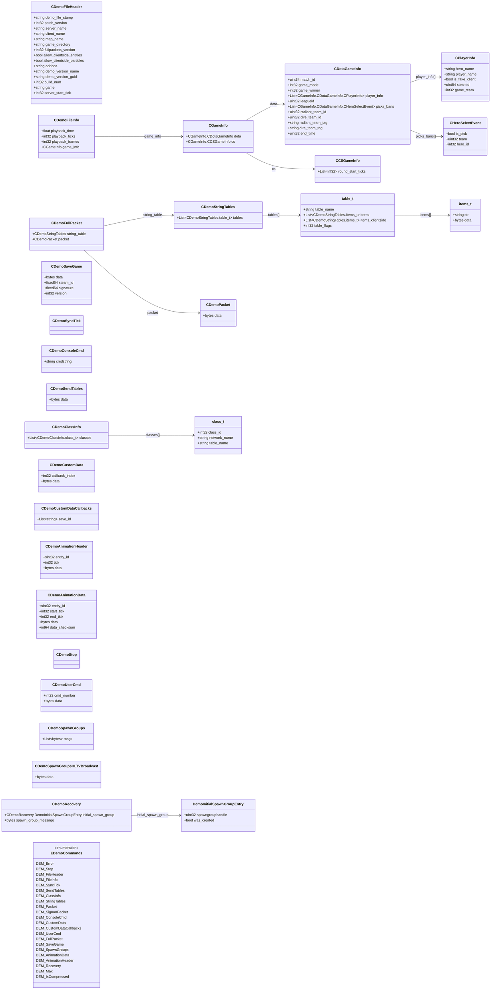

# `demo.proto`

## Diagram

## Enums

### `EDemoCommands`

| Name | Value |
|------|-------|
| `DEM_Error` | -1 |
| `DEM_Stop` | 0 |
| `DEM_FileHeader` | 1 |
| `DEM_FileInfo` | 2 |
| `DEM_SyncTick` | 3 |
| `DEM_SendTables` | 4 |
| `DEM_ClassInfo` | 5 |
| `DEM_StringTables` | 6 |
| `DEM_Packet` | 7 |
| `DEM_SignonPacket` | 8 |
| `DEM_ConsoleCmd` | 9 |
| `DEM_CustomData` | 10 |
| `DEM_CustomDataCallbacks` | 11 |
| `DEM_UserCmd` | 12 |
| `DEM_FullPacket` | 13 |
| `DEM_SaveGame` | 14 |
| `DEM_SpawnGroups` | 15 |
| `DEM_AnimationData` | 16 |
| `DEM_AnimationHeader` | 17 |
| `DEM_Recovery` | 18 |
| `DEM_Max` | 19 |
| `DEM_IsCompressed` | 64 |

## Messages

### `CDemoFileHeader`

| Field | Ordinal | Type | Label | Description |
|-------|---------|------|-------|-------------|
| `demo_file_stamp` | 1 | string | required |  |
| `patch_version` | 2 | int32 | optional |  |
| `server_name` | 3 | string | optional |  |
| `client_name` | 4 | string | optional |  |
| `map_name` | 5 | string | optional |  |
| `game_directory` | 6 | string | optional |  |
| `fullpackets_version` | 7 | int32 | optional |  |
| `allow_clientside_entities` | 8 | bool | optional |  |
| `allow_clientside_particles` | 9 | bool | optional |  |
| `addons` | 10 | string | optional |  |
| `demo_version_name` | 11 | string | optional |  |
| `demo_version_guid` | 12 | string | optional |  |
| `build_num` | 13 | int32 | optional |  |
| `game` | 14 | string | optional |  |
| `server_start_tick` | 15 | int32 | optional |  |

### `CGameInfo`

| Field | Ordinal | Type | Label | Description |
|-------|---------|------|-------|-------------|
| `dota` | 4 | CGameInfo.CDotaGameInfo | optional |  |
| `cs` | 5 | CGameInfo.CCSGameInfo | optional |  |

### `CDemoFileInfo`

| Field | Ordinal | Type | Label | Description |
|-------|---------|------|-------|-------------|
| `playback_time` | 1 | float | optional |  |
| `playback_ticks` | 2 | int32 | optional |  |
| `playback_frames` | 3 | int32 | optional |  |
| `game_info` | 4 | [CGameInfo](#cgameinfo) | optional |  |

### `CDemoPacket`

| Field | Ordinal | Type | Label | Description |
|-------|---------|------|-------|-------------|
| `data` | 3 | bytes | optional |  |

### `CDemoFullPacket`

| Field | Ordinal | Type | Label | Description |
|-------|---------|------|-------|-------------|
| `string_table` | 1 | [CDemoStringTables](#cdemostringtables) | optional |  |
| `packet` | 2 | [CDemoPacket](#cdemopacket) | optional |  |

### `CDemoSaveGame`

| Field | Ordinal | Type | Label | Description |
|-------|---------|------|-------|-------------|
| `data` | 1 | bytes | optional |  |
| `steam_id` | 2 | fixed64 | optional |  |
| `signature` | 3 | fixed64 | optional |  |
| `version` | 4 | int32 | optional |  |

### `CDemoSyncTick`

### `CDemoConsoleCmd`

| Field | Ordinal | Type | Label | Description |
|-------|---------|------|-------|-------------|
| `cmdstring` | 1 | string | optional |  |

### `CDemoSendTables`

| Field | Ordinal | Type | Label | Description |
|-------|---------|------|-------|-------------|
| `data` | 1 | bytes | optional |  |

### `CDemoClassInfo`

| Field | Ordinal | Type | Label | Description |
|-------|---------|------|-------|-------------|
| `classes` | 1 | CDemoClassInfo.class_t | repeated |  |

### `CDemoCustomData`

| Field | Ordinal | Type | Label | Description |
|-------|---------|------|-------|-------------|
| `callback_index` | 1 | int32 | optional |  |
| `data` | 2 | bytes | optional |  |

### `CDemoCustomDataCallbacks`

| Field | Ordinal | Type | Label | Description |
|-------|---------|------|-------|-------------|
| `save_id` | 1 | string | repeated |  |

### `CDemoAnimationHeader`

| Field | Ordinal | Type | Label | Description |
|-------|---------|------|-------|-------------|
| `entity_id` | 1 | sint32 | optional |  |
| `tick` | 2 | int32 | optional |  |
| `data` | 3 | bytes | optional |  |

### `CDemoAnimationData`

| Field | Ordinal | Type | Label | Description |
|-------|---------|------|-------|-------------|
| `entity_id` | 1 | sint32 | optional |  |
| `start_tick` | 2 | int32 | optional |  |
| `end_tick` | 3 | int32 | optional |  |
| `data` | 4 | bytes | optional |  |
| `data_checksum` | 5 | int64 | optional |  |

### `CDemoStringTables`

| Field | Ordinal | Type | Label | Description |
|-------|---------|------|-------|-------------|
| `tables` | 1 | CDemoStringTables.table_t | repeated |  |

### `CDemoStop`

### `CDemoUserCmd`

| Field | Ordinal | Type | Label | Description |
|-------|---------|------|-------|-------------|
| `cmd_number` | 1 | int32 | optional |  |
| `data` | 2 | bytes | optional |  |

### `CDemoSpawnGroups`

| Field | Ordinal | Type | Label | Description |
|-------|---------|------|-------|-------------|
| `msgs` | 3 | bytes | repeated |  |

### `CDemoSpawnGroupsHLTVBroadcast`

| Field | Ordinal | Type | Label | Description |
|-------|---------|------|-------|-------------|
| `data` | 1 | bytes | optional |  |

### `CDemoRecovery`

| Field | Ordinal | Type | Label | Description |
|-------|---------|------|-------|-------------|
| `initial_spawn_group` | 1 | CDemoRecovery.DemoInitialSpawnGroupEntry | optional |  |
| `spawn_group_message` | 2 | bytes | optional |  |
