# `econ_gcmessages.proto`

**Imports:** `steammessages.proto`

## Diagram

```mermaid
classDiagram
direction LR

  class CMsgGCGiftedItems {
    +uint32 accountid
    +uint32 giftdefindex
    +uint32 max_gifts_possible
    +uint32 num_eligible_recipients
    +List~uint32~ recipients_accountids
  }

  class CMsgGCDev_SchemaReservationRequest {
    +string schema_typename
    +string instance_name
    +uint64 context
    +uint64 id
  }

  class CMsgCasketItem {
    +uint64 casket_item_id
    +uint64 item_item_id
  }

  class CMsgGCUserTrackTimePlayedConsecutively {
    +uint32 state
  }

  class CMsgGCItemCustomizationNotification {
    +List~uint64~ item_id
    +uint32 request
    +List~uint64~ extra_data
  }

  class EGCItemMsg{
    <<enumeration>>
    k_EMsgGCBase
    k_EMsgGCSetItemPosition
    k_EMsgGCCraft
    k_EMsgGCCraftResponse
    k_EMsgGCDelete
    k_EMsgGCVerifyCacheSubscription
    k_EMsgGCNameItem
    k_EMsgGCUnlockCrate_DEPRECATED
    k_EMsgGCUnlockCrateResponse
    k_EMsgGCPaintItem
    k_EMsgGCPaintItemResponse
    k_EMsgGCGoldenWrenchBroadcast
    k_EMsgGCMOTDRequest
    k_EMsgGCMOTDRequestResponse
    k_EMsgGCAddItemToSocket_DEPRECATED
    k_EMsgGCAddItemToSocketResponse_DEPRECATED
    k_EMsgGCAddSocketToBaseItem_DEPRECATED
    k_EMsgGCAddSocketToItem_DEPRECATED
    k_EMsgGCAddSocketToItemResponse_DEPRECATED
    k_EMsgGCNameBaseItem
    k_EMsgGCNameBaseItemResponse
    k_EMsgGCRemoveSocketItem_DEPRECATED
    k_EMsgGCRemoveSocketItemResponse_DEPRECATED
    k_EMsgGCCustomizeItemTexture
    k_EMsgGCCustomizeItemTextureResponse
    k_EMsgGCUseItemRequest
    k_EMsgGCUseItemResponse
    k_EMsgGCGiftedItems_DEPRECATED
    k_EMsgGCRemoveItemName
    k_EMsgGCRemoveItemPaint
    k_EMsgGCGiftWrapItem
    k_EMsgGCGiftWrapItemResponse
    k_EMsgGCDeliverGift
    k_EMsgGCDeliverGiftResponseGiver
    k_EMsgGCDeliverGiftResponseReceiver
    k_EMsgGCUnwrapGiftRequest
    k_EMsgGCUnwrapGiftResponse
    k_EMsgGCSetItemStyle
    k_EMsgGCUsedClaimCodeItem
    k_EMsgGCSortItems
    k_EMsgGC_RevolvingLootList_DEPRECATED
    k_EMsgGCLookupAccount
    k_EMsgGCLookupAccountResponse
    k_EMsgGCLookupAccountName
    k_EMsgGCLookupAccountNameResponse
    k_EMsgGCUpdateItemSchema
    k_EMsgGCRemoveCustomTexture
    k_EMsgGCRemoveCustomTextureResponse
    k_EMsgGCRemoveMakersMark
    k_EMsgGCRemoveMakersMarkResponse
    k_EMsgGCRemoveUniqueCraftIndex
    k_EMsgGCRemoveUniqueCraftIndexResponse
    k_EMsgGCSaxxyBroadcast
    k_EMsgGCBackpackSortFinished
    k_EMsgGCCollectItem
    k_EMsgGCItemAcknowledged__DEPRECATED
    k_EMsgGC_ReportAbuse
    k_EMsgGC_ReportAbuseResponse
    k_EMsgGCNameItemNotification
    k_EMsgGCApplyConsumableEffects
    k_EMsgGCConsumableExhausted
    k_EMsgGCShowItemsPickedUp
    k_EMsgGCClientDisplayNotification
    k_EMsgGCApplyStrangePart
    k_EMsgGC_IncrementKillCountAttribute
    k_EMsgGC_IncrementKillCountResponse
    k_EMsgGCApplyPennantUpgrade
    k_EMsgGCSetItemPositions
    k_EMsgGCApplyEggEssence
    k_EMsgGCNameEggEssenceResponse
    k_EMsgGCPaintKitItem
    k_EMsgGCPaintKitBaseItem
    k_EMsgGCPaintKitItemResponse
    k_EMsgGCGiftedItems
    k_EMsgGCUnlockItemStyle
    k_EMsgGCUnlockItemStyleResponse
    k_EMsgGCApplySticker
    k_EMsgGCItemAcknowledged
    k_EMsgGCStatTrakSwap
    k_EMsgGCUserTrackTimePlayedConsecutively
    k_EMsgGCItemCustomizationNotification
    k_EMsgGCModifyItemAttribute
    k_EMsgGCCasketItemAdd
    k_EMsgGCCasketItemExtract
    k_EMsgGCCasketItemLoadContents
    k_EMsgGCTradingBase
    k_EMsgGCTrading_InitiateTradeRequest
    k_EMsgGCTrading_InitiateTradeResponse
    k_EMsgGCTrading_StartSession
    k_EMsgGCTrading_SetItem
    k_EMsgGCTrading_RemoveItem
    k_EMsgGCTrading_UpdateTradeInfo
    k_EMsgGCTrading_SetReadiness
    k_EMsgGCTrading_ReadinessResponse
    k_EMsgGCTrading_SessionClosed
    k_EMsgGCTrading_CancelSession
    k_EMsgGCTrading_TradeChatMsg
    k_EMsgGCTrading_ConfirmOffer
    k_EMsgGCTrading_TradeTypingChatMsg
    k_EMsgGCServerBrowser_FavoriteServer
    k_EMsgGCServerBrowser_BlacklistServer
    k_EMsgGCServerRentalsBase
    k_EMsgGCItemPreviewCheckStatus
    k_EMsgGCItemPreviewStatusResponse
    k_EMsgGCItemPreviewRequest
    k_EMsgGCItemPreviewRequestResponse
    k_EMsgGCItemPreviewExpire
    k_EMsgGCItemPreviewExpireNotification
    k_EMsgGCItemPreviewItemBoughtNotification
    k_EMsgGCDev_NewItemRequest
    k_EMsgGCDev_NewItemRequestResponse
    k_EMsgGCDev_PaintKitDropItem
    k_EMsgGCDev_SchemaReservationRequest
    k_EMsgGCStoreGetUserData
    k_EMsgGCStoreGetUserDataResponse
    k_EMsgGCStorePurchaseInit_DEPRECATED
    k_EMsgGCStorePurchaseInitResponse_DEPRECATED
    k_EMsgGCStorePurchaseFinalize
    k_EMsgGCStorePurchaseFinalizeResponse
    k_EMsgGCStorePurchaseCancel
    k_EMsgGCStorePurchaseCancelResponse
    k_EMsgGCStorePurchaseQueryTxn
    k_EMsgGCStorePurchaseQueryTxnResponse
    k_EMsgGCStorePurchaseInit
    k_EMsgGCStorePurchaseInitResponse
    k_EMsgGCBannedWordListRequest
    k_EMsgGCBannedWordListResponse
    k_EMsgGCToGCBannedWordListBroadcast
    k_EMsgGCToGCBannedWordListUpdated
    k_EMsgGCToGCDirtySDOCache
    k_EMsgGCToGCDirtyMultipleSDOCache
    k_EMsgGCToGCUpdateSQLKeyValue
    k_EMsgGCToGCIsTrustedServer
    k_EMsgGCToGCIsTrustedServerResponse
    k_EMsgGCToGCBroadcastConsoleCommand
    k_EMsgGCServerVersionUpdated
    k_EMsgGCToGCWebAPIAccountChanged
    k_EMsgGCRequestAnnouncements
    k_EMsgGCRequestAnnouncementsResponse
    k_EMsgGCRequestPassportItemGrant
    k_EMsgGCClientVersionUpdated
    k_EMsgGCRecurringSubscriptionStatus
    k_EMsgGCAdjustEquipSlotsManual
    k_EMsgGCAdjustEquipSlotsShuffle
    k_EMsgGCOpenCrate
    k_EMsgGCAcknowledgeRentalExpiration
    k_EMsgGCVolatileItemLoadContents
  }

  class EGCMsgResponse{
    <<enumeration>>
    k_EGCMsgResponseOK
    k_EGCMsgResponseDenied
    k_EGCMsgResponseServerError
    k_EGCMsgResponseTimeout
    k_EGCMsgResponseInvalid
    k_EGCMsgResponseNoMatch
    k_EGCMsgResponseUnknownError
    k_EGCMsgResponseNotLoggedOn
    k_EGCMsgFailedToCreate
    k_EGCMsgLimitExceeded
    k_EGCMsgCommitUnfinalized
  }

  class EUnlockStyle{
    <<enumeration>>
    k_UnlockStyle_Succeeded
    k_UnlockStyle_Failed_PreReq
    k_UnlockStyle_Failed_CantAfford
    k_UnlockStyle_Failed_CantCommit
    k_UnlockStyle_Failed_CantLockCache
    k_UnlockStyle_Failed_CantAffordAttrib
  }

  class EGCItemCustomizationNotification{
    <<enumeration>>
    k_EGCItemCustomizationNotification_NameItem
    k_EGCItemCustomizationNotification_UnlockCrate
    k_EGCItemCustomizationNotification_XRayItemReveal
    k_EGCItemCustomizationNotification_XRayItemClaim
    k_EGCItemCustomizationNotification_CasketTooFull
    k_EGCItemCustomizationNotification_CasketContents
    k_EGCItemCustomizationNotification_CasketAdded
    k_EGCItemCustomizationNotification_CasketRemoved
    k_EGCItemCustomizationNotification_CasketInvFull
    k_EGCItemCustomizationNotification_NameBaseItem
    k_EGCItemCustomizationNotification_RemoveItemName
    k_EGCItemCustomizationNotification_RemoveSticker
    k_EGCItemCustomizationNotification_ExtractSticker
    k_EGCItemCustomizationNotification_EncapsulateSticker
    k_EGCItemCustomizationNotification_ApplySticker
    k_EGCItemCustomizationNotification_StatTrakSwap
    k_EGCItemCustomizationNotification_RemovePatch
    k_EGCItemCustomizationNotification_ApplyPatch
    k_EGCItemCustomizationNotification_ApplyKeychain
    k_EGCItemCustomizationNotification_RemoveKeychain
    k_EGCItemCustomizationNotification_ActivateFanToken
    k_EGCItemCustomizationNotification_ActivateOperationCoin
    k_EGCItemCustomizationNotification_GraffitiUnseal
    k_EGCItemCustomizationNotification_GenerateSouvenir
    k_EGCItemCustomizationNotification_ClientRedeemMissionReward
    k_EGCItemCustomizationNotification_ClientRedeemFreeReward
    k_EGCItemCustomizationNotification_XpShopUseTicket
    k_EGCItemCustomizationNotification_XpShopAckTracks
  }

```

## Enums

### `EGCItemMsg`

| Name | Value |
|------|-------|
| `k_EMsgGCBase` | 1000 |
| `k_EMsgGCSetItemPosition` | 1001 |
| `k_EMsgGCCraft` | 1002 |
| `k_EMsgGCCraftResponse` | 1003 |
| `k_EMsgGCDelete` | 1004 |
| `k_EMsgGCVerifyCacheSubscription` | 1005 |
| `k_EMsgGCNameItem` | 1006 |
| `k_EMsgGCUnlockCrate_DEPRECATED` | 1007 |
| `k_EMsgGCUnlockCrateResponse` | 1008 |
| `k_EMsgGCPaintItem` | 1009 |
| `k_EMsgGCPaintItemResponse` | 1010 |
| `k_EMsgGCGoldenWrenchBroadcast` | 1011 |
| `k_EMsgGCMOTDRequest` | 1012 |
| `k_EMsgGCMOTDRequestResponse` | 1013 |
| `k_EMsgGCAddItemToSocket_DEPRECATED` | 1014 |
| `k_EMsgGCAddItemToSocketResponse_DEPRECATED` | 1015 |
| `k_EMsgGCAddSocketToBaseItem_DEPRECATED` | 1016 |
| `k_EMsgGCAddSocketToItem_DEPRECATED` | 1017 |
| `k_EMsgGCAddSocketToItemResponse_DEPRECATED` | 1018 |
| `k_EMsgGCNameBaseItem` | 1019 |
| `k_EMsgGCNameBaseItemResponse` | 1020 |
| `k_EMsgGCRemoveSocketItem_DEPRECATED` | 1021 |
| `k_EMsgGCRemoveSocketItemResponse_DEPRECATED` | 1022 |
| `k_EMsgGCCustomizeItemTexture` | 1023 |
| `k_EMsgGCCustomizeItemTextureResponse` | 1024 |
| `k_EMsgGCUseItemRequest` | 1025 |
| `k_EMsgGCUseItemResponse` | 1026 |
| `k_EMsgGCGiftedItems_DEPRECATED` | 1027 |
| `k_EMsgGCRemoveItemName` | 1030 |
| `k_EMsgGCRemoveItemPaint` | 1031 |
| `k_EMsgGCGiftWrapItem` | 1032 |
| `k_EMsgGCGiftWrapItemResponse` | 1033 |
| `k_EMsgGCDeliverGift` | 1034 |
| `k_EMsgGCDeliverGiftResponseGiver` | 1035 |
| `k_EMsgGCDeliverGiftResponseReceiver` | 1036 |
| `k_EMsgGCUnwrapGiftRequest` | 1037 |
| `k_EMsgGCUnwrapGiftResponse` | 1038 |
| `k_EMsgGCSetItemStyle` | 1039 |
| `k_EMsgGCUsedClaimCodeItem` | 1040 |
| `k_EMsgGCSortItems` | 1041 |
| `k_EMsgGC_RevolvingLootList_DEPRECATED` | 1042 |
| `k_EMsgGCLookupAccount` | 1043 |
| `k_EMsgGCLookupAccountResponse` | 1044 |
| `k_EMsgGCLookupAccountName` | 1045 |
| `k_EMsgGCLookupAccountNameResponse` | 1046 |
| `k_EMsgGCUpdateItemSchema` | 1049 |
| `k_EMsgGCRemoveCustomTexture` | 1051 |
| `k_EMsgGCRemoveCustomTextureResponse` | 1052 |
| `k_EMsgGCRemoveMakersMark` | 1053 |
| `k_EMsgGCRemoveMakersMarkResponse` | 1054 |
| `k_EMsgGCRemoveUniqueCraftIndex` | 1055 |
| `k_EMsgGCRemoveUniqueCraftIndexResponse` | 1056 |
| `k_EMsgGCSaxxyBroadcast` | 1057 |
| `k_EMsgGCBackpackSortFinished` | 1058 |
| `k_EMsgGCCollectItem` | 1061 |
| `k_EMsgGCItemAcknowledged__DEPRECATED` | 1062 |
| `k_EMsgGC_ReportAbuse` | 1065 |
| `k_EMsgGC_ReportAbuseResponse` | 1066 |
| `k_EMsgGCNameItemNotification` | 1068 |
| `k_EMsgGCApplyConsumableEffects` | 1069 |
| `k_EMsgGCConsumableExhausted` | 1070 |
| `k_EMsgGCShowItemsPickedUp` | 1071 |
| `k_EMsgGCClientDisplayNotification` | 1072 |
| `k_EMsgGCApplyStrangePart` | 1073 |
| `k_EMsgGC_IncrementKillCountAttribute` | 1074 |
| `k_EMsgGC_IncrementKillCountResponse` | 1075 |
| `k_EMsgGCApplyPennantUpgrade` | 1076 |
| `k_EMsgGCSetItemPositions` | 1077 |
| `k_EMsgGCApplyEggEssence` | 1078 |
| `k_EMsgGCNameEggEssenceResponse` | 1079 |
| `k_EMsgGCPaintKitItem` | 1080 |
| `k_EMsgGCPaintKitBaseItem` | 1081 |
| `k_EMsgGCPaintKitItemResponse` | 1082 |
| `k_EMsgGCGiftedItems` | 1083 |
| `k_EMsgGCUnlockItemStyle` | 1084 |
| `k_EMsgGCUnlockItemStyleResponse` | 1085 |
| `k_EMsgGCApplySticker` | 1086 |
| `k_EMsgGCItemAcknowledged` | 1087 |
| `k_EMsgGCStatTrakSwap` | 1088 |
| `k_EMsgGCUserTrackTimePlayedConsecutively` | 1089 |
| `k_EMsgGCItemCustomizationNotification` | 1090 |
| `k_EMsgGCModifyItemAttribute` | 1091 |
| `k_EMsgGCCasketItemAdd` | 1092 |
| `k_EMsgGCCasketItemExtract` | 1093 |
| `k_EMsgGCCasketItemLoadContents` | 1094 |
| `k_EMsgGCTradingBase` | 1500 |
| `k_EMsgGCTrading_InitiateTradeRequest` | 1501 |
| `k_EMsgGCTrading_InitiateTradeResponse` | 1502 |
| `k_EMsgGCTrading_StartSession` | 1503 |
| `k_EMsgGCTrading_SetItem` | 1504 |
| `k_EMsgGCTrading_RemoveItem` | 1505 |
| `k_EMsgGCTrading_UpdateTradeInfo` | 1506 |
| `k_EMsgGCTrading_SetReadiness` | 1507 |
| `k_EMsgGCTrading_ReadinessResponse` | 1508 |
| `k_EMsgGCTrading_SessionClosed` | 1509 |
| `k_EMsgGCTrading_CancelSession` | 1510 |
| `k_EMsgGCTrading_TradeChatMsg` | 1511 |
| `k_EMsgGCTrading_ConfirmOffer` | 1512 |
| `k_EMsgGCTrading_TradeTypingChatMsg` | 1513 |
| `k_EMsgGCServerBrowser_FavoriteServer` | 1601 |
| `k_EMsgGCServerBrowser_BlacklistServer` | 1602 |
| `k_EMsgGCServerRentalsBase` | 1700 |
| `k_EMsgGCItemPreviewCheckStatus` | 1701 |
| `k_EMsgGCItemPreviewStatusResponse` | 1702 |
| `k_EMsgGCItemPreviewRequest` | 1703 |
| `k_EMsgGCItemPreviewRequestResponse` | 1704 |
| `k_EMsgGCItemPreviewExpire` | 1705 |
| `k_EMsgGCItemPreviewExpireNotification` | 1706 |
| `k_EMsgGCItemPreviewItemBoughtNotification` | 1707 |
| `k_EMsgGCDev_NewItemRequest` | 2001 |
| `k_EMsgGCDev_NewItemRequestResponse` | 2002 |
| `k_EMsgGCDev_PaintKitDropItem` | 2003 |
| `k_EMsgGCDev_SchemaReservationRequest` | 2004 |
| `k_EMsgGCStoreGetUserData` | 2500 |
| `k_EMsgGCStoreGetUserDataResponse` | 2501 |
| `k_EMsgGCStorePurchaseInit_DEPRECATED` | 2502 |
| `k_EMsgGCStorePurchaseInitResponse_DEPRECATED` | 2503 |
| `k_EMsgGCStorePurchaseFinalize` | 2504 |
| `k_EMsgGCStorePurchaseFinalizeResponse` | 2505 |
| `k_EMsgGCStorePurchaseCancel` | 2506 |
| `k_EMsgGCStorePurchaseCancelResponse` | 2507 |
| `k_EMsgGCStorePurchaseQueryTxn` | 2508 |
| `k_EMsgGCStorePurchaseQueryTxnResponse` | 2509 |
| `k_EMsgGCStorePurchaseInit` | 2510 |
| `k_EMsgGCStorePurchaseInitResponse` | 2511 |
| `k_EMsgGCBannedWordListRequest` | 2512 |
| `k_EMsgGCBannedWordListResponse` | 2513 |
| `k_EMsgGCToGCBannedWordListBroadcast` | 2514 |
| `k_EMsgGCToGCBannedWordListUpdated` | 2515 |
| `k_EMsgGCToGCDirtySDOCache` | 2516 |
| `k_EMsgGCToGCDirtyMultipleSDOCache` | 2517 |
| `k_EMsgGCToGCUpdateSQLKeyValue` | 2518 |
| `k_EMsgGCToGCIsTrustedServer` | 2519 |
| `k_EMsgGCToGCIsTrustedServerResponse` | 2520 |
| `k_EMsgGCToGCBroadcastConsoleCommand` | 2521 |
| `k_EMsgGCServerVersionUpdated` | 2522 |
| `k_EMsgGCToGCWebAPIAccountChanged` | 2524 |
| `k_EMsgGCRequestAnnouncements` | 2525 |
| `k_EMsgGCRequestAnnouncementsResponse` | 2526 |
| `k_EMsgGCRequestPassportItemGrant` | 2527 |
| `k_EMsgGCClientVersionUpdated` | 2528 |
| `k_EMsgGCRecurringSubscriptionStatus` | 2530 |
| `k_EMsgGCAdjustEquipSlotsManual` | 2531 |
| `k_EMsgGCAdjustEquipSlotsShuffle` | 2532 |
| `k_EMsgGCOpenCrate` | 2534 |
| `k_EMsgGCAcknowledgeRentalExpiration` | 2535 |
| `k_EMsgGCVolatileItemLoadContents` | 2536 |

### `EGCMsgResponse`

| Name | Value |
|------|-------|
| `k_EGCMsgResponseOK` | 0 |
| `k_EGCMsgResponseDenied` | 1 |
| `k_EGCMsgResponseServerError` | 2 |
| `k_EGCMsgResponseTimeout` | 3 |
| `k_EGCMsgResponseInvalid` | 4 |
| `k_EGCMsgResponseNoMatch` | 5 |
| `k_EGCMsgResponseUnknownError` | 6 |
| `k_EGCMsgResponseNotLoggedOn` | 7 |
| `k_EGCMsgFailedToCreate` | 8 |
| `k_EGCMsgLimitExceeded` | 9 |
| `k_EGCMsgCommitUnfinalized` | 10 |

### `EUnlockStyle`

| Name | Value |
|------|-------|
| `k_UnlockStyle_Succeeded` | 0 |
| `k_UnlockStyle_Failed_PreReq` | 1 |
| `k_UnlockStyle_Failed_CantAfford` | 2 |
| `k_UnlockStyle_Failed_CantCommit` | 3 |
| `k_UnlockStyle_Failed_CantLockCache` | 4 |
| `k_UnlockStyle_Failed_CantAffordAttrib` | 5 |

### `EGCItemCustomizationNotification`

| Name | Value |
|------|-------|
| `k_EGCItemCustomizationNotification_NameItem` | 1006 |
| `k_EGCItemCustomizationNotification_UnlockCrate` | 1007 |
| `k_EGCItemCustomizationNotification_XRayItemReveal` | 1008 |
| `k_EGCItemCustomizationNotification_XRayItemClaim` | 1009 |
| `k_EGCItemCustomizationNotification_CasketTooFull` | 1011 |
| `k_EGCItemCustomizationNotification_CasketContents` | 1012 |
| `k_EGCItemCustomizationNotification_CasketAdded` | 1013 |
| `k_EGCItemCustomizationNotification_CasketRemoved` | 1014 |
| `k_EGCItemCustomizationNotification_CasketInvFull` | 1015 |
| `k_EGCItemCustomizationNotification_NameBaseItem` | 1019 |
| `k_EGCItemCustomizationNotification_RemoveItemName` | 1030 |
| `k_EGCItemCustomizationNotification_RemoveSticker` | 1053 |
| `k_EGCItemCustomizationNotification_ExtractSticker` | 1054 |
| `k_EGCItemCustomizationNotification_EncapsulateSticker` | 1055 |
| `k_EGCItemCustomizationNotification_ApplySticker` | 1086 |
| `k_EGCItemCustomizationNotification_StatTrakSwap` | 1088 |
| `k_EGCItemCustomizationNotification_RemovePatch` | 1089 |
| `k_EGCItemCustomizationNotification_ApplyPatch` | 1090 |
| `k_EGCItemCustomizationNotification_ApplyKeychain` | 1091 |
| `k_EGCItemCustomizationNotification_RemoveKeychain` | 1092 |
| `k_EGCItemCustomizationNotification_ActivateFanToken` | 9178 |
| `k_EGCItemCustomizationNotification_ActivateOperationCoin` | 9179 |
| `k_EGCItemCustomizationNotification_GraffitiUnseal` | 9185 |
| `k_EGCItemCustomizationNotification_GenerateSouvenir` | 9204 |
| `k_EGCItemCustomizationNotification_ClientRedeemMissionReward` | 9209 |
| `k_EGCItemCustomizationNotification_ClientRedeemFreeReward` | 9219 |
| `k_EGCItemCustomizationNotification_XpShopUseTicket` | 9221 |
| `k_EGCItemCustomizationNotification_XpShopAckTracks` | 9222 |

## Messages

### `CMsgGCGiftedItems`

| Field | Ordinal | Type | Label | Description |
|-------|---------|------|-------|-------------|
| `accountid` | 1 | uint32 | optional |  |
| `giftdefindex` | 2 | uint32 | optional |  |
| `max_gifts_possible` | 3 | uint32 | optional |  |
| `num_eligible_recipients` | 4 | uint32 | optional |  |
| `recipients_accountids` | 5 | uint32 | repeated |  |

### `CMsgGCDev_SchemaReservationRequest`

| Field | Ordinal | Type | Label | Description |
|-------|---------|------|-------|-------------|
| `schema_typename` | 1 | string | optional |  |
| `instance_name` | 2 | string | optional |  |
| `context` | 3 | uint64 | optional |  |
| `id` | 4 | uint64 | optional |  |

### `CMsgCasketItem`

| Field | Ordinal | Type | Label | Description |
|-------|---------|------|-------|-------------|
| `casket_item_id` | 1 | uint64 | optional |  |
| `item_item_id` | 2 | uint64 | optional |  |

### `CMsgGCUserTrackTimePlayedConsecutively`

| Field | Ordinal | Type | Label | Description |
|-------|---------|------|-------|-------------|
| `state` | 1 | uint32 | optional |  |

### `CMsgGCItemCustomizationNotification`

| Field | Ordinal | Type | Label | Description |
|-------|---------|------|-------|-------------|
| `item_id` | 1 | uint64 | repeated |  |
| `request` | 2 | uint32 | optional |  |
| `extra_data` | 3 | uint64 | repeated |  |
