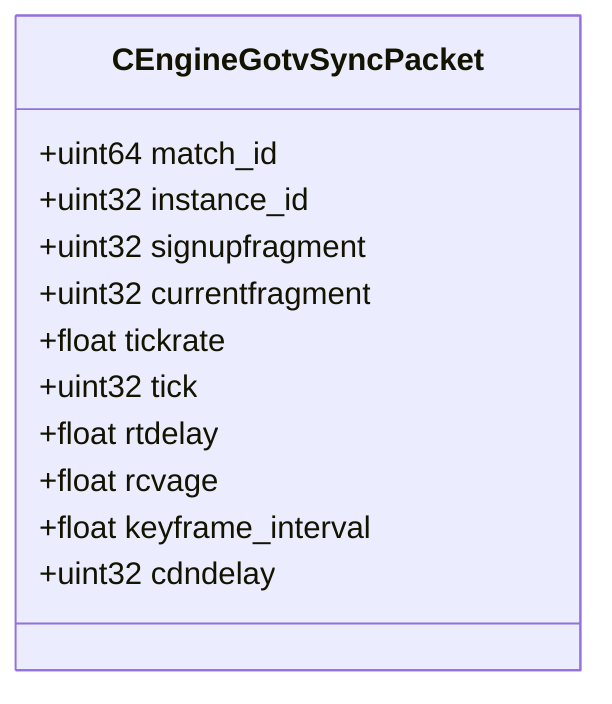

# `engine_gcmessages.proto`

**Imports:** `google/protobuf/descriptor.proto`

## Diagram

## Messages

### `CEngineGotvSyncPacket`

| Field | Ordinal | Type | Label | Description |
|-------|---------|------|-------|-------------|
| `match_id` | 1 | uint64 | optional |  |
| `instance_id` | 2 | uint32 | optional |  |
| `signupfragment` | 3 | uint32 | optional |  |
| `currentfragment` | 4 | uint32 | optional |  |
| `tickrate` | 5 | float | optional |  |
| `tick` | 6 | uint32 | optional |  |
| `rtdelay` | 8 | float | optional |  |
| `rcvage` | 9 | float | optional |  |
| `keyframe_interval` | 10 | float | optional |  |
| `cdndelay` | 11 | uint32 | optional |  |
