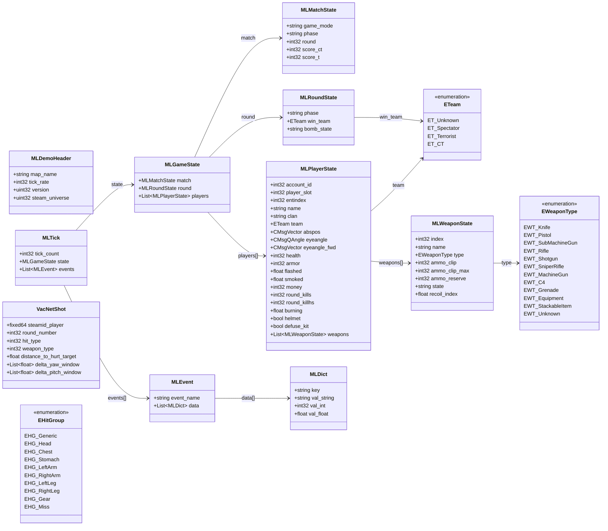

# `fatdemo.proto`

**Imports:** `networkbasetypes.proto`

## Diagram

## Enums

### `EHitGroup`

| Name | Value |
|------|-------|
| `EHG_Generic` | 0 |
| `EHG_Head` | 1 |
| `EHG_Chest` | 2 |
| `EHG_Stomach` | 3 |
| `EHG_LeftArm` | 4 |
| `EHG_RightArm` | 5 |
| `EHG_LeftLeg` | 6 |
| `EHG_RightLeg` | 7 |
| `EHG_Gear` | 8 |
| `EHG_Miss` | 9 |

### `ETeam`

| Name | Value |
|------|-------|
| `ET_Unknown` | 0 |
| `ET_Spectator` | 1 |
| `ET_Terrorist` | 2 |
| `ET_CT` | 3 |

### `EWeaponType`

| Name | Value |
|------|-------|
| `EWT_Knife` | 0 |
| `EWT_Pistol` | 1 |
| `EWT_SubMachineGun` | 2 |
| `EWT_Rifle` | 3 |
| `EWT_Shotgun` | 4 |
| `EWT_SniperRifle` | 5 |
| `EWT_MachineGun` | 6 |
| `EWT_C4` | 7 |
| `EWT_Grenade` | 8 |
| `EWT_Equipment` | 9 |
| `EWT_StackableItem` | 10 |
| `EWT_Unknown` | 11 |

## Messages

### `MLDict`

| Field | Ordinal | Type | Label | Description |
|-------|---------|------|-------|-------------|
| `key` | 1 | string | optional |  |
| `val_string` | 2 | string | optional |  |
| `val_int` | 3 | int32 | optional |  |
| `val_float` | 4 | float | optional |  |

### `MLEvent`

| Field | Ordinal | Type | Label | Description |
|-------|---------|------|-------|-------------|
| `event_name` | 1 | string | optional |  |
| `data` | 2 | [MLDict](#mldict) | repeated |  |

### `MLMatchState`

| Field | Ordinal | Type | Label | Description |
|-------|---------|------|-------|-------------|
| `game_mode` | 1 | string | optional |  |
| `phase` | 2 | string | optional |  |
| `round` | 3 | int32 | optional |  |
| `score_ct` | 4 | int32 | optional |  |
| `score_t` | 5 | int32 | optional |  |

### `MLRoundState`

| Field | Ordinal | Type | Label | Description |
|-------|---------|------|-------|-------------|
| `phase` | 1 | string | optional |  |
| `win_team` | 2 | [ETeam](#eteam) | optional | *(default: `ET_Unknown`)* |
| `bomb_state` | 3 | string | optional |  |

### `MLWeaponState`

| Field | Ordinal | Type | Label | Description |
|-------|---------|------|-------|-------------|
| `index` | 1 | int32 | optional |  |
| `name` | 2 | string | optional |  |
| `type` | 3 | [EWeaponType](#eweapontype) | optional | *(default: `EWT_Knife`)* |
| `ammo_clip` | 4 | int32 | optional |  |
| `ammo_clip_max` | 5 | int32 | optional |  |
| `ammo_reserve` | 6 | int32 | optional |  |
| `state` | 7 | string | optional |  |
| `recoil_index` | 8 | float | optional |  |

### `MLPlayerState`

| Field | Ordinal | Type | Label | Description |
|-------|---------|------|-------|-------------|
| `account_id` | 1 | int32 | optional |  |
| `player_slot` | 2 | int32 | optional | *(default: `-1`)* |
| `entindex` | 3 | int32 | optional |  |
| `name` | 4 | string | optional |  |
| `clan` | 5 | string | optional |  |
| `team` | 6 | [ETeam](#eteam) | optional | *(default: `ET_Unknown`)* |
| `abspos` | 7 | CMsgVector | optional |  |
| `eyeangle` | 8 | CMsgQAngle | optional |  |
| `eyeangle_fwd` | 9 | CMsgVector | optional |  |
| `health` | 10 | int32 | optional |  |
| `armor` | 11 | int32 | optional |  |
| `flashed` | 12 | float | optional |  |
| `smoked` | 13 | float | optional |  |
| `money` | 14 | int32 | optional |  |
| `round_kills` | 15 | int32 | optional |  |
| `round_killhs` | 16 | int32 | optional |  |
| `burning` | 17 | float | optional |  |
| `helmet` | 18 | bool | optional |  |
| `defuse_kit` | 19 | bool | optional |  |
| `weapons` | 20 | [MLWeaponState](#mlweaponstate) | repeated |  |

### `MLGameState`

| Field | Ordinal | Type | Label | Description |
|-------|---------|------|-------|-------------|
| `match` | 1 | [MLMatchState](#mlmatchstate) | optional |  |
| `round` | 2 | [MLRoundState](#mlroundstate) | optional |  |
| `players` | 3 | [MLPlayerState](#mlplayerstate) | repeated |  |

### `MLDemoHeader`

| Field | Ordinal | Type | Label | Description |
|-------|---------|------|-------|-------------|
| `map_name` | 1 | string | optional |  |
| `tick_rate` | 2 | int32 | optional |  |
| `version` | 3 | uint32 | optional |  |
| `steam_universe` | 4 | uint32 | optional |  |

### `MLTick`

| Field | Ordinal | Type | Label | Description |
|-------|---------|------|-------|-------------|
| `tick_count` | 1 | int32 | optional |  |
| `state` | 2 | [MLGameState](#mlgamestate) | optional |  |
| `events` | 3 | [MLEvent](#mlevent) | repeated |  |

### `VacNetShot`

| Field | Ordinal | Type | Label | Description |
|-------|---------|------|-------|-------------|
| `steamid_player` | 1 | fixed64 | optional |  |
| `round_number` | 2 | int32 | optional |  |
| `hit_type` | 3 | int32 | optional |  |
| `weapon_type` | 4 | int32 | optional |  |
| `distance_to_hurt_target` | 5 | float | optional |  |
| `delta_yaw_window` | 6 | float | repeated |  |
| `delta_pitch_window` | 7 | float | repeated |  |
