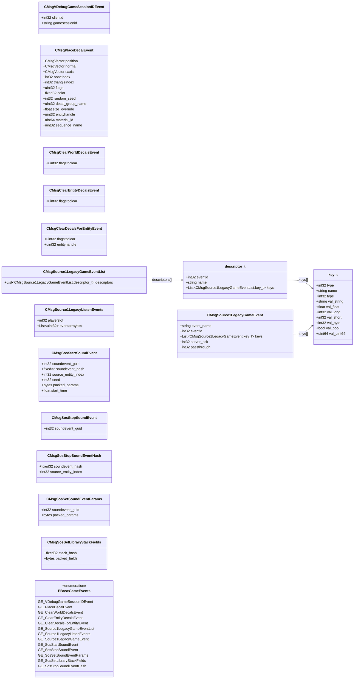

# `gameevents.proto`

**Imports:** `networkbasetypes.proto`

Source 2 base game-event protobuf messages.  Provides the Source 1-legacy game-event bridge (CMsgSource1LegacyGameEvent), sound-system events (SoS), and surface-decal events.  Identified by the EBaseGameEvents enum (200–212).

## Diagram

## Enums

### `EBaseGameEvents`

| Name | Value |
|------|-------|
| `GE_VDebugGameSessionIDEvent` | 200 |
| `GE_PlaceDecalEvent` | 201 |
| `GE_ClearWorldDecalsEvent` | 202 |
| `GE_ClearEntityDecalsEvent` | 203 |
| `GE_ClearDecalsForEntityEvent` | 204 |
| `GE_Source1LegacyGameEventList` | 205 |
| `GE_Source1LegacyListenEvents` | 206 |
| `GE_Source1LegacyGameEvent` | 207 |
| `GE_SosStartSoundEvent` | 208 |
| `GE_SosStopSoundEvent` | 209 |
| `GE_SosSetSoundEventParams` | 210 |
| `GE_SosSetLibraryStackFields` | 211 |
| `GE_SosStopSoundEventHash` | 212 |

## Messages

### `CMsgVDebugGameSessionIDEvent`

Debug event that reports the current game-session ID string to a specific client.  Used during development to trace session continuity.

| Field | Ordinal | Type | Label | Description |
|-------|---------|------|-------|-------------|
| `clientid` | 1 | int32 | optional | Slot index of the client receiving the session-ID debug information. |
| `gamesessionid` | 2 | string | optional | Unique string identifier for the current game session. |

### `CMsgPlaceDecalEvent`

Instructs clients to paint a decal (bullet hole, blood splatter, spray) onto a surface or entity in the world.

| Field | Ordinal | Type | Label | Description |
|-------|---------|------|-------|-------------|
| `position` | 1 | CMsgVector | optional | World-space hit position where the decal should be placed. |
| `normal` | 2 | CMsgVector | optional | Surface normal at the hit position; orients the decal correctly. |
| `saxis` | 3 | CMsgVector | optional | Secondary axis vector for texture alignment. |
| `boneindex` | 4 | int32 | optional | Bone index when the decal is attached to an animated model (-1 for world surfaces). |
| `flags` | 5 | uint32 | optional | Decal flags bitmask (temporary, permanent, etc.). |
| `color` | 6 | fixed32 | optional | RGBA colour tint applied to the decal texture. |
| `random_seed` | 7 | int32 | optional | Random seed used to select from a decal group variant. |
| `decal_group_name` | 8 | uint32 | optional | Hash of the decal group name (e.g. 'BulletImpactConcrete'). |
| `size_override` | 9 | float | optional | Override size in world units (0 = use default decal size). |
| `entityhandle` | 10 | uint32 | optional | Entity handle to attach the decal to (0xFFFFFF = world). *(default: `16777215`)* |
| `material_id` | 11 | uint64 | optional | Material ID of the surface at the hit point. |
| `sequence_name` | 12 | uint32 | optional | Hash of the decal sequence name for animated decals. |
| `triangleindex` | 13 | int32 | optional | Mesh triangle index for precise placement on complex geometry. |

### `CMsgClearWorldDecalsEvent`

Removes all world-surface decals matching the given flags (e.g. clears bullet holes at round start).

| Field | Ordinal | Type | Label | Description |
|-------|---------|------|-------|-------------|
| `flagstoclear` | 1 | uint32 | optional | Bitmask of decal flags; decals with any matching flag will be removed. |

### `CMsgClearEntityDecalsEvent`

Removes all decals painted on entity surfaces that match the given flags.

| Field | Ordinal | Type | Label | Description |
|-------|---------|------|-------|-------------|
| `flagstoclear` | 1 | uint32 | optional | Bitmask of decal flags to clear from all entity surfaces. |

### `CMsgClearDecalsForEntityEvent`

Removes all decals on a specific entity that match the given flags.

| Field | Ordinal | Type | Label | Description |
|-------|---------|------|-------|-------------|
| `flagstoclear` | 1 | uint32 | optional | Bitmask of decal flags to clear. |
| `entityhandle` | 2 | uint32 | optional | Handle of the specific entity whose decals should be cleared. *(default: `16777215`)* |

### `CMsgSource1LegacyGameEventList`

Sent once at the start of a connection to register all Source 1 game-event schemas with the client.  The client uses this list to decode subsequent CMsgSource1LegacyGameEvent messages by ID.

> 📝 This is the Source 2 equivalent of the Source 1 'svc_GameEventList' message. All classic CS:GO game events (player_death, bomb_planted, etc.) are transmitted through this bridge.

| Field | Ordinal | Type | Label | Description |
|-------|---------|------|-------|-------------|
| `descriptors` | 1 | CMsgSource1LegacyGameEventList.descriptor_t | repeated |  |

### `CMsgSource1LegacyListenEvents`

Registers which Source 1 game-events a specific client wishes to receive. Used by plugins and spectators to opt in to event streams.

| Field | Ordinal | Type | Label | Description |
|-------|---------|------|-------|-------------|
| `playerslot` | 1 | int32 | optional | Player slot that is registering these event listeners. |
| `eventarraybits` | 2 | uint32 | repeated | Packed bitmask array; bit N set means listen for game-event with ID N. |

### `CMsgSource1LegacyGameEvent`

Carries a single Source 1 game-event (player_death, weapon_fire, bomb_planted, etc.) over the Source 2 network layer.  The event-type name and all key–value pairs are encoded inside the keys list.

> 📝 CS2 game events (player_death, round_start, bomb_exploded, etc.) are all transmitted as CMsgSource1LegacyGameEvent messages.  Use the event_name field to identify them and CMsgSource1LegacyGameEventList to decode keys.

| Field | Ordinal | Type | Label | Description |
|-------|---------|------|-------|-------------|
| `event_name` | 1 | string | optional | String name of the game event (e.g. 'player_death', 'bomb_planted'). |
| `eventid` | 2 | int32 | optional | Numeric event ID assigned during registration via CMsgSource1LegacyGameEventList. |
| `keys` | 3 | CMsgSource1LegacyGameEvent.key_t | repeated | Typed key–value pairs carrying event-specific data (integers, floats, strings, booleans). |
| `server_tick` | 4 | int32 | optional | Server tick on which the event was fired. |
| `passthrough` | 5 | int32 | optional | Passthrough flag used internally by the event system. |

### `CMsgSosStartSoundEvent`

Starts a named sound event through the SoS (Sound Operating System) layer, associated with an optional source entity.

| Field | Ordinal | Type | Label | Description |
|-------|---------|------|-------|-------------|
| `soundevent_guid` | 1 | int32 | optional | Unique integer handle for this sound instance (used to stop or modify it later). |
| `soundevent_hash` | 2 | fixed32 | optional | CRC32 hash of the sound event name string. |
| `source_entity_index` | 3 | int32 | optional | Entity index of the sound source (-1 = world/positional). *(default: `-1`)* |
| `seed` | 4 | int32 | optional | Random seed for sound variation selection. |
| `packed_params` | 5 | bytes | optional | Packed binary parameters for the sound event (volume, pitch, position, etc.). |
| `start_time` | 6 | float | optional | Game time at which the sound should start playing (allows latency compensation). |

### `CMsgSosStopSoundEvent`

Stops a specific sound instance identified by its GUID.

| Field | Ordinal | Type | Label | Description |
|-------|---------|------|-------|-------------|
| `soundevent_guid` | 1 | int32 | optional | GUID of the sound instance to stop (matches soundevent_guid from CMsgSosStartSoundEvent). |

### `CMsgSosStopSoundEventHash`

Stops all sound instances matching the given sound-event hash on the specified source entity.

| Field | Ordinal | Type | Label | Description |
|-------|---------|------|-------|-------------|
| `soundevent_hash` | 1 | fixed32 | optional | CRC32 hash of the sound event name to stop. |
| `source_entity_index` | 2 | int32 | optional | Entity index to restrict the stop to (-1 = stop all matching sounds). *(default: `-1`)* |

### `CMsgSosSetSoundEventParams`

Updates runtime parameters of an active sound event without restarting it (e.g. volume fade, pitch shift on a looping ambient sound).

| Field | Ordinal | Type | Label | Description |
|-------|---------|------|-------|-------------|
| `soundevent_guid` | 1 | int32 | optional | GUID of the active sound instance to modify. |
| `packed_params` | 5 | bytes | optional | New packed parameter values to apply to the running sound. |

### `CMsgSosSetLibraryStackFields`

Modifies fields in a named sound library stack (a group of sound layers), allowing global sound-mix changes from the server.

| Field | Ordinal | Type | Label | Description |
|-------|---------|------|-------|-------------|
| `stack_hash` | 1 | fixed32 | optional | CRC32 hash of the sound library stack name to modify. |
| `packed_fields` | 5 | bytes | optional | Packed binary field values to apply to the stack. |
