# `gcsystemmsgs.proto`

## Diagram

```mermaid
classDiagram
direction LR

  class CMsgGCHVacVerificationChange {
    +fixed64 steamid
    +uint32 appid
    +bool is_verified
  }

  class CMsgGCHAccountPhoneNumberChange {
    +fixed64 steamid
    +uint32 appid
    +uint64 phone_id
    +bool is_verified
    +bool is_identifying
  }

  class CMsgGCHInviteUserToLobby {
    +fixed64 steamid
    +uint32 appid
    +fixed64 steamid_invited
    +fixed64 steamid_lobby
  }

  class CMsgGCHRecurringSubscriptionStatusChange {
    +fixed64 steamid
    +uint32 appid
    +fixed64 agreementid
    +bool active
  }

  class CQuest_PublisherAddCommunityItemsToPlayer_Request {
    +uint64 steamid
    +uint32 appid
    +uint32 match_item_type
    +uint32 match_item_class
    +string prefix_item_name
    +List~CQuest_PublisherAddCommunityItemsToPlayer_Request.Attribute~ attributes
    +string note
  }

  class Attribute {
    +uint32 attribute
    +uint64 value
  }

  class CQuest_PublisherAddCommunityItemsToPlayer_Response {
    +uint32 items_matched
    +uint32 items_granted
  }

  class CCommunity_GamePersonalDataCategoryInfo {
    +string type
    +string localization_token
    +string template_file
  }

  class CCommunity_GetGamePersonalDataCategories_Request {
    +uint32 appid
  }

  class CCommunity_GetGamePersonalDataCategories_Response {
    +List~CCommunity_GamePersonalDataCategoryInfo~ categories
    +string app_assets_basename
  }

  class CCommunity_GetGamePersonalDataEntries_Request {
    +uint32 appid
    +uint64 steamid
    +string type
    +string continue_token
  }

  class CCommunity_GetGamePersonalDataEntries_Response {
    +uint32 gceresult
    +List~string~ entries
    +string continue_token
    +string continue_text
  }

  class CCommunity_TerminateGamePersonalDataEntries_Request {
    +uint32 appid
    +uint64 steamid
  }

  class CCommunity_TerminateGamePersonalDataEntries_Response {
    +uint32 gceresult
  }

  CQuest_PublisherAddCommunityItemsToPlayer_Request --> Attribute : attributes[]
  CCommunity_GetGamePersonalDataCategories_Response --> CCommunity_GamePersonalDataCategoryInfo : categories[]

  class EGCSystemMsg{
    <<enumeration>>
    k_EGCMsgInvalid
    k_EGCMsgMulti
    k_EGCMsgGenericReply
    k_EGCMsgSystemBase
    k_EGCMsgAchievementAwarded
    k_EGCMsgConCommand
    k_EGCMsgStartPlaying
    k_EGCMsgStopPlaying
    k_EGCMsgStartGameserver
    k_EGCMsgStopGameserver
    k_EGCMsgWGRequest
    k_EGCMsgWGResponse
    k_EGCMsgGetUserGameStatsSchema
    k_EGCMsgGetUserGameStatsSchemaResponse
    k_EGCMsgGetUserStatsDEPRECATED
    k_EGCMsgGetUserStatsResponse
    k_EGCMsgAppInfoUpdated
    k_EGCMsgValidateSession
    k_EGCMsgValidateSessionResponse
    k_EGCMsgLookupAccountFromInput
    k_EGCMsgSendHTTPRequest
    k_EGCMsgSendHTTPRequestResponse
    k_EGCMsgPreTestSetup
    k_EGCMsgRecordSupportAction
    k_EGCMsgGetAccountDetails_DEPRECATED
    k_EGCMsgReceiveInterAppMessage
    k_EGCMsgFindAccounts
    k_EGCMsgPostAlert
    k_EGCMsgGetLicenses
    k_EGCMsgGetUserStats
    k_EGCMsgGetCommands
    k_EGCMsgGetCommandsResponse
    k_EGCMsgAddFreeLicense
    k_EGCMsgAddFreeLicenseResponse
    k_EGCMsgGetIPLocation
    k_EGCMsgGetIPLocationResponse
    k_EGCMsgSystemStatsSchema
    k_EGCMsgGetSystemStats
    k_EGCMsgGetSystemStatsResponse
    k_EGCMsgSendEmail
    k_EGCMsgSendEmailResponse
    k_EGCMsgGetEmailTemplate
    k_EGCMsgGetEmailTemplateResponse
    k_EGCMsgGrantGuestPass
    k_EGCMsgGrantGuestPassResponse
    k_EGCMsgGetAccountDetails
    k_EGCMsgGetAccountDetailsResponse
    k_EGCMsgGetPersonaNames
    k_EGCMsgGetPersonaNamesResponse
    k_EGCMsgMultiplexMsg
    k_EGCMsgMultiplexMsgResponse
    k_EGCMsgWebAPIRegisterInterfaces
    k_EGCMsgWebAPIJobRequest
    k_EGCMsgWebAPIJobRequestHttpResponse
    k_EGCMsgWebAPIJobRequestForwardResponse
    k_EGCMsgMemCachedGet
    k_EGCMsgMemCachedGetResponse
    k_EGCMsgMemCachedSet
    k_EGCMsgMemCachedDelete
    k_EGCMsgMemCachedStats
    k_EGCMsgMemCachedStatsResponse
    k_EGCMsgMasterSetDirectory
    k_EGCMsgMasterSetDirectoryResponse
    k_EGCMsgMasterSetWebAPIRouting
    k_EGCMsgMasterSetWebAPIRoutingResponse
    k_EGCMsgMasterSetClientMsgRouting
    k_EGCMsgMasterSetClientMsgRoutingResponse
    k_EGCMsgSetOptions
    k_EGCMsgSetOptionsResponse
    k_EGCMsgSystemBase2
    k_EGCMsgGetPurchaseTrustStatus
    k_EGCMsgGetPurchaseTrustStatusResponse
    k_EGCMsgUpdateSession
    k_EGCMsgGCAccountVacStatusChange
    k_EGCMsgCheckFriendship
    k_EGCMsgCheckFriendshipResponse
    k_EGCMsgGetPartnerAccountLink
    k_EGCMsgGetPartnerAccountLinkResponse
    k_EGCMsgDPPartnerMicroTxns
    k_EGCMsgDPPartnerMicroTxnsResponse
    k_EGCMsgVacVerificationChange
    k_EGCMsgAccountPhoneNumberChange
    k_EGCMsgInviteUserToLobby
    k_EGCMsgGetGamePersonalDataCategoriesRequest
    k_EGCMsgGetGamePersonalDataCategoriesResponse
    k_EGCMsgGetGamePersonalDataEntriesRequest
    k_EGCMsgGetGamePersonalDataEntriesResponse
    k_EGCMsgTerminateGamePersonalDataEntriesRequest
    k_EGCMsgTerminateGamePersonalDataEntriesResponse
    k_EGCMsgRecurringSubscriptionStatusChange
    k_EGCMsgDirectServiceMethod
    k_EGCMsgDirectServiceMethodResponse
  }

  class ESOMsg{
    <<enumeration>>
    k_ESOMsg_Create
    k_ESOMsg_Update
    k_ESOMsg_Destroy
    k_ESOMsg_CacheSubscribed
    k_ESOMsg_CacheUnsubscribed
    k_ESOMsg_UpdateMultiple
    k_ESOMsg_CacheSubscriptionCheck
    k_ESOMsg_CacheSubscriptionRefresh
  }

  class EGCBaseClientMsg{
    <<enumeration>>
    k_EMsgGCClientWelcome
    k_EMsgGCServerWelcome
    k_EMsgGCClientHello
    k_EMsgGCServerHello
    k_EMsgGCClientConnectionStatus
    k_EMsgGCServerConnectionStatus
    k_EMsgGCClientHelloPartner
    k_EMsgGCClientHelloPW
    k_EMsgGCClientHelloR2
    k_EMsgGCClientHelloR3
    k_EMsgGCClientHelloR4
  }

  class EGCToGCMsg{
    <<enumeration>>
    k_EGCToGCMsgMasterAck
    k_EGCToGCMsgMasterAckResponse
    k_EGCToGCMsgRouted
    k_EGCToGCMsgRoutedReply
    k_EMsgUpdateSessionIP
    k_EMsgRequestSessionIP
    k_EMsgRequestSessionIPResponse
    k_EGCToGCMsgMasterStartupComplete
  }

  class ECommunityItemClass{
    <<enumeration>>
    k_ECommunityItemClass_Invalid
    k_ECommunityItemClass_Badge
    k_ECommunityItemClass_GameCard
    k_ECommunityItemClass_ProfileBackground
    k_ECommunityItemClass_Emoticon
    k_ECommunityItemClass_BoosterPack
    k_ECommunityItemClass_Consumable
    k_ECommunityItemClass_GameGoo
    k_ECommunityItemClass_ProfileModifier
    k_ECommunityItemClass_Scene
    k_ECommunityItemClass_SalienItem
  }

  class ECommunityItemAttribute{
    <<enumeration>>
    k_ECommunityItemAttribute_Invalid
    k_ECommunityItemAttribute_CardBorder
    k_ECommunityItemAttribute_Level
    k_ECommunityItemAttribute_IssueNumber
    k_ECommunityItemAttribute_TradableTime
    k_ECommunityItemAttribute_StorePackageID
    k_ECommunityItemAttribute_CommunityItemAppID
    k_ECommunityItemAttribute_CommunityItemType
    k_ECommunityItemAttribute_ProfileModiferEnabled
    k_ECommunityItemAttribute_ExpiryTime
  }

```

## Enums

### `EGCSystemMsg`

| Name | Value |
|------|-------|
| `k_EGCMsgInvalid` | 0 |
| `k_EGCMsgMulti` | 1 |
| `k_EGCMsgGenericReply` | 10 |
| `k_EGCMsgSystemBase` | 50 |
| `k_EGCMsgAchievementAwarded` | 51 |
| `k_EGCMsgConCommand` | 52 |
| `k_EGCMsgStartPlaying` | 53 |
| `k_EGCMsgStopPlaying` | 54 |
| `k_EGCMsgStartGameserver` | 55 |
| `k_EGCMsgStopGameserver` | 56 |
| `k_EGCMsgWGRequest` | 57 |
| `k_EGCMsgWGResponse` | 58 |
| `k_EGCMsgGetUserGameStatsSchema` | 59 |
| `k_EGCMsgGetUserGameStatsSchemaResponse` | 60 |
| `k_EGCMsgGetUserStatsDEPRECATED` | 61 |
| `k_EGCMsgGetUserStatsResponse` | 62 |
| `k_EGCMsgAppInfoUpdated` | 63 |
| `k_EGCMsgValidateSession` | 64 |
| `k_EGCMsgValidateSessionResponse` | 65 |
| `k_EGCMsgLookupAccountFromInput` | 66 |
| `k_EGCMsgSendHTTPRequest` | 67 |
| `k_EGCMsgSendHTTPRequestResponse` | 68 |
| `k_EGCMsgPreTestSetup` | 69 |
| `k_EGCMsgRecordSupportAction` | 70 |
| `k_EGCMsgGetAccountDetails_DEPRECATED` | 71 |
| `k_EGCMsgReceiveInterAppMessage` | 73 |
| `k_EGCMsgFindAccounts` | 74 |
| `k_EGCMsgPostAlert` | 75 |
| `k_EGCMsgGetLicenses` | 76 |
| `k_EGCMsgGetUserStats` | 77 |
| `k_EGCMsgGetCommands` | 78 |
| `k_EGCMsgGetCommandsResponse` | 79 |
| `k_EGCMsgAddFreeLicense` | 80 |
| `k_EGCMsgAddFreeLicenseResponse` | 81 |
| `k_EGCMsgGetIPLocation` | 82 |
| `k_EGCMsgGetIPLocationResponse` | 83 |
| `k_EGCMsgSystemStatsSchema` | 84 |
| `k_EGCMsgGetSystemStats` | 85 |
| `k_EGCMsgGetSystemStatsResponse` | 86 |
| `k_EGCMsgSendEmail` | 87 |
| `k_EGCMsgSendEmailResponse` | 88 |
| `k_EGCMsgGetEmailTemplate` | 89 |
| `k_EGCMsgGetEmailTemplateResponse` | 90 |
| `k_EGCMsgGrantGuestPass` | 91 |
| `k_EGCMsgGrantGuestPassResponse` | 92 |
| `k_EGCMsgGetAccountDetails` | 93 |
| `k_EGCMsgGetAccountDetailsResponse` | 94 |
| `k_EGCMsgGetPersonaNames` | 95 |
| `k_EGCMsgGetPersonaNamesResponse` | 96 |
| `k_EGCMsgMultiplexMsg` | 97 |
| `k_EGCMsgMultiplexMsgResponse` | 98 |
| `k_EGCMsgWebAPIRegisterInterfaces` | 101 |
| `k_EGCMsgWebAPIJobRequest` | 102 |
| `k_EGCMsgWebAPIJobRequestHttpResponse` | 104 |
| `k_EGCMsgWebAPIJobRequestForwardResponse` | 105 |
| `k_EGCMsgMemCachedGet` | 200 |
| `k_EGCMsgMemCachedGetResponse` | 201 |
| `k_EGCMsgMemCachedSet` | 202 |
| `k_EGCMsgMemCachedDelete` | 203 |
| `k_EGCMsgMemCachedStats` | 204 |
| `k_EGCMsgMemCachedStatsResponse` | 205 |
| `k_EGCMsgMasterSetDirectory` | 220 |
| `k_EGCMsgMasterSetDirectoryResponse` | 221 |
| `k_EGCMsgMasterSetWebAPIRouting` | 222 |
| `k_EGCMsgMasterSetWebAPIRoutingResponse` | 223 |
| `k_EGCMsgMasterSetClientMsgRouting` | 224 |
| `k_EGCMsgMasterSetClientMsgRoutingResponse` | 225 |
| `k_EGCMsgSetOptions` | 226 |
| `k_EGCMsgSetOptionsResponse` | 227 |
| `k_EGCMsgSystemBase2` | 500 |
| `k_EGCMsgGetPurchaseTrustStatus` | 501 |
| `k_EGCMsgGetPurchaseTrustStatusResponse` | 502 |
| `k_EGCMsgUpdateSession` | 503 |
| `k_EGCMsgGCAccountVacStatusChange` | 504 |
| `k_EGCMsgCheckFriendship` | 505 |
| `k_EGCMsgCheckFriendshipResponse` | 506 |
| `k_EGCMsgGetPartnerAccountLink` | 507 |
| `k_EGCMsgGetPartnerAccountLinkResponse` | 508 |
| `k_EGCMsgDPPartnerMicroTxns` | 512 |
| `k_EGCMsgDPPartnerMicroTxnsResponse` | 513 |
| `k_EGCMsgVacVerificationChange` | 518 |
| `k_EGCMsgAccountPhoneNumberChange` | 519 |
| `k_EGCMsgInviteUserToLobby` | 523 |
| `k_EGCMsgGetGamePersonalDataCategoriesRequest` | 524 |
| `k_EGCMsgGetGamePersonalDataCategoriesResponse` | 525 |
| `k_EGCMsgGetGamePersonalDataEntriesRequest` | 526 |
| `k_EGCMsgGetGamePersonalDataEntriesResponse` | 527 |
| `k_EGCMsgTerminateGamePersonalDataEntriesRequest` | 528 |
| `k_EGCMsgTerminateGamePersonalDataEntriesResponse` | 529 |
| `k_EGCMsgRecurringSubscriptionStatusChange` | 530 |
| `k_EGCMsgDirectServiceMethod` | 531 |
| `k_EGCMsgDirectServiceMethodResponse` | 532 |

### `ESOMsg`

| Name | Value |
|------|-------|
| `k_ESOMsg_Create` | 21 |
| `k_ESOMsg_Update` | 22 |
| `k_ESOMsg_Destroy` | 23 |
| `k_ESOMsg_CacheSubscribed` | 24 |
| `k_ESOMsg_CacheUnsubscribed` | 25 |
| `k_ESOMsg_UpdateMultiple` | 26 |
| `k_ESOMsg_CacheSubscriptionCheck` | 27 |
| `k_ESOMsg_CacheSubscriptionRefresh` | 28 |

### `EGCBaseClientMsg`

| Name | Value |
|------|-------|
| `k_EMsgGCClientWelcome` | 4004 |
| `k_EMsgGCServerWelcome` | 4005 |
| `k_EMsgGCClientHello` | 4006 |
| `k_EMsgGCServerHello` | 4007 |
| `k_EMsgGCClientConnectionStatus` | 4009 |
| `k_EMsgGCServerConnectionStatus` | 4010 |
| `k_EMsgGCClientHelloPartner` | 4011 |
| `k_EMsgGCClientHelloPW` | 4012 |
| `k_EMsgGCClientHelloR2` | 4013 |
| `k_EMsgGCClientHelloR3` | 4014 |
| `k_EMsgGCClientHelloR4` | 4015 |

### `EGCToGCMsg`

| Name | Value |
|------|-------|
| `k_EGCToGCMsgMasterAck` | 150 |
| `k_EGCToGCMsgMasterAckResponse` | 151 |
| `k_EGCToGCMsgRouted` | 152 |
| `k_EGCToGCMsgRoutedReply` | 153 |
| `k_EMsgUpdateSessionIP` | 154 |
| `k_EMsgRequestSessionIP` | 155 |
| `k_EMsgRequestSessionIPResponse` | 156 |
| `k_EGCToGCMsgMasterStartupComplete` | 157 |

### `ECommunityItemClass`

| Name | Value |
|------|-------|
| `k_ECommunityItemClass_Invalid` | 0 |
| `k_ECommunityItemClass_Badge` | 1 |
| `k_ECommunityItemClass_GameCard` | 2 |
| `k_ECommunityItemClass_ProfileBackground` | 3 |
| `k_ECommunityItemClass_Emoticon` | 4 |
| `k_ECommunityItemClass_BoosterPack` | 5 |
| `k_ECommunityItemClass_Consumable` | 6 |
| `k_ECommunityItemClass_GameGoo` | 7 |
| `k_ECommunityItemClass_ProfileModifier` | 8 |
| `k_ECommunityItemClass_Scene` | 9 |
| `k_ECommunityItemClass_SalienItem` | 10 |

### `ECommunityItemAttribute`

| Name | Value |
|------|-------|
| `k_ECommunityItemAttribute_Invalid` | 0 |
| `k_ECommunityItemAttribute_CardBorder` | 1 |
| `k_ECommunityItemAttribute_Level` | 2 |
| `k_ECommunityItemAttribute_IssueNumber` | 3 |
| `k_ECommunityItemAttribute_TradableTime` | 4 |
| `k_ECommunityItemAttribute_StorePackageID` | 5 |
| `k_ECommunityItemAttribute_CommunityItemAppID` | 6 |
| `k_ECommunityItemAttribute_CommunityItemType` | 7 |
| `k_ECommunityItemAttribute_ProfileModiferEnabled` | 8 |
| `k_ECommunityItemAttribute_ExpiryTime` | 9 |

## Messages

### `CMsgGCHVacVerificationChange`

| Field | Ordinal | Type | Label | Description |
|-------|---------|------|-------|-------------|
| `steamid` | 1 | fixed64 | optional |  |
| `appid` | 2 | uint32 | optional |  |
| `is_verified` | 3 | bool | optional |  |

### `CMsgGCHAccountPhoneNumberChange`

| Field | Ordinal | Type | Label | Description |
|-------|---------|------|-------|-------------|
| `steamid` | 1 | fixed64 | optional |  |
| `appid` | 2 | uint32 | optional |  |
| `phone_id` | 3 | uint64 | optional |  |
| `is_verified` | 4 | bool | optional |  |
| `is_identifying` | 5 | bool | optional |  |

### `CMsgGCHInviteUserToLobby`

| Field | Ordinal | Type | Label | Description |
|-------|---------|------|-------|-------------|
| `steamid` | 1 | fixed64 | optional |  |
| `appid` | 2 | uint32 | optional |  |
| `steamid_invited` | 3 | fixed64 | optional |  |
| `steamid_lobby` | 4 | fixed64 | optional |  |

### `CMsgGCHRecurringSubscriptionStatusChange`

| Field | Ordinal | Type | Label | Description |
|-------|---------|------|-------|-------------|
| `steamid` | 1 | fixed64 | optional |  |
| `appid` | 2 | uint32 | optional |  |
| `agreementid` | 3 | fixed64 | optional |  |
| `active` | 4 | bool | optional |  |

### `CQuest_PublisherAddCommunityItemsToPlayer_Request`

| Field | Ordinal | Type | Label | Description |
|-------|---------|------|-------|-------------|
| `steamid` | 1 | uint64 | optional |  |
| `appid` | 2 | uint32 | optional |  |
| `match_item_type` | 3 | uint32 | optional |  |
| `match_item_class` | 4 | uint32 | optional |  |
| `prefix_item_name` | 5 | string | optional |  |
| `attributes` | 6 | CQuest_PublisherAddCommunityItemsToPlayer_Request.Attribute | repeated |  |
| `note` | 7 | string | optional |  |

### `CQuest_PublisherAddCommunityItemsToPlayer_Response`

| Field | Ordinal | Type | Label | Description |
|-------|---------|------|-------|-------------|
| `items_matched` | 1 | uint32 | optional |  |
| `items_granted` | 2 | uint32 | optional |  |

### `CCommunity_GamePersonalDataCategoryInfo`

| Field | Ordinal | Type | Label | Description |
|-------|---------|------|-------|-------------|
| `type` | 1 | string | optional |  |
| `localization_token` | 2 | string | optional |  |
| `template_file` | 3 | string | optional |  |

### `CCommunity_GetGamePersonalDataCategories_Request`

| Field | Ordinal | Type | Label | Description |
|-------|---------|------|-------|-------------|
| `appid` | 1 | uint32 | optional |  |

### `CCommunity_GetGamePersonalDataCategories_Response`

| Field | Ordinal | Type | Label | Description |
|-------|---------|------|-------|-------------|
| `categories` | 1 | [CCommunity_GamePersonalDataCategoryInfo](#ccommunity_gamepersonaldatacategoryinfo) | repeated |  |
| `app_assets_basename` | 2 | string | optional |  |

### `CCommunity_GetGamePersonalDataEntries_Request`

| Field | Ordinal | Type | Label | Description |
|-------|---------|------|-------|-------------|
| `appid` | 1 | uint32 | optional |  |
| `steamid` | 2 | uint64 | optional |  |
| `type` | 3 | string | optional |  |
| `continue_token` | 4 | string | optional |  |

### `CCommunity_GetGamePersonalDataEntries_Response`

| Field | Ordinal | Type | Label | Description |
|-------|---------|------|-------|-------------|
| `gceresult` | 1 | uint32 | optional |  |
| `entries` | 2 | string | repeated |  |
| `continue_token` | 3 | string | optional |  |
| `continue_text` | 4 | string | optional |  |

### `CCommunity_TerminateGamePersonalDataEntries_Request`

| Field | Ordinal | Type | Label | Description |
|-------|---------|------|-------|-------------|
| `appid` | 1 | uint32 | optional |  |
| `steamid` | 2 | uint64 | optional |  |

### `CCommunity_TerminateGamePersonalDataEntries_Response`

| Field | Ordinal | Type | Label | Description |
|-------|---------|------|-------|-------------|
| `gceresult` | 1 | uint32 | optional |  |
