# `netmessages.proto`

**Imports:** `networkbasetypes.proto`, `source2_steam_stats.proto`

Core Source 2 network protocol messages exchanged between client and server. Includes server-info negotiation, entity delta updates, string tables, voice data, and game-event delivery.  Client→Server messages use the CLC_ prefix; Server→Client use SVC_.

## Diagram

```mermaid
classDiagram
direction LR

  class CCLCMsg_ClientInfo {
    +fixed32 send_table_crc
    +uint32 server_count
    +bool is_hltv
    +uint32 friends_id
    +string friends_name
  }

  class CCLCMsg_Move {
    +bytes data
    +uint32 last_command_number
  }

  class CMsgVoiceAudio {
    +VoiceDataFormat_t format
    +bytes voice_data
    +int32 sequence_bytes
    +uint32 section_number
    +uint32 sample_rate
    +uint32 uncompressed_sample_offset
    +uint32 num_packets
    +List~uint32~ packet_offsets
    +float voice_level
  }

  class CCLCMsg_VoiceData {
    +CMsgVoiceAudio audio
    +fixed64 xuid
    +uint32 tick
  }

  class CCLCMsg_BaselineAck {
    +int32 baseline_tick
    +int32 baseline_nr
  }

  class CCLCMsg_ListenEvents {
    +List~fixed32~ event_mask
  }

  class CCLCMsg_RespondCvarValue {
    +int32 cookie
    +int32 status_code
    +string name
    +string value
  }

  class CCLCMsg_LoadingProgress {
    +int32 progress
  }

  class CCLCMsg_SplitPlayerConnect {
    +string playername
  }

  class CCLCMsg_SplitPlayerDisconnect {
    +int32 slot
  }

  class CCLCMsg_ServerStatus {
    +bool simplified
  }

  class CCLCMsg_RequestPause {
    +RequestPause_t pause_type
    +int32 pause_group
  }

  class CCLCMsg_CmdKeyValues {
    +bytes data
  }

  class CCLCMsg_RconServerDetails {
    +bytes token
  }

  class CCLCMsg_Diagnostic {
    +CMsgSource2SystemSpecs system_specs
    +CMsgSource2VProfLiteReport vprof_report
    +CMsgSource2NetworkFlowQuality downstream_flow
    +CMsgSource2NetworkFlowQuality upstream_flow
    +List~CMsgSource2PerfIntervalSample~ perf_samples
  }

  class CSVCMsg_ServerInfo {
    +int32 protocol
    +int32 server_count
    +bool is_dedicated
    +bool is_hltv
    +int32 c_os
    +int32 max_clients
    +int32 max_classes
    +int32 player_slot
    +float tick_interval
    +string game_dir
    +string map_name
    +string sky_name
    +string host_name
    +string addon_name
    +CSVCMsg_GameSessionConfiguration game_session_config
    +bytes game_session_manifest
  }

  class CSVCMsg_ClassInfo {
    +bool create_on_client
    +List~CSVCMsg_ClassInfo.class_t~ classes
  }

  class class_t {
    +int32 class_id
    +string class_name
  }

  class CSVCMsg_SetPause {
    +bool paused
  }

  class CSVCMsg_VoiceInit {
    +int32 quality
    +string codec
    +int32 version
  }

  class CSVCMsg_Print {
    +string text
  }

  class CSVCMsg_Sounds {
    +bool reliable_sound
    +List~CSVCMsg_Sounds.sounddata_t~ sounds
  }

  class sounddata_t {
    +sint32 origin_x
    +sint32 origin_y
    +sint32 origin_z
    +uint32 volume
    +float delay_value
    +int32 sequence_number
    +int32 entity_index
    +int32 channel
    +int32 pitch
    +int32 flags
    +uint32 sound_num
    +fixed32 sound_num_handle
    +int32 speaker_entity
    +int32 random_seed
    +int32 sound_level
    +bool is_sentence
    +bool is_ambient
    +uint32 guid
    +fixed64 sound_resource_id
  }

  class CSVCMsg_Prefetch {
    +int32 sound_index
    +PrefetchType resource_type
  }

  class CSVCMsg_SetView {
    +int32 entity_index
    +int32 slot
  }

  class CSVCMsg_FixAngle {
    +bool relative
    +CMsgQAngle angle
  }

  class CSVCMsg_CrosshairAngle {
    +CMsgQAngle angle
  }

  class CSVCMsg_BSPDecal {
    +CMsgVector pos
    +int32 decal_texture_index
    +int32 entity_index
    +int32 model_index
    +bool low_priority
  }

  class CSVCMsg_SplitScreen {
    +ESplitScreenMessageType type
    +int32 slot
    +int32 player_index
  }

  class CSVCMsg_GetCvarValue {
    +int32 cookie
    +string cvar_name
  }

  class CSVCMsg_Menu {
    +int32 dialog_type
    +bytes menu_key_values
  }

  class CSVCMsg_UserMessage {
    +int32 msg_type
    +bytes msg_data
    +int32 passthrough
  }

  class CSVCMsg_SendTable {
    +bool is_end
    +string net_table_name
    +bool needs_decoder
    +List~CSVCMsg_SendTable.sendprop_t~ props
  }

  class sendprop_t {
    +int32 type
    +string var_name
    +int32 flags
    +int32 priority
    +string dt_name
    +int32 num_elements
    +float low_value
    +float high_value
    +int32 num_bits
  }

  class CSVCMsg_GameEventList {
    +List~CSVCMsg_GameEventList.descriptor_t~ descriptors
  }

  class key_t {
    +int32 type
    +string name
  }

  class descriptor_t {
    +int32 eventid
    +string name
    +List~CSVCMsg_GameEventList.key_t~ keys
  }

  class CSVCMsg_PacketEntities {
    +int32 max_entries
    +int32 updated_entries
    +bool legacy_is_delta
    +bool update_baseline
    +int32 baseline
    +int32 delta_from
    +bytes entity_data
    +bool pending_full_frame
    +uint32 active_spawngroup_handle
    +uint32 max_spawngroup_creationsequence
    +uint32 last_cmd_number_executed
    +sint32 last_cmd_number_recv_delta
    +uint32 server_tick
    +bytes serialized_entities
    +List~CSVCMsg_PacketEntities.alternate_baseline_t~ alternate_baselines
    +uint32 has_pvs_vis_bits_deprecated
    +List~sint32~ cmd_recv_status
    +CSVCMsg_PacketEntities.non_transmitted_entities_t non_transmitted_entities
    +uint32 cq_starved_command_ticks
    +uint32 cq_discarded_command_ticks
    +CSVCMsg_PacketEntities.outofpvs_entity_updates_t outofpvs_entity_updates
    +bytes dev_padding
  }

  class alternate_baseline_t {
    +int32 entity_index
    +int32 baseline_index
  }

  class non_transmitted_entities_t {
    +int32 header_count
    +bytes data
  }

  class outofpvs_entity_updates_t {
    +int32 count
    +bytes data
  }

  class CSVCMsg_TempEntities {
    +bool reliable
    +int32 num_entries
    +bytes entity_data
  }

  class CSVCMsg_CreateStringTable {
    +string name
    +int32 num_entries
    +bool user_data_fixed_size
    +int32 user_data_size
    +int32 user_data_size_bits
    +int32 flags
    +bytes string_data
    +int32 uncompressed_size
    +bool data_compressed
    +bool using_varint_bitcounts
  }

  class CSVCMsg_UpdateStringTable {
    +int32 table_id
    +int32 num_changed_entries
    +bytes string_data
  }

  class CSVCMsg_VoiceData {
    +CMsgVoiceAudio audio
    +int32 client
    +bool proximity
    +fixed64 xuid
    +int32 audible_mask
    +uint32 tick
    +int32 passthrough
  }

  class CSVCMsg_PacketReliable {
    +int32 tick
    +int32 messagessize
    +bool state
  }

  class CSVCMsg_FullFrameSplit {
    +int32 tick
    +int32 section
    +int32 total
    +bytes data
  }

  class CSVCMsg_HLTVStatus {
    +string master
    +int32 clients
    +int32 slots
    +int32 proxies
  }

  class CSVCMsg_ServerSteamID {
    +uint64 steam_id
  }

  class CSVCMsg_CmdKeyValues {
    +bytes data
  }

  class CSVCMsg_RconServerDetails {
    +bytes token
    +string details
  }

  class CMsgIPCAddress {
    +fixed64 computer_guid
    +uint32 process_id
  }

  class CMsgServerPeer {
    +int32 player_slot
    +fixed64 steamid
    +CMsgIPCAddress ipc
    +bool they_hear_you
    +bool you_hear_them
    +bool is_listenserver_host
  }

  class CSVCMsg_PeerList {
    +List~CMsgServerPeer~ peer
  }

  class CSVCMsg_ClearAllStringTables {
    +string mapname
    +bool create_tables_skipped
  }

  class ProtoFlattenedSerializerField_t {
    +int32 var_type_sym
    +int32 var_name_sym
    +int32 bit_count
    +float low_value
    +float high_value
    +int32 encode_flags
    +int32 field_serializer_name_sym
    +int32 field_serializer_version
    +int32 send_node_sym
    +int32 var_encoder_sym
    +List~ProtoFlattenedSerializerField_t.polymorphic_field_t~ polymorphic_types
    +int32 var_serializer_sym
  }

  class polymorphic_field_t {
    +int32 polymorphic_field_serializer_name_sym
    +int32 polymorphic_field_serializer_version
  }

  class ProtoFlattenedSerializer_t {
    +int32 serializer_name_sym
    +int32 serializer_version
    +List~int32~ fields_index
  }

  class CSVCMsg_FlattenedSerializer {
    +List~ProtoFlattenedSerializer_t~ serializers
    +List~string~ symbols
    +List~ProtoFlattenedSerializerField_t~ fields
  }

  class CSVCMsg_StopSound {
    +fixed32 guid
  }

  class CBidirMsg_RebroadcastGameEvent {
    +bool posttoserver
    +int32 buftype
    +uint32 clientbitcount
    +uint64 receivingclients
  }

  class CBidirMsg_RebroadcastSource {
    +int32 eventsource
  }

  class CBidirMsg_PredictionEvent {
    +uint32 event_id
    +bytes event_data
    +uint32 sync_type
    +uint32 sync_val_uint32
  }

  class CMsgServerNetworkStats {
    +bool dedicated
    +int32 cpu_usage
    +int32 memory_used_mb
    +int32 memory_free_mb
    +int32 uptime
    +int32 spawn_count
    +int32 num_clients
    +int32 num_bots
    +int32 num_spectators
    +int32 num_tv_relays
    +float fps
    +List~CMsgServerNetworkStats.Port~ ports
    +float avg_ping_ms
    +float avg_engine_latency_out
    +float avg_packets_out
    +float avg_packets_in
    +float avg_loss_out
    +float avg_loss_in
    +float avg_data_out
    +float avg_data_in
    +uint64 total_data_in
    +uint64 total_packets_in
    +uint64 total_data_out
    +uint64 total_packets_out
    +List~CMsgServerNetworkStats.Player~ players
  }

  class Port {
    +int32 port
    +string name
  }

  class Player {
    +uint64 steamid
    +string remote_addr
    +int32 ping_avg_ms
    +float packet_loss_pct
    +bool is_bot
    +float loss_in
    +float loss_out
    +int32 engine_latency_ms
  }

  class CSVCMsg_HltvReplay {
    +int32 delay
    +int32 primary_target
    +int32 replay_stop_at
    +int32 replay_start_at
    +int32 replay_slowdown_begin
    +int32 replay_slowdown_end
    +float replay_slowdown_rate
    +int32 reason
  }

  class CCLCMsg_HltvReplay {
    +int32 request
    +float slowdown_length
    +float slowdown_rate
    +int32 primary_target
    +float event_time
  }

  class CSVCMsg_Broadcast_Command {
    +string cmd
  }

  class CCLCMsg_HltvFixupOperatorTick {
    +int32 tick
    +bytes props_data
    +CMsgVector origin
    +CMsgQAngle eye_angles
    +int32 observer_mode
    +bool cameraman_scoreboard
    +int32 observer_target
    +CMsgVector view_offset
  }

  class CSVCMsg_HltvFixupOperatorStatus {
    +uint32 mode
    +string override_operator_name
  }

  class CMsgServerUserCmd {
    +bytes data
    +int32 cmd_number
    +int32 player_slot
    +int32 server_tick_executed
    +int32 client_tick
  }

  class CSVCMsg_UserCommands {
    +List~CMsgServerUserCmd~ commands
  }

  class CSVCMsg_NextMsgPredicted {
    +int32 predicted_by_player_slot
    +uint32 message_type_id
  }

  CMsgVoiceAudio --> VoiceDataFormat_t : format
  CCLCMsg_VoiceData --> CMsgVoiceAudio : audio
  CCLCMsg_RequestPause --> RequestPause_t : pause_type
  CSVCMsg_ClassInfo --> class_t : classes[]
  CSVCMsg_Sounds --> sounddata_t : sounds[]
  CSVCMsg_Prefetch --> PrefetchType : resource_type
  CSVCMsg_SplitScreen --> ESplitScreenMessageType : type
  CSVCMsg_SendTable --> sendprop_t : props[]
  CSVCMsg_GameEventList --> descriptor_t : descriptors[]
  descriptor_t --> key_t : keys[]
  CSVCMsg_PacketEntities --> alternate_baseline_t : alternate_baselines[]
  CSVCMsg_PacketEntities --> non_transmitted_entities_t : non_transmitted_entities
  CSVCMsg_PacketEntities --> outofpvs_entity_updates_t : outofpvs_entity_updates
  CSVCMsg_VoiceData --> CMsgVoiceAudio : audio
  CMsgServerPeer --> CMsgIPCAddress : ipc
  CSVCMsg_PeerList --> CMsgServerPeer : peer[]
  ProtoFlattenedSerializerField_t --> polymorphic_field_t : polymorphic_types[]
  CSVCMsg_FlattenedSerializer --> ProtoFlattenedSerializer_t : serializers[]
  CSVCMsg_FlattenedSerializer --> ProtoFlattenedSerializerField_t : fields[]
  CMsgServerNetworkStats --> Port : ports[]
  CMsgServerNetworkStats --> Player : players[]
  CSVCMsg_UserCommands --> CMsgServerUserCmd : commands[]

  class CLC_Messages{
    <<enumeration>>
    clc_ClientInfo
    clc_Move
    clc_VoiceData
    clc_BaselineAck
    clc_RespondCvarValue
    clc_LoadingProgress
    clc_SplitPlayerConnect
    clc_SplitPlayerDisconnect
    clc_ServerStatus
    clc_RequestPause
    clc_CmdKeyValues
    clc_RconServerDetails
    clc_HltvReplay
    clc_Diagnostic
  }

  class SVC_Messages{
    <<enumeration>>
    svc_ServerInfo
    svc_FlattenedSerializer
    svc_ClassInfo
    svc_SetPause
    svc_CreateStringTable
    svc_UpdateStringTable
    svc_VoiceInit
    svc_VoiceData
    svc_Print
    svc_Sounds
    svc_SetView
    svc_ClearAllStringTables
    svc_CmdKeyValues
    svc_BSPDecal
    svc_SplitScreen
    svc_PacketEntities
    svc_Prefetch
    svc_Menu
    svc_GetCvarValue
    svc_StopSound
    svc_PeerList
    svc_PacketReliable
    svc_HLTVStatus
    svc_ServerSteamID
    svc_FullFrameSplit
    svc_RconServerDetails
    svc_UserMessage
    svc_Broadcast_Command
    svc_HltvFixupOperatorStatus
    svc_UserCmds
    svc_NextMsgPredicted
  }

  class VoiceDataFormat_t{
    <<enumeration>>
    VOICEDATA_FORMAT_STEAM
    VOICEDATA_FORMAT_ENGINE
    VOICEDATA_FORMAT_OPUS
  }

  class RequestPause_t{
    <<enumeration>>
    RP_PAUSE
    RP_UNPAUSE
    RP_TOGGLEPAUSE
  }

  class PrefetchType{
    <<enumeration>>
    PFT_SOUND
  }

  class ESplitScreenMessageType{
    <<enumeration>>
    MSG_SPLITSCREEN_ADDUSER
    MSG_SPLITSCREEN_REMOVEUSER
  }

  class EQueryCvarValueStatus{
    <<enumeration>>
    eQueryCvarValueStatus_ValueIntact
    eQueryCvarValueStatus_CvarNotFound
    eQueryCvarValueStatus_NotACvar
    eQueryCvarValueStatus_CvarProtected
  }

  class DIALOG_TYPE{
    <<enumeration>>
    DIALOG_MSG
    DIALOG_MENU
    DIALOG_TEXT
    DIALOG_ENTRY
    DIALOG_ASKCONNECT
  }

  class SVC_Messages_LowFrequency{
    <<enumeration>>
    svc_dummy
  }

  class Bidirectional_Messages{
    <<enumeration>>
    bi_RebroadcastGameEvent
    bi_RebroadcastSource
    bi_GameEvent_DEPRECATED
    bi_PredictionEvent
  }

  class ReplayEventType_t{
    <<enumeration>>
    REPLAY_EVENT_CANCEL
    REPLAY_EVENT_DEATH
    REPLAY_EVENT_GENERIC
    REPLAY_EVENT_STUCK_NEED_FULL_UPDATE
    REPLAY_EVENT_VICTORY
  }

```

## Enums

### `CLC_Messages`

| Name | Value |
|------|-------|
| `clc_ClientInfo` | 20 |
| `clc_Move` | 21 |
| `clc_VoiceData` | 22 |
| `clc_BaselineAck` | 23 |
| `clc_RespondCvarValue` | 25 |
| `clc_LoadingProgress` | 27 |
| `clc_SplitPlayerConnect` | 28 |
| `clc_SplitPlayerDisconnect` | 30 |
| `clc_ServerStatus` | 31 |
| `clc_RequestPause` | 33 |
| `clc_CmdKeyValues` | 34 |
| `clc_RconServerDetails` | 35 |
| `clc_HltvReplay` | 36 |
| `clc_Diagnostic` | 37 |

### `SVC_Messages`

| Name | Value |
|------|-------|
| `svc_ServerInfo` | 40 |
| `svc_FlattenedSerializer` | 41 |
| `svc_ClassInfo` | 42 |
| `svc_SetPause` | 43 |
| `svc_CreateStringTable` | 44 |
| `svc_UpdateStringTable` | 45 |
| `svc_VoiceInit` | 46 |
| `svc_VoiceData` | 47 |
| `svc_Print` | 48 |
| `svc_Sounds` | 49 |
| `svc_SetView` | 50 |
| `svc_ClearAllStringTables` | 51 |
| `svc_CmdKeyValues` | 52 |
| `svc_BSPDecal` | 53 |
| `svc_SplitScreen` | 54 |
| `svc_PacketEntities` | 55 |
| `svc_Prefetch` | 56 |
| `svc_Menu` | 57 |
| `svc_GetCvarValue` | 58 |
| `svc_StopSound` | 59 |
| `svc_PeerList` | 60 |
| `svc_PacketReliable` | 61 |
| `svc_HLTVStatus` | 62 |
| `svc_ServerSteamID` | 63 |
| `svc_FullFrameSplit` | 70 |
| `svc_RconServerDetails` | 71 |
| `svc_UserMessage` | 72 |
| `svc_Broadcast_Command` | 74 |
| `svc_HltvFixupOperatorStatus` | 75 |
| `svc_UserCmds` | 76 |
| `svc_NextMsgPredicted` | 77 |

### `VoiceDataFormat_t`

| Name | Value |
|------|-------|
| `VOICEDATA_FORMAT_STEAM` | 0 |
| `VOICEDATA_FORMAT_ENGINE` | 1 |
| `VOICEDATA_FORMAT_OPUS` | 2 |

### `RequestPause_t`

| Name | Value |
|------|-------|
| `RP_PAUSE` | 0 |
| `RP_UNPAUSE` | 1 |
| `RP_TOGGLEPAUSE` | 2 |

### `PrefetchType`

| Name | Value |
|------|-------|
| `PFT_SOUND` | 0 |

### `ESplitScreenMessageType`

| Name | Value |
|------|-------|
| `MSG_SPLITSCREEN_ADDUSER` | 0 |
| `MSG_SPLITSCREEN_REMOVEUSER` | 1 |

### `EQueryCvarValueStatus`

| Name | Value |
|------|-------|
| `eQueryCvarValueStatus_ValueIntact` | 0 |
| `eQueryCvarValueStatus_CvarNotFound` | 1 |
| `eQueryCvarValueStatus_NotACvar` | 2 |
| `eQueryCvarValueStatus_CvarProtected` | 3 |

### `DIALOG_TYPE`

| Name | Value |
|------|-------|
| `DIALOG_MSG` | 0 |
| `DIALOG_MENU` | 1 |
| `DIALOG_TEXT` | 2 |
| `DIALOG_ENTRY` | 3 |
| `DIALOG_ASKCONNECT` | 4 |

### `SVC_Messages_LowFrequency`

| Name | Value |
|------|-------|
| `svc_dummy` | 600 |

### `Bidirectional_Messages`

| Name | Value |
|------|-------|
| `bi_RebroadcastGameEvent` | 16 |
| `bi_RebroadcastSource` | 17 |
| `bi_GameEvent_DEPRECATED` | 18 |
| `bi_PredictionEvent` | 19 |

### `ReplayEventType_t`

| Name | Value |
|------|-------|
| `REPLAY_EVENT_CANCEL` | 0 |
| `REPLAY_EVENT_DEATH` | 1 |
| `REPLAY_EVENT_GENERIC` | 2 |
| `REPLAY_EVENT_STUCK_NEED_FULL_UPDATE` | 3 |
| `REPLAY_EVENT_VICTORY` | 4 |

## Messages

### `CCLCMsg_ClientInfo`

Sent by the client immediately after the initial connection handshake to provide hardware/software capability information.

| Field | Ordinal | Type | Label | Description |
|-------|---------|------|-------|-------------|
| `send_table_crc` | 1 | fixed32 | optional |  |
| `server_count` | 2 | uint32 | optional |  |
| `is_hltv` | 3 | bool | optional |  |
| `friends_id` | 5 | uint32 | optional |  |
| `friends_name` | 6 | string | optional |  |

### `CCLCMsg_Move`

Primary per-tick user-command message carrying all player input: view angles, buttons pressed, tick number, and move delta.  This is the heartbeat of the client→server input channel.

| Field | Ordinal | Type | Label | Description |
|-------|---------|------|-------|-------------|
| `data` | 3 | bytes | optional |  |
| `last_command_number` | 4 | uint32 | optional |  |

### `CMsgVoiceAudio`

| Field | Ordinal | Type | Label | Description |
|-------|---------|------|-------|-------------|
| `format` | 1 | [VoiceDataFormat_t](#voicedataformat_t) | optional | *(default: `VOICEDATA_FORMAT_STEAM`)* |
| `voice_data` | 2 | bytes | optional |  |
| `sequence_bytes` | 3 | int32 | optional |  |
| `section_number` | 4 | uint32 | optional |  |
| `sample_rate` | 5 | uint32 | optional |  |
| `uncompressed_sample_offset` | 6 | uint32 | optional |  |
| `num_packets` | 7 | uint32 | optional |  |
| `packet_offsets` | 8 | uint32 | repeated |  |
| `voice_level` | 9 | float | optional |  |

### `CCLCMsg_VoiceData`

Carries a compressed voice-audio packet from the client to the server for relay to nearby players.

| Field | Ordinal | Type | Label | Description |
|-------|---------|------|-------|-------------|
| `audio` | 1 | [CMsgVoiceAudio](#cmsgvoiceaudio) | optional |  |
| `xuid` | 2 | fixed64 | optional |  |
| `tick` | 3 | uint32 | optional |  |

### `CCLCMsg_BaselineAck`

Acknowledges that the client has received and applied the entity baseline snapshot up to a given tick, allowing the server to stop retransmitting baseline data.

| Field | Ordinal | Type | Label | Description |
|-------|---------|------|-------|-------------|
| `baseline_tick` | 1 | int32 | optional |  |
| `baseline_nr` | 2 | int32 | optional |  |

### `CCLCMsg_ListenEvents`

Registers which game-events this client wishes to receive (similar to CMsgSource1LegacyListenEvents but at the CLC layer).

| Field | Ordinal | Type | Label | Description |
|-------|---------|------|-------|-------------|
| `event_mask` | 1 | fixed32 | repeated |  |

### `CCLCMsg_RespondCvarValue`

Client response to a CSVCMsg_GetCvarValue query; reports the current value of a convar requested by the server (e.g. for anti-cheat verification).

| Field | Ordinal | Type | Label | Description |
|-------|---------|------|-------|-------------|
| `cookie` | 1 | int32 | optional |  |
| `status_code` | 2 | int32 | optional |  |
| `name` | 3 | string | optional |  |
| `value` | 4 | string | optional |  |

### `CCLCMsg_LoadingProgress`

Periodic heartbeat sent by the client while loading a map, reporting the current loading percentage so the server can track all-clients-loaded state.

| Field | Ordinal | Type | Label | Description |
|-------|---------|------|-------|-------------|
| `progress` | 1 | int32 | optional |  |

### `CCLCMsg_SplitPlayerConnect`

| Field | Ordinal | Type | Label | Description |
|-------|---------|------|-------|-------------|
| `playername` | 1 | string | optional |  |

### `CCLCMsg_SplitPlayerDisconnect`

| Field | Ordinal | Type | Label | Description |
|-------|---------|------|-------|-------------|
| `slot` | 1 | int32 | optional |  |

### `CCLCMsg_ServerStatus`

| Field | Ordinal | Type | Label | Description |
|-------|---------|------|-------|-------------|
| `simplified` | 1 | bool | optional |  |

### `CCLCMsg_RequestPause`

Client request to pause or unpause the server (only honoured when the client has appropriate privileges, e.g. tournament admin).

| Field | Ordinal | Type | Label | Description |
|-------|---------|------|-------|-------------|
| `pause_type` | 1 | [RequestPause_t](#requestpause_t) | optional | *(default: `RP_PAUSE`)* |
| `pause_group` | 2 | int32 | optional |  |

### `CCLCMsg_CmdKeyValues`

| Field | Ordinal | Type | Label | Description |
|-------|---------|------|-------|-------------|
| `data` | 1 | bytes | optional |  |

### `CCLCMsg_RconServerDetails`

| Field | Ordinal | Type | Label | Description |
|-------|---------|------|-------|-------------|
| `token` | 1 | bytes | optional |  |

### `CCLCMsg_Diagnostic`

| Field | Ordinal | Type | Label | Description |
|-------|---------|------|-------|-------------|
| `system_specs` | 1 | CMsgSource2SystemSpecs | optional |  |
| `vprof_report` | 2 | CMsgSource2VProfLiteReport | optional |  |
| `downstream_flow` | 3 | CMsgSource2NetworkFlowQuality | optional |  |
| `upstream_flow` | 4 | CMsgSource2NetworkFlowQuality | optional |  |
| `perf_samples` | 5 | CMsgSource2PerfIntervalSample | repeated |  |

### `CSVCMsg_ServerInfo`

First substantial message sent by the server after handshake.  Provides all configuration data the client needs to initialise its session.

| Field | Ordinal | Type | Label | Description |
|-------|---------|------|-------|-------------|
| `protocol` | 1 | int32 | optional | Network protocol version number. |
| `server_count` | 2 | int32 | optional | Unique server instance counter; increments on each map change. |
| `is_dedicated` | 3 | bool | optional | True when running on a dedicated server (as opposed to a listen server). |
| `is_hltv` | 4 | bool | optional | True when this connection is a GOTV/HLTV proxy. |
| `c_os` | 6 | int32 | optional | Server operating system code (0 = Windows, 1 = Linux, 2 = macOS). |
| `max_clients` | 10 | int32 | optional | Maximum number of player slots on this server. |
| `max_classes` | 11 | int32 | optional | Number of entity class types registered; used to size class-info tables. |
| `player_slot` | 12 | int32 | optional | Slot index assigned to this connecting client. *(default: `-1`)* |
| `tick_interval` | 13 | float | optional | Duration of one server tick in seconds (e.g. 0.015625 for 64-tick). |
| `game_dir` | 14 | string | optional | Game directory name (e.g. 'csgo'). |
| `map_name` | 15 | string | optional | Name of the map currently running on the server. |
| `sky_name` | 16 | string | optional | Sky-box texture set name used for the current map. |
| `host_name` | 17 | string | optional | Display name of the server as shown in the server browser. |
| `addon_name` | 18 | string | optional |  |
| `game_session_config` | 19 | CSVCMsg_GameSessionConfiguration | optional |  |
| `game_session_manifest` | 20 | bytes | optional |  |

### `CSVCMsg_ClassInfo`

Enumerates all entity class types known to the server, mapping numeric class IDs to class name strings.  Clients use this to instantiate the correct entity objects when receiving entity creation deltas.

| Field | Ordinal | Type | Label | Description |
|-------|---------|------|-------|-------------|
| `create_on_client` | 1 | bool | optional | True when the client should create entity objects from this list immediately. |
| `classes` | 2 | CSVCMsg_ClassInfo.class_t | repeated | List of (class_id, class_name) pairs for all registered entity classes. |

### `CSVCMsg_SetPause`

Instructs the client to enter or leave pause state.

| Field | Ordinal | Type | Label | Description |
|-------|---------|------|-------|-------------|
| `paused` | 1 | bool | optional | True to pause client-side simulation. |

### `CSVCMsg_VoiceInit`

Initialises the voice-codec parameters on the client.

| Field | Ordinal | Type | Label | Description |
|-------|---------|------|-------|-------------|
| `quality` | 1 | int32 | optional | Voice codec quality level. |
| `codec` | 2 | string | optional |  |
| `version` | 3 | int32 | optional | *(default: `0`)* |

### `CSVCMsg_Print`

| Field | Ordinal | Type | Label | Description |
|-------|---------|------|-------|-------------|
| `text` | 1 | string | optional |  |

### `CSVCMsg_Sounds`

| Field | Ordinal | Type | Label | Description |
|-------|---------|------|-------|-------------|
| `reliable_sound` | 1 | bool | optional |  |
| `sounds` | 2 | CSVCMsg_Sounds.sounddata_t | repeated |  |

### `CSVCMsg_Prefetch`

| Field | Ordinal | Type | Label | Description |
|-------|---------|------|-------|-------------|
| `sound_index` | 1 | int32 | optional |  |
| `resource_type` | 2 | [PrefetchType](#prefetchtype) | optional | *(default: `PFT_SOUND`)* |

### `CSVCMsg_SetView`

Changes the entity index used as the origin for the client's view (e.g. switches from player view to a camera entity during replays).

| Field | Ordinal | Type | Label | Description |
|-------|---------|------|-------|-------------|
| `entity_index` | 1 | int32 | optional | Entity index to use as the view origin. *(default: `-1`)* |
| `slot` | 2 | int32 | optional | Split-screen slot this view assignment applies to. *(default: `-1`)* |

### `CSVCMsg_FixAngle`

Forces the client's view angles to specific values (used for spawn orientation resets, teleports, and some map entities).

| Field | Ordinal | Type | Label | Description |
|-------|---------|------|-------|-------------|
| `relative` | 1 | bool | optional | True for a relative angle delta, false for absolute. |
| `angle` | 2 | CMsgQAngle | optional | Target view angle (pitch, yaw, roll). |

### `CSVCMsg_CrosshairAngle`

| Field | Ordinal | Type | Label | Description |
|-------|---------|------|-------|-------------|
| `angle` | 1 | CMsgQAngle | optional |  |

### `CSVCMsg_BSPDecal`

| Field | Ordinal | Type | Label | Description |
|-------|---------|------|-------|-------------|
| `pos` | 1 | CMsgVector | optional |  |
| `decal_texture_index` | 2 | int32 | optional |  |
| `entity_index` | 3 | int32 | optional | *(default: `-1`)* |
| `model_index` | 4 | int32 | optional |  |
| `low_priority` | 5 | bool | optional |  |

### `CSVCMsg_SplitScreen`

| Field | Ordinal | Type | Label | Description |
|-------|---------|------|-------|-------------|
| `type` | 1 | [ESplitScreenMessageType](#esplitscreenmessagetype) | optional | *(default: `MSG_SPLITSCREEN_ADDUSER`)* |
| `slot` | 2 | int32 | optional |  |
| `player_index` | 3 | int32 | optional | *(default: `-1`)* |

### `CSVCMsg_GetCvarValue`

Asks the client to report the current value of a specific convar. The client responds with CCLCMsg_RespondCvarValue.

| Field | Ordinal | Type | Label | Description |
|-------|---------|------|-------|-------------|
| `cookie` | 1 | int32 | optional | Opaque identifier echoed back in the response for correlation. |
| `cvar_name` | 2 | string | optional | Name of the convar whose value is being queried. |

### `CSVCMsg_Menu`

| Field | Ordinal | Type | Label | Description |
|-------|---------|------|-------|-------------|
| `dialog_type` | 1 | int32 | optional |  |
| `menu_key_values` | 2 | bytes | optional |  |

### `CSVCMsg_UserMessage`

Wraps a higher-level user-message (CCSUsrMsg_*, CUserMessage*) inside a network packet for reliable delivery.

| Field | Ordinal | Type | Label | Description |
|-------|---------|------|-------|-------------|
| `msg_type` | 1 | int32 | optional | User-message type ID from ECstrike15UserMessages or EBaseUserMessages. |
| `msg_data` | 2 | bytes | optional | Serialised protobuf payload of the specific user-message type. |
| `passthrough` | 3 | int32 | optional | Passthrough flag used by split-screen. |

### `CSVCMsg_SendTable`

| Field | Ordinal | Type | Label | Description |
|-------|---------|------|-------|-------------|
| `is_end` | 1 | bool | optional |  |
| `net_table_name` | 2 | string | optional |  |
| `needs_decoder` | 3 | bool | optional |  |
| `props` | 4 | CSVCMsg_SendTable.sendprop_t | repeated |  |

### `CSVCMsg_GameEventList`

| Field | Ordinal | Type | Label | Description |
|-------|---------|------|-------|-------------|
| `descriptors` | 1 | CSVCMsg_GameEventList.descriptor_t | repeated |  |

### `CSVCMsg_PacketEntities`

The most bandwidth-intensive server message; carries the delta-compressed entity-state update for all entities that changed since the client's last acknowledged snapshot.

> 📝 The inner data blob is decoded using the Source 2 entity-delta codec. Demo parsers (demoinfocs-golang, etc.) spend most of their time processing this message.

| Field | Ordinal | Type | Label | Description |
|-------|---------|------|-------|-------------|
| `max_entries` | 1 | int32 | optional | Maximum entity index present in this packet. |
| `updated_entries` | 2 | int32 | optional | Number of entity change records in the data blob. |
| `legacy_is_delta` | 3 | bool | optional |  |
| `update_baseline` | 4 | bool | optional |  |
| `baseline` | 5 | int32 | optional | Which baseline buffer (0 or 1) the data is relative to. |
| `delta_from` | 6 | int32 | optional | Tick that the delta originates from. |
| `entity_data` | 7 | bytes | optional | Binary blob of delta-encoded entity field changes. |
| `pending_full_frame` | 8 | bool | optional |  |
| `active_spawngroup_handle` | 9 | uint32 | optional |  |
| `max_spawngroup_creationsequence` | 10 | uint32 | optional |  |
| `last_cmd_number_executed` | 11 | uint32 | optional |  |
| `server_tick` | 12 | uint32 | optional |  |
| `serialized_entities` | 13 | bytes | optional |  |
| `alternate_baselines` | 15 | CSVCMsg_PacketEntities.alternate_baseline_t | repeated |  |
| `has_pvs_vis_bits_deprecated` | 16 | uint32 | optional |  |
| `last_cmd_number_recv_delta` | 17 | sint32 | optional |  |
| `non_transmitted_entities` | 19 | CSVCMsg_PacketEntities.non_transmitted_entities_t | optional |  |
| `cq_starved_command_ticks` | 20 | uint32 | optional |  |
| `cq_discarded_command_ticks` | 21 | uint32 | optional |  |
| `cmd_recv_status` | 22 | sint32 | repeated |  |
| `outofpvs_entity_updates` | 23 | CSVCMsg_PacketEntities.outofpvs_entity_updates_t | optional |  |
| `dev_padding` | 999 | bytes | optional |  |

### `CSVCMsg_TempEntities`

Batches one or more temporary-entity (TE) events into a single reliable message.  TE events produce short-lived visual/audio effects without creating persistent server entities.

| Field | Ordinal | Type | Label | Description |
|-------|---------|------|-------|-------------|
| `reliable` | 1 | bool | optional |  |
| `num_entries` | 2 | int32 | optional | Number of TE entries packed into this message. |
| `entity_data` | 3 | bytes | optional | Serialised list of TE event data blobs. |

### `CSVCMsg_CreateStringTable`

Creates a new named string table on the client, initialised with the provided data blob.  String tables are the primary mechanism for sharing static/semi-static lookup data (model precache, sound precache, user info, etc.).

| Field | Ordinal | Type | Label | Description |
|-------|---------|------|-------|-------------|
| `name` | 1 | string | optional | Unique name of the string table (e.g. 'userinfo', 'modelprecache'). |
| `num_entries` | 2 | int32 | optional | Number of entries in the initial table. |
| `user_data_fixed_size` | 3 | bool | optional | True when all entries have fixed-size user-data blobs. |
| `user_data_size` | 4 | int32 | optional | Fixed user-data size in bytes (valid when user_data_fixed_size is true). |
| `user_data_size_bits` | 5 | int32 | optional | Bit-width of each user-data field. |
| `flags` | 6 | int32 | optional | Table flags (e.g. FSTRINGTAB_DICTIONARY_ENABLED). |
| `string_data` | 7 | bytes | optional | Serialised table data blob (may be compressed). |
| `uncompressed_size` | 8 | int32 | optional | Size of the data after decompression (0 when not compressed). |
| `data_compressed` | 9 | bool | optional | True when string_data is compressed. |
| `using_varint_bitcounts` | 10 | bool | optional | True when the serialised bit-counts are encoded as varints. |

### `CSVCMsg_UpdateStringTable`

Incremental update to an existing string table, adding or modifying entries since the last full snapshot.

| Field | Ordinal | Type | Label | Description |
|-------|---------|------|-------|-------------|
| `table_id` | 1 | int32 | optional | Index of the string table to update. |
| `num_changed_entries` | 2 | int32 | optional |  |
| `string_data` | 3 | bytes | optional | Delta-encoded table data blob. |

### `CSVCMsg_VoiceData`

Relays a voice-audio packet from a speaking player to all listeners.

| Field | Ordinal | Type | Label | Description |
|-------|---------|------|-------|-------------|
| `audio` | 1 | [CMsgVoiceAudio](#cmsgvoiceaudio) | optional | CMsgVoiceAudio containing the compressed audio data and format. |
| `client` | 2 | int32 | optional | Player slot index of the speaker. *(default: `-1`)* |
| `proximity` | 3 | bool | optional | True when the voice is 3D positional (proximity voice chat). |
| `xuid` | 4 | fixed64 | optional |  |
| `audible_mask` | 5 | int32 | optional | Bitmask of player slots that should hear this audio. |
| `tick` | 6 | uint32 | optional |  |
| `passthrough` | 7 | int32 | optional |  |

### `CSVCMsg_PacketReliable`

Reliable wrapper for delta packets that must be delivered in order and without loss (e.g. initial baseline or important game-state transitions).

| Field | Ordinal | Type | Label | Description |
|-------|---------|------|-------|-------------|
| `tick` | 1 | int32 | optional |  |
| `messagessize` | 2 | int32 | optional |  |
| `state` | 3 | bool | optional |  |

### `CSVCMsg_FullFrameSplit`

| Field | Ordinal | Type | Label | Description |
|-------|---------|------|-------|-------------|
| `tick` | 1 | int32 | optional |  |
| `section` | 2 | int32 | optional |  |
| `total` | 3 | int32 | optional |  |
| `data` | 4 | bytes | optional |  |

### `CSVCMsg_HLTVStatus`

| Field | Ordinal | Type | Label | Description |
|-------|---------|------|-------|-------------|
| `master` | 1 | string | optional |  |
| `clients` | 2 | int32 | optional |  |
| `slots` | 3 | int32 | optional |  |
| `proxies` | 4 | int32 | optional |  |

### `CSVCMsg_ServerSteamID`

| Field | Ordinal | Type | Label | Description |
|-------|---------|------|-------|-------------|
| `steam_id` | 1 | uint64 | optional |  |

### `CSVCMsg_CmdKeyValues`

| Field | Ordinal | Type | Label | Description |
|-------|---------|------|-------|-------------|
| `data` | 1 | bytes | optional |  |

### `CSVCMsg_RconServerDetails`

| Field | Ordinal | Type | Label | Description |
|-------|---------|------|-------|-------------|
| `token` | 1 | bytes | optional |  |
| `details` | 2 | string | optional |  |

### `CMsgIPCAddress`

| Field | Ordinal | Type | Label | Description |
|-------|---------|------|-------|-------------|
| `computer_guid` | 1 | fixed64 | optional |  |
| `process_id` | 2 | uint32 | optional |  |

### `CMsgServerPeer`

| Field | Ordinal | Type | Label | Description |
|-------|---------|------|-------|-------------|
| `player_slot` | 1 | int32 | optional | *(default: `-1`)* |
| `steamid` | 2 | fixed64 | optional |  |
| `ipc` | 3 | [CMsgIPCAddress](#cmsgipcaddress) | optional |  |
| `they_hear_you` | 4 | bool | optional |  |
| `you_hear_them` | 5 | bool | optional |  |
| `is_listenserver_host` | 6 | bool | optional |  |

### `CSVCMsg_PeerList`

| Field | Ordinal | Type | Label | Description |
|-------|---------|------|-------|-------------|
| `peer` | 1 | [CMsgServerPeer](#cmsgserverpeer) | repeated |  |

### `CSVCMsg_ClearAllStringTables`

| Field | Ordinal | Type | Label | Description |
|-------|---------|------|-------|-------------|
| `mapname` | 1 | string | optional |  |
| `create_tables_skipped` | 3 | bool | optional |  |

### `ProtoFlattenedSerializerField_t`

| Field | Ordinal | Type | Label | Description |
|-------|---------|------|-------|-------------|
| `var_type_sym` | 1 | int32 | optional |  |
| `var_name_sym` | 2 | int32 | optional |  |
| `bit_count` | 3 | int32 | optional |  |
| `low_value` | 4 | float | optional |  |
| `high_value` | 5 | float | optional |  |
| `encode_flags` | 6 | int32 | optional |  |
| `field_serializer_name_sym` | 7 | int32 | optional |  |
| `field_serializer_version` | 8 | int32 | optional |  |
| `send_node_sym` | 9 | int32 | optional |  |
| `var_encoder_sym` | 10 | int32 | optional |  |
| `polymorphic_types` | 11 | ProtoFlattenedSerializerField_t.polymorphic_field_t | repeated |  |
| `var_serializer_sym` | 12 | int32 | optional |  |

### `ProtoFlattenedSerializer_t`

| Field | Ordinal | Type | Label | Description |
|-------|---------|------|-------|-------------|
| `serializer_name_sym` | 1 | int32 | optional |  |
| `serializer_version` | 2 | int32 | optional |  |
| `fields_index` | 3 | int32 | repeated |  |

### `CSVCMsg_FlattenedSerializer`

| Field | Ordinal | Type | Label | Description |
|-------|---------|------|-------|-------------|
| `serializers` | 1 | [ProtoFlattenedSerializer_t](#protoflattenedserializer_t) | repeated |  |
| `symbols` | 2 | string | repeated |  |
| `fields` | 3 | [ProtoFlattenedSerializerField_t](#protoflattenedserializerfield_t) | repeated |  |

### `CSVCMsg_StopSound`

| Field | Ordinal | Type | Label | Description |
|-------|---------|------|-------|-------------|
| `guid` | 1 | fixed32 | optional |  |

### `CBidirMsg_RebroadcastGameEvent`

| Field | Ordinal | Type | Label | Description |
|-------|---------|------|-------|-------------|
| `posttoserver` | 1 | bool | optional |  |
| `buftype` | 2 | int32 | optional |  |
| `clientbitcount` | 3 | uint32 | optional |  |
| `receivingclients` | 4 | uint64 | optional |  |

### `CBidirMsg_RebroadcastSource`

| Field | Ordinal | Type | Label | Description |
|-------|---------|------|-------|-------------|
| `eventsource` | 1 | int32 | optional |  |

### `CBidirMsg_PredictionEvent`

| Field | Ordinal | Type | Label | Description |
|-------|---------|------|-------|-------------|
| `event_id` | 1 | uint32 | optional |  |
| `event_data` | 2 | bytes | optional |  |
| `sync_type` | 3 | uint32 | optional |  |
| `sync_val_uint32` | 4 | uint32 | optional |  |

### `CMsgServerNetworkStats`

| Field | Ordinal | Type | Label | Description |
|-------|---------|------|-------|-------------|
| `dedicated` | 1 | bool | optional |  |
| `cpu_usage` | 2 | int32 | optional |  |
| `memory_used_mb` | 3 | int32 | optional |  |
| `memory_free_mb` | 4 | int32 | optional |  |
| `uptime` | 5 | int32 | optional |  |
| `spawn_count` | 6 | int32 | optional |  |
| `num_clients` | 8 | int32 | optional |  |
| `num_bots` | 9 | int32 | optional |  |
| `num_spectators` | 10 | int32 | optional |  |
| `num_tv_relays` | 11 | int32 | optional |  |
| `fps` | 12 | float | optional |  |
| `ports` | 17 | CMsgServerNetworkStats.Port | repeated |  |
| `avg_ping_ms` | 18 | float | optional |  |
| `avg_engine_latency_out` | 19 | float | optional |  |
| `avg_packets_out` | 20 | float | optional |  |
| `avg_packets_in` | 21 | float | optional |  |
| `avg_loss_out` | 22 | float | optional |  |
| `avg_loss_in` | 23 | float | optional |  |
| `avg_data_out` | 24 | float | optional |  |
| `avg_data_in` | 25 | float | optional |  |
| `total_data_in` | 26 | uint64 | optional |  |
| `total_packets_in` | 27 | uint64 | optional |  |
| `total_data_out` | 28 | uint64 | optional |  |
| `total_packets_out` | 29 | uint64 | optional |  |
| `players` | 30 | CMsgServerNetworkStats.Player | repeated |  |

### `CSVCMsg_HltvReplay`

| Field | Ordinal | Type | Label | Description |
|-------|---------|------|-------|-------------|
| `delay` | 1 | int32 | optional |  |
| `primary_target` | 2 | int32 | optional | *(default: `-1`)* |
| `replay_stop_at` | 3 | int32 | optional |  |
| `replay_start_at` | 4 | int32 | optional |  |
| `replay_slowdown_begin` | 5 | int32 | optional |  |
| `replay_slowdown_end` | 6 | int32 | optional |  |
| `replay_slowdown_rate` | 7 | float | optional |  |
| `reason` | 8 | int32 | optional |  |

### `CCLCMsg_HltvReplay`

| Field | Ordinal | Type | Label | Description |
|-------|---------|------|-------|-------------|
| `request` | 1 | int32 | optional |  |
| `slowdown_length` | 2 | float | optional |  |
| `slowdown_rate` | 3 | float | optional |  |
| `primary_target` | 4 | int32 | optional | *(default: `-1`)* |
| `event_time` | 5 | float | optional |  |

### `CSVCMsg_Broadcast_Command`

| Field | Ordinal | Type | Label | Description |
|-------|---------|------|-------|-------------|
| `cmd` | 1 | string | optional |  |

### `CCLCMsg_HltvFixupOperatorTick`

| Field | Ordinal | Type | Label | Description |
|-------|---------|------|-------|-------------|
| `tick` | 1 | int32 | optional |  |
| `props_data` | 2 | bytes | optional |  |
| `origin` | 3 | CMsgVector | optional |  |
| `eye_angles` | 4 | CMsgQAngle | optional |  |
| `observer_mode` | 5 | int32 | optional |  |
| `cameraman_scoreboard` | 6 | bool | optional |  |
| `observer_target` | 7 | int32 | optional |  |
| `view_offset` | 8 | CMsgVector | optional |  |

### `CSVCMsg_HltvFixupOperatorStatus`

| Field | Ordinal | Type | Label | Description |
|-------|---------|------|-------|-------------|
| `mode` | 1 | uint32 | optional |  |
| `override_operator_name` | 2 | string | optional |  |

### `CMsgServerUserCmd`

| Field | Ordinal | Type | Label | Description |
|-------|---------|------|-------|-------------|
| `data` | 1 | bytes | optional |  |
| `cmd_number` | 2 | int32 | optional |  |
| `player_slot` | 3 | int32 | optional | *(default: `-1`)* |
| `server_tick_executed` | 4 | int32 | optional |  |
| `client_tick` | 5 | int32 | optional |  |

### `CSVCMsg_UserCommands`

| Field | Ordinal | Type | Label | Description |
|-------|---------|------|-------|-------------|
| `commands` | 1 | [CMsgServerUserCmd](#cmsgserverusercmd) | repeated |  |

### `CSVCMsg_NextMsgPredicted`

| Field | Ordinal | Type | Label | Description |
|-------|---------|------|-------|-------------|
| `predicted_by_player_slot` | 1 | int32 | optional | *(default: `-1`)* |
| `message_type_id` | 2 | uint32 | optional |  |
