# `networkbasetypes.proto`

**Imports:** `google/protobuf/descriptor.proto`, `network_connection.proto`

Foundational proto-type definitions shared across all CS2 network and game-event messages.  Provides compact vector, angle, quaternion, colour, and player-info structs used as fields in higher-level messages.

## Diagram

```mermaid
classDiagram
direction LR

  class CMsgVector {
    +float x
    +float y
    +float z
    +float w
  }

  class CMsgVector2D {
    +float x
    +float y
  }

  class CMsgQAngle {
    +float x
    +float y
    +float z
  }

  class CMsgQuaternion {
    +float x
    +float y
    +float z
    +float w
  }

  class CMsgTransform {
    +CMsgVector position
    +float scale
    +CMsgQuaternion orientation
  }

  class CMsgRGBA {
    +int32 r
    +int32 g
    +int32 b
    +int32 a
  }

  class CMsgPlayerInfo {
    +string name
    +fixed64 xuid
    +int32 userid
    +fixed64 steamid
    +bool fakeplayer
    +bool ishltv
  }

  class CEntityMsg {
    +uint32 target_entity
  }

  class CMsg_CVars {
    +List~CMsg_CVars.CVar~ cvars
  }

  class CVar {
    +string name
    +string value
  }

  class CNETMsg_NOP {
  }

  class CNETMsg_SplitScreenUser {
    +int32 slot
  }

  class CNETMsg_Tick {
    +uint32 tick
    +uint32 host_computationtime
    +uint32 host_computationtime_std_deviation
    +uint32 legacy_host_loss
    +uint32 host_unfiltered_frametime
    +uint32 hltv_replay_flags
    +uint32 expected_long_tick
    +string expected_long_tick_reason
    +uint32 host_frame_dropped_pct_x10
    +uint32 host_frame_irregular_arrival_pct_x10
  }

  class CNETMsg_StringCmd {
    +string command
    +uint32 prediction_sync
  }

  class CNETMsg_SetConVar {
    +CMsg_CVars convars
  }

  class CNETMsg_SignonState {
    +SignonState_t signon_state
    +uint32 spawn_count
    +uint32 num_server_players
    +List~string~ players_networkids
    +string map_name
    +string addons
  }

  class CSVCMsg_GameEvent {
    +string event_name
    +int32 eventid
    +List~CSVCMsg_GameEvent.key_t~ keys
  }

  class key_t {
    +int32 type
    +string val_string
    +float val_float
    +int32 val_long
    +int32 val_short
    +int32 val_byte
    +bool val_bool
    +uint64 val_uint64
  }

  class CSVCMsgList_GameEvents {
    +List~CSVCMsgList_GameEvents.event_t~ events
  }

  class event_t {
    +int32 tick
    +CSVCMsg_GameEvent event
  }

  class CNETMsg_SpawnGroup_Load {
    +string worldname
    +string entitylumpname
    +string entityfiltername
    +uint32 spawngrouphandle
    +uint32 spawngroupownerhandle
    +CMsgVector world_offset_pos
    +CMsgQAngle world_offset_angle
    +bytes spawngroupmanifest
    +uint32 flags
    +int32 tickcount
    +bool manifestincomplete
    +string localnamefixup
    +string parentnamefixup
    +int32 manifestloadpriority
    +uint32 worldgroupid
    +uint32 creationsequence
    +string savegamefilename
    +uint32 spawngroupparenthandle
    +bool leveltransition
    +string worldgroupname
  }

  class CNETMsg_SpawnGroup_ManifestUpdate {
    +uint32 spawngrouphandle
    +bytes spawngroupmanifest
    +bool manifestincomplete
  }

  class CNETMsg_SpawnGroup_SetCreationTick {
    +uint32 spawngrouphandle
    +int32 tickcount
    +uint32 creationsequence
  }

  class CNETMsg_SpawnGroup_Unload {
    +uint32 spawngrouphandle
    +uint32 flags
    +int32 tickcount
  }

  class CNETMsg_SpawnGroup_LoadCompleted {
    +uint32 spawngrouphandle
  }

  class CSVCMsg_GameSessionConfiguration {
    +bool is_multiplayer
    +bool is_loadsavegame
    +bool is_background_map
    +bool is_headless
    +uint32 min_client_limit
    +uint32 max_client_limit
    +uint32 max_clients
    +fixed32 tick_interval
    +string hostname
    +string savegamename
    +string s1_mapname
    +string gamemode
    +string server_ip_address
    +bytes data
    +bool is_localonly
    +bool no_steam_server
    +bool is_transition
    +string previouslevel
    +string landmarkname
  }

  class CNETMsg_DebugOverlay {
    +int32 etype
    +List~CMsgVector~ vectors
    +List~CMsgRGBA~ colors
    +List~float~ dimensions
    +List~float~ times
    +List~bool~ bools
    +List~uint64~ uint64s
    +List~string~ strings
  }

  CMsgTransform --> CMsgVector : position
  CMsgTransform --> CMsgQuaternion : orientation
  CMsg_CVars --> CVar : cvars[]
  CNETMsg_SetConVar --> CMsg_CVars : convars
  CNETMsg_SignonState --> SignonState_t : signon_state
  CSVCMsg_GameEvent --> key_t : keys[]
  CSVCMsgList_GameEvents --> event_t : events[]
  event_t --> CSVCMsg_GameEvent : event
  CNETMsg_SpawnGroup_Load --> CMsgVector : world_offset_pos
  CNETMsg_SpawnGroup_Load --> CMsgQAngle : world_offset_angle
  CNETMsg_DebugOverlay --> CMsgVector : vectors[]
  CNETMsg_DebugOverlay --> CMsgRGBA : colors[]

  class SignonState_t{
    <<enumeration>>
    SIGNONSTATE_NONE
    SIGNONSTATE_CHALLENGE
    SIGNONSTATE_CONNECTED
    SIGNONSTATE_NEW
    SIGNONSTATE_PRESPAWN
    SIGNONSTATE_SPAWN
    SIGNONSTATE_FULL
    SIGNONSTATE_CHANGELEVEL
  }

  class NET_Messages{
    <<enumeration>>
    net_NOP
    net_Disconnect_Legacy
    net_SplitScreenUser
    net_Tick
    net_StringCmd
    net_SetConVar
    net_SignonState
    net_SpawnGroup_Load
    net_SpawnGroup_ManifestUpdate
    net_SpawnGroup_SetCreationTick
    net_SpawnGroup_Unload
    net_SpawnGroup_LoadCompleted
    net_DebugOverlay
  }

  class SpawnGroupFlags_t{
    <<enumeration>>
    SPAWN_GROUP_LOAD_ENTITIES_FROM_SAVE
    SPAWN_GROUP_DONT_SPAWN_ENTITIES
    SPAWN_GROUP_SYNCHRONOUS_SPAWN
    SPAWN_GROUP_IS_INITIAL_SPAWN_GROUP
    SPAWN_GROUP_CREATE_CLIENT_ONLY_ENTITIES
    SPAWN_GROUP_BLOCK_UNTIL_LOADED
    SPAWN_GROUP_LOAD_STREAMING_DATA
    SPAWN_GROUP_CREATE_NEW_SCENE_WORLD
  }

```

## Enums

### `SignonState_t`

| Name | Value |
|------|-------|
| `SIGNONSTATE_NONE` | 0 |
| `SIGNONSTATE_CHALLENGE` | 1 |
| `SIGNONSTATE_CONNECTED` | 2 |
| `SIGNONSTATE_NEW` | 3 |
| `SIGNONSTATE_PRESPAWN` | 4 |
| `SIGNONSTATE_SPAWN` | 5 |
| `SIGNONSTATE_FULL` | 6 |
| `SIGNONSTATE_CHANGELEVEL` | 7 |

### `NET_Messages`

| Name | Value |
|------|-------|
| `net_NOP` | 0 |
| `net_Disconnect_Legacy` | 1 |
| `net_SplitScreenUser` | 3 |
| `net_Tick` | 4 |
| `net_StringCmd` | 5 |
| `net_SetConVar` | 6 |
| `net_SignonState` | 7 |
| `net_SpawnGroup_Load` | 8 |
| `net_SpawnGroup_ManifestUpdate` | 9 |
| `net_SpawnGroup_SetCreationTick` | 11 |
| `net_SpawnGroup_Unload` | 12 |
| `net_SpawnGroup_LoadCompleted` | 13 |
| `net_DebugOverlay` | 15 |

### `SpawnGroupFlags_t`

| Name | Value |
|------|-------|
| `SPAWN_GROUP_LOAD_ENTITIES_FROM_SAVE` | 1 |
| `SPAWN_GROUP_DONT_SPAWN_ENTITIES` | 2 |
| `SPAWN_GROUP_SYNCHRONOUS_SPAWN` | 4 |
| `SPAWN_GROUP_IS_INITIAL_SPAWN_GROUP` | 8 |
| `SPAWN_GROUP_CREATE_CLIENT_ONLY_ENTITIES` | 16 |
| `SPAWN_GROUP_BLOCK_UNTIL_LOADED` | 64 |
| `SPAWN_GROUP_LOAD_STREAMING_DATA` | 128 |
| `SPAWN_GROUP_CREATE_NEW_SCENE_WORLD` | 256 |

## Messages

### `CMsgVector`

Compact three-component world-space position or direction vector transmitted over the CS2 network.  Used for shot origins, positions, normals, etc.

| Field | Ordinal | Type | Label | Description |
|-------|---------|------|-------|-------------|
| `x` | 1 | float | optional | X component of the vector (world units). |
| `y` | 2 | float | optional | Y component of the vector (world units). |
| `z` | 3 | float | optional | Z component of the vector (world units, positive = up). |
| `w` | 4 | float | optional |  |

### `CMsgVector2D`

Two-component vector for screen-space or 2D positions.

| Field | Ordinal | Type | Label | Description |
|-------|---------|------|-------|-------------|
| `x` | 1 | float | optional | X component. |
| `y` | 2 | float | optional | Y component. |

### `CMsgQAngle`

Euler angle triplet (pitch, yaw, roll) used to represent orientations in CS2 network messages.  Pitch = up/down, Yaw = left/right, Roll = tilt.

| Field | Ordinal | Type | Label | Description |
|-------|---------|------|-------|-------------|
| `x` | 1 | float | optional | Pitch angle in degrees (positive = look down). |
| `y` | 2 | float | optional | Yaw angle in degrees (positive = turn left). |
| `z` | 3 | float | optional | Roll angle in degrees. |

### `CMsgQuaternion`

Unit quaternion representation of a 3D rotation, used when higher precision or gimbal-lock avoidance is needed.

| Field | Ordinal | Type | Label | Description |
|-------|---------|------|-------|-------------|
| `x` | 1 | float | optional | Quaternion X component. |
| `y` | 2 | float | optional | Quaternion Y component. |
| `z` | 3 | float | optional | Quaternion Z component. |
| `w` | 4 | float | optional | Quaternion W (scalar) component. |

### `CMsgTransform`

Combined position and orientation transform message.

| Field | Ordinal | Type | Label | Description |
|-------|---------|------|-------|-------------|
| `position` | 1 | [CMsgVector](#cmsgvector) | optional | World-space translation vector. |
| `scale` | 2 | float | optional |  |
| `orientation` | 3 | [CMsgQuaternion](#cmsgquaternion) | optional |  |

### `CMsgRGBA`

32-bit RGBA colour value transmitted as four separate byte-range integers.

| Field | Ordinal | Type | Label | Description |
|-------|---------|------|-------|-------------|
| `r` | 1 | int32 | optional | Red channel (0–255). |
| `g` | 2 | int32 | optional | Green channel (0–255). |
| `b` | 3 | int32 | optional | Blue channel (0–255). |
| `a` | 4 | int32 | optional | Alpha channel (0 = fully transparent, 255 = fully opaque). |

### `CMsgPlayerInfo`

Compact player-identification record stored in the 'userinfo' string table.  Every connected client has an entry here; used to resolve entity handles to Steam IDs and display names in demo parsers.

| Field | Ordinal | Type | Label | Description |
|-------|---------|------|-------|-------------|
| `name` | 1 | string | optional | Steam display name of the player (UTF-8, up to 32 bytes). |
| `xuid` | 2 | fixed64 | optional | Steam's internal 64-bit XUID (may differ from SteamID64 for certain account types). |
| `userid` | 3 | int32 | optional | Session-scoped integer user ID assigned by the server (unique per connection). |
| `steamid` | 4 | fixed64 | optional | 64-bit SteamID64 of the player. |
| `fakeplayer` | 5 | bool | optional | True when this slot is occupied by a bot rather than a human player. |
| `ishltv` | 6 | bool | optional | True when this slot is a GOTV/HLTV proxy connection. |

### `CEntityMsg`

Wrapper that targets an entity-specific message to a specific entity handle.

| Field | Ordinal | Type | Label | Description |
|-------|---------|------|-------|-------------|
| `target_entity` | 1 | uint32 | optional | Packed entity handle of the target entity (0xFFFFFF = broadcast). *(default: `16777215`)* |

### `CMsg_CVars`

List of convar name–value pairs, used to synchronise convar state between client and server (e.g. in CNETMsg_SetConVar).

| Field | Ordinal | Type | Label | Description |
|-------|---------|------|-------|-------------|
| `cvars` | 1 | CMsg_CVars.CVar | repeated |  |

### `CNETMsg_NOP`

No-operation message; sent as a heartbeat or padding packet.

### `CNETMsg_SplitScreenUser`

| Field | Ordinal | Type | Label | Description |
|-------|---------|------|-------|-------------|
| `slot` | 1 | int32 | optional |  |

### `CNETMsg_Tick`

Per-tick synchronisation heartbeat sent from the server to all clients. Carries host-performance metrics alongside the current tick number.

| Field | Ordinal | Type | Label | Description |
|-------|---------|------|-------|-------------|
| `tick` | 1 | uint32 | optional | Current server tick number. |
| `host_computationtime` | 4 | uint32 | optional | Server computation time for this tick in microseconds. |
| `host_computationtime_std_deviation` | 5 | uint32 | optional | Standard deviation of recent computation times in microseconds. |
| `legacy_host_loss` | 7 | uint32 | optional |  |
| `host_unfiltered_frametime` | 8 | uint32 | optional | Unsmoothed frame time in microseconds. |
| `hltv_replay_flags` | 9 | uint32 | optional | GOTV replay control flags. |
| `expected_long_tick` | 10 | uint32 | optional | Tick number that is expected to take longer than usual (pre-warned to clients). |
| `expected_long_tick_reason` | 11 | string | optional |  |
| `host_frame_dropped_pct_x10` | 12 | uint32 | optional | Percentage of server frames dropped, multiplied by 10 (e.g. 15 = 1.5%). |
| `host_frame_irregular_arrival_pct_x10` | 13 | uint32 | optional |  |

### `CNETMsg_StringCmd`

Client→Server string command (e.g. 'joingame', 'spectate', 'changeteam'). The server whitelists valid commands; arbitrary console commands are not accepted.

| Field | Ordinal | Type | Label | Description |
|-------|---------|------|-------|-------------|
| `command` | 1 | string | optional |  |
| `prediction_sync` | 2 | uint32 | optional |  |

### `CNETMsg_SetConVar`

Pushes a list of convar values from the server to the client (or from client to server when the client is reporting user settings).

| Field | Ordinal | Type | Label | Description |
|-------|---------|------|-------|-------------|
| `convars` | 1 | [CMsg_CVars](#cmsg_cvars) | optional |  |

### `CNETMsg_SignonState`

Reports the current connection stage of the client or server during the multi-step sign-on sequence.

| Field | Ordinal | Type | Label | Description |
|-------|---------|------|-------|-------------|
| `signon_state` | 1 | [SignonState_t](#signonstate_t) | optional | SignonState_t enum: NONE=0, CHALLENGE=1, CONNECTED=2, NEW=3, PRESPAWN=4, SPAWN=5, FULL=6, CHANGELEVEL=7. *(default: `SIGNONSTATE_NONE`)* |
| `spawn_count` | 2 | uint32 | optional | Incremented each map load; used to detect map changes. |
| `num_server_players` | 3 | uint32 | optional | Number of player slots currently occupied on the server. |
| `players_networkids` | 4 | string | repeated | List of SteamID strings for currently connected players. |
| `map_name` | 5 | string | optional | Current map name. |
| `addons` | 6 | string | optional | Comma-separated list of workshop addons loaded on this server. |

### `CSVCMsg_GameEvent`

| Field | Ordinal | Type | Label | Description |
|-------|---------|------|-------|-------------|
| `event_name` | 1 | string | optional |  |
| `eventid` | 2 | int32 | optional |  |
| `keys` | 3 | CSVCMsg_GameEvent.key_t | repeated |  |

### `CSVCMsgList_GameEvents`

| Field | Ordinal | Type | Label | Description |
|-------|---------|------|-------|-------------|
| `events` | 1 | CSVCMsgList_GameEvents.event_t | repeated |  |

### `CNETMsg_SpawnGroup_Load`

| Field | Ordinal | Type | Label | Description |
|-------|---------|------|-------|-------------|
| `worldname` | 1 | string | optional |  |
| `entitylumpname` | 2 | string | optional |  |
| `entityfiltername` | 3 | string | optional |  |
| `spawngrouphandle` | 4 | uint32 | optional |  |
| `spawngroupownerhandle` | 5 | uint32 | optional |  |
| `world_offset_pos` | 6 | [CMsgVector](#cmsgvector) | optional |  |
| `world_offset_angle` | 7 | [CMsgQAngle](#cmsgqangle) | optional |  |
| `spawngroupmanifest` | 8 | bytes | optional |  |
| `flags` | 9 | uint32 | optional |  |
| `tickcount` | 10 | int32 | optional |  |
| `manifestincomplete` | 11 | bool | optional |  |
| `localnamefixup` | 12 | string | optional |  |
| `parentnamefixup` | 13 | string | optional |  |
| `manifestloadpriority` | 14 | int32 | optional |  |
| `worldgroupid` | 15 | uint32 | optional |  |
| `creationsequence` | 16 | uint32 | optional |  |
| `savegamefilename` | 17 | string | optional |  |
| `spawngroupparenthandle` | 18 | uint32 | optional |  |
| `leveltransition` | 19 | bool | optional |  |
| `worldgroupname` | 20 | string | optional |  |

### `CNETMsg_SpawnGroup_ManifestUpdate`

| Field | Ordinal | Type | Label | Description |
|-------|---------|------|-------|-------------|
| `spawngrouphandle` | 1 | uint32 | optional |  |
| `spawngroupmanifest` | 2 | bytes | optional |  |
| `manifestincomplete` | 3 | bool | optional |  |

### `CNETMsg_SpawnGroup_SetCreationTick`

| Field | Ordinal | Type | Label | Description |
|-------|---------|------|-------|-------------|
| `spawngrouphandle` | 1 | uint32 | optional |  |
| `tickcount` | 2 | int32 | optional |  |
| `creationsequence` | 3 | uint32 | optional |  |

### `CNETMsg_SpawnGroup_Unload`

| Field | Ordinal | Type | Label | Description |
|-------|---------|------|-------|-------------|
| `spawngrouphandle` | 1 | uint32 | optional |  |
| `flags` | 2 | uint32 | optional |  |
| `tickcount` | 3 | int32 | optional |  |

### `CNETMsg_SpawnGroup_LoadCompleted`

| Field | Ordinal | Type | Label | Description |
|-------|---------|------|-------|-------------|
| `spawngrouphandle` | 1 | uint32 | optional |  |

### `CSVCMsg_GameSessionConfiguration`

| Field | Ordinal | Type | Label | Description |
|-------|---------|------|-------|-------------|
| `is_multiplayer` | 1 | bool | optional |  |
| `is_loadsavegame` | 2 | bool | optional |  |
| `is_background_map` | 3 | bool | optional |  |
| `is_headless` | 4 | bool | optional |  |
| `min_client_limit` | 5 | uint32 | optional |  |
| `max_client_limit` | 6 | uint32 | optional |  |
| `max_clients` | 7 | uint32 | optional |  |
| `tick_interval` | 8 | fixed32 | optional |  |
| `hostname` | 9 | string | optional |  |
| `savegamename` | 10 | string | optional |  |
| `s1_mapname` | 11 | string | optional |  |
| `gamemode` | 12 | string | optional |  |
| `server_ip_address` | 13 | string | optional |  |
| `data` | 14 | bytes | optional |  |
| `is_localonly` | 15 | bool | optional |  |
| `is_transition` | 16 | bool | optional |  |
| `previouslevel` | 17 | string | optional |  |
| `landmarkname` | 18 | string | optional |  |
| `no_steam_server` | 19 | bool | optional |  |

### `CNETMsg_DebugOverlay`

| Field | Ordinal | Type | Label | Description |
|-------|---------|------|-------|-------------|
| `etype` | 1 | int32 | optional |  |
| `vectors` | 2 | [CMsgVector](#cmsgvector) | repeated |  |
| `colors` | 3 | [CMsgRGBA](#cmsgrgba) | repeated |  |
| `dimensions` | 4 | float | repeated |  |
| `times` | 5 | float | repeated |  |
| `bools` | 6 | bool | repeated |  |
| `uint64s` | 7 | uint64 | repeated |  |
| `strings` | 8 | string | repeated |  |
