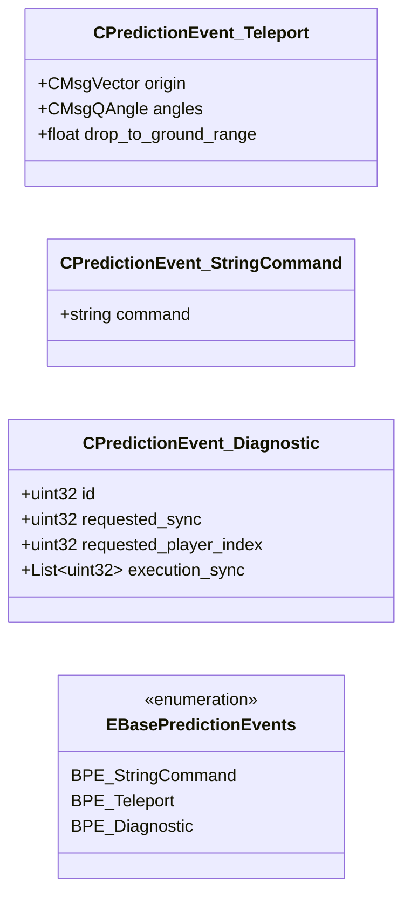

# `prediction_events.proto`

**Imports:** `networkbasetypes.proto`

## Diagram

## Enums

### `EBasePredictionEvents`

| Name | Value |
|------|-------|
| `BPE_StringCommand` | 128 |
| `BPE_Teleport` | 130 |
| `BPE_Diagnostic` | 16384 |

## Messages

### `CPredictionEvent_Teleport`

| Field | Ordinal | Type | Label | Description |
|-------|---------|------|-------|-------------|
| `origin` | 1 | CMsgVector | optional |  |
| `angles` | 2 | CMsgQAngle | optional |  |
| `drop_to_ground_range` | 3 | float | optional |  |

### `CPredictionEvent_StringCommand`

| Field | Ordinal | Type | Label | Description |
|-------|---------|------|-------|-------------|
| `command` | 1 | string | optional |  |

### `CPredictionEvent_Diagnostic`

| Field | Ordinal | Type | Label | Description |
|-------|---------|------|-------|-------------|
| `id` | 1 | uint32 | optional |  |
| `requested_sync` | 2 | uint32 | optional |  |
| `requested_player_index` | 3 | uint32 | optional |  |
| `execution_sync` | 4 | uint32 | repeated |  |
