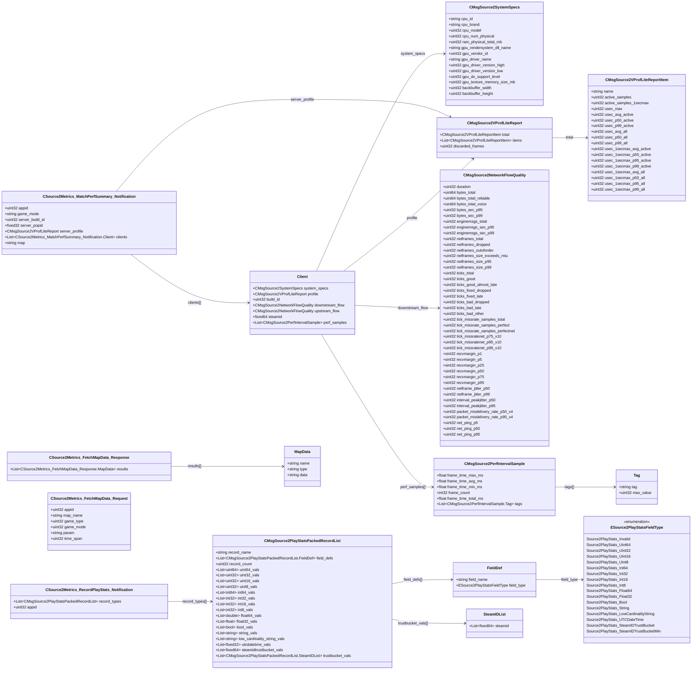

# `source2_steam_stats.proto`

## Diagram

## Enums

### `ESource2PlayStatsFieldType`

| Name | Value |
|------|-------|
| `Source2PlayStats_Invalid` | 0 |
| `Source2PlayStats_UInt64` | 1 |
| `Source2PlayStats_UInt32` | 2 |
| `Source2PlayStats_UInt16` | 3 |
| `Source2PlayStats_UInt8` | 4 |
| `Source2PlayStats_Int64` | 5 |
| `Source2PlayStats_Int32` | 6 |
| `Source2PlayStats_Int16` | 7 |
| `Source2PlayStats_Int8` | 8 |
| `Source2PlayStats_Float64` | 9 |
| `Source2PlayStats_Float32` | 10 |
| `Source2PlayStats_Bool` | 11 |
| `Source2PlayStats_String` | 12 |
| `Source2PlayStats_LowCardinalityString` | 13 |
| `Source2PlayStats_UTCDateTime` | 14 |
| `Source2PlayStats_SteamIDTrustBucket` | 15 |
| `Source2PlayStats_SteamIDTrustBucketMin` | 16 |

## Messages

### `CMsgSource2SystemSpecs`

| Field | Ordinal | Type | Label | Description |
|-------|---------|------|-------|-------------|
| `cpu_id` | 1 | string | optional |  |
| `cpu_brand` | 2 | string | optional |  |
| `cpu_model` | 3 | uint32 | optional |  |
| `cpu_num_physical` | 4 | uint32 | optional |  |
| `ram_physical_total_mb` | 21 | uint32 | optional |  |
| `gpu_rendersystem_dll_name` | 41 | string | optional |  |
| `gpu_vendor_id` | 42 | uint32 | optional |  |
| `gpu_driver_name` | 43 | string | optional |  |
| `gpu_driver_version_high` | 44 | uint32 | optional |  |
| `gpu_driver_version_low` | 45 | uint32 | optional |  |
| `gpu_dx_support_level` | 46 | uint32 | optional |  |
| `gpu_texture_memory_size_mb` | 47 | uint32 | optional |  |
| `backbuffer_width` | 51 | uint32 | optional |  |
| `backbuffer_height` | 52 | uint32 | optional |  |

### `CMsgSource2VProfLiteReportItem`

| Field | Ordinal | Type | Label | Description |
|-------|---------|------|-------|-------------|
| `name` | 1 | string | optional |  |
| `active_samples` | 2 | uint32 | optional |  |
| `usec_max` | 3 | uint32 | optional |  |
| `active_samples_1secmax` | 4 | uint32 | optional |  |
| `usec_avg_active` | 11 | uint32 | optional |  |
| `usec_p50_active` | 12 | uint32 | optional |  |
| `usec_p99_active` | 13 | uint32 | optional |  |
| `usec_avg_all` | 21 | uint32 | optional |  |
| `usec_p50_all` | 22 | uint32 | optional |  |
| `usec_p99_all` | 23 | uint32 | optional |  |
| `usec_1secmax_avg_active` | 31 | uint32 | optional |  |
| `usec_1secmax_p50_active` | 32 | uint32 | optional |  |
| `usec_1secmax_p95_active` | 33 | uint32 | optional |  |
| `usec_1secmax_p99_active` | 34 | uint32 | optional |  |
| `usec_1secmax_avg_all` | 41 | uint32 | optional |  |
| `usec_1secmax_p50_all` | 42 | uint32 | optional |  |
| `usec_1secmax_p95_all` | 43 | uint32 | optional |  |
| `usec_1secmax_p99_all` | 44 | uint32 | optional |  |

### `CMsgSource2VProfLiteReport`

| Field | Ordinal | Type | Label | Description |
|-------|---------|------|-------|-------------|
| `total` | 1 | [CMsgSource2VProfLiteReportItem](#cmsgsource2vproflitereportitem) | optional |  |
| `items` | 2 | [CMsgSource2VProfLiteReportItem](#cmsgsource2vproflitereportitem) | repeated |  |
| `discarded_frames` | 3 | uint32 | optional |  |

### `CMsgSource2NetworkFlowQuality`

| Field | Ordinal | Type | Label | Description |
|-------|---------|------|-------|-------------|
| `duration` | 1 | uint32 | optional |  |
| `bytes_total` | 5 | uint64 | optional |  |
| `bytes_total_reliable` | 6 | uint64 | optional |  |
| `bytes_total_voice` | 7 | uint64 | optional |  |
| `bytes_sec_p95` | 10 | uint32 | optional |  |
| `bytes_sec_p99` | 11 | uint32 | optional |  |
| `enginemsgs_total` | 20 | uint32 | optional |  |
| `enginemsgs_sec_p95` | 21 | uint32 | optional |  |
| `enginemsgs_sec_p99` | 22 | uint32 | optional |  |
| `netframes_total` | 30 | uint32 | optional |  |
| `netframes_dropped` | 31 | uint32 | optional |  |
| `netframes_outoforder` | 32 | uint32 | optional |  |
| `netframes_size_exceeds_mtu` | 34 | uint32 | optional |  |
| `netframes_size_p95` | 35 | uint32 | optional |  |
| `netframes_size_p99` | 36 | uint32 | optional |  |
| `ticks_total` | 40 | uint32 | optional |  |
| `ticks_good` | 41 | uint32 | optional |  |
| `ticks_good_almost_late` | 42 | uint32 | optional |  |
| `ticks_fixed_dropped` | 43 | uint32 | optional |  |
| `ticks_fixed_late` | 44 | uint32 | optional |  |
| `ticks_bad_dropped` | 45 | uint32 | optional |  |
| `ticks_bad_late` | 46 | uint32 | optional |  |
| `ticks_bad_other` | 47 | uint32 | optional |  |
| `tick_missrate_samples_total` | 50 | uint32 | optional |  |
| `tick_missrate_samples_perfect` | 51 | uint32 | optional |  |
| `tick_missrate_samples_perfectnet` | 52 | uint32 | optional |  |
| `tick_missratenet_p75_x10` | 53 | uint32 | optional |  |
| `tick_missratenet_p95_x10` | 54 | uint32 | optional |  |
| `tick_missratenet_p99_x10` | 55 | uint32 | optional |  |
| `recvmargin_p1` | 61 | sint32 | optional |  |
| `recvmargin_p5` | 62 | sint32 | optional |  |
| `recvmargin_p25` | 63 | sint32 | optional |  |
| `recvmargin_p50` | 64 | sint32 | optional |  |
| `recvmargin_p75` | 65 | sint32 | optional |  |
| `recvmargin_p95` | 66 | sint32 | optional |  |
| `netframe_jitter_p50` | 70 | uint32 | optional |  |
| `netframe_jitter_p99` | 71 | uint32 | optional |  |
| `interval_peakjitter_p50` | 72 | uint32 | optional |  |
| `interval_peakjitter_p95` | 73 | uint32 | optional |  |
| `packet_misdelivery_rate_p50_x4` | 74 | uint32 | optional |  |
| `packet_misdelivery_rate_p95_x4` | 75 | uint32 | optional |  |
| `net_ping_p5` | 80 | uint32 | optional |  |
| `net_ping_p50` | 81 | uint32 | optional |  |
| `net_ping_p95` | 82 | uint32 | optional |  |

### `CMsgSource2PerfIntervalSample`

| Field | Ordinal | Type | Label | Description |
|-------|---------|------|-------|-------------|
| `frame_time_max_ms` | 1 | float | optional |  |
| `frame_time_avg_ms` | 2 | float | optional |  |
| `frame_time_min_ms` | 3 | float | optional |  |
| `frame_count` | 4 | int32 | optional |  |
| `frame_time_total_ms` | 5 | float | optional |  |
| `tags` | 6 | CMsgSource2PerfIntervalSample.Tag | repeated |  |

### `CSource2Metrics_MatchPerfSummary_Notification`

| Field | Ordinal | Type | Label | Description |
|-------|---------|------|-------|-------------|
| `appid` | 1 | uint32 | optional |  |
| `game_mode` | 2 | string | optional |  |
| `server_build_id` | 3 | uint32 | optional |  |
| `server_popid` | 4 | fixed32 | optional |  |
| `server_profile` | 10 | [CMsgSource2VProfLiteReport](#cmsgsource2vproflitereport) | optional |  |
| `clients` | 11 | CSource2Metrics_MatchPerfSummary_Notification.Client | repeated |  |
| `map` | 20 | string | optional |  |

### `CMsgSource2PlayStatsPackedRecordList`

| Field | Ordinal | Type | Label | Description |
|-------|---------|------|-------|-------------|
| `record_name` | 1 | string | optional |  |
| `field_defs` | 2 | CMsgSource2PlayStatsPackedRecordList.FieldDef | repeated |  |
| `record_count` | 3 | uint32 | optional |  |
| `uint64_vals` | 4 | uint64 | repeated |  |
| `uint32_vals` | 5 | uint32 | repeated |  |
| `uint16_vals` | 6 | uint32 | repeated |  |
| `uint8_vals` | 7 | uint32 | repeated |  |
| `int64_vals` | 8 | int64 | repeated |  |
| `int32_vals` | 9 | int32 | repeated |  |
| `int16_vals` | 10 | int32 | repeated |  |
| `int8_vals` | 11 | int32 | repeated |  |
| `float64_vals` | 12 | double | repeated |  |
| `float32_vals` | 13 | float | repeated |  |
| `bool_vals` | 14 | bool | repeated |  |
| `string_vals` | 15 | string | repeated |  |
| `low_cardinality_string_vals` | 16 | string | repeated |  |
| `utcdatetime_vals` | 17 | fixed32 | repeated |  |
| `steamidtrustbucket_vals` | 18 | fixed64 | repeated |  |
| `trustbucket_vals` | 19 | CMsgSource2PlayStatsPackedRecordList.SteamIDList | repeated |  |

### `CSource2Metrics_RecordPlayStats_Notification`

| Field | Ordinal | Type | Label | Description |
|-------|---------|------|-------|-------------|
| `record_types` | 1 | [CMsgSource2PlayStatsPackedRecordList](#cmsgsource2playstatspackedrecordlist) | repeated |  |
| `appid` | 2 | uint32 | optional |  |

### `CSource2Metrics_FetchMapData_Request`

| Field | Ordinal | Type | Label | Description |
|-------|---------|------|-------|-------------|
| `appid` | 1 | uint32 | optional |  |
| `map_name` | 2 | string | optional |  |
| `game_type` | 3 | uint32 | optional |  |
| `game_mode` | 4 | uint32 | optional |  |
| `param` | 5 | string | optional |  |
| `time_span` | 6 | uint32 | optional |  |

### `CSource2Metrics_FetchMapData_Response`

| Field | Ordinal | Type | Label | Description |
|-------|---------|------|-------|-------------|
| `results` | 1 | CSource2Metrics_FetchMapData_Response.MapData | repeated |  |
