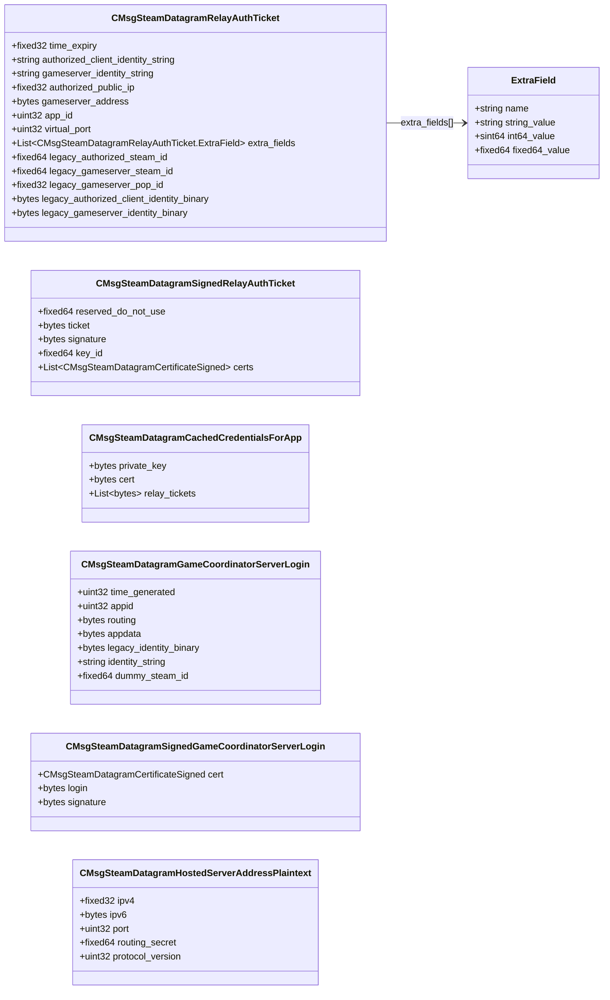

# `steamdatagram_messages_auth.proto`

**Imports:** `steamnetworkingsockets_messages_certs.proto`

## Diagram

## Messages

### `CMsgSteamDatagramRelayAuthTicket`

| Field | Ordinal | Type | Label | Description |
|-------|---------|------|-------|-------------|
| `time_expiry` | 1 | fixed32 | optional |  |
| `legacy_authorized_steam_id` | 2 | fixed64 | optional |  |
| `authorized_public_ip` | 3 | fixed32 | optional |  |
| `legacy_gameserver_steam_id` | 4 | fixed64 | optional |  |
| `app_id` | 7 | uint32 | optional |  |
| `extra_fields` | 8 | CMsgSteamDatagramRelayAuthTicket.ExtraField | repeated |  |
| `legacy_gameserver_pop_id` | 9 | fixed32 | optional |  |
| `virtual_port` | 10 | uint32 | optional |  |
| `gameserver_address` | 11 | bytes | optional |  |
| `legacy_authorized_client_identity_binary` | 12 | bytes | optional |  |
| `legacy_gameserver_identity_binary` | 13 | bytes | optional |  |
| `authorized_client_identity_string` | 14 | string | optional |  |
| `gameserver_identity_string` | 15 | string | optional |  |

### `CMsgSteamDatagramSignedRelayAuthTicket`

| Field | Ordinal | Type | Label | Description |
|-------|---------|------|-------|-------------|
| `reserved_do_not_use` | 1 | fixed64 | optional |  |
| `key_id` | 2 | fixed64 | optional |  |
| `ticket` | 3 | bytes | optional |  |
| `signature` | 4 | bytes | optional |  |
| `certs` | 5 | CMsgSteamDatagramCertificateSigned | repeated |  |

### `CMsgSteamDatagramCachedCredentialsForApp`

| Field | Ordinal | Type | Label | Description |
|-------|---------|------|-------|-------------|
| `private_key` | 1 | bytes | optional |  |
| `cert` | 2 | bytes | optional |  |
| `relay_tickets` | 3 | bytes | repeated |  |

### `CMsgSteamDatagramGameCoordinatorServerLogin`

| Field | Ordinal | Type | Label | Description |
|-------|---------|------|-------|-------------|
| `time_generated` | 1 | uint32 | optional |  |
| `appid` | 2 | uint32 | optional |  |
| `routing` | 3 | bytes | optional |  |
| `appdata` | 4 | bytes | optional |  |
| `legacy_identity_binary` | 5 | bytes | optional |  |
| `identity_string` | 6 | string | optional |  |
| `dummy_steam_id` | 99 | fixed64 | optional |  |

### `CMsgSteamDatagramSignedGameCoordinatorServerLogin`

| Field | Ordinal | Type | Label | Description |
|-------|---------|------|-------|-------------|
| `cert` | 1 | CMsgSteamDatagramCertificateSigned | optional |  |
| `login` | 2 | bytes | optional |  |
| `signature` | 3 | bytes | optional |  |

### `CMsgSteamDatagramHostedServerAddressPlaintext`

| Field | Ordinal | Type | Label | Description |
|-------|---------|------|-------|-------------|
| `ipv4` | 1 | fixed32 | optional |  |
| `ipv6` | 2 | bytes | optional |  |
| `port` | 3 | uint32 | optional |  |
| `routing_secret` | 4 | fixed64 | optional |  |
| `protocol_version` | 5 | uint32 | optional |  |
