# `steamdatagram_messages_sdr.proto`

**Imports:** `steamnetworkingsockets_messages_certs.proto`, `steamnetworkingsockets_messages.proto`

## Diagram

```mermaid
classDiagram
direction LR

  class CMsgSteamNetworkingIPAddress {
    +fixed32 v4
    +bytes v6
  }

  class CMsgSteamDatagramSignedMessageGeneric {
    +CMsgSteamDatagramCertificateSigned cert
    +bytes signed_data
    +bytes signature
    +bytes dummy_pad
  }

  class CMsgSteamDatagramRouterPingReply {
    +fixed32 client_timestamp
    +List~fixed32~ latency_datacenter_ids
    +List~uint32~ latency_ping_ms
    +List~fixed32~ latency_datacenter_ids_p2p
    +List~uint32~ latency_ping_ms_p2p
    +fixed32 your_public_ip
    +fixed32 your_public_port
    +fixed32 server_time
    +fixed64 challenge
    +uint32 seconds_until_shutdown
    +fixed32 client_cookie
    +uint32 recv_tos
    +uint32 echo_sent_tos
    +uint32 sent_tos
    +uint32 echo_request_reply_tos
    +uint32 scoring_penalty_relay_cluster
    +uint32 flags
    +List~CMsgSteamDatagramRouterPingReply.RouteException~ route_exceptions
    +List~CMsgSteamDatagramRouterPingReply.AltAddress~ alt_addresses
    +bytes dummy_pad
    +uint64 dummy_varint
  }

  class RouteException {
    +fixed32 data_center_id
    +uint32 flags
    +uint32 penalty
  }

  class AltAddress {
    +fixed32 ipv4
    +uint32 port
    +uint32 penalty
    +CMsgSteamDatagramRouterPingReply.AltAddress.Protocol protocol
    +string id
  }

  class CMsgSteamDatagramGameserverPingRequestBody {
    +fixed32 relay_popid
    +CMsgSteamNetworkingIPAddress your_public_ip
    +uint32 your_public_port
    +uint64 relay_unix_time
    +fixed64 routing_secret
    +List~CMsgSteamNetworkingIPAddress~ my_ips
    +bytes echo
  }

  class CMsgSteamDatagramGameserverPingRequestEnvelope {
    +CMsgSteamDatagramCertificateSigned cert
    +bytes signed_data
    +bytes signature
    +fixed32 legacy_your_public_ip
    +fixed32 legacy_your_public_port
    +fixed32 legacy_relay_unix_time
    +fixed64 legacy_challenge
    +fixed32 legacy_router_timestamp
    +bytes dummy_pad
  }

  class CMsgSteamDatagramGameserverPingReplyData {
    +fixed32 echo_relay_unix_time
    +bytes echo
    +fixed64 legacy_challenge
    +fixed32 legacy_router_timestamp
    +fixed32 data_center_id
    +uint32 appid
    +uint32 protocol_version
    +string build
    +uint64 network_config_version
    +fixed32 my_unix_time
    +bytes routing_blob
  }

  class CMsgSteamDatagramNoSessionRelayToClient {
    +fixed32 connection_id
    +fixed32 your_public_ip
    +fixed32 your_public_port
    +fixed32 server_time
    +fixed64 challenge
    +uint32 seconds_until_shutdown
  }

  class CMsgSteamDatagramNoSessionRelayToPeer {
    +uint32 legacy_relay_session_id
    +fixed32 from_relay_session_id
    +fixed32 from_connection_id
    +fixed64 kludge_pad
  }

  class CMsgTOSTreatment {
    +string l4s_detect
    +string up_ecn1
    +string down_dscp45
  }

  class CMsgSteamDatagramClientPingSampleRequest {
    +fixed32 connection_id
  }

  class CMsgSteamDatagramClientPingSampleReply {
    +fixed32 connection_id
    +bool relay_override_active
    +CMsgTOSTreatment tos
    +List~CMsgSteamDatagramClientPingSampleReply.POP~ pops
    +List~CMsgSteamDatagramClientPingSampleReply.LegacyDataCenter~ legacy_data_centers
  }

  class POP {
    +fixed32 pop_id
    +uint32 default_front_ping_ms
    +uint32 cluster_penalty
    +List~CMsgSteamDatagramClientPingSampleReply.POP.AltAddress~ alt_addresses
    +uint32 default_e2e_ping_ms
    +uint32 default_e2e_score
    +fixed32 p2p_via_peer_relay_pop_id
    +uint32 best_dc_ping_ms
    +uint32 best_dc_score
    +fixed32 best_dc_via_relay_pop_id
    +uint32 default_dc_ping_ms
    +uint32 default_dc_score
    +fixed32 default_dc_via_relay_pop_id
    +uint32 test_dc_ping_ms
    +uint32 test_dc_score
    +fixed32 test_dc_via_relay_pop_id
  }

  class AltAddress {
    +string id
    +uint32 front_ping_ms
    +uint32 penalty
  }

  class LegacyDataCenter {
    +fixed32 data_center_id
    +fixed32 best_dc_via_relay_pop_id
    +uint32 best_dc_ping_ms
  }

  class CMsgSteamDatagramClientSwitchedPrimary {
    +fixed32 connection_id
    +fixed32 from_ip
    +uint32 from_port
    +fixed32 from_router_cluster
    +uint32 from_active_time
    +uint32 from_active_packets_recv
    +string from_dropped_reason
    +uint32 gap_ms
    +CMsgSteamDatagramClientSwitchedPrimary.RouterQuality from_quality_now
    +CMsgSteamDatagramClientSwitchedPrimary.RouterQuality to_quality_now
    +CMsgSteamDatagramClientSwitchedPrimary.RouterQuality from_quality_then
    +CMsgSteamDatagramClientSwitchedPrimary.RouterQuality to_quality_then
  }

  class RouterQuality {
    +uint32 score
    +uint32 front_ping
    +uint32 back_ping
    +uint32 seconds_until_down
  }

  class CMsgSteamDatagramConnectRequest {
    +fixed32 connection_id
    +fixed64 my_timestamp
    +uint32 ping_est_ms
    +uint32 virtual_port
    +uint32 gameserver_relay_session_id
    +CMsgSteamDatagramSessionCryptInfoSigned crypt
    +CMsgSteamDatagramCertificateSigned cert
    +fixed64 routing_secret
    +fixed64 legacy_client_steam_id
  }

  class CMsgSteamDatagramConnectOK {
    +fixed32 client_connection_id
    +fixed32 server_connection_id
    +fixed64 your_timestamp
    +uint32 delay_time_usec
    +uint32 gameserver_relay_session_id
    +CMsgSteamDatagramSessionCryptInfoSigned crypt
    +CMsgSteamDatagramCertificateSigned cert
  }

  class CMsgSteamNetworkingP2PSDRRoutingSummary {
    +uint32 initial_ping
    +uint32 initial_ping_front_local
    +uint32 initial_ping_front_remote
    +uint32 initial_score
    +fixed32 initial_pop_local
    +fixed32 initial_pop_remote
    +uint32 best_ping
    +uint32 best_ping_front_local
    +uint32 best_ping_front_remote
    +uint32 best_score
    +fixed32 best_pop_local
    +fixed32 best_pop_remote
    +uint32 best_time
    +uint32 negotiation_ms
    +uint32 selected_seconds
  }

  class CMsgSteamDatagramP2PRoutingSummary {
    +CMsgSteamNetworkingICESessionSummary ice
    +CMsgSteamNetworkingP2PSDRRoutingSummary sdr
  }

  class CMsgSteamDatagramConnectionClosed {
    +fixed32 to_connection_id
    +fixed32 from_connection_id
    +string from_identity_string
    +CMsgSteamNetworkingIdentityLegacyBinary legacy_from_identity_binary
    +fixed64 legacy_from_steam_id
    +uint32 legacy_gameserver_relay_session_id
    +fixed32 to_relay_session_id
    +fixed32 from_relay_session_id
    +bytes forward_target_relay_routing_token
    +uint32 forward_target_revision
    +CMsgSteamDatagramConnectionClosed.ERelayMode relay_mode
    +string debug
    +uint32 reason_code
    +fixed64 routing_secret
    +bool not_primary_session
    +bool not_primary_transport
    +bool relay_override_active
    +CMsgSteamDatagramConnectionQuality quality_relay
    +CMsgSteamDatagramConnectionQuality quality_e2e
    +CMsgSteamDatagramP2PRoutingSummary p2p_routing_summary
  }

  class CMsgSteamDatagramNoConnection {
    +fixed32 to_connection_id
    +fixed32 from_connection_id
    +uint32 legacy_gameserver_relay_session_id
    +fixed32 to_relay_session_id
    +fixed32 from_relay_session_id
    +string from_identity_string
    +fixed64 legacy_from_steam_id
    +bool end_to_end
    +bool not_primary_session
    +bool not_primary_transport
    +bool relay_override_active
    +CMsgSteamDatagramConnectionQuality quality_relay
    +CMsgSteamDatagramConnectionQuality quality_e2e
    +CMsgSteamDatagramP2PRoutingSummary p2p_routing_summary
    +fixed64 routing_secret
    +fixed32 dummy_pad
  }

  class CMsgSteamDatagramGameserverSessionRequest {
    +bytes ticket
    +fixed32 challenge_time
    +fixed64 challenge
    +fixed32 client_connection_id
    +fixed32 server_connection_id
    +uint64 network_config_version
    +uint32 protocol_version
    +string platform
    +string build
    +string dev_gameserver_identity
    +CMsgSteamDatagramCertificateSigned dev_client_cert
  }

  class CMsgSteamDatagramGameserverSessionEstablished {
    +fixed32 connection_id
    +string gameserver_identity_string
    +uint32 seconds_until_shutdown
    +uint32 seq_num_r2c
    +bytes dummy_legacy_identity_binary
    +fixed64 legacy_gameserver_steamid
  }

  class CMsgSteamDatagramConnectionStatsClientToRouter {
    +CMsgSteamDatagramConnectionQuality quality_relay
    +CMsgSteamDatagramConnectionQuality quality_e2e
    +List~fixed32~ ack_relay
    +List~fixed32~ legacy_ack_e2e
    +uint32 flags
    +fixed32 client_connection_id
    +uint32 seq_num_c2r
    +uint32 seq_num_e2e
  }

  class CMsgSteamDatagramConnectionStatsRouterToClient {
    +CMsgSteamDatagramConnectionQuality quality_relay
    +CMsgSteamDatagramConnectionQuality quality_e2e
    +uint32 seconds_until_shutdown
    +fixed32 migrate_request_ip
    +uint32 migrate_request_port
    +uint32 scoring_penalty_relay_cluster
    +List~fixed32~ ack_relay
    +List~fixed32~ legacy_ack_e2e
    +uint32 flags
    +fixed32 client_connection_id
    +uint32 seq_num_r2c
    +uint32 seq_num_e2e
  }

  class CMsgSteamDatagramConnectionStatsRouterToServer {
    +CMsgSteamDatagramConnectionQuality quality_relay
    +CMsgSteamDatagramConnectionQuality quality_e2e
    +List~fixed32~ ack_relay
    +List~fixed32~ legacy_ack_e2e
    +uint32 flags
    +uint32 seq_num_r2s
    +uint32 seq_num_e2e
    +string client_identity_string
    +fixed64 legacy_client_steam_id
    +uint32 relay_session_id
    +fixed32 client_connection_id
    +fixed32 server_connection_id
    +fixed64 routing_secret
  }

  class CMsgSteamDatagramConnectionStatsServerToRouter {
    +CMsgSteamDatagramConnectionQuality quality_relay
    +CMsgSteamDatagramConnectionQuality quality_e2e
    +List~fixed32~ ack_relay
    +List~fixed32~ legacy_ack_e2e
    +uint32 flags
    +uint32 seq_num_s2r
    +uint32 seq_num_e2e
    +uint32 relay_session_id
    +fixed32 client_connection_id
    +fixed32 server_connection_id
  }

  class CMsgSteamDatagramP2PSessionRequestBody {
    +fixed32 challenge_time
    +fixed64 challenge
    +fixed32 client_connection_id
    +fixed64 legacy_peer_steam_id
    +string peer_identity_string
    +fixed32 peer_connection_id
    +bytes encrypted_data
    +uint32 encryption_your_public_key_lead_byte
    +bytes encryption_my_ephemeral_public_key
    +uint32 protocol_version
    +uint64 network_config_version
    +string platform
    +string build
  }

  class EncryptedData {
    +string peer_identity_string
  }

  class CMsgSteamDatagramP2PSessionRequest {
    +CMsgSteamDatagramCertificateSigned cert
    +bytes body
    +bytes signature
  }

  class CMsgSteamDatagramP2PSessionEstablished {
    +fixed32 connection_id
    +uint32 seconds_until_shutdown
    +bytes relay_routing_token
    +uint32 seq_num_r2c
  }

  class CMsgSteamDatagramConnectionStatsP2PClientToRouter {
    +CMsgSteamDatagramConnectionQuality quality_relay
    +CMsgSteamDatagramConnectionQuality quality_e2e
    +CMsgSteamDatagramP2PRoutingSummary p2p_routing_summary
    +List~fixed32~ ack_relay
    +List~fixed32~ legacy_ack_e2e
    +uint32 flags
    +bytes forward_target_relay_routing_token
    +uint32 forward_target_revision
    +bytes routes
    +uint32 ack_peer_routes_revision
    +fixed32 connection_id
    +uint32 seq_num_c2r
    +uint32 seq_num_e2e
  }

  class CMsgSteamDatagramConnectionStatsP2PRouterToClient {
    +CMsgSteamDatagramConnectionQuality quality_relay
    +CMsgSteamDatagramConnectionQuality quality_e2e
    +uint32 seconds_until_shutdown
    +fixed32 migrate_request_ip
    +uint32 migrate_request_port
    +uint32 scoring_penalty_relay_cluster
    +List~fixed32~ ack_relay
    +List~fixed32~ legacy_ack_e2e
    +uint32 flags
    +uint32 ack_forward_target_revision
    +bytes routes
    +uint32 ack_peer_routes_revision
    +fixed32 connection_id
    +uint32 seq_num_r2c
    +uint32 seq_num_e2e
  }

  class CMsgSteamDatagramP2PBadRouteRouterToClient {
    +fixed32 connection_id
    +bytes failed_relay_routing_token
    +uint32 ack_forward_target_revision
    +fixed64 kludge_pad
  }

  class CMsgSteamDatagramP2PRoutes {
    +List~CMsgSteamDatagramP2PRoutes.RelayCluster~ relay_clusters
    +List~CMsgSteamDatagramP2PRoutes.Route~ routes
    +uint32 revision
  }

  class RelayCluster {
    +fixed32 pop_id
    +uint32 ping_ms
    +uint32 score_penalty
    +bytes session_relay_routing_token
  }

  class Route {
    +fixed32 my_pop_id
    +fixed32 your_pop_id
    +uint32 legacy_score
    +uint32 interior_score
  }

  class CMsgSteamDatagramSetSecondaryAddressRequest {
    +fixed32 client_main_ip
    +fixed32 client_main_port
    +fixed32 client_connection_id
    +string client_identity
    +bool request_send_duplication
    +bytes kludge_pad
  }

  class CMsgSteamDatagramSetSecondaryAddressResult {
    +bool success
    +string message
  }

  CMsgSteamDatagramRouterPingReply --> RouteException : route_exceptions[]
  CMsgSteamDatagramRouterPingReply --> AltAddress : alt_addresses[]
  CMsgSteamDatagramGameserverPingRequestBody --> CMsgSteamNetworkingIPAddress : your_public_ip
  CMsgSteamDatagramClientPingSampleReply --> CMsgTOSTreatment : tos
  CMsgSteamDatagramClientPingSampleReply --> POP : pops[]
  CMsgSteamDatagramClientPingSampleReply --> LegacyDataCenter : legacy_data_centers[]
  POP --> AltAddress : alt_addresses[]
  CMsgSteamDatagramClientSwitchedPrimary --> RouterQuality : from_quality_now
  CMsgSteamDatagramP2PRoutingSummary --> CMsgSteamNetworkingP2PSDRRoutingSummary : sdr
  CMsgSteamDatagramConnectionClosed --> CMsgSteamDatagramP2PRoutingSummary : p2p_routing_summary
  CMsgSteamDatagramNoConnection --> CMsgSteamDatagramP2PRoutingSummary : p2p_routing_summary
  CMsgSteamDatagramConnectionStatsP2PClientToRouter --> CMsgSteamDatagramP2PRoutingSummary : p2p_routing_summary
  CMsgSteamDatagramP2PRoutes --> RelayCluster : relay_clusters[]
  CMsgSteamDatagramP2PRoutes --> Route : routes[]

  class ESteamDatagramMsgID{
    <<enumeration>>
    k_ESteamDatagramMsg_Invalid
    k_ESteamDatagramMsg_RouterPingRequest
    k_ESteamDatagramMsg_RouterPingReply
    k_ESteamDatagramMsg_GameserverPingRequest
    k_ESteamDatagramMsg_GameserverSessionRequest
    k_ESteamDatagramMsg_GameserverSessionEstablished
    k_ESteamDatagramMsg_NoSession
    k_ESteamDatagramMsg_Diagnostic
    k_ESteamDatagramMsg_DataClientToRouter
    k_ESteamDatagramMsg_DataRouterToServer
    k_ESteamDatagramMsg_DataServerToRouter
    k_ESteamDatagramMsg_DataRouterToClient
    k_ESteamDatagramMsg_Stats
    k_ESteamDatagramMsg_ClientPingSampleRequest
    k_ESteamDatagramMsg_ClientPingSampleReply
    k_ESteamDatagramMsg_ClientToRouterSwitchedPrimary
    k_ESteamDatagramMsg_RelayHealth
    k_ESteamDatagramMsg_ConnectRequest
    k_ESteamDatagramMsg_ConnectOK
    k_ESteamDatagramMsg_ConnectionClosed
    k_ESteamDatagramMsg_NoConnection
    k_ESteamDatagramMsg_TicketDecryptRequest
    k_ESteamDatagramMsg_TicketDecryptReply
    k_ESteamDatagramMsg_P2PSessionRequest
    k_ESteamDatagramMsg_P2PSessionEstablished
    k_ESteamDatagramMsg_P2PStatsClient
    k_ESteamDatagramMsg_P2PStatsRelay
    k_ESteamDatagramMsg_P2PBadRoute
    k_ESteamDatagramMsg_GameserverPingReply
    k_ESteamDatagramMsg_LegacyGameserverRegistration
    k_ESteamDatagramMsg_SetSecondaryAddressRequest
    k_ESteamDatagramMsg_SetSecondaryAddressResult
    k_ESteamDatagramMsg_RelayToRelayPingRequest
    k_ESteamDatagramMsg_RelayToRelayPingReply
  }

```

## Enums

### `ESteamDatagramMsgID`

| Name | Value |
|------|-------|
| `k_ESteamDatagramMsg_Invalid` | 0 |
| `k_ESteamDatagramMsg_RouterPingRequest` | 1 |
| `k_ESteamDatagramMsg_RouterPingReply` | 2 |
| `k_ESteamDatagramMsg_GameserverPingRequest` | 3 |
| `k_ESteamDatagramMsg_GameserverSessionRequest` | 5 |
| `k_ESteamDatagramMsg_GameserverSessionEstablished` | 6 |
| `k_ESteamDatagramMsg_NoSession` | 7 |
| `k_ESteamDatagramMsg_Diagnostic` | 8 |
| `k_ESteamDatagramMsg_DataClientToRouter` | 9 |
| `k_ESteamDatagramMsg_DataRouterToServer` | 10 |
| `k_ESteamDatagramMsg_DataServerToRouter` | 11 |
| `k_ESteamDatagramMsg_DataRouterToClient` | 12 |
| `k_ESteamDatagramMsg_Stats` | 13 |
| `k_ESteamDatagramMsg_ClientPingSampleRequest` | 14 |
| `k_ESteamDatagramMsg_ClientPingSampleReply` | 15 |
| `k_ESteamDatagramMsg_ClientToRouterSwitchedPrimary` | 16 |
| `k_ESteamDatagramMsg_RelayHealth` | 17 |
| `k_ESteamDatagramMsg_ConnectRequest` | 18 |
| `k_ESteamDatagramMsg_ConnectOK` | 19 |
| `k_ESteamDatagramMsg_ConnectionClosed` | 20 |
| `k_ESteamDatagramMsg_NoConnection` | 21 |
| `k_ESteamDatagramMsg_TicketDecryptRequest` | 22 |
| `k_ESteamDatagramMsg_TicketDecryptReply` | 23 |
| `k_ESteamDatagramMsg_P2PSessionRequest` | 24 |
| `k_ESteamDatagramMsg_P2PSessionEstablished` | 25 |
| `k_ESteamDatagramMsg_P2PStatsClient` | 26 |
| `k_ESteamDatagramMsg_P2PStatsRelay` | 27 |
| `k_ESteamDatagramMsg_P2PBadRoute` | 28 |
| `k_ESteamDatagramMsg_GameserverPingReply` | 29 |
| `k_ESteamDatagramMsg_LegacyGameserverRegistration` | 30 |
| `k_ESteamDatagramMsg_SetSecondaryAddressRequest` | 31 |
| `k_ESteamDatagramMsg_SetSecondaryAddressResult` | 32 |
| `k_ESteamDatagramMsg_RelayToRelayPingRequest` | 33 |
| `k_ESteamDatagramMsg_RelayToRelayPingReply` | 34 |

## Messages

### `CMsgSteamNetworkingIPAddress`

| Field | Ordinal | Type | Label | Description |
|-------|---------|------|-------|-------------|
| `v4` | 1 | fixed32 | optional |  |
| `v6` | 2 | bytes | optional |  |

### `CMsgSteamDatagramSignedMessageGeneric`

| Field | Ordinal | Type | Label | Description |
|-------|---------|------|-------|-------------|
| `cert` | 1 | CMsgSteamDatagramCertificateSigned | optional |  |
| `signed_data` | 2 | bytes | optional |  |
| `signature` | 3 | bytes | optional |  |
| `dummy_pad` | 1023 | bytes | optional |  |

### `CMsgSteamDatagramRouterPingReply`

| Field | Ordinal | Type | Label | Description |
|-------|---------|------|-------|-------------|
| `client_timestamp` | 1 | fixed32 | optional |  |
| `latency_datacenter_ids` | 2 | fixed32 | repeated |  |
| `latency_ping_ms` | 3 | uint32 | repeated |  |
| `your_public_ip` | 4 | fixed32 | optional |  |
| `server_time` | 5 | fixed32 | optional |  |
| `challenge` | 6 | fixed64 | optional |  |
| `seconds_until_shutdown` | 7 | uint32 | optional |  |
| `client_cookie` | 8 | fixed32 | optional |  |
| `scoring_penalty_relay_cluster` | 9 | uint32 | optional |  |
| `route_exceptions` | 10 | CMsgSteamDatagramRouterPingReply.RouteException | repeated |  |
| `your_public_port` | 11 | fixed32 | optional |  |
| `flags` | 12 | uint32 | optional |  |
| `alt_addresses` | 13 | CMsgSteamDatagramRouterPingReply.AltAddress | repeated |  |
| `latency_datacenter_ids_p2p` | 14 | fixed32 | repeated |  |
| `latency_ping_ms_p2p` | 15 | uint32 | repeated |  |
| `recv_tos` | 16 | uint32 | optional |  |
| `echo_sent_tos` | 17 | uint32 | optional |  |
| `sent_tos` | 18 | uint32 | optional |  |
| `echo_request_reply_tos` | 19 | uint32 | optional |  |
| `dummy_pad` | 99 | bytes | optional |  |
| `dummy_varint` | 100 | uint64 | optional |  |

### `CMsgSteamDatagramGameserverPingRequestBody`

| Field | Ordinal | Type | Label | Description |
|-------|---------|------|-------|-------------|
| `relay_popid` | 1 | fixed32 | optional |  |
| `your_public_ip` | 2 | [CMsgSteamNetworkingIPAddress](#cmsgsteamnetworkingipaddress) | optional |  |
| `your_public_port` | 3 | uint32 | optional |  |
| `relay_unix_time` | 4 | uint64 | optional |  |
| `routing_secret` | 5 | fixed64 | optional |  |
| `my_ips` | 6 | [CMsgSteamNetworkingIPAddress](#cmsgsteamnetworkingipaddress) | repeated |  |
| `echo` | 8 | bytes | optional |  |

### `CMsgSteamDatagramGameserverPingRequestEnvelope`

| Field | Ordinal | Type | Label | Description |
|-------|---------|------|-------|-------------|
| `legacy_your_public_ip` | 1 | fixed32 | optional |  |
| `legacy_relay_unix_time` | 2 | fixed32 | optional |  |
| `legacy_challenge` | 3 | fixed64 | optional |  |
| `legacy_router_timestamp` | 4 | fixed32 | optional |  |
| `legacy_your_public_port` | 5 | fixed32 | optional |  |
| `cert` | 6 | CMsgSteamDatagramCertificateSigned | optional |  |
| `signed_data` | 7 | bytes | optional |  |
| `signature` | 8 | bytes | optional |  |
| `dummy_pad` | 1023 | bytes | optional |  |

### `CMsgSteamDatagramGameserverPingReplyData`

| Field | Ordinal | Type | Label | Description |
|-------|---------|------|-------|-------------|
| `echo_relay_unix_time` | 2 | fixed32 | optional |  |
| `legacy_challenge` | 3 | fixed64 | optional |  |
| `legacy_router_timestamp` | 4 | fixed32 | optional |  |
| `data_center_id` | 5 | fixed32 | optional |  |
| `appid` | 6 | uint32 | optional |  |
| `protocol_version` | 7 | uint32 | optional |  |
| `echo` | 8 | bytes | optional |  |
| `build` | 9 | string | optional |  |
| `network_config_version` | 10 | uint64 | optional |  |
| `my_unix_time` | 11 | fixed32 | optional |  |
| `routing_blob` | 12 | bytes | optional |  |

### `CMsgSteamDatagramNoSessionRelayToClient`

| Field | Ordinal | Type | Label | Description |
|-------|---------|------|-------|-------------|
| `your_public_ip` | 2 | fixed32 | optional |  |
| `server_time` | 3 | fixed32 | optional |  |
| `challenge` | 4 | fixed64 | optional |  |
| `seconds_until_shutdown` | 5 | uint32 | optional |  |
| `your_public_port` | 6 | fixed32 | optional |  |
| `connection_id` | 7 | fixed32 | optional |  |

### `CMsgSteamDatagramNoSessionRelayToPeer`

| Field | Ordinal | Type | Label | Description |
|-------|---------|------|-------|-------------|
| `legacy_relay_session_id` | 1 | uint32 | optional |  |
| `from_relay_session_id` | 2 | fixed32 | optional |  |
| `from_connection_id` | 7 | fixed32 | optional |  |
| `kludge_pad` | 99 | fixed64 | optional |  |

### `CMsgTOSTreatment`

| Field | Ordinal | Type | Label | Description |
|-------|---------|------|-------|-------------|
| `l4s_detect` | 1 | string | optional |  |
| `up_ecn1` | 2 | string | optional |  |
| `down_dscp45` | 3 | string | optional |  |

### `CMsgSteamDatagramClientPingSampleRequest`

| Field | Ordinal | Type | Label | Description |
|-------|---------|------|-------|-------------|
| `connection_id` | 1 | fixed32 | optional |  |

### `CMsgSteamDatagramClientPingSampleReply`

| Field | Ordinal | Type | Label | Description |
|-------|---------|------|-------|-------------|
| `connection_id` | 1 | fixed32 | optional |  |
| `pops` | 2 | CMsgSteamDatagramClientPingSampleReply.POP | repeated |  |
| `legacy_data_centers` | 3 | CMsgSteamDatagramClientPingSampleReply.LegacyDataCenter | repeated |  |
| `relay_override_active` | 5 | bool | optional |  |
| `tos` | 6 | [CMsgTOSTreatment](#cmsgtostreatment) | optional |  |

### `CMsgSteamDatagramClientSwitchedPrimary`

| Field | Ordinal | Type | Label | Description |
|-------|---------|------|-------|-------------|
| `connection_id` | 1 | fixed32 | optional |  |
| `from_ip` | 2 | fixed32 | optional |  |
| `from_port` | 3 | uint32 | optional |  |
| `from_router_cluster` | 4 | fixed32 | optional |  |
| `from_active_time` | 5 | uint32 | optional |  |
| `from_active_packets_recv` | 6 | uint32 | optional |  |
| `from_dropped_reason` | 7 | string | optional |  |
| `gap_ms` | 8 | uint32 | optional |  |
| `from_quality_now` | 9 | CMsgSteamDatagramClientSwitchedPrimary.RouterQuality | optional |  |
| `to_quality_now` | 10 | CMsgSteamDatagramClientSwitchedPrimary.RouterQuality | optional |  |
| `from_quality_then` | 11 | CMsgSteamDatagramClientSwitchedPrimary.RouterQuality | optional |  |
| `to_quality_then` | 12 | CMsgSteamDatagramClientSwitchedPrimary.RouterQuality | optional |  |

### `CMsgSteamDatagramConnectRequest`

| Field | Ordinal | Type | Label | Description |
|-------|---------|------|-------|-------------|
| `connection_id` | 1 | fixed32 | optional |  |
| `gameserver_relay_session_id` | 2 | uint32 | optional |  |
| `legacy_client_steam_id` | 3 | fixed64 | optional |  |
| `my_timestamp` | 4 | fixed64 | optional |  |
| `ping_est_ms` | 5 | uint32 | optional |  |
| `crypt` | 6 | CMsgSteamDatagramSessionCryptInfoSigned | optional |  |
| `cert` | 7 | CMsgSteamDatagramCertificateSigned | optional |  |
| `virtual_port` | 9 | uint32 | optional |  |
| `routing_secret` | 10 | fixed64 | optional |  |

### `CMsgSteamDatagramConnectOK`

| Field | Ordinal | Type | Label | Description |
|-------|---------|------|-------|-------------|
| `client_connection_id` | 1 | fixed32 | optional |  |
| `gameserver_relay_session_id` | 2 | uint32 | optional |  |
| `your_timestamp` | 3 | fixed64 | optional |  |
| `delay_time_usec` | 4 | uint32 | optional |  |
| `crypt` | 5 | CMsgSteamDatagramSessionCryptInfoSigned | optional |  |
| `cert` | 6 | CMsgSteamDatagramCertificateSigned | optional |  |
| `server_connection_id` | 7 | fixed32 | optional |  |

### `CMsgSteamNetworkingP2PSDRRoutingSummary`

| Field | Ordinal | Type | Label | Description |
|-------|---------|------|-------|-------------|
| `initial_ping` | 1 | uint32 | optional |  |
| `initial_ping_front_local` | 2 | uint32 | optional |  |
| `initial_ping_front_remote` | 3 | uint32 | optional |  |
| `initial_score` | 4 | uint32 | optional |  |
| `initial_pop_local` | 5 | fixed32 | optional |  |
| `initial_pop_remote` | 6 | fixed32 | optional |  |
| `negotiation_ms` | 7 | uint32 | optional |  |
| `selected_seconds` | 8 | uint32 | optional |  |
| `best_ping` | 11 | uint32 | optional |  |
| `best_ping_front_local` | 12 | uint32 | optional |  |
| `best_ping_front_remote` | 13 | uint32 | optional |  |
| `best_score` | 14 | uint32 | optional |  |
| `best_pop_local` | 15 | fixed32 | optional |  |
| `best_pop_remote` | 16 | fixed32 | optional |  |
| `best_time` | 17 | uint32 | optional |  |

### `CMsgSteamDatagramP2PRoutingSummary`

| Field | Ordinal | Type | Label | Description |
|-------|---------|------|-------|-------------|
| `ice` | 2 | CMsgSteamNetworkingICESessionSummary | optional |  |
| `sdr` | 3 | [CMsgSteamNetworkingP2PSDRRoutingSummary](#cmsgsteamnetworkingp2psdrroutingsummary) | optional |  |

### `CMsgSteamDatagramConnectionClosed`

| Field | Ordinal | Type | Label | Description |
|-------|---------|------|-------|-------------|
| `legacy_gameserver_relay_session_id` | 2 | uint32 | optional |  |
| `legacy_from_steam_id` | 3 | fixed64 | optional |  |
| `relay_mode` | 4 | CMsgSteamDatagramConnectionClosed.ERelayMode | optional | *(default: `None`)* |
| `debug` | 5 | string | optional |  |
| `reason_code` | 6 | uint32 | optional |  |
| `to_connection_id` | 7 | fixed32 | optional |  |
| `from_connection_id` | 8 | fixed32 | optional |  |
| `to_relay_session_id` | 9 | fixed32 | optional |  |
| `from_relay_session_id` | 10 | fixed32 | optional |  |
| `forward_target_relay_routing_token` | 11 | bytes | optional |  |
| `forward_target_revision` | 12 | uint32 | optional |  |
| `legacy_from_identity_binary` | 13 | CMsgSteamNetworkingIdentityLegacyBinary | optional |  |
| `routing_secret` | 14 | fixed64 | optional |  |
| `from_identity_string` | 15 | string | optional |  |
| `not_primary_session` | 16 | bool | optional |  |
| `quality_relay` | 17 | CMsgSteamDatagramConnectionQuality | optional |  |
| `quality_e2e` | 18 | CMsgSteamDatagramConnectionQuality | optional |  |
| `not_primary_transport` | 19 | bool | optional |  |
| `p2p_routing_summary` | 21 | [CMsgSteamDatagramP2PRoutingSummary](#cmsgsteamdatagramp2proutingsummary) | optional |  |
| `relay_override_active` | 22 | bool | optional |  |

### `CMsgSteamDatagramNoConnection`

| Field | Ordinal | Type | Label | Description |
|-------|---------|------|-------|-------------|
| `legacy_gameserver_relay_session_id` | 2 | uint32 | optional |  |
| `legacy_from_steam_id` | 3 | fixed64 | optional |  |
| `end_to_end` | 4 | bool | optional |  |
| `to_connection_id` | 5 | fixed32 | optional |  |
| `from_connection_id` | 6 | fixed32 | optional |  |
| `from_identity_string` | 7 | string | optional |  |
| `to_relay_session_id` | 9 | fixed32 | optional |  |
| `from_relay_session_id` | 10 | fixed32 | optional |  |
| `routing_secret` | 11 | fixed64 | optional |  |
| `not_primary_session` | 12 | bool | optional |  |
| `quality_relay` | 13 | CMsgSteamDatagramConnectionQuality | optional |  |
| `quality_e2e` | 14 | CMsgSteamDatagramConnectionQuality | optional |  |
| `not_primary_transport` | 15 | bool | optional |  |
| `p2p_routing_summary` | 16 | [CMsgSteamDatagramP2PRoutingSummary](#cmsgsteamdatagramp2proutingsummary) | optional |  |
| `relay_override_active` | 17 | bool | optional |  |
| `dummy_pad` | 1023 | fixed32 | optional |  |

### `CMsgSteamDatagramGameserverSessionRequest`

| Field | Ordinal | Type | Label | Description |
|-------|---------|------|-------|-------------|
| `ticket` | 1 | bytes | optional |  |
| `challenge_time` | 3 | fixed32 | optional |  |
| `challenge` | 4 | fixed64 | optional |  |
| `client_connection_id` | 5 | fixed32 | optional |  |
| `network_config_version` | 6 | uint64 | optional |  |
| `protocol_version` | 7 | uint32 | optional |  |
| `server_connection_id` | 8 | fixed32 | optional |  |
| `platform` | 9 | string | optional |  |
| `build` | 10 | string | optional |  |
| `dev_gameserver_identity` | 100 | string | optional |  |
| `dev_client_cert` | 101 | CMsgSteamDatagramCertificateSigned | optional |  |

### `CMsgSteamDatagramGameserverSessionEstablished`

| Field | Ordinal | Type | Label | Description |
|-------|---------|------|-------|-------------|
| `connection_id` | 1 | fixed32 | optional |  |
| `gameserver_identity_string` | 2 | string | optional |  |
| `legacy_gameserver_steamid` | 3 | fixed64 | optional |  |
| `seconds_until_shutdown` | 4 | uint32 | optional |  |
| `seq_num_r2c` | 6 | uint32 | optional |  |
| `dummy_legacy_identity_binary` | 7 | bytes | optional |  |

### `CMsgSteamDatagramConnectionStatsClientToRouter`

| Field | Ordinal | Type | Label | Description |
|-------|---------|------|-------|-------------|
| `quality_relay` | 1 | CMsgSteamDatagramConnectionQuality | optional |  |
| `quality_e2e` | 2 | CMsgSteamDatagramConnectionQuality | optional |  |
| `ack_relay` | 4 | fixed32 | repeated |  |
| `legacy_ack_e2e` | 5 | fixed32 | repeated |  |
| `flags` | 6 | uint32 | optional |  |
| `client_connection_id` | 8 | fixed32 | optional |  |
| `seq_num_c2r` | 9 | uint32 | optional |  |
| `seq_num_e2e` | 10 | uint32 | optional |  |

### `CMsgSteamDatagramConnectionStatsRouterToClient`

| Field | Ordinal | Type | Label | Description |
|-------|---------|------|-------|-------------|
| `quality_relay` | 1 | CMsgSteamDatagramConnectionQuality | optional |  |
| `quality_e2e` | 2 | CMsgSteamDatagramConnectionQuality | optional |  |
| `seconds_until_shutdown` | 6 | uint32 | optional |  |
| `client_connection_id` | 7 | fixed32 | optional |  |
| `seq_num_r2c` | 8 | uint32 | optional |  |
| `seq_num_e2e` | 9 | uint32 | optional |  |
| `migrate_request_ip` | 10 | fixed32 | optional |  |
| `migrate_request_port` | 11 | uint32 | optional |  |
| `scoring_penalty_relay_cluster` | 12 | uint32 | optional |  |
| `ack_relay` | 13 | fixed32 | repeated |  |
| `legacy_ack_e2e` | 14 | fixed32 | repeated |  |
| `flags` | 15 | uint32 | optional |  |

### `CMsgSteamDatagramConnectionStatsRouterToServer`

| Field | Ordinal | Type | Label | Description |
|-------|---------|------|-------|-------------|
| `quality_relay` | 1 | CMsgSteamDatagramConnectionQuality | optional |  |
| `quality_e2e` | 2 | CMsgSteamDatagramConnectionQuality | optional |  |
| `seq_num_r2s` | 5 | uint32 | optional |  |
| `seq_num_e2e` | 6 | uint32 | optional |  |
| `legacy_client_steam_id` | 7 | fixed64 | optional |  |
| `relay_session_id` | 8 | uint32 | optional |  |
| `client_connection_id` | 9 | fixed32 | optional |  |
| `ack_relay` | 10 | fixed32 | repeated |  |
| `legacy_ack_e2e` | 11 | fixed32 | repeated |  |
| `flags` | 12 | uint32 | optional |  |
| `server_connection_id` | 13 | fixed32 | optional |  |
| `routing_secret` | 14 | fixed64 | optional |  |
| `client_identity_string` | 15 | string | optional |  |

### `CMsgSteamDatagramConnectionStatsServerToRouter`

| Field | Ordinal | Type | Label | Description |
|-------|---------|------|-------|-------------|
| `quality_relay` | 1 | CMsgSteamDatagramConnectionQuality | optional |  |
| `quality_e2e` | 2 | CMsgSteamDatagramConnectionQuality | optional |  |
| `seq_num_s2r` | 3 | uint32 | optional |  |
| `seq_num_e2e` | 4 | uint32 | optional |  |
| `relay_session_id` | 6 | uint32 | optional |  |
| `client_connection_id` | 7 | fixed32 | optional |  |
| `ack_relay` | 8 | fixed32 | repeated |  |
| `legacy_ack_e2e` | 9 | fixed32 | repeated |  |
| `flags` | 10 | uint32 | optional |  |
| `server_connection_id` | 11 | fixed32 | optional |  |

### `CMsgSteamDatagramP2PSessionRequestBody`

| Field | Ordinal | Type | Label | Description |
|-------|---------|------|-------|-------------|
| `challenge_time` | 1 | fixed32 | optional |  |
| `challenge` | 2 | fixed64 | optional |  |
| `client_connection_id` | 3 | fixed32 | optional |  |
| `legacy_peer_steam_id` | 4 | fixed64 | optional |  |
| `peer_connection_id` | 5 | fixed32 | optional |  |
| `protocol_version` | 8 | uint32 | optional |  |
| `network_config_version` | 9 | uint64 | optional |  |
| `peer_identity_string` | 11 | string | optional |  |
| `platform` | 12 | string | optional |  |
| `build` | 13 | string | optional |  |
| `encrypted_data` | 14 | bytes | optional |  |
| `encryption_your_public_key_lead_byte` | 15 | uint32 | optional |  |
| `encryption_my_ephemeral_public_key` | 16 | bytes | optional |  |

### `CMsgSteamDatagramP2PSessionRequest`

| Field | Ordinal | Type | Label | Description |
|-------|---------|------|-------|-------------|
| `cert` | 1 | CMsgSteamDatagramCertificateSigned | optional |  |
| `body` | 2 | bytes | optional |  |
| `signature` | 3 | bytes | optional |  |

### `CMsgSteamDatagramP2PSessionEstablished`

| Field | Ordinal | Type | Label | Description |
|-------|---------|------|-------|-------------|
| `connection_id` | 1 | fixed32 | optional |  |
| `seconds_until_shutdown` | 3 | uint32 | optional |  |
| `relay_routing_token` | 4 | bytes | optional |  |
| `seq_num_r2c` | 5 | uint32 | optional |  |

### `CMsgSteamDatagramConnectionStatsP2PClientToRouter`

| Field | Ordinal | Type | Label | Description |
|-------|---------|------|-------|-------------|
| `quality_relay` | 1 | CMsgSteamDatagramConnectionQuality | optional |  |
| `quality_e2e` | 2 | CMsgSteamDatagramConnectionQuality | optional |  |
| `ack_relay` | 3 | fixed32 | repeated |  |
| `legacy_ack_e2e` | 4 | fixed32 | repeated |  |
| `flags` | 5 | uint32 | optional |  |
| `forward_target_relay_routing_token` | 6 | bytes | optional |  |
| `forward_target_revision` | 7 | uint32 | optional |  |
| `routes` | 8 | bytes | optional |  |
| `ack_peer_routes_revision` | 9 | uint32 | optional |  |
| `connection_id` | 10 | fixed32 | optional |  |
| `seq_num_c2r` | 11 | uint32 | optional |  |
| `seq_num_e2e` | 12 | uint32 | optional |  |
| `p2p_routing_summary` | 14 | [CMsgSteamDatagramP2PRoutingSummary](#cmsgsteamdatagramp2proutingsummary) | optional |  |

### `CMsgSteamDatagramConnectionStatsP2PRouterToClient`

| Field | Ordinal | Type | Label | Description |
|-------|---------|------|-------|-------------|
| `quality_relay` | 1 | CMsgSteamDatagramConnectionQuality | optional |  |
| `quality_e2e` | 2 | CMsgSteamDatagramConnectionQuality | optional |  |
| `seconds_until_shutdown` | 3 | uint32 | optional |  |
| `migrate_request_ip` | 4 | fixed32 | optional |  |
| `migrate_request_port` | 5 | uint32 | optional |  |
| `scoring_penalty_relay_cluster` | 6 | uint32 | optional |  |
| `ack_relay` | 7 | fixed32 | repeated |  |
| `legacy_ack_e2e` | 8 | fixed32 | repeated |  |
| `flags` | 9 | uint32 | optional |  |
| `ack_forward_target_revision` | 10 | uint32 | optional |  |
| `routes` | 11 | bytes | optional |  |
| `ack_peer_routes_revision` | 12 | uint32 | optional |  |
| `connection_id` | 13 | fixed32 | optional |  |
| `seq_num_r2c` | 14 | uint32 | optional |  |
| `seq_num_e2e` | 15 | uint32 | optional |  |

### `CMsgSteamDatagramP2PBadRouteRouterToClient`

| Field | Ordinal | Type | Label | Description |
|-------|---------|------|-------|-------------|
| `connection_id` | 1 | fixed32 | optional |  |
| `failed_relay_routing_token` | 2 | bytes | optional |  |
| `ack_forward_target_revision` | 3 | uint32 | optional |  |
| `kludge_pad` | 99 | fixed64 | optional |  |

### `CMsgSteamDatagramP2PRoutes`

| Field | Ordinal | Type | Label | Description |
|-------|---------|------|-------|-------------|
| `relay_clusters` | 1 | CMsgSteamDatagramP2PRoutes.RelayCluster | repeated |  |
| `routes` | 2 | CMsgSteamDatagramP2PRoutes.Route | repeated |  |
| `revision` | 3 | uint32 | optional |  |

### `CMsgSteamDatagramSetSecondaryAddressRequest`

| Field | Ordinal | Type | Label | Description |
|-------|---------|------|-------|-------------|
| `client_main_ip` | 1 | fixed32 | optional |  |
| `client_main_port` | 2 | fixed32 | optional |  |
| `client_connection_id` | 3 | fixed32 | optional |  |
| `client_identity` | 4 | string | optional |  |
| `request_send_duplication` | 5 | bool | optional |  |
| `kludge_pad` | 99 | bytes | optional |  |

### `CMsgSteamDatagramSetSecondaryAddressResult`

| Field | Ordinal | Type | Label | Description |
|-------|---------|------|-------|-------------|
| `success` | 1 | bool | optional |  |
| `message` | 2 | string | optional |  |
