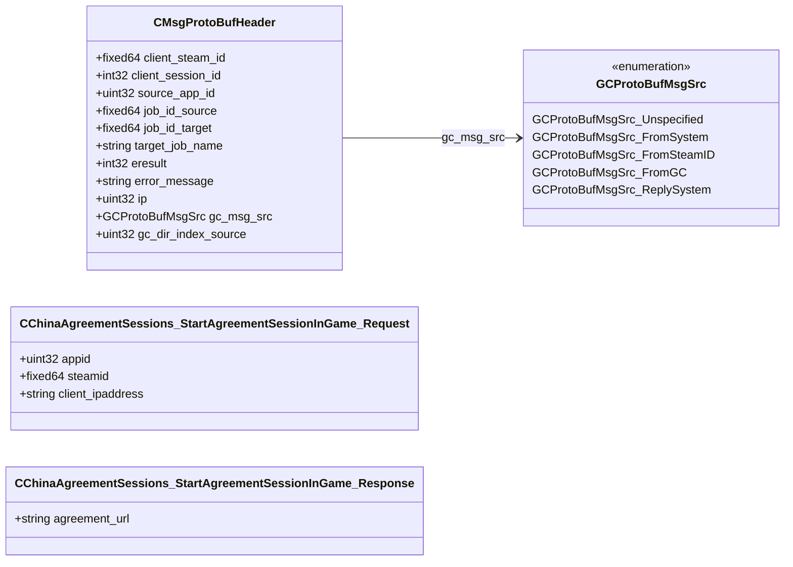

# `steammessages.proto`

**Imports:** `google/protobuf/descriptor.proto`

## Diagram

## Enums

### `GCProtoBufMsgSrc`

| Name | Value |
|------|-------|
| `GCProtoBufMsgSrc_Unspecified` | 0 |
| `GCProtoBufMsgSrc_FromSystem` | 1 |
| `GCProtoBufMsgSrc_FromSteamID` | 2 |
| `GCProtoBufMsgSrc_FromGC` | 3 |
| `GCProtoBufMsgSrc_ReplySystem` | 4 |

## Messages

### `CMsgProtoBufHeader`

| Field | Ordinal | Type | Label | Description |
|-------|---------|------|-------|-------------|
| `client_steam_id` | 1 | fixed64 | optional |  |
| `client_session_id` | 2 | int32 | optional |  |
| `source_app_id` | 3 | uint32 | optional |  |
| `job_id_source` | 10 | fixed64 | optional | *(default: `18446744073709551615`)* |
| `job_id_target` | 11 | fixed64 | optional | *(default: `18446744073709551615`)* |
| `target_job_name` | 12 | string | optional |  |
| `eresult` | 13 | int32 | optional | *(default: `2`)* |
| `error_message` | 14 | string | optional |  |
| `ip` | 15 | uint32 | optional |  |
| `gc_msg_src` | 200 | [GCProtoBufMsgSrc](#gcprotobufmsgsrc) | optional | *(default: `GCProtoBufMsgSrc_Unspecified`)* |
| `gc_dir_index_source` | 201 | uint32 | optional |  |

### `CChinaAgreementSessions_StartAgreementSessionInGame_Request`

| Field | Ordinal | Type | Label | Description |
|-------|---------|------|-------|-------------|
| `appid` | 1 | uint32 | optional |  |
| `steamid` | 2 | fixed64 | optional |  |
| `client_ipaddress` | 3 | string | optional |  |

### `CChinaAgreementSessions_StartAgreementSessionInGame_Response`

| Field | Ordinal | Type | Label | Description |
|-------|---------|------|-------|-------------|
| `agreement_url` | 1 | string | optional |  |
