# `steammessages_base.proto`

**Imports:** `google/protobuf/descriptor.proto`

## Diagram

```mermaid
classDiagram
direction LR

  class CMsgIPAddress {
    +fixed32 v4
    +bytes v6
  }

  class CMsgIPAddressBucket {
    +CMsgIPAddress original_ip_address
    +fixed64 bucket
  }

  class CMsgGCRoutingProtoBufHeader {
    +uint64 dst_gcid_queue
    +uint32 dst_gc_dir_index
  }

  class CMsgProtoBufHeader {
    +fixed64 steamid
    +int32 client_sessionid
    +uint32 routing_appid
    +fixed64 jobid_source
    +fixed64 jobid_target
    +string target_job_name
    +int32 seq_num
    +int32 eresult
    +string error_message
    +uint32 auth_account_flags
    +uint32 token_source
    +bool admin_spoofing_user
    +int32 transport_error
    +uint64 messageid
    +uint32 publisher_group_id
    +uint32 sysid
    +uint64 trace_tag
    +uint32 webapi_key_id
    +bool is_from_external_source
    +List~uint32~ forward_to_sysid
    +uint32 cm_sysid
    +uint32 launcher_type
    +uint32 realm
    +int32 timeout_ms
    +string debug_source
    +uint32 debug_source_string_index
    +uint64 token_id
    +CMsgGCRoutingProtoBufHeader routing_gc
    +CMsgProtoBufHeader.ESessionDisposition session_disposition
    +string wg_token
    +string webui_auth_key
    +uint32 ip
    +bytes ip_v6
  }

  class CMsgMulti {
    +uint32 size_unzipped
    +bytes message_body
  }

  class CMsgProtobufWrapped {
    +bytes message_body
  }

  class CMsgAuthTicket {
    +uint32 estate
    +uint32 eresult
    +fixed64 steamid
    +fixed64 gameid
    +uint32 h_steam_pipe
    +uint32 ticket_crc
    +bytes ticket
    +bytes server_secret
    +uint32 ticket_type
  }

  class CCDDBAppDetailCommon {
    +uint32 appid
    +string name
    +string icon
    +bool tool
    +bool demo
    +bool media
    +bool community_visible_stats
    +string friendly_name
    +string propagation
    +bool has_adult_content
    +bool is_visible_in_steam_china
    +uint32 app_type
    +bool has_adult_content_sex
    +bool has_adult_content_violence
    +List~uint32~ content_descriptorids
  }

  class CMsgAppRights {
    +bool edit_info
    +bool publish
    +bool view_error_data
    +bool download
    +bool upload_cdkeys
    +bool generate_cdkeys
    +bool view_financials
    +bool manage_ceg
    +bool manage_signing
    +bool manage_cdkeys
    +bool edit_marketing
    +bool economy_support
    +bool economy_support_supervisor
    +bool manage_pricing
    +bool broadcast_live
    +bool view_marketing_traffic
    +bool edit_store_display_content
  }

  class CCuratorPreferences {
    +uint32 supported_languages
    +bool platform_windows
    +bool platform_mac
    +bool platform_linux
    +bool vr_content
    +bool adult_content_violence
    +bool adult_content_sex
    +uint32 timestamp_updated
    +List~uint32~ tagids_curated
    +List~uint32~ tagids_filtered
    +string website_title
    +string website_url
    +string discussion_url
    +bool show_broadcast
  }

  class CLocalizationToken {
    +uint32 language
    +string localized_string
  }

  class CClanEventUserNewsTuple {
    +uint32 clanid
    +fixed64 event_gid
    +fixed64 announcement_gid
    +uint32 rtime_start
    +uint32 rtime_end
    +uint32 priority_score
    +uint32 type
    +uint32 clamp_range_slot
    +uint32 appid
    +uint32 rtime32_last_modified
  }

  class CClanMatchEventByRange {
    +uint32 rtime_before
    +uint32 rtime_after
    +uint32 qualified
    +List~CClanEventUserNewsTuple~ events
  }

  class CCommunity_ClanAnnouncementInfo {
    +uint64 gid
    +uint64 clanid
    +uint64 posterid
    +string headline
    +uint32 posttime
    +uint32 updatetime
    +string body
    +int32 commentcount
    +List~string~ tags
    +int32 language
    +bool hidden
    +fixed64 forum_topic_id
    +fixed64 event_gid
    +int32 voteupcount
    +int32 votedowncount
    +EBanContentCheckResult ban_check_result
    +bool banned
  }

  class CClanEventData {
    +fixed64 gid
    +fixed64 clan_steamid
    +string event_name
    +EProtoClanEventType event_type
    +uint32 appid
    +string server_address
    +string server_password
    +uint32 rtime32_start_time
    +uint32 rtime32_end_time
    +int32 comment_count
    +fixed64 creator_steamid
    +fixed64 last_update_steamid
    +string event_notes
    +string jsondata
    +CCommunity_ClanAnnouncementInfo announcement_body
    +bool published
    +bool hidden
    +uint32 rtime32_visibility_start
    +uint32 rtime32_visibility_end
    +uint32 broadcaster_accountid
    +uint32 follower_count
    +uint32 ignore_count
    +fixed64 forum_topic_id
    +uint32 rtime32_last_modified
    +fixed64 news_post_gid
    +uint32 rtime_mod_reviewed
    +uint32 featured_app_tagid
    +List~uint32~ referenced_appids
    +uint32 build_id
    +string build_branch
  }

  class CBilling_Address {
    +string first_name
    +string last_name
    +string address1
    +string address2
    +string city
    +string us_state
    +string country_code
    +string postcode
    +int32 zip_plus4
    +string phone
  }

  class CPackageReservationStatus {
    +uint32 packageid
    +int32 reservation_state
    +int32 queue_position
    +int32 total_queue_size
    +string reservation_country_code
    +bool expired
    +uint32 time_expires
    +uint32 time_reserved
  }

  class CMsgKeyValuePair {
    +string name
    +string value
  }

  class CMsgKeyValueSet {
    +List~CMsgKeyValuePair~ pairs
  }

  class UserContentDescriptorPreferences {
    +List~UserContentDescriptorPreferences.ContentDescriptor~ content_descriptors_to_exclude
  }

  class ContentDescriptor {
    +uint32 content_descriptorid
    +uint32 timestamp_added
  }

  CMsgIPAddressBucket --> CMsgIPAddress : original_ip_address
  CMsgProtoBufHeader --> CMsgGCRoutingProtoBufHeader : routing_gc
  CClanMatchEventByRange --> CClanEventUserNewsTuple : events[]
  CCommunity_ClanAnnouncementInfo --> EBanContentCheckResult : ban_check_result
  CClanEventData --> EProtoClanEventType : event_type
  CClanEventData --> CCommunity_ClanAnnouncementInfo : announcement_body
  CMsgKeyValueSet --> CMsgKeyValuePair : pairs[]
  UserContentDescriptorPreferences --> ContentDescriptor : content_descriptors_to_exclude[]

  class EBanContentCheckResult{
    <<enumeration>>
    k_EBanContentCheckResult_NotScanned
    k_EBanContentCheckResult_Reset
    k_EBanContentCheckResult_NeedsChecking
    k_EBanContentCheckResult_VeryUnlikely
    k_EBanContentCheckResult_Unlikely
    k_EBanContentCheckResult_Possible
    k_EBanContentCheckResult_Likely
    k_EBanContentCheckResult_VeryLikely
  }

  class EProtoClanEventType{
    <<enumeration>>
    k_EClanOtherEvent
    k_EClanGameEvent
    k_EClanPartyEvent
    k_EClanMeetingEvent
    k_EClanSpecialCauseEvent
    k_EClanMusicAndArtsEvent
    k_EClanSportsEvent
    k_EClanTripEvent
    k_EClanChatEvent
    k_EClanGameReleaseEvent
    k_EClanBroadcastEvent
    k_EClanSmallUpdateEvent
    k_EClanPreAnnounceMajorUpdateEvent
    k_EClanMajorUpdateEvent
    k_EClanDLCReleaseEvent
    k_EClanFutureReleaseEvent
    k_EClanESportTournamentStreamEvent
    k_EClanDevStreamEvent
    k_EClanFamousStreamEvent
    k_EClanGameSalesEvent
    k_EClanGameItemSalesEvent
    k_EClanInGameBonusXPEvent
    k_EClanInGameLootEvent
    k_EClanInGamePerksEvent
    k_EClanInGameChallengeEvent
    k_EClanInGameContestEvent
    k_EClanIRLEvent
    k_EClanNewsEvent
    k_EClanBetaReleaseEvent
    k_EClanInGameContentReleaseEvent
    k_EClanFreeTrial
    k_EClanSeasonRelease
    k_EClanSeasonUpdate
    k_EClanCrosspostEvent
    k_EClanInGameEventGeneral
  }

  class PartnerEventNotificationType{
    <<enumeration>>
    k_EEventStart
    k_EEventBroadcastStart
    k_EEventMatchStart
    k_EEventPartnerMaxType
  }

```

## Enums

### `EBanContentCheckResult`

| Name | Value |
|------|-------|
| `k_EBanContentCheckResult_NotScanned` | 0 |
| `k_EBanContentCheckResult_Reset` | 1 |
| `k_EBanContentCheckResult_NeedsChecking` | 2 |
| `k_EBanContentCheckResult_VeryUnlikely` | 5 |
| `k_EBanContentCheckResult_Unlikely` | 30 |
| `k_EBanContentCheckResult_Possible` | 50 |
| `k_EBanContentCheckResult_Likely` | 75 |
| `k_EBanContentCheckResult_VeryLikely` | 100 |

### `EProtoClanEventType`

| Name | Value |
|------|-------|
| `k_EClanOtherEvent` | 1 |
| `k_EClanGameEvent` | 2 |
| `k_EClanPartyEvent` | 3 |
| `k_EClanMeetingEvent` | 4 |
| `k_EClanSpecialCauseEvent` | 5 |
| `k_EClanMusicAndArtsEvent` | 6 |
| `k_EClanSportsEvent` | 7 |
| `k_EClanTripEvent` | 8 |
| `k_EClanChatEvent` | 9 |
| `k_EClanGameReleaseEvent` | 10 |
| `k_EClanBroadcastEvent` | 11 |
| `k_EClanSmallUpdateEvent` | 12 |
| `k_EClanPreAnnounceMajorUpdateEvent` | 13 |
| `k_EClanMajorUpdateEvent` | 14 |
| `k_EClanDLCReleaseEvent` | 15 |
| `k_EClanFutureReleaseEvent` | 16 |
| `k_EClanESportTournamentStreamEvent` | 17 |
| `k_EClanDevStreamEvent` | 18 |
| `k_EClanFamousStreamEvent` | 19 |
| `k_EClanGameSalesEvent` | 20 |
| `k_EClanGameItemSalesEvent` | 21 |
| `k_EClanInGameBonusXPEvent` | 22 |
| `k_EClanInGameLootEvent` | 23 |
| `k_EClanInGamePerksEvent` | 24 |
| `k_EClanInGameChallengeEvent` | 25 |
| `k_EClanInGameContestEvent` | 26 |
| `k_EClanIRLEvent` | 27 |
| `k_EClanNewsEvent` | 28 |
| `k_EClanBetaReleaseEvent` | 29 |
| `k_EClanInGameContentReleaseEvent` | 30 |
| `k_EClanFreeTrial` | 31 |
| `k_EClanSeasonRelease` | 32 |
| `k_EClanSeasonUpdate` | 33 |
| `k_EClanCrosspostEvent` | 34 |
| `k_EClanInGameEventGeneral` | 35 |

### `PartnerEventNotificationType`

| Name | Value |
|------|-------|
| `k_EEventStart` | 0 |
| `k_EEventBroadcastStart` | 1 |
| `k_EEventMatchStart` | 2 |
| `k_EEventPartnerMaxType` | 3 |

## Messages

### `CMsgIPAddress`

| Field | Ordinal | Type | Label | Description |
|-------|---------|------|-------|-------------|
| `v4` | 1 | fixed32 | optional |  |
| `v6` | 2 | bytes | optional |  |

### `CMsgIPAddressBucket`

| Field | Ordinal | Type | Label | Description |
|-------|---------|------|-------|-------------|
| `original_ip_address` | 1 | [CMsgIPAddress](#cmsgipaddress) | optional |  |
| `bucket` | 2 | fixed64 | optional |  |

### `CMsgGCRoutingProtoBufHeader`

| Field | Ordinal | Type | Label | Description |
|-------|---------|------|-------|-------------|
| `dst_gcid_queue` | 1 | uint64 | optional |  |
| `dst_gc_dir_index` | 2 | uint32 | optional |  |

### `CMsgProtoBufHeader`

| Field | Ordinal | Type | Label | Description |
|-------|---------|------|-------|-------------|
| `steamid` | 1 | fixed64 | optional |  |
| `client_sessionid` | 2 | int32 | optional |  |
| `routing_appid` | 3 | uint32 | optional |  |
| `jobid_source` | 10 | fixed64 | optional | *(default: `18446744073709551615`)* |
| `jobid_target` | 11 | fixed64 | optional | *(default: `18446744073709551615`)* |
| `target_job_name` | 12 | string | optional |  |
| `eresult` | 13 | int32 | optional | *(default: `2`)* |
| `error_message` | 14 | string | optional |  |
| `ip` | 15 | uint32 | optional |  |
| `auth_account_flags` | 16 | uint32 | optional |  |
| `transport_error` | 17 | int32 | optional | *(default: `1`)* |
| `messageid` | 18 | uint64 | optional | *(default: `18446744073709551615`)* |
| `publisher_group_id` | 19 | uint32 | optional |  |
| `sysid` | 20 | uint32 | optional |  |
| `trace_tag` | 21 | uint64 | optional |  |
| `token_source` | 22 | uint32 | optional |  |
| `admin_spoofing_user` | 23 | bool | optional |  |
| `seq_num` | 24 | int32 | optional |  |
| `webapi_key_id` | 25 | uint32 | optional |  |
| `is_from_external_source` | 26 | bool | optional |  |
| `forward_to_sysid` | 27 | uint32 | repeated |  |
| `cm_sysid` | 28 | uint32 | optional |  |
| `ip_v6` | 29 | bytes | optional |  |
| `launcher_type` | 31 | uint32 | optional | *(default: `0`)* |
| `realm` | 32 | uint32 | optional | *(default: `0`)* |
| `timeout_ms` | 33 | int32 | optional | *(default: `-1`)* |
| `debug_source` | 34 | string | optional |  |
| `debug_source_string_index` | 35 | uint32 | optional |  |
| `token_id` | 36 | uint64 | optional |  |
| `routing_gc` | 37 | [CMsgGCRoutingProtoBufHeader](#cmsggcroutingprotobufheader) | optional |  |
| `session_disposition` | 38 | CMsgProtoBufHeader.ESessionDisposition | optional | *(default: `k_ESessionDispositionNormal`)* |
| `wg_token` | 39 | string | optional |  |
| `webui_auth_key` | 40 | string | optional |  |

### `CMsgMulti`

| Field | Ordinal | Type | Label | Description |
|-------|---------|------|-------|-------------|
| `size_unzipped` | 1 | uint32 | optional |  |
| `message_body` | 2 | bytes | optional |  |

### `CMsgProtobufWrapped`

| Field | Ordinal | Type | Label | Description |
|-------|---------|------|-------|-------------|
| `message_body` | 1 | bytes | optional |  |

### `CMsgAuthTicket`

| Field | Ordinal | Type | Label | Description |
|-------|---------|------|-------|-------------|
| `estate` | 1 | uint32 | optional |  |
| `eresult` | 2 | uint32 | optional | *(default: `2`)* |
| `steamid` | 3 | fixed64 | optional |  |
| `gameid` | 4 | fixed64 | optional |  |
| `h_steam_pipe` | 5 | uint32 | optional |  |
| `ticket_crc` | 6 | uint32 | optional |  |
| `ticket` | 7 | bytes | optional |  |
| `server_secret` | 8 | bytes | optional |  |
| `ticket_type` | 9 | uint32 | optional |  |

### `CCDDBAppDetailCommon`

| Field | Ordinal | Type | Label | Description |
|-------|---------|------|-------|-------------|
| `appid` | 1 | uint32 | optional |  |
| `name` | 2 | string | optional |  |
| `icon` | 3 | string | optional |  |
| `tool` | 6 | bool | optional |  |
| `demo` | 7 | bool | optional |  |
| `media` | 8 | bool | optional |  |
| `community_visible_stats` | 9 | bool | optional |  |
| `friendly_name` | 10 | string | optional |  |
| `propagation` | 11 | string | optional |  |
| `has_adult_content` | 12 | bool | optional |  |
| `is_visible_in_steam_china` | 13 | bool | optional |  |
| `app_type` | 14 | uint32 | optional |  |
| `has_adult_content_sex` | 15 | bool | optional |  |
| `has_adult_content_violence` | 16 | bool | optional |  |
| `content_descriptorids` | 17 | uint32 | repeated |  |

### `CMsgAppRights`

| Field | Ordinal | Type | Label | Description |
|-------|---------|------|-------|-------------|
| `edit_info` | 1 | bool | optional |  |
| `publish` | 2 | bool | optional |  |
| `view_error_data` | 3 | bool | optional |  |
| `download` | 4 | bool | optional |  |
| `upload_cdkeys` | 5 | bool | optional |  |
| `generate_cdkeys` | 6 | bool | optional |  |
| `view_financials` | 7 | bool | optional |  |
| `manage_ceg` | 8 | bool | optional |  |
| `manage_signing` | 9 | bool | optional |  |
| `manage_cdkeys` | 10 | bool | optional |  |
| `edit_marketing` | 11 | bool | optional |  |
| `economy_support` | 12 | bool | optional |  |
| `economy_support_supervisor` | 13 | bool | optional |  |
| `manage_pricing` | 14 | bool | optional |  |
| `broadcast_live` | 15 | bool | optional |  |
| `view_marketing_traffic` | 16 | bool | optional |  |
| `edit_store_display_content` | 17 | bool | optional |  |

### `CCuratorPreferences`

| Field | Ordinal | Type | Label | Description |
|-------|---------|------|-------|-------------|
| `supported_languages` | 1 | uint32 | optional |  |
| `platform_windows` | 2 | bool | optional |  |
| `platform_mac` | 3 | bool | optional |  |
| `platform_linux` | 4 | bool | optional |  |
| `vr_content` | 5 | bool | optional |  |
| `adult_content_violence` | 6 | bool | optional |  |
| `adult_content_sex` | 7 | bool | optional |  |
| `timestamp_updated` | 8 | uint32 | optional |  |
| `tagids_curated` | 9 | uint32 | repeated |  |
| `tagids_filtered` | 10 | uint32 | repeated |  |
| `website_title` | 11 | string | optional |  |
| `website_url` | 12 | string | optional |  |
| `discussion_url` | 13 | string | optional |  |
| `show_broadcast` | 14 | bool | optional |  |

### `CLocalizationToken`

| Field | Ordinal | Type | Label | Description |
|-------|---------|------|-------|-------------|
| `language` | 1 | uint32 | optional |  |
| `localized_string` | 2 | string | optional |  |

### `CClanEventUserNewsTuple`

| Field | Ordinal | Type | Label | Description |
|-------|---------|------|-------|-------------|
| `clanid` | 1 | uint32 | optional |  |
| `event_gid` | 2 | fixed64 | optional |  |
| `announcement_gid` | 3 | fixed64 | optional |  |
| `rtime_start` | 4 | uint32 | optional |  |
| `rtime_end` | 5 | uint32 | optional |  |
| `priority_score` | 6 | uint32 | optional |  |
| `type` | 7 | uint32 | optional |  |
| `clamp_range_slot` | 8 | uint32 | optional |  |
| `appid` | 9 | uint32 | optional |  |
| `rtime32_last_modified` | 10 | uint32 | optional |  |

### `CClanMatchEventByRange`

| Field | Ordinal | Type | Label | Description |
|-------|---------|------|-------|-------------|
| `rtime_before` | 1 | uint32 | optional |  |
| `rtime_after` | 2 | uint32 | optional |  |
| `qualified` | 3 | uint32 | optional |  |
| `events` | 4 | [CClanEventUserNewsTuple](#cclaneventusernewstuple) | repeated |  |

### `CCommunity_ClanAnnouncementInfo`

| Field | Ordinal | Type | Label | Description |
|-------|---------|------|-------|-------------|
| `gid` | 1 | uint64 | optional |  |
| `clanid` | 2 | uint64 | optional |  |
| `posterid` | 3 | uint64 | optional |  |
| `headline` | 4 | string | optional |  |
| `posttime` | 5 | uint32 | optional |  |
| `updatetime` | 6 | uint32 | optional |  |
| `body` | 7 | string | optional |  |
| `commentcount` | 8 | int32 | optional |  |
| `tags` | 9 | string | repeated |  |
| `language` | 10 | int32 | optional |  |
| `hidden` | 11 | bool | optional |  |
| `forum_topic_id` | 12 | fixed64 | optional |  |
| `event_gid` | 13 | fixed64 | optional |  |
| `voteupcount` | 14 | int32 | optional |  |
| `votedowncount` | 15 | int32 | optional |  |
| `ban_check_result` | 16 | [EBanContentCheckResult](#ebancontentcheckresult) | optional | *(default: `k_EBanContentCheckResult_NotScanned`)* |
| `banned` | 17 | bool | optional |  |

### `CClanEventData`

| Field | Ordinal | Type | Label | Description |
|-------|---------|------|-------|-------------|
| `gid` | 1 | fixed64 | optional |  |
| `clan_steamid` | 2 | fixed64 | optional |  |
| `event_name` | 3 | string | optional |  |
| `event_type` | 4 | [EProtoClanEventType](#eprotoclaneventtype) | optional | *(default: `k_EClanOtherEvent`)* |
| `appid` | 5 | uint32 | optional |  |
| `server_address` | 6 | string | optional |  |
| `server_password` | 7 | string | optional |  |
| `rtime32_start_time` | 8 | uint32 | optional |  |
| `rtime32_end_time` | 9 | uint32 | optional |  |
| `comment_count` | 10 | int32 | optional |  |
| `creator_steamid` | 11 | fixed64 | optional |  |
| `last_update_steamid` | 12 | fixed64 | optional |  |
| `event_notes` | 13 | string | optional |  |
| `jsondata` | 14 | string | optional |  |
| `announcement_body` | 15 | [CCommunity_ClanAnnouncementInfo](#ccommunity_clanannouncementinfo) | optional |  |
| `published` | 16 | bool | optional |  |
| `hidden` | 17 | bool | optional |  |
| `rtime32_visibility_start` | 18 | uint32 | optional |  |
| `rtime32_visibility_end` | 19 | uint32 | optional |  |
| `broadcaster_accountid` | 20 | uint32 | optional |  |
| `follower_count` | 21 | uint32 | optional |  |
| `ignore_count` | 22 | uint32 | optional |  |
| `forum_topic_id` | 23 | fixed64 | optional |  |
| `rtime32_last_modified` | 24 | uint32 | optional |  |
| `news_post_gid` | 25 | fixed64 | optional |  |
| `rtime_mod_reviewed` | 26 | uint32 | optional |  |
| `featured_app_tagid` | 27 | uint32 | optional |  |
| `referenced_appids` | 28 | uint32 | repeated |  |
| `build_id` | 29 | uint32 | optional |  |
| `build_branch` | 30 | string | optional |  |

### `CBilling_Address`

| Field | Ordinal | Type | Label | Description |
|-------|---------|------|-------|-------------|
| `first_name` | 1 | string | optional |  |
| `last_name` | 2 | string | optional |  |
| `address1` | 3 | string | optional |  |
| `address2` | 4 | string | optional |  |
| `city` | 5 | string | optional |  |
| `us_state` | 6 | string | optional |  |
| `country_code` | 7 | string | optional |  |
| `postcode` | 8 | string | optional |  |
| `zip_plus4` | 9 | int32 | optional |  |
| `phone` | 10 | string | optional |  |

### `CPackageReservationStatus`

| Field | Ordinal | Type | Label | Description |
|-------|---------|------|-------|-------------|
| `packageid` | 1 | uint32 | optional |  |
| `reservation_state` | 2 | int32 | optional |  |
| `queue_position` | 3 | int32 | optional |  |
| `total_queue_size` | 4 | int32 | optional |  |
| `reservation_country_code` | 5 | string | optional |  |
| `expired` | 6 | bool | optional |  |
| `time_expires` | 7 | uint32 | optional |  |
| `time_reserved` | 8 | uint32 | optional |  |

### `CMsgKeyValuePair`

| Field | Ordinal | Type | Label | Description |
|-------|---------|------|-------|-------------|
| `name` | 1 | string | optional |  |
| `value` | 2 | string | optional |  |

### `CMsgKeyValueSet`

| Field | Ordinal | Type | Label | Description |
|-------|---------|------|-------|-------------|
| `pairs` | 1 | [CMsgKeyValuePair](#cmsgkeyvaluepair) | repeated |  |

### `UserContentDescriptorPreferences`

| Field | Ordinal | Type | Label | Description |
|-------|---------|------|-------|-------------|
| `content_descriptors_to_exclude` | 1 | UserContentDescriptorPreferences.ContentDescriptor | repeated |  |
