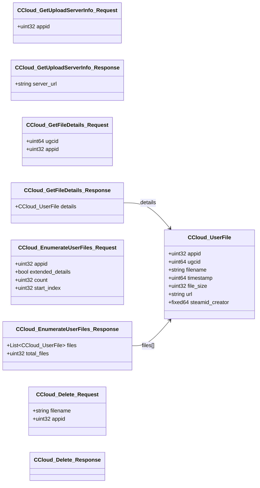

# `steammessages_cloud.steamworkssdk.proto`

**Imports:** `steammessages_unified_base.steamworkssdk.proto`

## Diagram

## Messages

### `CCloud_GetUploadServerInfo_Request`

| Field | Ordinal | Type | Label | Description |
|-------|---------|------|-------|-------------|
| `appid` | 1 | uint32 | optional |  |

### `CCloud_GetUploadServerInfo_Response`

| Field | Ordinal | Type | Label | Description |
|-------|---------|------|-------|-------------|
| `server_url` | 1 | string | optional |  |

### `CCloud_GetFileDetails_Request`

| Field | Ordinal | Type | Label | Description |
|-------|---------|------|-------|-------------|
| `ugcid` | 1 | uint64 | optional |  |
| `appid` | 2 | uint32 | optional |  |

### `CCloud_UserFile`

| Field | Ordinal | Type | Label | Description |
|-------|---------|------|-------|-------------|
| `appid` | 1 | uint32 | optional |  |
| `ugcid` | 2 | uint64 | optional |  |
| `filename` | 3 | string | optional |  |
| `timestamp` | 4 | uint64 | optional |  |
| `file_size` | 5 | uint32 | optional |  |
| `url` | 6 | string | optional |  |
| `steamid_creator` | 7 | fixed64 | optional |  |

### `CCloud_GetFileDetails_Response`

| Field | Ordinal | Type | Label | Description |
|-------|---------|------|-------|-------------|
| `details` | 1 | [CCloud_UserFile](#ccloud_userfile) | optional |  |

### `CCloud_EnumerateUserFiles_Request`

| Field | Ordinal | Type | Label | Description |
|-------|---------|------|-------|-------------|
| `appid` | 1 | uint32 | optional |  |
| `extended_details` | 2 | bool | optional |  |
| `count` | 3 | uint32 | optional |  |
| `start_index` | 4 | uint32 | optional |  |

### `CCloud_EnumerateUserFiles_Response`

| Field | Ordinal | Type | Label | Description |
|-------|---------|------|-------|-------------|
| `files` | 1 | [CCloud_UserFile](#ccloud_userfile) | repeated |  |
| `total_files` | 2 | uint32 | optional |  |

### `CCloud_Delete_Request`

| Field | Ordinal | Type | Label | Description |
|-------|---------|------|-------|-------------|
| `filename` | 1 | string | optional |  |
| `appid` | 2 | uint32 | optional |  |

### `CCloud_Delete_Response`
