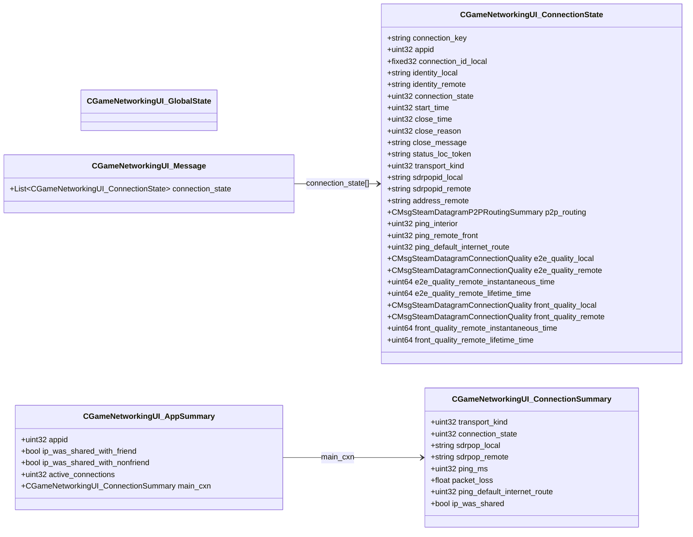

# `steammessages_gamenetworkingui.proto`

**Imports:** `steamnetworkingsockets_messages.proto`, `steamdatagram_messages_sdr.proto`

## Diagram

## Messages

### `CGameNetworkingUI_GlobalState`

### `CGameNetworkingUI_ConnectionState`

| Field | Ordinal | Type | Label | Description |
|-------|---------|------|-------|-------------|
| `connection_key` | 1 | string | optional |  |
| `appid` | 2 | uint32 | optional |  |
| `connection_id_local` | 3 | fixed32 | optional |  |
| `identity_local` | 4 | string | optional |  |
| `identity_remote` | 5 | string | optional |  |
| `connection_state` | 10 | uint32 | optional |  |
| `start_time` | 12 | uint32 | optional |  |
| `close_time` | 13 | uint32 | optional |  |
| `close_reason` | 14 | uint32 | optional |  |
| `close_message` | 15 | string | optional |  |
| `status_loc_token` | 16 | string | optional |  |
| `transport_kind` | 20 | uint32 | optional |  |
| `sdrpopid_local` | 21 | string | optional |  |
| `sdrpopid_remote` | 22 | string | optional |  |
| `address_remote` | 23 | string | optional |  |
| `p2p_routing` | 24 | CMsgSteamDatagramP2PRoutingSummary | optional |  |
| `ping_interior` | 25 | uint32 | optional |  |
| `ping_remote_front` | 26 | uint32 | optional |  |
| `ping_default_internet_route` | 27 | uint32 | optional |  |
| `e2e_quality_local` | 30 | CMsgSteamDatagramConnectionQuality | optional |  |
| `e2e_quality_remote` | 31 | CMsgSteamDatagramConnectionQuality | optional |  |
| `e2e_quality_remote_instantaneous_time` | 32 | uint64 | optional |  |
| `e2e_quality_remote_lifetime_time` | 33 | uint64 | optional |  |
| `front_quality_local` | 40 | CMsgSteamDatagramConnectionQuality | optional |  |
| `front_quality_remote` | 41 | CMsgSteamDatagramConnectionQuality | optional |  |
| `front_quality_remote_instantaneous_time` | 42 | uint64 | optional |  |
| `front_quality_remote_lifetime_time` | 43 | uint64 | optional |  |

### `CGameNetworkingUI_Message`

| Field | Ordinal | Type | Label | Description |
|-------|---------|------|-------|-------------|
| `connection_state` | 1 | [CGameNetworkingUI_ConnectionState](#cgamenetworkingui_connectionstate) | repeated |  |

### `CGameNetworkingUI_ConnectionSummary`

| Field | Ordinal | Type | Label | Description |
|-------|---------|------|-------|-------------|
| `transport_kind` | 1 | uint32 | optional |  |
| `sdrpop_local` | 2 | string | optional |  |
| `sdrpop_remote` | 3 | string | optional |  |
| `ping_ms` | 4 | uint32 | optional |  |
| `packet_loss` | 5 | float | optional |  |
| `ping_default_internet_route` | 6 | uint32 | optional |  |
| `ip_was_shared` | 7 | bool | optional |  |
| `connection_state` | 8 | uint32 | optional |  |

### `CGameNetworkingUI_AppSummary`

| Field | Ordinal | Type | Label | Description |
|-------|---------|------|-------|-------------|
| `appid` | 1 | uint32 | optional |  |
| `ip_was_shared_with_friend` | 10 | bool | optional |  |
| `ip_was_shared_with_nonfriend` | 11 | bool | optional |  |
| `active_connections` | 20 | uint32 | optional |  |
| `main_cxn` | 30 | [CGameNetworkingUI_ConnectionSummary](#cgamenetworkingui_connectionsummary) | optional |  |
