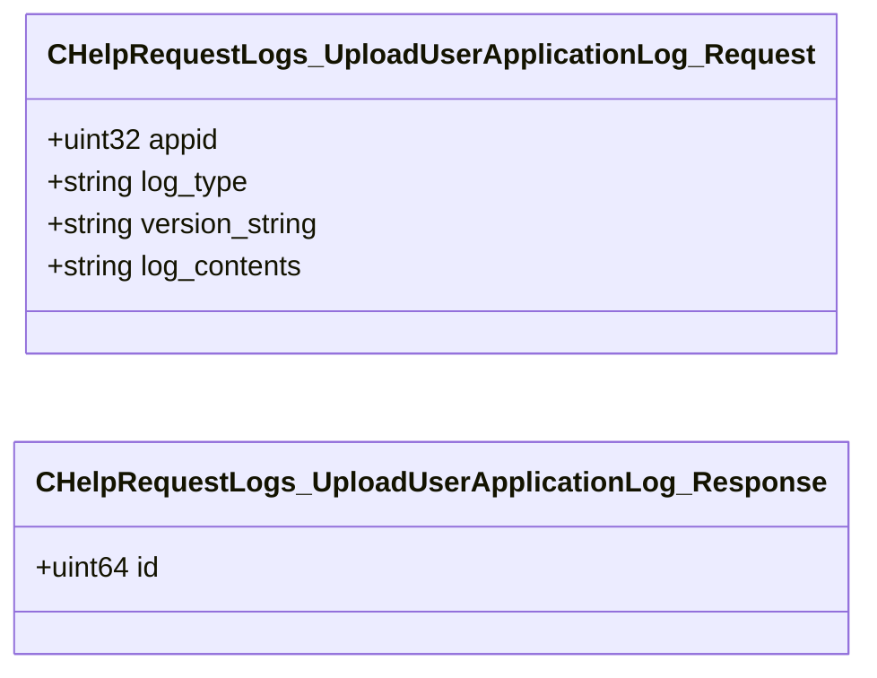

# `steammessages_helprequest.steamworkssdk.proto`

**Imports:** `steammessages_unified_base.steamworkssdk.proto`

## Diagram

## Messages

### `CHelpRequestLogs_UploadUserApplicationLog_Request`

| Field | Ordinal | Type | Label | Description |
|-------|---------|------|-------|-------------|
| `appid` | 1 | uint32 | optional |  |
| `log_type` | 2 | string | optional |  |
| `version_string` | 3 | string | optional |  |
| `log_contents` | 4 | string | optional |  |

### `CHelpRequestLogs_UploadUserApplicationLog_Response`

| Field | Ordinal | Type | Label | Description |
|-------|---------|------|-------|-------------|
| `id` | 1 | uint64 | optional |  |
