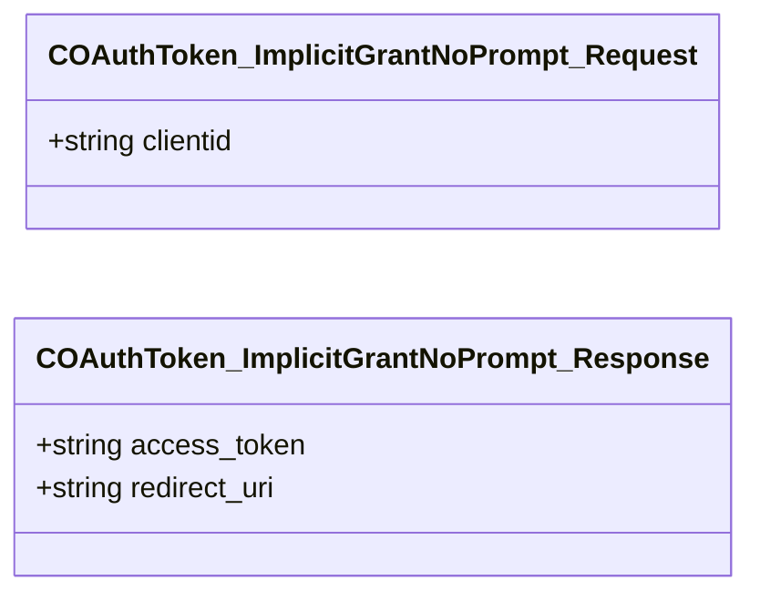

# `steammessages_oauth.steamworkssdk.proto`

**Imports:** `steammessages_unified_base.steamworkssdk.proto`

## Diagram

## Messages

### `COAuthToken_ImplicitGrantNoPrompt_Request`

| Field | Ordinal | Type | Label | Description |
|-------|---------|------|-------|-------------|
| `clientid` | 1 | string | optional |  |

### `COAuthToken_ImplicitGrantNoPrompt_Response`

| Field | Ordinal | Type | Label | Description |
|-------|---------|------|-------|-------------|
| `access_token` | 1 | string | optional |  |
| `redirect_uri` | 2 | string | optional |  |
