# `steammessages_player.steamworkssdk.proto`

**Imports:** `steammessages_unified_base.steamworkssdk.proto`

## Diagram

```mermaid
classDiagram
direction LR

  class CPlayer_GetMutualFriendsForIncomingInvites_Request {
  }

  class CPlayer_IncomingInviteMutualFriendList {
    +fixed64 steamid
    +List~uint32~ mutual_friend_account_ids
  }

  class CPlayer_GetMutualFriendsForIncomingInvites_Response {
    +List~CPlayer_IncomingInviteMutualFriendList~ incoming_invite_mutual_friends_lists
  }

  class CPlayer_GetFriendsGameplayInfo_Request {
    +uint32 appid
  }

  class CPlayer_GetFriendsGameplayInfo_Response {
    +CPlayer_GetFriendsGameplayInfo_Response.OwnGameplayInfo your_info
    +List~CPlayer_GetFriendsGameplayInfo_Response.FriendsGameplayInfo~ in_game
    +List~CPlayer_GetFriendsGameplayInfo_Response.FriendsGameplayInfo~ played_recently
    +List~CPlayer_GetFriendsGameplayInfo_Response.FriendsGameplayInfo~ played_ever
    +List~CPlayer_GetFriendsGameplayInfo_Response.FriendsGameplayInfo~ owns
    +List~CPlayer_GetFriendsGameplayInfo_Response.FriendsGameplayInfo~ in_wishlist
  }

  class FriendsGameplayInfo {
    +fixed64 steamid
    +uint32 minutes_played
    +uint32 minutes_played_forever
  }

  class OwnGameplayInfo {
    +fixed64 steamid
    +uint32 minutes_played
    +uint32 minutes_played_forever
    +bool in_wishlist
    +bool owned
  }

  class CPlayer_GetGameBadgeLevels_Request {
    +uint32 appid
  }

  class CPlayer_GetGameBadgeLevels_Response {
    +uint32 player_level
    +List~CPlayer_GetGameBadgeLevels_Response.Badge~ badges
  }

  class Badge {
    +int32 level
    +int32 series
    +uint32 border_color
  }

  class CPlayer_GetLastPlayedTimes_Request {
    +uint32 min_last_played
  }

  class CPlayer_GetLastPlayedTimes_Response {
    +List~CPlayer_GetLastPlayedTimes_Response.Game~ games
  }

  class Game {
    +int32 appid
    +uint32 last_playtime
    +int32 playtime_2weeks
    +int32 playtime_forever
    +uint32 first_playtime
  }

  class CPlayer_AcceptSSA_Request {
  }

  class CPlayer_AcceptSSA_Response {
  }

  class CPlayer_GetNicknameList_Request {
  }

  class CPlayer_GetNicknameList_Response {
    +List~CPlayer_GetNicknameList_Response.PlayerNickname~ nicknames
  }

  class PlayerNickname {
    +fixed32 accountid
    +string nickname
  }

  class CPlayer_GetPerFriendPreferences_Request {
  }

  class PerFriendPreferences {
    +fixed32 accountid
    +string nickname
    +ENotificationSetting notifications_showingame
    +ENotificationSetting notifications_showonline
    +ENotificationSetting notifications_showmessages
    +ENotificationSetting sounds_showingame
    +ENotificationSetting sounds_showonline
    +ENotificationSetting sounds_showmessages
    +ENotificationSetting notifications_sendmobile
  }

  class CPlayer_GetPerFriendPreferences_Response {
    +List~PerFriendPreferences~ preferences
  }

  class CPlayer_SetPerFriendPreferences_Request {
    +PerFriendPreferences preferences
  }

  class CPlayer_SetPerFriendPreferences_Response {
  }

  class CPlayer_AddFriend_Request {
    +fixed64 steamid
  }

  class CPlayer_AddFriend_Response {
    +bool invite_sent
    +uint32 friend_relationship
  }

  class CPlayer_RemoveFriend_Request {
    +fixed64 steamid
  }

  class CPlayer_RemoveFriend_Response {
    +uint32 friend_relationship
  }

  class CPlayer_IgnoreFriend_Request {
    +fixed64 steamid
    +bool unignore
  }

  class CPlayer_IgnoreFriend_Response {
    +uint32 friend_relationship
  }

  class CPlayer_GetCommunityPreferences_Request {
  }

  class CPlayer_CommunityPreferences {
    +bool hide_adult_content_violence
    +bool hide_adult_content_sex
    +bool parenthesize_nicknames
    +uint32 timestamp_updated
  }

  class CPlayer_GetCommunityPreferences_Response {
    +CPlayer_CommunityPreferences preferences
  }

  class CPlayer_SetCommunityPreferences_Request {
    +CPlayer_CommunityPreferences preferences
  }

  class CPlayer_SetCommunityPreferences_Response {
  }

  class CPlayer_GetNewSteamAnnouncementState_Request {
    +int32 language
  }

  class CPlayer_GetNewSteamAnnouncementState_Response {
    +int32 state
    +string announcement_headline
    +string announcement_url
    +uint32 time_posted
    +uint64 announcement_gid
  }

  class CPlayer_UpdateSteamAnnouncementLastRead_Request {
    +uint64 announcement_gid
    +uint32 time_posted
  }

  class CPlayer_UpdateSteamAnnouncementLastRead_Response {
  }

  CPlayer_GetMutualFriendsForIncomingInvites_Response --> CPlayer_IncomingInviteMutualFriendList : incoming_invite_mutual_friends_lists[]
  CPlayer_GetFriendsGameplayInfo_Response --> OwnGameplayInfo : your_info
  CPlayer_GetFriendsGameplayInfo_Response --> FriendsGameplayInfo : in_game[]
  CPlayer_GetGameBadgeLevels_Response --> Badge : badges[]
  CPlayer_GetLastPlayedTimes_Response --> Game : games[]
  CPlayer_GetNicknameList_Response --> PlayerNickname : nicknames[]
  PerFriendPreferences --> ENotificationSetting : notifications_showingame
  CPlayer_GetPerFriendPreferences_Response --> PerFriendPreferences : preferences[]
  CPlayer_SetPerFriendPreferences_Request --> PerFriendPreferences : preferences
  CPlayer_GetCommunityPreferences_Response --> CPlayer_CommunityPreferences : preferences
  CPlayer_SetCommunityPreferences_Request --> CPlayer_CommunityPreferences : preferences

  class ENotificationSetting{
    <<enumeration>>
    k_ENotificationSettingNotifyUseDefault
    k_ENotificationSettingAlways
    k_ENotificationSettingNever
  }

```

## Enums

### `ENotificationSetting`

| Name | Value |
|------|-------|
| `k_ENotificationSettingNotifyUseDefault` | 0 |
| `k_ENotificationSettingAlways` | 1 |
| `k_ENotificationSettingNever` | 2 |

## Messages

### `CPlayer_GetMutualFriendsForIncomingInvites_Request`

### `CPlayer_IncomingInviteMutualFriendList`

| Field | Ordinal | Type | Label | Description |
|-------|---------|------|-------|-------------|
| `steamid` | 1 | fixed64 | optional |  |
| `mutual_friend_account_ids` | 2 | uint32 | repeated |  |

### `CPlayer_GetMutualFriendsForIncomingInvites_Response`

| Field | Ordinal | Type | Label | Description |
|-------|---------|------|-------|-------------|
| `incoming_invite_mutual_friends_lists` | 1 | [CPlayer_IncomingInviteMutualFriendList](#cplayer_incominginvitemutualfriendlist) | repeated |  |

### `CPlayer_GetFriendsGameplayInfo_Request`

| Field | Ordinal | Type | Label | Description |
|-------|---------|------|-------|-------------|
| `appid` | 1 | uint32 | optional |  |

### `CPlayer_GetFriendsGameplayInfo_Response`

| Field | Ordinal | Type | Label | Description |
|-------|---------|------|-------|-------------|
| `your_info` | 1 | CPlayer_GetFriendsGameplayInfo_Response.OwnGameplayInfo | optional |  |
| `in_game` | 2 | CPlayer_GetFriendsGameplayInfo_Response.FriendsGameplayInfo | repeated |  |
| `played_recently` | 3 | CPlayer_GetFriendsGameplayInfo_Response.FriendsGameplayInfo | repeated |  |
| `played_ever` | 4 | CPlayer_GetFriendsGameplayInfo_Response.FriendsGameplayInfo | repeated |  |
| `owns` | 5 | CPlayer_GetFriendsGameplayInfo_Response.FriendsGameplayInfo | repeated |  |
| `in_wishlist` | 6 | CPlayer_GetFriendsGameplayInfo_Response.FriendsGameplayInfo | repeated |  |

### `CPlayer_GetGameBadgeLevels_Request`

| Field | Ordinal | Type | Label | Description |
|-------|---------|------|-------|-------------|
| `appid` | 1 | uint32 | optional |  |

### `CPlayer_GetGameBadgeLevels_Response`

| Field | Ordinal | Type | Label | Description |
|-------|---------|------|-------|-------------|
| `player_level` | 1 | uint32 | optional |  |
| `badges` | 2 | CPlayer_GetGameBadgeLevels_Response.Badge | repeated |  |

### `CPlayer_GetLastPlayedTimes_Request`

| Field | Ordinal | Type | Label | Description |
|-------|---------|------|-------|-------------|
| `min_last_played` | 1 | uint32 | optional |  |

### `CPlayer_GetLastPlayedTimes_Response`

| Field | Ordinal | Type | Label | Description |
|-------|---------|------|-------|-------------|
| `games` | 1 | CPlayer_GetLastPlayedTimes_Response.Game | repeated |  |

### `CPlayer_AcceptSSA_Request`

### `CPlayer_AcceptSSA_Response`

### `CPlayer_GetNicknameList_Request`

### `CPlayer_GetNicknameList_Response`

| Field | Ordinal | Type | Label | Description |
|-------|---------|------|-------|-------------|
| `nicknames` | 1 | CPlayer_GetNicknameList_Response.PlayerNickname | repeated |  |

### `CPlayer_GetPerFriendPreferences_Request`

### `PerFriendPreferences`

| Field | Ordinal | Type | Label | Description |
|-------|---------|------|-------|-------------|
| `accountid` | 1 | fixed32 | optional |  |
| `nickname` | 2 | string | optional |  |
| `notifications_showingame` | 3 | [ENotificationSetting](#enotificationsetting) | optional | *(default: `k_ENotificationSettingNotifyUseDefault`)* |
| `notifications_showonline` | 4 | [ENotificationSetting](#enotificationsetting) | optional | *(default: `k_ENotificationSettingNotifyUseDefault`)* |
| `notifications_showmessages` | 5 | [ENotificationSetting](#enotificationsetting) | optional | *(default: `k_ENotificationSettingNotifyUseDefault`)* |
| `sounds_showingame` | 6 | [ENotificationSetting](#enotificationsetting) | optional | *(default: `k_ENotificationSettingNotifyUseDefault`)* |
| `sounds_showonline` | 7 | [ENotificationSetting](#enotificationsetting) | optional | *(default: `k_ENotificationSettingNotifyUseDefault`)* |
| `sounds_showmessages` | 8 | [ENotificationSetting](#enotificationsetting) | optional | *(default: `k_ENotificationSettingNotifyUseDefault`)* |
| `notifications_sendmobile` | 9 | [ENotificationSetting](#enotificationsetting) | optional | *(default: `k_ENotificationSettingNotifyUseDefault`)* |

### `CPlayer_GetPerFriendPreferences_Response`

| Field | Ordinal | Type | Label | Description |
|-------|---------|------|-------|-------------|
| `preferences` | 1 | [PerFriendPreferences](#perfriendpreferences) | repeated |  |

### `CPlayer_SetPerFriendPreferences_Request`

| Field | Ordinal | Type | Label | Description |
|-------|---------|------|-------|-------------|
| `preferences` | 1 | [PerFriendPreferences](#perfriendpreferences) | optional |  |

### `CPlayer_SetPerFriendPreferences_Response`

### `CPlayer_AddFriend_Request`

| Field | Ordinal | Type | Label | Description |
|-------|---------|------|-------|-------------|
| `steamid` | 1 | fixed64 | optional |  |

### `CPlayer_AddFriend_Response`

| Field | Ordinal | Type | Label | Description |
|-------|---------|------|-------|-------------|
| `invite_sent` | 1 | bool | optional |  |
| `friend_relationship` | 2 | uint32 | optional |  |

### `CPlayer_RemoveFriend_Request`

| Field | Ordinal | Type | Label | Description |
|-------|---------|------|-------|-------------|
| `steamid` | 1 | fixed64 | optional |  |

### `CPlayer_RemoveFriend_Response`

| Field | Ordinal | Type | Label | Description |
|-------|---------|------|-------|-------------|
| `friend_relationship` | 1 | uint32 | optional |  |

### `CPlayer_IgnoreFriend_Request`

| Field | Ordinal | Type | Label | Description |
|-------|---------|------|-------|-------------|
| `steamid` | 1 | fixed64 | optional |  |
| `unignore` | 2 | bool | optional |  |

### `CPlayer_IgnoreFriend_Response`

| Field | Ordinal | Type | Label | Description |
|-------|---------|------|-------|-------------|
| `friend_relationship` | 1 | uint32 | optional |  |

### `CPlayer_GetCommunityPreferences_Request`

### `CPlayer_CommunityPreferences`

| Field | Ordinal | Type | Label | Description |
|-------|---------|------|-------|-------------|
| `hide_adult_content_violence` | 1 | bool | optional | *(default: `true`)* |
| `hide_adult_content_sex` | 2 | bool | optional | *(default: `true`)* |
| `timestamp_updated` | 3 | uint32 | optional |  |
| `parenthesize_nicknames` | 4 | bool | optional | *(default: `false`)* |

### `CPlayer_GetCommunityPreferences_Response`

| Field | Ordinal | Type | Label | Description |
|-------|---------|------|-------|-------------|
| `preferences` | 1 | [CPlayer_CommunityPreferences](#cplayer_communitypreferences) | optional |  |

### `CPlayer_SetCommunityPreferences_Request`

| Field | Ordinal | Type | Label | Description |
|-------|---------|------|-------|-------------|
| `preferences` | 1 | [CPlayer_CommunityPreferences](#cplayer_communitypreferences) | optional |  |

### `CPlayer_SetCommunityPreferences_Response`

### `CPlayer_GetNewSteamAnnouncementState_Request`

| Field | Ordinal | Type | Label | Description |
|-------|---------|------|-------|-------------|
| `language` | 1 | int32 | optional |  |

### `CPlayer_GetNewSteamAnnouncementState_Response`

| Field | Ordinal | Type | Label | Description |
|-------|---------|------|-------|-------------|
| `state` | 1 | int32 | optional |  |
| `announcement_headline` | 2 | string | optional |  |
| `announcement_url` | 3 | string | optional |  |
| `time_posted` | 4 | uint32 | optional |  |
| `announcement_gid` | 5 | uint64 | optional |  |

### `CPlayer_UpdateSteamAnnouncementLastRead_Request`

| Field | Ordinal | Type | Label | Description |
|-------|---------|------|-------|-------------|
| `announcement_gid` | 1 | uint64 | optional |  |
| `time_posted` | 2 | uint32 | optional |  |

### `CPlayer_UpdateSteamAnnouncementLastRead_Response`
