# `steammessages_publishedfile.steamworkssdk.proto`

**Imports:** `steammessages_unified_base.steamworkssdk.proto`

## Diagram

```mermaid
classDiagram
direction LR

  class CPublishedFile_Subscribe_Request {
    +uint64 publishedfileid
    +uint32 list_type
    +int32 appid
    +bool notify_client
  }

  class CPublishedFile_Subscribe_Response {
  }

  class CPublishedFile_Unsubscribe_Request {
    +uint64 publishedfileid
    +uint32 list_type
    +int32 appid
    +bool notify_client
  }

  class CPublishedFile_Unsubscribe_Response {
  }

  class CPublishedFile_Publish_Request {
    +uint32 appid
    +uint32 consumer_appid
    +string cloudfilename
    +string preview_cloudfilename
    +string title
    +string file_description
    +uint32 file_type
    +string consumer_shortcut_name
    +string youtube_username
    +string youtube_videoid
    +uint32 visibility
    +string redirect_uri
    +List~string~ tags
    +string collection_type
    +string game_type
    +string url
  }

  class CPublishedFile_Publish_Response {
    +uint64 publishedfileid
    +string redirect_uri
  }

  class CPublishedFile_GetDetails_Request {
    +List~fixed64~ publishedfileids
    +bool includetags
    +bool includeadditionalpreviews
    +bool includechildren
    +bool includekvtags
    +bool includevotes
    +bool short_description
  }

  class PublishedFileDetails {
    +uint32 result
    +uint64 publishedfileid
    +fixed64 creator
    +uint32 creator_appid
    +uint32 consumer_appid
    +uint32 consumer_shortcutid
    +string filename
    +uint64 file_size
    +uint64 preview_file_size
    +string file_url
    +string preview_url
    +string youtubevideoid
    +string url
    +fixed64 hcontent_file
    +fixed64 hcontent_preview
    +string title
    +string file_description
    +string short_description
    +uint32 time_created
    +uint32 time_updated
    +uint32 visibility
    +uint32 flags
    +bool workshop_file
    +bool workshop_accepted
    +bool show_subscribe_all
    +int32 num_comments_developer
    +int32 num_comments_public
    +bool banned
    +string ban_reason
    +fixed64 banner
    +bool can_be_deleted
    +bool incompatible
    +string app_name
    +uint32 file_type
    +bool can_subscribe
    +uint32 subscriptions
    +uint32 favorited
    +uint32 followers
    +uint32 lifetime_subscriptions
    +uint32 lifetime_favorited
    +uint32 lifetime_followers
    +uint32 views
    +uint32 image_width
    +uint32 image_height
    +string image_url
    +bool spoiler_tag
    +uint32 shortcutid
    +string shortcutname
    +uint32 num_children
    +uint32 num_reports
    +List~PublishedFileDetails.Preview~ previews
    +List~PublishedFileDetails.Tag~ tags
    +List~PublishedFileDetails.Child~ children
    +List~PublishedFileDetails.KVTag~ kvtags
    +PublishedFileDetails.VoteData vote_data
    +uint32 time_subscribed
  }

  class Tag {
    +string tag
    +bool adminonly
  }

  class Preview {
    +uint64 previewid
    +uint32 sortorder
    +string url
    +uint32 size
    +string filename
    +string youtubevideoid
  }

  class Child {
    +uint64 publishedfileid
    +uint32 sortorder
    +uint32 file_type
  }

  class KVTag {
    +string key
    +string value
  }

  class VoteData {
    +float score
    +uint32 votes_up
    +uint32 votes_down
  }

  class CPublishedFile_GetDetails_Response {
    +List~PublishedFileDetails~ publishedfiledetails
  }

  class CPublishedFile_GetUserFiles_Request {
    +uint32 appid
    +uint32 page
    +uint32 numperpage
    +string sortmethod
    +bool totalonly
    +uint32 privacy
    +bool ids_only
    +List~string~ requiredtags
    +List~string~ excludedtags
  }

  class CPublishedFile_GetUserFiles_Response {
    +uint32 total
    +uint32 startindex
    +List~PublishedFileDetails~ publishedfiledetails
    +List~CPublishedFile_GetUserFiles_Response.App~ apps
  }

  class App {
    +uint32 appid
    +string name
    +uint32 shortcutid
    +bool private
  }

  class CPublishedFile_Update_Request {
    +uint32 appid
    +fixed64 publishedfileid
    +string title
    +string file_description
    +uint32 visibility
    +List~string~ tags
    +string filename
    +string preview_filename
  }

  class CPublishedFile_Update_Response {
  }

  class CPublishedFile_RefreshVotingQueue_Request {
    +uint32 appid
    +uint32 matching_file_type
    +List~string~ tags
    +bool match_all_tags
    +List~string~ excluded_tags
    +uint32 desired_queue_size
  }

  class CPublishedFile_RefreshVotingQueue_Response {
  }

  PublishedFileDetails --> Preview : previews[]
  PublishedFileDetails --> Tag : tags[]
  PublishedFileDetails --> Child : children[]
  PublishedFileDetails --> KVTag : kvtags[]
  PublishedFileDetails --> VoteData : vote_data
  CPublishedFile_GetDetails_Response --> PublishedFileDetails : publishedfiledetails[]
  CPublishedFile_GetUserFiles_Response --> PublishedFileDetails : publishedfiledetails[]
  CPublishedFile_GetUserFiles_Response --> App : apps[]

```

## Messages

### `CPublishedFile_Subscribe_Request`

| Field | Ordinal | Type | Label | Description |
|-------|---------|------|-------|-------------|
| `publishedfileid` | 1 | uint64 | optional |  |
| `list_type` | 2 | uint32 | optional |  |
| `appid` | 3 | int32 | optional |  |
| `notify_client` | 4 | bool | optional |  |

### `CPublishedFile_Subscribe_Response`

### `CPublishedFile_Unsubscribe_Request`

| Field | Ordinal | Type | Label | Description |
|-------|---------|------|-------|-------------|
| `publishedfileid` | 1 | uint64 | optional |  |
| `list_type` | 2 | uint32 | optional |  |
| `appid` | 3 | int32 | optional |  |
| `notify_client` | 4 | bool | optional |  |

### `CPublishedFile_Unsubscribe_Response`

### `CPublishedFile_Publish_Request`

| Field | Ordinal | Type | Label | Description |
|-------|---------|------|-------|-------------|
| `appid` | 1 | uint32 | optional |  |
| `consumer_appid` | 2 | uint32 | optional |  |
| `cloudfilename` | 3 | string | optional |  |
| `preview_cloudfilename` | 4 | string | optional |  |
| `title` | 5 | string | optional |  |
| `file_description` | 6 | string | optional |  |
| `file_type` | 7 | uint32 | optional |  |
| `consumer_shortcut_name` | 8 | string | optional |  |
| `youtube_username` | 9 | string | optional |  |
| `youtube_videoid` | 10 | string | optional |  |
| `visibility` | 11 | uint32 | optional |  |
| `redirect_uri` | 12 | string | optional |  |
| `tags` | 13 | string | repeated |  |
| `collection_type` | 14 | string | optional |  |
| `game_type` | 15 | string | optional |  |
| `url` | 16 | string | optional |  |

### `CPublishedFile_Publish_Response`

| Field | Ordinal | Type | Label | Description |
|-------|---------|------|-------|-------------|
| `publishedfileid` | 1 | uint64 | optional |  |
| `redirect_uri` | 2 | string | optional |  |

### `CPublishedFile_GetDetails_Request`

| Field | Ordinal | Type | Label | Description |
|-------|---------|------|-------|-------------|
| `publishedfileids` | 1 | fixed64 | repeated |  |
| `includetags` | 2 | bool | optional |  |
| `includeadditionalpreviews` | 3 | bool | optional |  |
| `includechildren` | 4 | bool | optional |  |
| `includekvtags` | 5 | bool | optional |  |
| `includevotes` | 6 | bool | optional |  |
| `short_description` | 8 | bool | optional |  |

### `PublishedFileDetails`

| Field | Ordinal | Type | Label | Description |
|-------|---------|------|-------|-------------|
| `result` | 1 | uint32 | optional |  |
| `publishedfileid` | 2 | uint64 | optional |  |
| `creator` | 3 | fixed64 | optional |  |
| `creator_appid` | 4 | uint32 | optional |  |
| `consumer_appid` | 5 | uint32 | optional |  |
| `consumer_shortcutid` | 6 | uint32 | optional |  |
| `filename` | 7 | string | optional |  |
| `file_size` | 8 | uint64 | optional |  |
| `preview_file_size` | 9 | uint64 | optional |  |
| `file_url` | 10 | string | optional |  |
| `preview_url` | 11 | string | optional |  |
| `youtubevideoid` | 12 | string | optional |  |
| `url` | 13 | string | optional |  |
| `hcontent_file` | 14 | fixed64 | optional |  |
| `hcontent_preview` | 15 | fixed64 | optional |  |
| `title` | 16 | string | optional |  |
| `file_description` | 17 | string | optional |  |
| `short_description` | 18 | string | optional |  |
| `time_created` | 19 | uint32 | optional |  |
| `time_updated` | 20 | uint32 | optional |  |
| `visibility` | 21 | uint32 | optional |  |
| `flags` | 22 | uint32 | optional |  |
| `workshop_file` | 23 | bool | optional |  |
| `workshop_accepted` | 24 | bool | optional |  |
| `show_subscribe_all` | 25 | bool | optional |  |
| `num_comments_developer` | 26 | int32 | optional |  |
| `num_comments_public` | 27 | int32 | optional |  |
| `banned` | 28 | bool | optional |  |
| `ban_reason` | 29 | string | optional |  |
| `banner` | 30 | fixed64 | optional |  |
| `can_be_deleted` | 31 | bool | optional |  |
| `incompatible` | 32 | bool | optional |  |
| `app_name` | 33 | string | optional |  |
| `file_type` | 34 | uint32 | optional |  |
| `can_subscribe` | 35 | bool | optional |  |
| `subscriptions` | 36 | uint32 | optional |  |
| `favorited` | 37 | uint32 | optional |  |
| `followers` | 38 | uint32 | optional |  |
| `lifetime_subscriptions` | 39 | uint32 | optional |  |
| `lifetime_favorited` | 40 | uint32 | optional |  |
| `lifetime_followers` | 41 | uint32 | optional |  |
| `views` | 42 | uint32 | optional |  |
| `image_width` | 43 | uint32 | optional |  |
| `image_height` | 44 | uint32 | optional |  |
| `image_url` | 45 | string | optional |  |
| `spoiler_tag` | 46 | bool | optional |  |
| `shortcutid` | 47 | uint32 | optional |  |
| `shortcutname` | 48 | string | optional |  |
| `num_children` | 49 | uint32 | optional |  |
| `num_reports` | 50 | uint32 | optional |  |
| `previews` | 51 | PublishedFileDetails.Preview | repeated |  |
| `tags` | 52 | PublishedFileDetails.Tag | repeated |  |
| `children` | 53 | PublishedFileDetails.Child | repeated |  |
| `kvtags` | 54 | PublishedFileDetails.KVTag | repeated |  |
| `vote_data` | 55 | PublishedFileDetails.VoteData | optional |  |
| `time_subscribed` | 56 | uint32 | optional |  |

### `CPublishedFile_GetDetails_Response`

| Field | Ordinal | Type | Label | Description |
|-------|---------|------|-------|-------------|
| `publishedfiledetails` | 1 | [PublishedFileDetails](#publishedfiledetails) | repeated |  |

### `CPublishedFile_GetUserFiles_Request`

| Field | Ordinal | Type | Label | Description |
|-------|---------|------|-------|-------------|
| `appid` | 1 | uint32 | optional |  |
| `page` | 3 | uint32 | optional | *(default: `1, (description) = "(Optional) Starting page for results."`)* |
| `numperpage` | 4 | uint32 | optional | *(default: `1, (description) = "(Optional) The number of results, per page to return."`)* |
| `sortmethod` | 6 | string | optional | *(default: `"lastupdated", (description) = "(Optional) Sorting method to use on returned values."`)* |
| `totalonly` | 7 | bool | optional |  |
| `privacy` | 9 | uint32 | optional |  |
| `ids_only` | 10 | bool | optional |  |
| `requiredtags` | 11 | string | repeated |  |
| `excludedtags` | 12 | string | repeated |  |

### `CPublishedFile_GetUserFiles_Response`

| Field | Ordinal | Type | Label | Description |
|-------|---------|------|-------|-------------|
| `total` | 1 | uint32 | optional |  |
| `startindex` | 2 | uint32 | optional |  |
| `publishedfiledetails` | 3 | [PublishedFileDetails](#publishedfiledetails) | repeated |  |
| `apps` | 4 | CPublishedFile_GetUserFiles_Response.App | repeated |  |

### `CPublishedFile_Update_Request`

| Field | Ordinal | Type | Label | Description |
|-------|---------|------|-------|-------------|
| `appid` | 1 | uint32 | optional |  |
| `publishedfileid` | 2 | fixed64 | optional |  |
| `title` | 3 | string | optional |  |
| `file_description` | 4 | string | optional |  |
| `visibility` | 5 | uint32 | optional |  |
| `tags` | 6 | string | repeated |  |
| `filename` | 7 | string | optional |  |
| `preview_filename` | 8 | string | optional |  |

### `CPublishedFile_Update_Response`

### `CPublishedFile_RefreshVotingQueue_Request`

| Field | Ordinal | Type | Label | Description |
|-------|---------|------|-------|-------------|
| `appid` | 1 | uint32 | optional |  |
| `matching_file_type` | 2 | uint32 | optional |  |
| `tags` | 3 | string | repeated |  |
| `match_all_tags` | 4 | bool | optional | *(default: `true, (description) = "If true, then files must have all the tags specified.  If false, then must have at least one of the tags specified."`)* |
| `excluded_tags` | 5 | string | repeated |  |
| `desired_queue_size` | 6 | uint32 | optional |  |

### `CPublishedFile_RefreshVotingQueue_Response`
