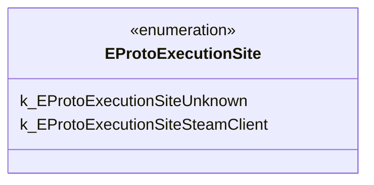

# `steammessages_unified_base.steamworkssdk.proto`

**Imports:** `google/protobuf/descriptor.proto`

## Diagram

## Enums

### `EProtoExecutionSite`

| Name | Value |
|------|-------|
| `k_EProtoExecutionSiteUnknown` | 0 |
| `k_EProtoExecutionSiteSteamClient` | 3 |
